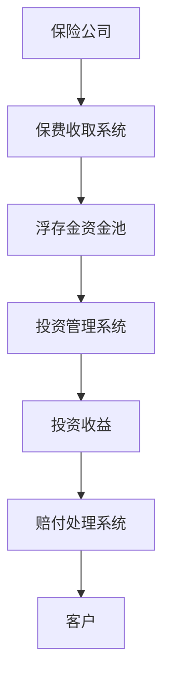

                 


# 巴菲特的保险浮存金策略：利用他人的钱投资

## 关键词：巴菲特，保险浮存金，投资策略，资金运作，长期投资

## 摘要：本文深入分析了巴菲特的保险浮存金策略，探讨了其核心思想、运作机制、数学模型、系统架构、项目实战及最佳实践。通过详细的技术分析和实际案例，揭示了如何利用保险浮存金进行低成本、长期投资，实现财富增长。

---

## 第一部分: 保险浮存金的基本概念

### 第1章: 保险浮存金的定义与特点

#### 1.1 保险浮存金的定义与特点

保险浮存金（Insurance Float）是指保险公司通过收取保费所形成的资金，用于赔付和投资。其特点包括：

- **资金来源稳定**：保费是保险公司主要的收入来源，具有持续性和可预测性。
- **低成本资金**：相对于其他融资方式，保费的成本较低，适合长期投资。
- **资金期限长**：保险浮存金的使用周期较长，适合用于股票等长期投资。

#### 1.2 巴菲特与保险浮存金的渊源

- **巴菲特的生平简介**：沃伦·巴菲特是世界著名投资家，伯克希尔哈撒韦公司的董事长兼首席执行官。
- **巴菲特的投资理念**：价值投资，注重公司基本面，长期持有优质资产。
- **发现保险浮存金策略**：巴菲特意识到保险公司可以利用浮存金进行投资，从而创造额外收益。

---

## 第二部分: 巴菲特保险浮存金策略的核心思想

### 第2章: 保险浮存金的运作机制

#### 2.1 保险公司的资金管理

- **资金池构建**：保险公司通过收取保费形成资金池。
- **浮存金的分配**：一部分用于赔付，另一部分用于投资。
- **投资组合管理**：将浮存金投资于股票、债券等资产，实现资金增值。

#### 2.2 巴菲特策略的独特性

- **利用他人资金投资**：通过收取保费获得低成本资金，用于投资优质资产。
- **长期投资与资金时间价值**：巴菲特注重长期投资，利用复利效应实现财富增长。
- **低成本资金优势**：保险浮存金的成本低于其他融资方式，适合长期投资。

---

## 第三部分: 保险浮存金策略的数学模型与分析

### 第3章: 保险浮存金的现金流分析

#### 3.1 现金流的时间价值计算

- **复利计算公式**：$$ FV = PV \times (1 + r)^n $$
  - PV：现值
  - r：年利率
  - n：投资年数
  - FV：终值

- **年金现值计算**：$$ PV = PMT \times \frac{1 - (1 + r)^{-n}}{r} $$
  - PMT：每期支付金额
  - r：利率
  - n：期数

---

## 第四部分: 保险浮存金策略的系统架构设计

### 第4章: 系统架构与流程

#### 4.1 保险公司的业务流程

- **保费收取**：通过代理人或线上渠道收取保费。
- **赔付处理**：根据保险合同进行赔付。
- **投资管理**：将浮存金投资于股票、债券等资产。

#### 4.2 系统架构图



---

## 第五部分: 保险浮存金策略的项目实战

### 第5章: 项目实战与案例分析

#### 5.1 环境安装

- **Python环境**：安装Python 3.x
- **库安装**：安装numpy和pandas库，用于数据分析。

#### 5.2 核心实现代码

```python
import numpy as np
import pandas as pd

# 模拟保费流入和投资收益
def calculate_insurance_float(initialremium, rate, years):
    float_value = initialremium
    for year in range(years):
        float_value = float_value * (1 + rate)
        print(f"Year {year + 1}: Float Value = {float_value}")
    return float_value

# 示例：初始保费1000万元，年利率5%，投资10年
initialremium = 10000000
rate = 0.05
years = 10

final_float = calculate_insurance_float(initialremium, rate, years)
print(f"最终浮存金价值：{final_float}")
```

#### 5.3 案例分析

- **初始投资**：1000万元，年利率5%，投资10年。
- **最终浮存金价值**：$$ 1000 \times (1 + 0.05)^{10} \approx 1628.89 \text{万元} $$
- **收益分析**：通过长期投资，浮存金增长了约62.89%，实现了显著的收益。

---

## 第六部分: 保险浮存金策略的最佳实践

### 第6章: 最佳实践与投资建议

#### 6.1 风险管理

- **分散投资**：将浮存金投资于多个资产类别，降低风险。
- **风险评估**：定期评估投资组合的风险，及时调整策略。

#### 6.2 合规性考虑

- **遵守监管规定**：确保投资行为符合相关法律法规。
- **合规运营**：保险公司需合规经营，确保资金来源合法。

#### 6.3 长期投资策略

- **长期持有**：坚持长期投资，避免短期波动影响投资决策。
- **持续学习**：不断学习投资知识，提升投资能力。

---

## 第七部分: 总结与展望

### 第7章: 总结与展望

#### 7.1 总结

- 巴菲特的保险浮存金策略通过利用保险公司收取的保费进行投资，实现了低成本、长期的资金增值。
- 该策略的关键在于长期投资和复利效应，能够为保险公司带来稳定的收益。

#### 7.2 展望

- **未来投资趋势**：随着科技的发展，保险浮存金的投资方式将更加多样化，可能包括更多创新金融产品。
- **技术驱动的变革**：大数据和人工智能将为保险浮存金的管理和投资提供新的可能性。

---

## 作者：AI天才研究院/AI Genius Institute & 禅与计算机程序设计艺术 /Zen And The Art of Computer Programming

---

**本文通过详细分析巴菲特的保险浮存金策略，揭示了其背后的数学模型、系统架构和实际应用。通过具体的Python代码案例，展示了如何利用保险浮存金进行投资，实现财富增长。同时，本文还提供了风险管理、合规性和长期投资的最佳实践建议，为读者提供了全面的指导。**

