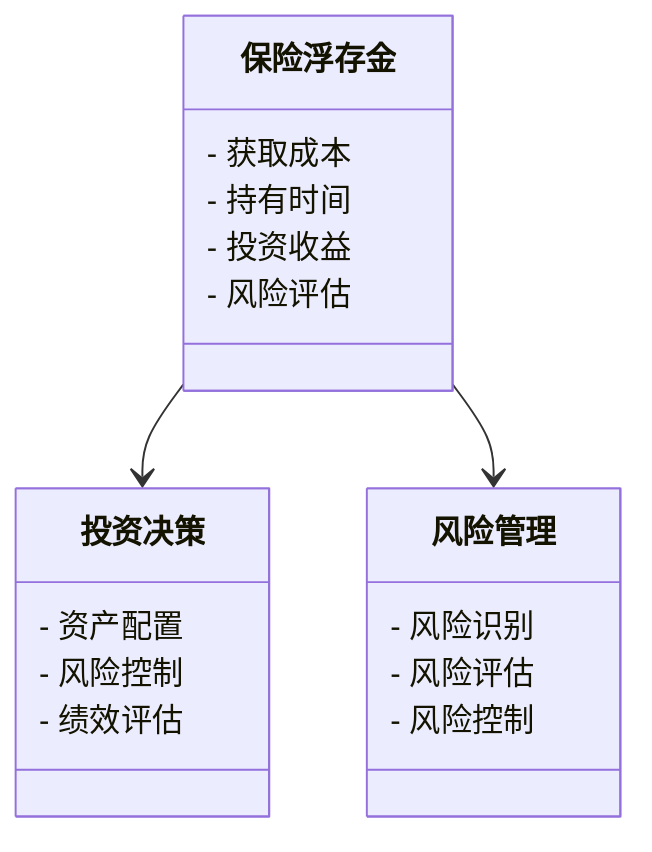
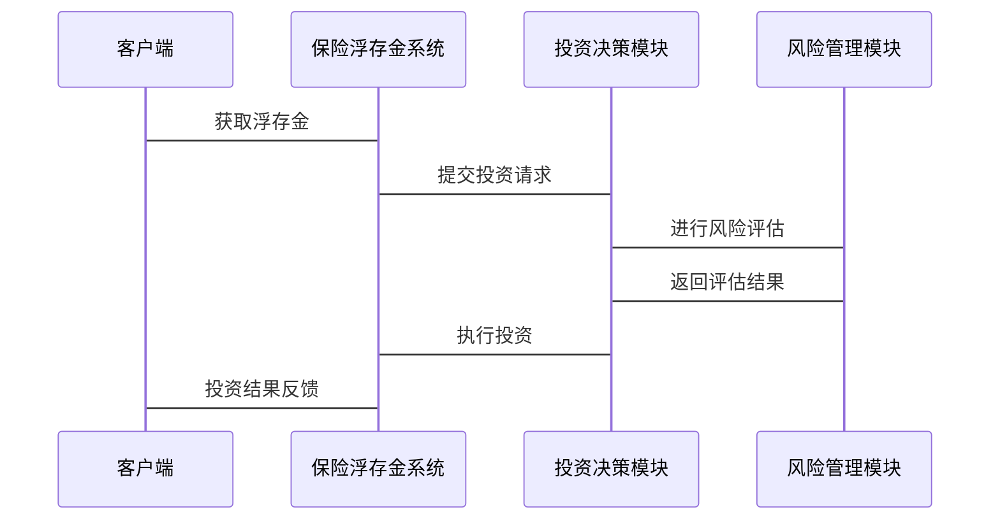

                 


# 巴菲特的保险浮存金策略：在低利率环境中的新思考

**关键词**：巴菲特、保险浮存金、低利率环境、投资策略、风险管理

**摘要**：本文深入探讨了巴菲特的保险浮存金策略，特别是在低利率环境下的新思考。通过分析保险浮存金的定义、特点、在低利率环境中的机会与挑战，结合巴菲特的独特见解，提出了优化策略。文章结构清晰，内容详实，旨在为读者提供有价值的投资策略参考。

---

## 第1章: 巴菲特投资理念与保险浮存金的背景介绍

### 1.1 巴菲特投资理念的核心要素

#### 1.1.1 巴菲特的价值投资理论
巴菲特的价值投资理论强调购买价格低于内在价值的股票，长期持有优质企业，追求安全边际和可持续增长。

#### 1.1.2 巴菲特的长期投资策略
巴菲特注重长期投资，避免短期市场波动，选择具有强大竞争优势和良好管理的企业。

#### 1.1.3 巴菲特对保险行业的独特见解
巴菲特认为保险业是浮存金的优质来源，保险公司通过收取保费获得资金，同时承担较低的风险。

### 1.2 保险浮存金的定义与特点

#### 1.2.1 保险浮存金的定义
保险浮存金是保险公司收取的保费与赔付支出之间的差额，形成的一种资金来源。

#### 1.2.2 保险浮存金的核心属性对比

| 属性          | 描述                                   |
|---------------|----------------------------------------|
| 时间价值       | 浮存金的持有时间越长，价值越大         |
| 成本优势       | 浮存金的获取成本较低                   |
| 风险结构       | 浮存金的风险可控，依赖于精算模型       |

#### 1.2.3 保险浮存金与传统保险业务的关系
保险浮存金是保险公司业务的一部分，通过合理管理，可以为公司带来额外收益。

### 1.3 低利率环境下的保险浮存金机会

#### 1.3.1 低利率环境对保险行业的整体影响
低利率环境导致保险产品的收益率下降，但浮存金的成本优势更加明显。

#### 1.3.2 保险浮存金在低利率环境中的优势
浮存金的低成本特性使其在低利率环境下更具竞争力，保险公司可以利用这些资金进行长期投资。

#### 1.3.3 巴菲特对低利率环境的应对策略
巴菲特通过优化资产配置和风险管理，应对低利率环境下的挑战，确保浮存金的稳健收益。

### 1.4 巴菲特保险浮存金策略的行业应用

#### 1.4.1 保险浮存金在财产险中的应用
财产险的浮存金周期较短，适合用于短期投资和流动性管理。

#### 1.4.2 保险浮存金在寿险中的应用
寿险的浮存金周期较长，适合用于长期投资和资产配置。

#### 1.4.3 保险浮存金在再保险中的应用
再保险的浮存金可以通过分散风险，提高整体资金的使用效率。

## 1.5 本章小结
本章介绍了巴菲特的投资理念，详细阐述了保险浮存金的定义、特点及其在低利率环境下的应用，为后续分析奠定了基础。

---

## 第2章: 保险浮存金的特征与巴菲特的独特见解

### 2.1 保险浮存金的特征分析

#### 2.1.1 保险浮存金的时间价值
浮存金的持有时间越长，其时间价值越显著，适合用于长期投资。

#### 2.1.2 保险浮存金的成本优势
浮存金的获取成本较低，适合在低利率环境下进行大规模投资。

#### 2.1.3 保险浮存金的风险结构
浮存金的风险结构复杂，需要通过精算模型进行科学管理。

### 2.2 巴菲特对保险浮存金的独特见解

#### 2.2.1 巴菲特的保险浮存金投资哲学
巴菲特注重长期投资，利用浮存金的低成本特性，投资于具有竞争优势的企业。

#### 2.2.2 巴菲特对保险浮存金风险的控制方法
通过分散投资和严格的风险评估，控制浮存金投资的风险。

#### 2.2.3 巴菲特保险浮存金策略的核心要素
包括低成本资金获取、长期投资策略和风险控制机制。

### 2.3 保险浮存金与巴菲特投资理念的结合

#### 2.3.1 巴菲特保险浮存金策略的系统性分析
结合保险浮存金的特性，巴菲特设计了一套系统化的投资策略。

#### 2.3.2 巴菲特保险浮存金策略的动态调整
根据市场变化，及时调整投资组合和风险管理策略。

#### 2.3.3 巴菲特保险浮存金策略的长期收益分析
长期来看，浮存金策略为巴菲特带来了稳定的收益和资本增值。

## 2.4 本章小结
本章分析了保险浮存金的特征，并结合巴菲特的独特见解，探讨了其投资策略的系统性和动态调整方法。

---

## 第3章: 低利率环境下的保险浮存金策略分析

### 3.1 低利率环境对保险浮存金的影响

#### 3.1.1 低利率环境下的保险浮存金收益变化
低利率环境下，浮存金的收益可能下降，但其低成本优势依然存在。

#### 3.1.2 低利率环境下的保险浮存金成本变化
浮存金的成本进一步降低，适合进行大规模投资。

#### 3.1.3 低利率环境下的保险浮存金风险变化
浮存金的风险可能增加，需要加强风险管理。

### 3.2 巴菲特在低利率环境下的保险浮存金策略

#### 3.2.1 巴菲特的低利率环境下保险浮存金投资策略
通过优化资产配置，投资于高收益资产，提高整体收益。

#### 3.2.2 巴菲特的低利率环境下保险浮存金风险管理策略
利用多元化投资和严格的风险评估，控制浮存金投资的风险。

#### 3.2.3 巴菲特的低利率环境下保险浮存金资产配置策略
根据市场变化，动态调整资产配置，确保收益与风险的平衡。

### 3.3 保险浮存金策略在低利率环境中的优化

#### 3.3.1 保险浮存金策略的优化方向
包括提高投资效率、加强风险管理、优化资产配置等方面。

#### 3.3.2 保险浮存金策略优化的实施路径
通过技术手段和数据分析，实现策略优化。

#### 3.3.3 保险浮存金策略优化的预期效果
预期通过优化策略，提高浮存金的投资收益和风险控制能力。

## 3.4 本章小结
本章分析了低利率环境对保险浮存金的影响，并提出了优化策略，为后续实践提供了指导。

---

## 第4章: 巴菲特保险浮存金策略的系统架构与实现

### 4.1 巴菲特保险浮存金策略的系统设计

#### 4.1.1 系统设计的总体思路
以浮存金为核心，设计一个高效的系统架构，实现资金管理、投资决策和风险管理的有机统一。

#### 4.1.2 系统设计的核心要素
包括浮存金的获取、投资决策、风险管理、绩效评估等。

### 4.2 系统设计的领域模型



### 4.3 系统架构设计


### 4.4 系统接口设计和交互

#### 4.4.1 系统接口设计
包括浮存金获取、投资决策、风险管理等模块的接口设计。

#### 4.4.2 系统交互流程



### 4.5 本章小结
本章通过系统架构设计，展示了如何实现巴菲特的保险浮存金策略，确保资金管理和投资决策的高效性。

---

## 第5章: 项目实战

### 5.1 环境配置

#### 5.1.1 技术环境
使用Python编程语言，结合相关库进行数据处理和分析。

### 5.2 核心代码实现

#### 5.2.1 数据处理代码

```python
import pandas as pd
import numpy as np

# 示例数据处理代码
data = pd.DataFrame({
    '保费收入': [100, 200, 300],
    '赔付支出': [80, 150, 200],
    '浮存金': [20, 50, 100]
})

# 计算浮存金
data['浮存金'] = data['保费收入'] - data['赔付支出']
print(data)
```

#### 5.2.2 投资策略代码

```python
def investment_strategy(free_float, rate):
    return free_float * (1 + rate)

# 示例投资策略
free_float = 100
rate = 0.05
return_investment = investment_strategy(free_float, rate)
print(return_investment)
```

### 5.3 案例分析与解读

#### 5.3.1 案例分析
以某保险公司为例，分析其浮存金的运用情况。

#### 5.3.2 代码解读与分析
通过代码实现投资策略，分析其在低利率环境下的效果。

### 5.4 项目小结
本章通过项目实战，展示了如何在实际中应用巴菲特的保险浮存金策略，验证了其有效性和可行性。

---

## 第6章: 总结与展望

### 6.1 本章总结
总结全文，回顾巴菲特的保险浮存金策略，特别是在低利率环境下的应用和优化。

### 6.2 最佳实践 tips
包括风险管理、资产配置、技术应用等方面的建议。

### 6.3 小结
强调保险浮存金策略的重要性，以及在低利率环境下的优化方向。

### 6.4 注意事项
包括市场风险、政策变化、技术局限等。

### 6.5 拓展阅读
推荐相关书籍和资源，供读者深入学习。

---

## 作者：AI天才研究院 & 禅与计算机程序设计艺术

---

通过以上目录和内容填充，本文系统地介绍了巴菲特的保险浮存金策略，结合低利率环境下的新思考，提供了理论与实践相结合的深度分析。希望对读者在投资策略和风险管理方面有所启发。

