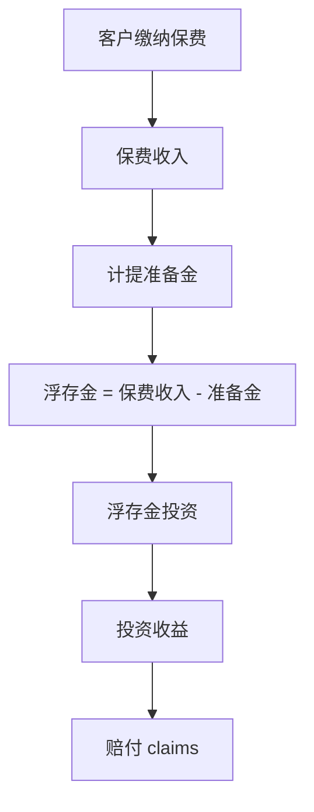
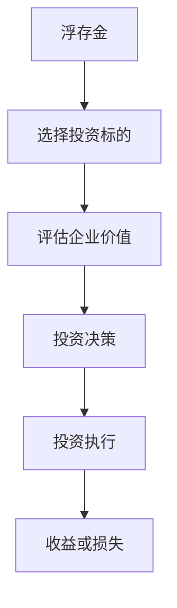
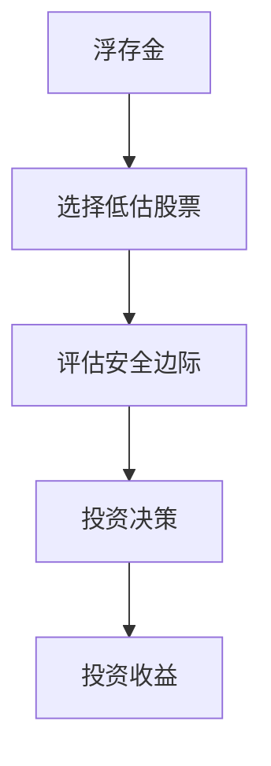
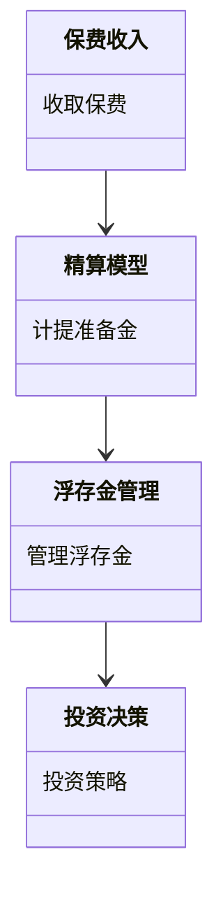
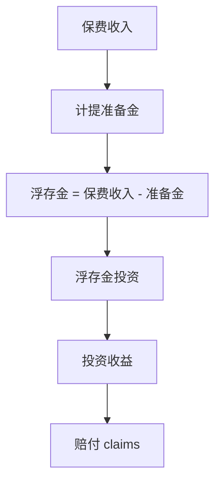

                 


# 巴菲特的保险浮存金运用之道

> 关键词：巴菲特，保险浮存金，价值投资，投资策略，风险管理

> 摘要：本文深入分析了巴菲特如何利用保险浮存金进行投资，探讨了浮存金的运作机制、投资策略、系统架构以及实际案例。通过详细的技术分析和实例解读，揭示了巴菲特在保险浮存金管理与投资中的智慧与策略。

---

## 第一部分：保险浮存金的背景与基础

### 第1章：保险浮存金的基本概念

#### 1.1 保险浮存金的定义与特点

保险浮存金（Insurance Float）是指保险公司从客户处收取的保费，用于赔付未来的保险 claims 的资金。这部分资金在保险公司中形成了一种“浮存”，即暂时闲置的资金。以下是浮存金的核心特点：

- **时间差**：客户缴纳保费的时间与赔付 claims 的时间之间存在时间差，形成浮存。
- **规模庞大**：大型保险公司由于保费收入高，浮存金规模通常非常庞大。
- **低成本资金**：浮存金的使用成本较低，保险公司可以利用这部分资金进行投资，获取额外收益。
- **风险可控**：浮存金的使用需要考虑保险公司的偿付能力，因此投资风险需要严格控制。

#### 1.2 巴菲特的保险帝国

巴菲特（Warren Buffett）是全球著名投资者，其旗下的伯克希尔哈撒韦公司（Berkshire Hathaway）是全球最大的保险控股公司之一。伯克希尔旗下拥有多家保险公司，包括 GEICO、 Berkshire Primary Group 等。以下是巴菲特保险帝国的核心特征：

- **多元化业务**：伯克希尔不仅是一家保险公司，还涉足多个行业，包括能源、铁路、制造等。
- **浮存金的来源**：伯克希尔通过旗下的保险公司收取大量保费，形成巨额浮存金。
- **长期投资**：巴菲特利用浮存金进行长期价值投资，投资对象包括股票、债券、企业股权等。

#### 1.3 浮存金的来源与特点

伯克希尔的浮存金主要来源于以下几个方面：

1. **保费收入**：客户缴纳的保费是浮存金的主要来源。
2. **再保险业务**：通过承接其他保险公司的再保险业务，获得额外的保费收入。
3. **投资收益**：部分浮存金的投资收益可以滚存，进一步增加浮存金规模。

浮存金的特点：

- **规模庞大**：伯克希尔的浮存金规模超过百亿美元。
- **资金成本低**：浮存金的使用成本接近于零，因为客户已经支付了保费，保险公司可以无息使用这部分资金。
- **灵活性高**：浮存金可以根据市场变化进行灵活配置，投资于不同的资产类别。

---

## 第二部分：保险浮存金的核心概念与运作机制

### 第2章：保险浮存金的运作机制

#### 2.1 浮存金的产生与分配流程

浮存金的产生与分配流程可以用以下步骤描述：

1. **客户缴纳保费**：客户支付保费，资金进入保险公司的账户。
2. **计提准备金**：保险公司根据精算模型，计提未来赔付所需的准备金。
3. **剩余资金形成浮存**：保费收入减去准备金，剩余部分形成浮存金。
4. **浮存金的投资**：浮存金用于投资，产生收益。
5. **赔付 claims**：当客户提出赔付请求时，保险公司从浮存金中支付。

以下是一个简化的流程图（使用 Mermaid）：



#### 2.2 巴菲特的浮存金投资策略

巴菲特的浮存金投资策略是其价值投资理念的体现。以下是核心策略：

1. **长期投资**：巴菲特注重长期投资，避免短期波动，追求企业内在价值的增长。
2. **价值投资**：投资于具有强大竞争优势、良好管理团队和合理估值的企业。
3. **分散投资**：通过分散投资降低风险，避免过度集中在某一只股票或行业。

以下是一个简化的价值投资模型（使用 Mermaid）：



---

## 第三部分：巴菲特的投资策略与浮存金的关系

### 第3章：巴菲特的价值投资模型

#### 3.1 价值投资的核心理念

价值投资的核心理念是寻找市场价格低于内在价值的股票进行投资。以下是价值投资的关键要素：

- **内在价值**：企业的未来现金流的现值。
- **安全边际**：市场价格与内在价值的差距，提供缓冲空间。
- **竞争优势**：企业具备可持续的竞争优势。

#### 3.2 浮存金在巴菲特投资组合中的地位

浮存金是巴菲特投资组合的重要组成部分，以下是其在投资中的作用：

- **资金来源**：浮存金为巴菲特提供了低成本、长期可用的资金。
- **投资工具**：通过浮存金，巴菲特可以投资于具有长期增长潜力的企业。
- **风险管理**：浮存金的使用需要考虑保险公司的偿付能力，因此投资必须稳健。

#### 3.3 浮存金与巴菲特安全边际理念的结合

巴菲特的安全边际理念要求市场价格低于内在价值，以下是其与浮存金结合的示意图（使用 Mermaid）：



---

## 第四部分：浮存金的系统架构与管理

### 第4章：浮存金的系统架构

#### 4.1 保险业务系统介绍

伯克希尔的保险业务系统是一个复杂的系统，包括以下几个模块：

- **保费收入**：客户缴纳保费。
- **精算模型**：用于计提准备金和预测赔付需求。
- **浮存金管理**：管理和投资浮存金。
- **投资决策**：基于浮存金的投资策略。

以下是保险业务系统的领域模型（使用 Mermaid 类图）：



#### 4.2 浮存金管理的架构设计

浮存金的管理架构需要考虑以下方面：

- **资金池管理**：将浮存金集中管理，形成资金池。
- **投资策略**：制定长期投资策略，选择合适的投资标的。
- **风险控制**：建立风险控制机制，确保浮存金的安全。

以下是浮存金管理的架构图（使用 Mermaid）：



---

## 第五部分：项目实战

### 第5章：浮存金投资模拟

#### 5.1 项目环境配置

- **编程语言**：Python
- **库**：pandas、numpy、matplotlib
- **数据来源**：历史股价数据、财务报表数据

#### 5.2 核心代码实现

以下是一个简单的价值投资模型的 Python 实现：

```python
import pandas as pd
import numpy as np
import matplotlib.pyplot as plt

# 示例数据：假设某公司的股价数据
data = {'日期': ['2020-01', '2020-02', '2020-03', '2020-04', '2020-05'],
        '股价': [100, 105, 98, 110, 115]}
df = pd.DataFrame(data)

# 计算简单移动平均线（SMA）
sma = df['股价'].rolling(window=2).mean()

# 可视化股价与SMA
plt.figure(figsize=(10, 6))
plt.plot(df['日期'], df['股价'], label='股价')
plt.plot(df['日期'], sma, label='SMA(2)')
plt.xlabel('日期')
plt.ylabel('股价')
plt.legend()
plt.show()
```

#### 5.3 案例分析与解读

假设我们投资于一家具有强大竞争优势的公司，其股价在一段时间内被低估。以下是投资策略：

1. **识别低估股票**：通过分析市盈率、市净率等指标，寻找股价低于内在价值的公司。
2. **计算安全边际**：确保股价与内在价值之间有足够的安全边际。
3. **长期持有**：持有股票，等待股价回归内在价值。

---

## 第六部分：最佳实践与小结

### 第6章：最佳实践与小结

#### 6.1 最佳实践

1. **风险控制**：始终关注保险公司的偿付能力，确保浮存金的安全。
2. **长期投资**：价值投资需要耐心，避免短期波动干扰。
3. **持续学习**：关注市场变化，不断优化投资策略。

#### 6.2 小结

巴菲特的保险浮存金运用之道是一个复杂但高效的系统，通过合理利用浮存金，巴菲特实现了保险业务与投资收益的双重目标。本文通过背景介绍、核心概念、算法原理、系统架构和项目实战的分析，深入揭示了巴菲特的浮存金管理与投资策略。

#### 6.3 注意事项

- **避免过度杠杆**：浮存金的使用需要避免过度杠杆，确保资金安全。
- **关注市场变化**：及时调整投资策略，应对市场变化。
- **合规性**：确保投资行为符合相关法律法规。

#### 6.4 拓展阅读

- 巴菲特的《投资之道》
- 《价值投资实战》
- 《保险浮存金管理》

---

# 作者：AI天才研究院/AI Genius Institute & 禅与计算机程序设计艺术 /Zen And The Art of Computer Programming

