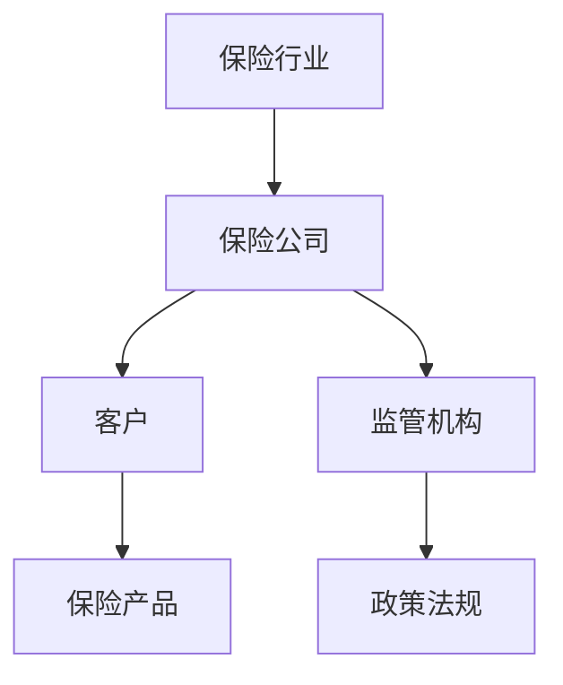

                 


# 如何在保险行业应用巴菲特的投资逻辑：从原理到实战

## 关键词：巴菲特，保险行业，投资逻辑，价值投资，财务分析，风险管理

## 摘要：本文系统地阐述了巴菲特在保险行业的投资逻辑，从基础概念到实战应用，详细分析了巴菲特的投资理念、分析框架、风险管理策略以及经典案例。通过本文，读者可以掌握如何应用巴菲特的方法在保险行业中进行投资分析和决策。

---

## 第1章：保险行业的基本概念与巴菲特的投资理念

### 1.1 保险行业的基本概念

#### 1.1.1 保险的定义与分类
- 保险的定义：保险是一种风险管理工具，通过分散风险来补偿潜在损失。
- 保险的分类：财产保险、人寿保险、健康保险、责任保险等。

#### 1.1.2 保险行业的核心业务模式
- 保费收入：保险公司通过收取保费来建立赔偿准备金。
- 投资收益：保险公司将保费投资于各种资产，以获取收益。

#### 1.1.3 保险行业的市场结构与竞争格局
- 市场结构：寡头垄断，少数大型保险公司占据主要市场份额。
- 竞争格局：价格竞争、产品创新、服务质量等。

### 1.2 巴菲特的投资理念

#### 1.2.1 巴菲特的投资哲学
- 价值投资：买入低于内在价值的股票，长期持有。
- 安全边际：买入价格远低于内在价值的资产，以降低风险。

#### 1.2.2 巴菲特对保险行业的独特见解
- 保险行业的稳定性：保险业务具有较强的防御性，能够在经济衰退中表现稳定。
- 保险公司的浮存金：利用保费收入形成的浮存金进行投资，是保险公司的重要竞争优势。

#### 1.2.3 巴菲特投资逻辑的核心要素
- 财务健康：关注公司的财务状况，尤其是偿付能力和盈利能力。
- 管理层质量：管理层的诚信、能力和决策是公司成功的关键。
- 行业地位：选择行业龙头，具有竞争优势。

---

## 第2章：保险行业的特殊性与巴菲特的分析框架

### 2.1 保险行业的特殊性

#### 2.1.1 保险产品的复杂性
- 保险产品的多样性：不同保险产品的风险和收益不同。
- 保险产品的长期性：保险合同通常具有较长的期限。

#### 2.1.2 保险行业的周期性与波动性
- 行业周期性：保险行业受经济周期影响较大，具有一定的波动性。
- 保险公司的偿付压力：在经济衰退时期，保险公司可能面临更大的偿付压力。

#### 2.1.3 保险行业的监管环境与政策影响
- 监管严格：保险行业受到严格的监管，确保市场秩序和消费者权益。
- 政策影响：政府政策的变化可能对保险行业产生重大影响。

### 2.2 巴菲特的保险行业分析框架

#### 2.2.1 财务指标分析
- 资产负债表分析：关注资产质量、负债结构和资本充足性。
- 利润表分析：关注保费收入、投资收益和营业成本。
- 现金流量表分析：关注经营活动、投资活动和筹资活动的现金流。

#### 2.2.2 管理层评估
- 管理层的诚信与能力：管理层是否具备诚信和专业能力。
- 管理层的战略决策：管理层是否制定合理的战略目标和投资计划。

#### 2.2.3 企业竞争优势分析
- 市场地位：公司在市场中的占有率和竞争能力。
- 核心竞争力：公司在产品、服务、成本等方面的核心优势。

---

## 第3章：巴菲特的保险投资逻辑

### 3.1 巴菲特的保险投资策略

#### 3.1.1 长期投资与价值投资
- 长期投资：巴菲特注重长期持有优质资产，避免短期波动。
- 价值投资：买入价格低于内在价值的股票，等待价值回归。

#### 3.1.2 安全边际的概念与应用
- 安全边际：买入价格与内在价值之间的差距，确保投资的安全性。
- 应用：通过分析公司财务状况，确定安全边际，降低投资风险。

#### 3.1.3 分散投资与风险控制
- 分散投资：通过投资不同行业和地区的资产，降低投资风险。
- 风险控制：设定止损点，避免重大损失。

### 3.2 巴菲特保险投资的成功案例

#### 3.2.1 可口可乐的保险投资案例
- 投资背景：可口可乐的稳定现金流和强大的品牌优势。
- 投资过程：巴菲特通过购买可口可乐的股票，长期持有，获得稳定收益。

#### 3.2.2 富国银行的保险投资案例
- 投资背景：富国银行的零售银行业务和强大的客户基础。
- 投资过程：巴菲特通过分析富国银行的财务状况和管理层能力，决定投资。

#### 3.2.3 其他经典保险投资案例分析
- 案例分析：如美国运通、 GE 等公司的投资案例，分析巴菲特的投资逻辑和成功因素。

---

## 第4章：巴菲特的保险行业分析方法

### 4.1 财务分析方法

#### 4.1.1 资产负债表分析
- 资产分析：关注资产的质量和流动性，尤其是投资性资产。
- 负债分析：关注负债的结构和偿付能力，尤其是短期负债。

#### 4.1.2 利润表分析
- 收入分析：关注保费收入和投资收益的稳定性和增长性。
- 成本分析：关注营业成本和管理费用的控制能力。

#### 4.1.3 现金流量表分析
- 经营活动现金流：关注公司的盈利能力和现金流的健康状况。
- 投资活动现金流：关注公司的投资活动和资本支出。

### 4.2 保险公司的偿付能力评估

#### 4.2.1 偿付能力的概念与计算
- 偿付能力：保险公司偿还债务的能力。
- 计算方法：偿付能力充足率 = （资本充足 + 盈余）/ 风险资产 × 100%。

#### 4.2.2 巴菲特对偿付能力的特殊关注点
- 偿付能力充足率：关注公司的偿付能力是否充足，确保公司能够履行赔偿责任。
- 资产质量：关注公司资产的流动性、安全性和收益性。

#### 4.2.3 偿付能力与投资风险的关系
- 偿付能力充足：公司具有较强的抗风险能力，投资风险较低。
- 偿付能力不足：公司可能面临偿付压力，投资风险增加。

---

## 第5章：巴菲特的保险投资策略与风险管理

### 5.1 巴菲特的保险投资策略

#### 5.1.1 保险行业的长期趋势分析
- 长期趋势：保险行业的需求稳定增长，尤其是寿险和健康险。
- 影响因素：人口老龄化、医疗技术进步、经济增速等。

#### 5.1.2 保险公司的竞争优势分析
- 市场地位：公司在市场中的占有率和品牌影响力。
- 核心竞争力：公司在产品、服务、成本等方面的核心优势。

#### 5.1.3 保险行业的估值方法
- 市盈率（P/E）：市盈率 = 股价 / 每股收益。
- 市净率（P/B）：市净率 = 股价 / 每股净资产。

### 5.2 巴菲特的风险管理策略

#### 5.2.1 风险分散与资产配置
- 风险分散：通过投资不同资产类别和行业，降低投资风险。
- 资产配置：根据市场环境和个人风险承受能力，合理配置资产。

#### 5.2.2 安全边际的设置与应用
- 安全边际：买入价格与内在价值之间的差距，确保投资的安全性。
- 应用：通过分析公司财务状况，确定安全边际，降低投资风险。

#### 5.2.3 保险行业风险的特殊考量
- 信用风险：保险公司投资的债券、贷款等可能面临信用风险。
- 市场风险：保险公司的投资组合可能受市场波动影响。

---

## 第6章：巴菲特保险投资逻辑的系统分析

### 6.1 保险行业的系统分析框架

#### 6.1.1 行业分析的维度与方法
- 行业分析维度：市场容量、增长速度、竞争格局、政策环境等。
- 行业分析方法：SWOT分析、PEST分析等。

#### 6.1.2 公司分析的维度与方法
- 公司分析维度：财务状况、管理层能力、竞争优势等。
- 公司分析方法：财务指标分析、管理层评估、竞争优势分析等。

### 6.2 保险行业的系统架构设计

#### 6.2.1 系统架构图


#### 6.2.2 系统功能设计
- 保险产品设计：根据客户需求设计保险产品。
- 保费收取：通过多种渠道收取保费。
- 投资管理：将保费投资于多种资产，获取收益。
- 理赔处理：处理客户的理赔请求，支付赔款。

---

## 第7章：项目实战：在保险行业应用巴菲特的投资逻辑

### 7.1 环境安装

#### 7.1.1 必要的工具与环境
- 数据分析工具：Excel、Python、R等。
- 财务分析工具：财务报表分析软件、估值模型工具。

#### 7.1.2 数据获取与准备
- 数据来源：公司财报、行业报告、新闻资讯等。
- 数据清洗：处理缺失值、异常值等。

### 7.2 系统核心实现源代码

#### 7.2.1 财务分析代码
```python
import pandas as pd

def calculate_pe_ratio(df):
    pe_ratio = df['股价'] / df['每股收益']
    return pe_ratio

def calculate_pb_ratio(df):
    pb_ratio = df['股价'] / df['每股净资产']
    return pb_ratio

# 示例数据
data = {
    '公司': ['公司A', '公司B', '公司C'],
    '股价': [50, 30, 40],
    '每股收益': [10, 5, 8],
    '每股净资产': [20, 15, 12]
}

df = pd.DataFrame(data)

pe_ratios = calculate_pe_ratio(df)
pb_ratios = calculate_pb_ratio(df)

print("PE Ratio:", pe_ratios)
print("PB Ratio:", pb_ratios)
```

#### 7.2.2 风险管理代码
```python
import numpy as np

def calculate_value_at_risk(positions, confidence_level=0.95):
    # 计算VaR
    returns = []
    for position in positions:
        returns.append(position['资产'] * (position['收益'] - 1))
    returns = np.array(returns)
    returns.sort()
    var = np.quantile(returns, 1 - confidence_level)
    return var

positions = [
    {'资产': 100, '收益': 0.1},
    {'资产': 200, '收益': 0.05},
    {'资产': 300, '收益': 0.08}
]

var = calculate_value_at_risk(positions)
print("VaR:", var)
```

### 7.3 代码应用解读与分析

#### 7.3.1 财务分析代码解读
- 代码功能：计算公司的市盈率和市净率，评估公司的估值。
- 应用场景：通过市盈率和市净率，判断公司是否具有投资价值。

#### 7.3.2 风险管理代码解读
- 代码功能：计算投资组合的风险价值（VaR），评估投资风险。
- 应用场景：通过VaR，确定投资组合的风险水平，制定风险管理策略。

### 7.4 实际案例分析与详细讲解剖析

#### 7.4.1 案例分析
- 案例：某保险公司投资组合分析。
- 数据：公司A的保费收入、投资收益、营业成本等数据。
- 分析过程：计算公司的PE、PB，评估公司估值；计算VaR，评估投资组合风险。

#### 7.4.2 案例解读
- 估值分析：公司A的PE为5，PB为2，低于行业平均水平，具有投资价值。
- 风险管理：公司A的投资组合VaR为-100万元，风险较低。

### 7.5 项目小结

#### 7.5.1 最佳实践 tips
- 定期评估公司的财务状况和投资组合风险。
- 关注行业政策变化和宏观经济环境。

#### 7.5.2 小结
- 巴菲特的投资逻辑在保险行业中具有重要的指导意义。
- 通过财务分析、风险管理等方法，可以有效评估保险公司的投资价值。

#### 7.5.3 注意事项
- 投资有风险，需谨慎决策。
- 关注市场变化，及时调整投资策略。

#### 7.5.4 拓展阅读
- 阅读巴菲特的《 Intelligent Investor 》。
- 关注保险行业的最新动态和研究。

---

## 作者：AI天才研究院/AI Genius Institute & 禅与计算机程序设计艺术 /Zen And The Art of Computer Programming

---

通过本文的详细分析，读者可以系统地了解巴菲特在保险行业的投资逻辑，并能够实际应用这些策略进行投资分析和决策。

