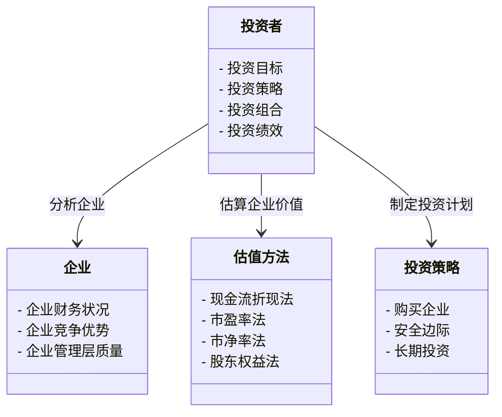
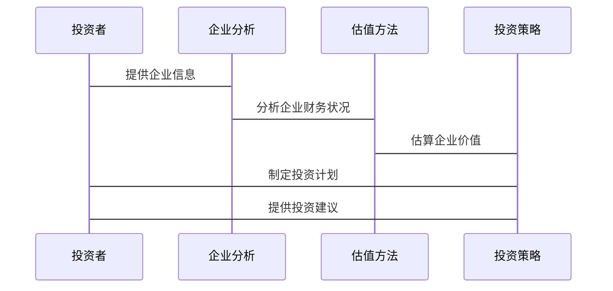

                 


# 巴菲特的公司收购哲学：寻找优质企业

## 关键词：
巴菲特，价值投资，公司收购，优质企业，安全边际

## 摘要：
本文将详细探讨巴菲特的公司收购哲学，分析其核心理念、选股标准、收购策略以及在现代市场中的应用。通过深入解析巴菲特的投资哲学，我们可以学习如何寻找和评估优质企业，制定长期的投资策略，以及在当前市场环境下如何灵活应用这些原则。

---

## 第一部分: 巴菲特投资哲学概述

### 第1章: 巴菲特投资哲学的核心理念

#### 1.1 巴菲特投资哲学的起源

##### 1.1.1 投资的本质与目标
投资的本质是通过购买资产，以期在未来获得超过初始投入的回报。巴菲特认为，投资的目标是找到那些能够持续创造价值的企业，并通过长期持有实现财富增长。

##### 1.1.2 巴菲特的价值投资理念
巴菲特的价值投资理念强调购买那些市场价格低于其内在价值的企业。他认为，市场先生（市场的波动性）是投资者的朋友，而不是敌人。投资者应该利用市场的非理性来寻找廉价的优质企业。

##### 1.1.3 投资哲学的核心要素
- **长期主义**：巴菲特相信时间是优质企业的朋友，短期波动不应影响长期决策。
- **安全边际**：购买价格低于内在价值，以降低投资风险。
- **企业质量**：优先选择具有强大竞争优势和良好财务状况的企业。

#### 1.2 巴菲特的投资原则

##### 1.2.1 质量第一：寻找优质企业
巴菲特认为，投资的核心是选择那些具有以下特征的企业：
- **强大的竞争优势**：企业能够在市场上长期保持领先地位。
- **稳定的财务状况**：低负债、高盈利能力、健康的现金流。
- **优秀的管理层**：管理层诚实、有能力，致力于股东利益。

##### 1.2.2 价格第二：安全边际的概念
安全边际是指买入价格与企业内在价值之间的差距。巴菲特认为，通过购买价格低于内在价值的企业，可以降低投资的风险，并为未来的价格波动提供缓冲空间。

##### 1.2.3 长期投资：时间的朋友
巴菲特强调长期投资的重要性。他认为，优质企业随着时间的推移会创造更多的价值，而短期市场的波动不应影响长期投资决策。

#### 1.3 巴菲特的安全边际理论

##### 1.3.1 安全边际的定义
安全边际是巴菲特投资理论中的一个重要概念，指企业内在价值与购买价格之间的差额。通过保持安全边际，投资者可以降低因估值错误或市场波动带来的风险。

##### 1.3.2 安全边际的重要性
- **降低投资风险**：安全边际为投资者提供了缓冲空间，即使估值出现偏差，也能减少损失。
- **避免过度乐观**：安全边际提醒投资者不要过于乐观地估计企业的未来表现。

##### 1.3.3 如何计算安全边际
安全边际的计算需要结合企业的内在价值和市场价格。通常，内在价值可以通过DCF（现金流折现法）等方法估算，而市场价格则是当前的股价。安全边际 = 内在价值 - 市场价格。

---

### 第2章: 巴菲特的选股标准

#### 2.1 优质企业的核心特征

##### 2.1.1 财务状况
- **收入质量**：企业收入是否稳定、可预测，是否来自核心业务。
- **资产质量**：企业的资产是否具有高流动性、低贬值风险。
- **利润质量**：企业的利润是否可持续，是否依赖于一次性收入。

##### 2.1.2 竞争优势
- **技术优势**：企业是否拥有独特的技术或专利，能够在市场上保持领先地位。
- **市场地位**：企业是否是市场领导者，是否具有定价权。
- **产品差异化**：产品是否具有独特的卖点，能够在竞争中脱颖而出。

##### 2.1.3 管理层质量
- **管理层的诚信**：管理层是否诚实可靠，是否有良好的道德记录。
- **管理层的能力**：管理层是否具有战略眼光和执行力，能够带领企业持续发展。

#### 2.2 企业财务报表分析

##### 2.2.1 收入质量
收入质量是评估企业盈利能力的重要指标。巴菲特强调，收入应来自企业的核心业务，并且具有可持续性。以下是收入质量的几个关键指标：

- **收入增长率**：收入是否持续增长，是否依赖于促销或价格折扣。
- **收入来源**：收入是否来自稳定的客户群体，是否依赖于单一市场或产品。
- **收入结构**：收入是否多元化，是否依赖于高风险的业务。

##### 2.2.2 资产质量
资产质量是评估企业财务健康状况的重要指标。巴菲特认为，企业的资产应具有高流动性、低贬值风险，并能够为企业的长期发展提供支持。

- **流动资产比例**：流动资产占总资产的比例，反映了企业的短期偿债能力。
- **固定资产质量**：固定资产是否具有高价值，是否符合企业的长期发展战略。
- **无形资产**：无形资产（如品牌、专利）是否具有长期价值。

##### 2.2.3 利润质量
利润质量是评估企业盈利能力的重要指标。巴菲特认为，利润应来自企业的核心业务，并且具有可持续性。

- **净利润率**：净利润占收入的比例，反映了企业的盈利能力。
- **利润来源**：利润是否来自核心业务，是否依赖于一次性收入。
- **利润增长**：利润是否持续增长，是否具有可持续性。

##### 2.2.4 现金流分析
现金流是评估企业财务健康状况的重要指标。巴菲特认为，现金流是企业的血液，没有健康的现金流，企业难以持续发展。

- **经营活动现金流**：经营活动现金流是否为正，是否能够支持企业的日常运营。
- **自由现金流**：自由现金流是否为正，是否能够支持企业的再投资。
- **现金流质量**：现金流是否稳定，是否具有可持续性。

#### 2.3 企业的竞争优势分析

##### 2.3.1 技术优势
技术优势是企业竞争优势的重要来源。巴菲特认为，拥有独特技术的企业能够在市场上保持领先地位，并创造持续的盈利能力。

- **技术领先性**：企业是否拥有领先的技术，是否能够保持技术优势。
- **技术创新能力**：企业是否具有强大的研发能力，是否能够不断创新。
- **技术保护**：企业是否通过专利、商标等方式保护其技术优势。

##### 2.3.2 市场地位
市场地位是企业竞争优势的重要体现。巴菲特认为，市场领导者通常具有定价权和品牌优势，能够在市场上占据有利地位。

- **市场份额**：企业是否是市场领导者，市场份额是否稳定。
- **品牌影响力**：企业品牌是否具有强大的影响力，是否能够在市场上吸引客户。
- **客户忠诚度**：客户是否对企业产品或服务具有高度忠诚度。

##### 2.3.3 产品差异化
产品差异化是企业竞争优势的重要来源。巴菲特认为，具有独特卖点的产品能够在市场上脱颖而出，并吸引更多的客户。

- **产品独特性**：产品是否具有独特的卖点，是否能够在市场上差异化竞争。
- **产品创新**：企业是否能够不断创新，推出新产品或改进现有产品。
- **产品生命周期**：产品是否处于成长期，是否具有长期市场潜力。

---

### 第3章: 巴菲特的公司收购策略

#### 3.1 公司收购的基本原则

##### 3.1.1 购买企业而非股票
巴菲特认为，投资的核心是购买企业，而不是股票。他强调，投资者应该关注企业的基本面，而不是市场的短期波动。

- **企业价值**：企业的内在价值是其未来现金流的折现值。
- **市场价格**：股票价格是市场的反映，但不应影响企业的内在价值。
- **长期投资**：购买企业而非股票意味着长期持有，等待企业价值的实现。

##### 3.1.2 理解企业商业模式
理解企业的商业模式是制定收购策略的重要步骤。巴菲特认为，投资者应该深入研究企业的商业模式，了解其盈利来源和增长潜力。

- **商业模式**：企业的盈利模式是否清晰，是否具有可持续性。
- **市场定位**：企业是否在市场中占据有利位置，是否能够吸引和留住客户。
- **竞争优势**：企业是否具有独特竞争优势，是否能够在市场上长期发展。

##### 3.1.3 评估企业的未来盈利能力
评估企业的未来盈利能力是制定收购策略的关键。巴菲特认为，投资者应该关注企业的未来现金流，而不是过去的财务表现。

- **未来现金流**：企业未来现金流的预测是否合理，是否具有可持续性。
- **增长潜力**：企业是否具有增长潜力，是否能够在未来实现更高的盈利。
- **行业趋势**：行业发展趋势是否有利于企业未来发展，是否能够为企业提供新的增长机会。

#### 3.2 股权收购的估值方法

##### 3.2.1 现金流折现法
现金流折现法是评估企业价值的重要方法。巴菲特认为，企业价值是未来现金流的折现值。以下是现金流折现法的步骤：

1. **预测未来现金流**：预测企业未来几年的现金流。
2. **确定折现率**：选择适当的折现率，通常是企业的加权平均资本成本（WACC）。
3. **计算现值**：将未来现金流折现，计算其现值。
4. **计算企业价值**：现值减去净债务，得到企业股权价值。

##### 3.2.2 市盈率法
市盈率法是评估企业价值的另一种方法。巴菲特认为，市盈率法适用于那些盈利稳定、增长潜力有限的企业。

- **市盈率（P/E）**：股价与每股收益的比率。
- **合理市盈率**：根据行业平均水平和企业盈利情况，确定合理市盈率。
- **企业价值**：合理市盈率乘以每股收益，得到企业价值。

##### 3.2.3 市净率法
市净率法是评估企业价值的另一种方法。巴菲特认为，市净率法适用于那些资产密集型的企业，如银行、房地产等。

- **市净率（P/B）**：股价与每股净资产的比率。
- **合理市净率**：根据行业平均水平和企业资产状况，确定合理市净率。
- **企业价值**：合理市净率乘以每股净资产，得到企业价值。

##### 3.2.4 股东权益法
股东权益法是评估企业价值的另一种方法。巴菲特认为，股东权益法适用于那些具有强大竞争优势和长期增长潜力的企业。

- **股东权益**：企业的净资产，即资产减去负债。
- **股东权益增长率**：股东权益的年增长率，反映了企业的增长潜力。
- **企业价值**：根据股东权益和增长率，评估企业价值。

#### 3.3 巴菲特的收购案例分析

##### 3.3.1 可口可乐收购案例
可口可乐是巴菲特的经典收购案例之一。1985年，巴菲特通过购买可口可乐的股票，成为其最大的股东之一。以下是可口可乐收购案例的分析：

- **企业优势**：可口可乐是全球知名的饮料品牌，具有强大的市场地位和品牌影响力。
- **财务状况**：可口可乐的财务状况稳健，现金流充足，具有强大的盈利能力。
- **管理团队**：可口可乐的管理团队具有卓越的领导能力和战略眼光，能够带领企业持续发展。

##### 3.3.2 IBM收购案例
IBM是巴菲特的另一经典收购案例。2011年，巴菲特通过购买IBM的股票，成为其最大的股东之一。以下是IBM收购案例的分析：

- **企业优势**：IBM是全球领先的科技公司，具有强大的技术优势和市场地位。
- **财务状况**：IBM的财务状况稳健，现金流充足，具有强大的盈利能力。
- **管理团队**：IBM的管理团队具有卓越的领导能力和战略眼光，能够带领企业持续发展。

##### 3.3.3 左右手公司收购策略
左手右手公司收购策略是巴菲特的一种特殊收购策略。以下是左手右手公司收购策略的分析：

- **左手公司**：左手公司是指那些具有强大竞争优势、财务状况稳健、管理团队优秀的企业。
- **右手公司**：右手公司是指那些市场价格低于内在价值，具有安全边际的企业。
- **收购策略**：通过购买左手公司，投资者可以获得长期的超额回报；通过购买右手公司，投资者可以降低投资风险，获得安全边际。

---

### 第4章: 巴菲特投资哲学的现代应用

#### 4.1 当前市场环境的变化

##### 4.1.1 科技企业的崛起
科技企业的崛起是当前市场环境的重要变化之一。科技企业在全球经济发展中扮演着越来越重要的角色，具有强大的增长潜力。

- **科技企业的优势**：科技企业具有强大的技术优势和市场地位，能够在市场上保持领先地位。
- **科技企业的风险**：科技企业的竞争激烈，市场波动较大，具有较高的风险。

##### 4.1.2 新兴行业的投资机会
新兴行业的投资机会是当前市场环境的重要变化之一。新兴行业如人工智能、区块链、新能源等，具有巨大的增长潜力。

- **新兴行业的优势**：新兴行业具有较高的增长潜力，能够为投资者带来超额回报。
- **新兴行业的风险**：新兴行业具有较高的不确定性，市场波动较大，具有较高的风险。

##### 4.1.3 全球化与本地化的平衡
全球化与本地化的平衡是当前市场环境的重要变化之一。全球化使得企业能够拓展国际市场，本地化则能够帮助企业更好地适应当地市场环境。

- **全球化的优势**：全球化使得企业能够拓展国际市场，提高销售额和利润。
- **本地化的优势**：本地化使得企业能够更好地适应当地市场环境，提高客户满意度。

#### 4.2 巴菲特哲学在当前市场的适应性

##### 4.2.1 优质企业的定义变化
优质企业的定义在当前市场环境中发生了变化。科技企业和新兴行业的崛起，使得优质企业的定义更加多样化。

- **科技企业的优质特征**：科技企业需要具有强大的技术优势、创新能力、市场地位。
- **新兴行业的优质特征**：新兴行业需要具有高增长潜力、创新能力强、市场前景广阔。

##### 4.2.2 安全边际的重新审视
安全边际在当前市场环境中的重要性发生了变化。随着市场的波动加剧，安全边际的重新审视变得更加重要。

- **安全边际的计算**：在当前市场环境中，安全边际的计算需要考虑更多的因素，如市场的波动性、企业的风险敞口等。
- **安全边际的应用**：在当前市场环境中，投资者需要更加注重安全边际，以降低投资风险。

##### 4.2.3 长期投资的风险与机遇
长期投资的风险与机遇在当前市场环境中发生了变化。长期投资的风险在于市场的波动性和企业的不确定性，机遇在于企业的长期增长潜力。

- **长期投资的风险**：长期投资的风险在于市场的波动性、企业的不确定性等。
- **长期投资的机遇**：长期投资的机遇在于企业的长期增长潜力、价值创造能力等。

#### 4.3 未来投资趋势的展望

##### 4.3.1 可持续投资的重要性
可持续投资是未来投资趋势的重要方向。随着社会对环保、社会责任的关注度提高，可持续投资的重要性日益凸显。

- **可持续投资的定义**：可持续投资是指那些具有社会责任、环保意识、治理结构完善的企业。
- **可持续投资的趋势**：未来投资趋势将更加注重可持续性，投资者将更加关注企业的社会责任和环保表现。

##### 4.3.2 数字经济与巴菲特哲学的结合
数字经济是未来投资趋势的重要方向。随着数字技术的快速发展，数字经济与巴菲特哲学的结合将更加紧密。

- **数字经济的定义**：数字经济是指以数字技术为核心驱动力的经济形态。
- **数字经济的趋势**：未来投资趋势将更加注重数字经济，投资者将更加关注那些具有强大数字技术优势的企业。

##### 4.3.3 投资者的责任与道德
投资者的责任与道德是未来投资趋势的重要方向。随着社会对道德投资的关注度提高，投资者的责任与道德将更加重要。

- **投资者的责任**：投资者有责任关注企业的社会责任、道德表现等。
- **投资者的道德**：投资者应遵循道德准则，避免短期投机，注重长期价值。

---

### 第5章: 巴菲特哲学的实践与启示

#### 5.1 巴菲特投资哲学的总结

##### 5.1.1 投资的核心要素
- **企业质量**：企业质量是投资的核心要素，优质企业是巴菲特投资哲学的核心。
- **安全边际**：安全边际是投资的重要保障，通过保持安全边际，投资者可以降低投资风险。
- **长期投资**：长期投资是投资的重要策略，优质企业的时间价值是巴菲特投资哲学的核心。

##### 5.1.2 长期投资的价值
长期投资的价值在于企业的长期增长潜力和价值创造能力。优质企业的时间价值是巴菲特投资哲学的核心，长期投资能够为投资者带来超额回报。

##### 5.1.3 投资的未来趋势
未来的投资趋势将更加注重可持续性、数字经济和社会责任。投资者需要更加注重企业的社会责任、环保表现和数字技术优势，才能在未来的市场中获得超额回报。

#### 5.2 巴菲特哲学的实践启示

##### 5.2.1 投资者的责任
投资者的责任在于关注企业的社会责任、道德表现和长期价值。优质企业的时间价值是巴菲特投资哲学的核心，投资者需要更加注重企业的社会责任和道德表现。

##### 5.2.2 投资者的道德
投资者的道德是投资的重要因素。优质企业的时间价值是巴菲特投资哲学的核心，投资者需要遵循道德准则，避免短期投机，注重长期价值。

##### 5.2.3 投资的未来方向
未来的投资方向将更加注重可持续性、数字经济和社会责任。投资者需要更加注重企业的社会责任、环保表现和数字技术优势，才能在未来的市场中获得超额回报。

#### 5.3 巴菲特哲学的未来展望

##### 5.3.1 优质企业的定义变化
优质企业的定义将更加多样化，科技企业和新兴行业的崛起将使得优质企业的定义更加复杂。

##### 5.3.2 安全边际的重新审视
安全边际的重新审视将更加重要，随着市场的波动加剧，投资者需要更加注重安全边际。

##### 5.3.3 长期投资的风险与机遇
长期投资的风险与机遇将更加复杂，投资者需要更加注重企业的长期增长潜力和价值创造能力。

---

## 第二部分: 巴菲特投资哲学的系统分析与架构设计

### 第6章: 系统分析与架构设计方案

#### 6.1 问题场景介绍
- **问题背景**：投资者在选择企业时，需要综合考虑企业的财务状况、竞争优势、管理层质量等多个因素。
- **问题描述**：如何系统地分析和评估企业，制定长期的投资策略。
- **问题解决**：通过系统分析和架构设计，帮助投资者制定科学的投资策略。

#### 6.2 项目介绍
- **项目目标**：通过系统分析和架构设计，帮助投资者制定科学的投资策略，实现长期的超额回报。
- **项目范围**：涵盖企业分析、估值方法、投资策略等多个方面。

#### 6.3 系统功能设计

##### 6.3.1 领域模型（Mermaid 类图）


#### 6.4 系统架构设计（Mermaid 架构图）


#### 6.5 系统接口设计
- **投资者**：投资者输入企业信息、财务数据等。
- **企业分析**：系统分析企业的财务状况、竞争优势、管理层质量。
- **估值方法**：系统通过不同的估值方法估算企业价值。
- **投资策略**：系统根据估值结果制定投资策略。

#### 6.6 系统交互（Mermaid 序列图）


---

## 第三部分: 项目实战

### 第7章: 项目实战

#### 7.1 环境安装
- **操作系统**：Windows 10 或更高版本，或macOS 10.15 或更高版本。
- **开发工具**：Python 3.8 或更高版本，Jupyter Notebook，Git。
- **依赖库**：pandas, numpy, matplotlib, seaborn。

#### 7.2 系统核心实现源代码

##### 7.2.1 企业财务状况分析
```python
import pandas as pd
import numpy as np

# 示例企业财务数据
data = {
    '收入': [1000, 2000, 1500, 2500],
    '利润': [100, 200, 150, 250],
    '现金流': [50, 100, 75, 125]
}

df = pd.DataFrame(data)

# 计算收入质量
收入质量 = df['收入'].mean()

# 计算利润质量
利润质量 = df['利润'].mean()

# 计算现金流质量
现金流质量 = df['现金流'].mean()

print(f"收入质量: {收入质量}")
print(f"利润质量: {利润质量}")
print(f"现金流质量: {现金流质量}")
```

##### 7.2.2 企业竞争优势分析
```python
import matplotlib.pyplot as plt

# 示例企业竞争优势数据
companies = ['公司A', '公司B', '公司C', '公司D']
竞争优势 = [0.8, 0.6, 0.7, 0.9]

plt.bar(companies,竞争优势)
plt.title('企业竞争优势分析')
plt.xlabel('公司名称')
plt.ylabel('竞争优势指数')
plt.show()
```

##### 7.2.3 投资策略制定
```python
import pandas as pd
import numpy as np

# 示例企业数据
data = {
    '公司名称': ['公司A', '公司B', '公司C', '公司D'],
    '内在价值': [100, 80, 120, 90],
    '市场价格': [80, 70, 110, 85]
}

df = pd.DataFrame(data)

# 计算安全边际
df['安全边际'] = df['内在价值'] - df['市场价格']

print(df)
```

#### 7.3 代码应用解读与分析
- **企业财务状况分析**：通过计算收入质量、利润质量、现金流质量，投资者可以评估企业的财务健康状况。
- **企业竞争优势分析**：通过绘制竞争优势指数图，投资者可以直观地了解企业的竞争优势。
- **投资策略制定**：通过计算安全边际，投资者可以评估企业的投资价值，制定长期的投资策略。

#### 7.4 实际案例分析和详细讲解剖析
- **案例分析**：以可口可乐为例，分析其财务状况、竞争优势、投资策略。
- **详细讲解**：通过具体的数据分析和图表展示，详细讲解巴菲特投资哲学的实际应用。

#### 7.5 项目小结
通过项目实战，投资者可以更好地理解巴菲特投资哲学的核心理念，掌握企业分析、估值方法和投资策略的制定方法，为未来的投资决策提供科学依据。

---

## 第四部分: 最佳实践 tips、小结、注意事项、拓展阅读

### 第8章: 最佳实践 tips、小结、注意事项、拓展阅读

#### 8.1 最佳实践 tips

##### 8.1.1 投资前的准备工作
- **了解企业**：深入研究企业的财务状况、竞争优势、管理层质量。
- **制定计划**：制定详细的投资计划，包括投资目标、投资策略、风险控制等。
- **持续学习**：持续学习投资知识，关注市场动态，提高投资能力。

##### 8.1.2 投资中的注意事项
- **分散投资**：避免过度集中投资，分散投资风险。
- **长期持有**：长期持有优质企业，避免频繁交易。
- **关注风险**：关注市场的波动性，保持安全边际。

#### 8.2 小结
通过本文的详细讲解，我们可以看到，巴菲特的投资哲学是一种科学的投资方法，通过系统分析和长期持有优质企业，实现超额回报。投资者需要深入理解巴菲特的投资哲学，掌握企业分析、估值方法和投资策略的制定方法，才能在未来的市场中获得成功。

#### 8.3 注意事项

##### 8.3.1 风险提示
- **市场风险**：市场波动可能导致投资损失。
- **企业风险**：企业的财务状况、竞争优势、管理层质量可能发生变化，影响投资价值。
- **流动性风险**：长期投资可能面临流动性风险，无法及时变现。

##### 8.3.2 投资者需具备的素质
- **专业知识**：投资者需要具备丰富的投资知识，了解企业分析、估值方法等。
- **心理素质**：投资者需要具备良好的心理素质，能够承受市场的波动和投资风险。
- **时间管理**：投资者需要具备良好的时间管理能力，能够长期持有优质企业，实现投资目标。

#### 8.4 拓展阅读
- **《巴菲特的选股标准》**：深入探讨巴菲特的选股标准和投资策略。
- **《价值投资实战》**：通过实际案例分析，学习巴菲特的投资哲学在实战中的应用。
- **《投资的智慧》**：总结巴菲特的投资哲学，提供科学的投资方法和策略。

---

## 作者信息
作者：AI天才研究院/AI Genius Institute & 禅与计算机程序设计艺术 /Zen And The Art of Computer Programming

---

通过本文的详细讲解，我们可以看到，巴菲特的投资哲学是一种科学的投资方法，通过系统分析和长期持有优质企业，实现超额回报。投资者需要深入理解巴菲特的投资哲学，掌握企业分析、估值方法和投资策略的制定方法，才能在未来的市场中获得成功。

