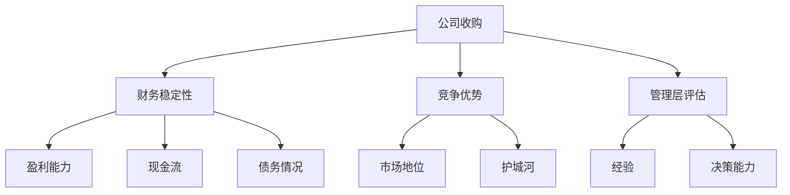
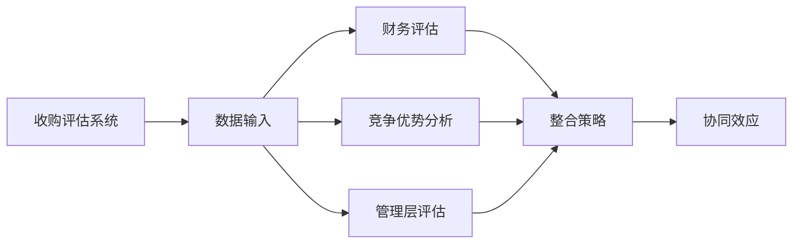

                 


# 巴菲特的公司收购策略：从股东到所有者的转变

> 关键词：巴菲特，公司收购，价值投资，股东，所有者，税务规划，企业整合

> 摘要：本文深入分析了巴菲特的公司收购策略，探讨了从股东到所有者的转变过程，结合经典案例分析，详细阐述了其投资哲学、收购标准、税务规划及整合策略，为投资者提供了实践指导。

---

# 第一部分：背景介绍

## 第1章：巴菲特的投资哲学

### 1.1 核心概念与术语说明

- **价值投资**：以低于内在价值的价格购买优质股票，长期持有。
- **安全边际**：购买价格远低于内在价值，确保安全性和高回报。
- **所有者思维**：长期持有，关注企业整体价值，而非短期股价波动。

### 1.2 问题背景与描述

- 投资者往往采取短期交易策略，忽视企业内在价值。
- 巴菲特强调长期持有，注重企业质量与管理。

### 1.3 问题解决

- 通过价值投资和安全边际，降低风险，提高回报率。
- 从股东到所有者思维的转变，实现长期价值创造。

### 1.4 边界与外延

- 价值投资适用于长期投资者，需具备分析能力。
- 安全边际确保在市场波动中仍能获利。

### 1.5 概念结构与核心要素

| 概念       | 属性                     |
|------------|--------------------------|
| 价值投资   | 低价买入，长期持有       |
| 安全边际   | 购买价格低于内在价值     |
| 所有者思维 | 关注企业整体，长期投资   |

---

# 第二部分：核心概念与联系

## 第2章：公司收购的标准与流程

### 2.1 核心概念原理

- **财务稳定性**：评估企业盈利能力、现金流和债务情况。
- **竞争优势**：分析企业市场地位、护城河。
- **管理层评估**：考察管理团队的经验和决策能力。

### 2.2 实体关系架构



---

# 第三部分：系统分析与架构设计

## 第3章：收购评估与整合策略

### 3.1 问题场景介绍

- 投资者需评估目标公司，制定整合计划，确保协同效应。

### 3.2 系统功能设计

| 功能模块       | 描述                     |
|----------------|--------------------------|
| 财务评估       | 分析财务报表，评估盈利能力 |
| 竞争优势分析   | 识别市场地位与护城河     |
| 管理层评估     | 考察管理团队能力         |

### 3.3 系统架构设计



### 3.4 实际案例分析

- **可口可乐收购案**：评估财务稳定性和竞争优势，制定整合策略，实现长期收益。

---

# 第四部分：算法原理与数学模型

## 第4章：数学模型与公式

### 4.1 财务评估公式

- **市盈率（P/E）**：$P/E = \frac{股价}{每股收益}$
- **内在价值计算**：$V = \sum \frac{CF_t}{(1+r)^t}$

### 4.2 安全边际计算

- **安全边际比例**：$安全边际 = \frac{内在价值 - 购买价格}{内在价值} \times 100\%$

---

# 第五部分：项目实战

## 第5章：环境安装与实现

### 5.1 环境安装

- 数据分析工具：Excel、Python（Pandas库）

### 5.2 核心代码实现

```python
import pandas as pd

def calculate_pe_ratio(df):
    df['P/E'] = df['股价'] / df['每股收益']
    return df

# 示例数据
data = {
    '公司': ['A', 'B', 'C'],
    '股价': [100, 80, 120],
    '每股收益': [20, 25, 30]
}

df = pd.DataFrame(data)
result = calculate_pe_ratio(df)
print(result)
```

### 5.3 应用解读

- 计算P/E比率，识别低于市场的价值股票，评估安全边际。

---

# 第六部分：总结与启示

## 第6章：总结与注意事项

### 6.1 启示

- 价值投资需要长期视角和深入分析。
- 安全边际降低风险，提高收益。

### 6.2 注意事项

- 确保数据准确，避免过度依赖模型。
- 定期复盘，及时调整策略。

---

# 参考文献

1. 巴菲特年度股东大会记录。
2. 《巴菲特的选股术》。
3. 《价值投资入门》。

---

作者：AI天才研究院 & 禅与计算机程序设计艺术

