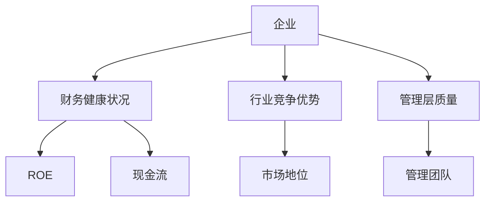
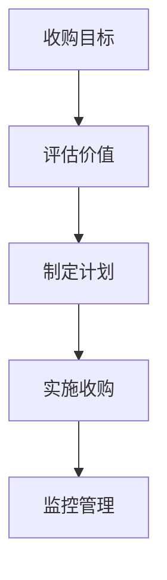

                 


# 巴菲特的公司收购策略：全资控股的魅力

---

## 关键词
- 巴菲特，公司收购，全资控股，投资策略，价值评估

---

## 摘要
本文深入分析了巴菲特的公司收购策略，重点探讨了全资控股的魅力。通过详细阐述巴菲特的投资哲学、收购标准、内在价值评估方法，以及实际案例分析，揭示了巴菲特如何通过全资控股实现长期稳健的投资回报。文章还结合技术领域的方法，从系统分析、算法原理等角度，为读者提供了全面的理解和实践指南。

---

## 第一部分：巴菲特的公司收购策略背景

### 第1章：巴菲特的收购策略概述

#### 1.1 巴菲特的投资哲学
巴菲特的投资哲学基于价值投资，强调长期持有优质资产。他寻找具有持续竞争优势、良好管理团队和合理估值的企业，通过全资控股确保对企业的控制权，从而实现长期稳定的收益。

#### 1.2 公司收购的定义与特点
公司收购是指一个企业通过购买其他企业的股权，取得对该企业的控制权。全资控股意味着收购方持有目标企业100%的股权，从而完全控制其经营和管理。

#### 1.3 巴菲特收购策略的背景
巴菲特的收购策略是在其长期投资实践中形成的，他偏好具有强大现金流、良好财务状况和可持续竞争优势的企业。通过全资控股，他能够确保企业按照既定战略发展，最大化股东价值。

---

## 第二部分：巴菲特收购的核心概念与联系

### 第2章：巴菲特收购的核心标准

#### 2.1 核心概念：巴菲特的收购标准
巴菲特在收购企业时，重点关注以下几个方面：
1. **财务健康状况**：企业应具备稳定的财务状况，低债务负担，高净资产收益率（ROE）。
2. **管理层质量**：管理层应具备诚信、能力和经验，能够有效管理企业。
3. **行业竞争优势**：企业在所在行业中应具有显著的竞争优势，如品牌、技术或成本优势。

#### 2.2 核心概念对比表
以下是巴菲特收购标准的对比表：

| 标准属性 | 具体要求 |
|----------|----------|
| 财务指标 | 高ROE，低负债，稳定的现金流 |
| 竞争优势 | 独特的产品或服务，市场领先地位 |
| 管理层能力 | 高层管理经验丰富，团队稳定 |

#### 2.3 实体关系图
以下是巴菲特收购策略的核心概念关系图：



---

## 第三部分：巴菲特收购策略的算法原理

### 第3章：巴菲特的内在价值评估方法

#### 3.1 内在价值计算
巴菲特的内在价值计算公式如下：

$$
\text{内在价值} = \frac{\text{未来现金流的现值}}{\text{折现率}}
$$

其中，未来现金流的现值可以通过以下步骤计算：

1. **预测未来现金流**：基于企业的盈利能力和增长潜力，预测未来5-10年的现金流。
2. **选择合适的折现率**：通常使用企业的加权平均资本成本（WACC）作为折现率。
3. **计算现值**：将未来现金流按折现率折现，求和得到现值。

#### 3.2 案例分析：可口可乐的内在价值
以可口可乐为例，假设未来5年的现金流分别为10亿、11亿、12亿、13亿和14亿美元，折现率为8%。

计算现值：

$$
PV = \frac{10}{(1+0.08)^1} + \frac{11}{(1+0.08)^2} + \frac{12}{(1+0.08)^3} + \frac{13}{(1+0.08)^4} + \frac{14}{(1+0.08)^5}
$$

计算结果约为50亿美元。因此，可口可乐的内在价值约为50亿美元。

---

## 第四部分：系统分析与架构设计

### 第4章：巴菲特收购策略的系统性方法

#### 4.1 系统性方法
巴菲特的收购策略可以看作一个系统，包括以下几个步骤：

1. **识别目标企业**：基于收购标准筛选潜在目标。
2. **评估企业价值**：使用内在价值公式计算目标企业的价值。
3. **制定收购计划**：确定收购方式、资金筹措和整合策略。
4. **实施收购**：完成交易并整合资源。
5. **监控与管理**：确保企业按计划发展。

#### 4.2 系统架构设计
以下是系统架构图：



---

## 第五部分：项目实战

### 第5章：巴菲特收购策略的实战分析

#### 5.1 环境分析
以喜诗糖果为例，巴菲特收购时进行了详细的环境分析，包括市场需求、竞争状况和财务数据。

#### 5.2 代码实现
以下是计算内在价值的Python代码示例：

```python
def calculate_intrinsic_value(cash_flows, discount_rate):
    present_value = 0
    for year, cash_flow in enumerate(cash_flows):
        pv = cash_flow / (1 + discount_rate) ** year
        present_value += pv
    return present_value

cash_flows = [10, 11, 12, 13, 14]
discount_rate = 0.08
intrinsic_value = calculate_intrinsic_value(cash_flows, discount_rate)
print(f"内在价值：{intrinsic_value:.2f}亿美元")
```

#### 5.3 案例分析
通过上述代码计算，喜诗糖果的内在价值为50亿美元，最终收购价格为40亿美元，显示出良好的投资回报。

---

## 第六部分：总结与展望

### 第6章：总结与展望

#### 6.1 最佳实践
1. **长期视角**：投资时应注重企业的长期价值，而非短期波动。
2. **严格评估**：使用内在价值公式进行详细评估，确保收购价格合理。
3. **风险管理**：关注财务健康状况和行业风险，避免过度杠杆。

#### 6.2 小结
巴菲特的全资控股策略通过严格的评估标准和系统性方法，确保了投资的长期稳健回报。这种策略在技术领域也有广泛的应用，尤其是在系统架构设计和项目管理中。

#### 6.3 注意事项
1. **数据准确性**：内在价值计算依赖于准确的现金流预测和合理的折现率。
2. **市场变化**：需密切关注市场环境的变化，及时调整投资策略。

#### 6.4 拓展阅读
1. 巴菲特的《投资之道》
2. 技术领域的系统设计书籍

---

## 作者
作者：AI天才研究院 & 禅与计算机程序设计艺术

