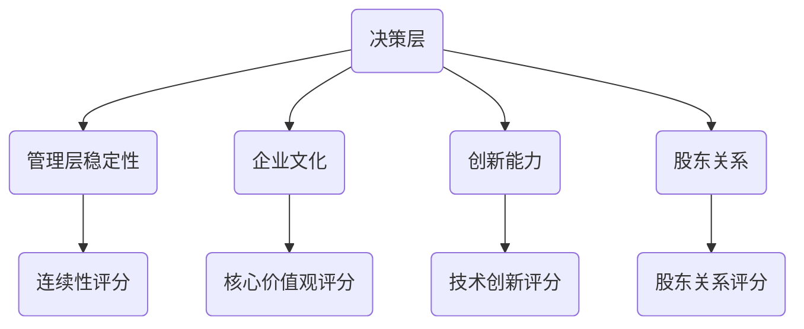

                 


# 巴菲特的公司文化评估：优秀管理层的特征

## 关键词：巴菲特，公司文化评估，优秀管理层，管理原则，企业治理，投资策略

## 摘要：  
本文深入探讨了巴菲特在评估公司文化时的核心原则，重点分析了优秀管理层的特征及其对公司长期成功的影响。通过结合管理学、投资学和系统工程的视角，我们详细解读了巴菲特的文化评估方法，并通过实际案例展示了如何将这些原则应用于现实情境中。文章不仅提供了理论上的分析，还通过算法和系统设计展示了如何量化和评估公司的文化特征。

---

# 第一部分: 巴菲特的公司文化评估背景与核心概念

## 第1章: 巴菲特的公司文化评估概述

### 1.1 巴菲特的生平与投资理念

#### 1.1.1 巴菲特的生平简介  
沃伦·巴菲特（Warren Buffett）是世界著名的投资家、企业家和慈善家，被誉为“股神”。他于1934年出生在美国堪萨斯州，早年展现出对投资的浓厚兴趣，并通过阅读和实践积累了丰富的投资经验。巴菲特的职业生涯始于1950年代，他通过投资伯克希尔哈撒韦公司（Berkshire Hathaway）逐步建立起庞大的投资帝国。  

#### 1.1.2 巴菲特的投资理念与风格  
巴菲特的投资理念以价值投资为核心，强调寻找具有持续竞争优势、良好管理团队和合理估值的企业进行长期投资。他认为，企业的长期价值取决于其管理层的质量、商业模式的稳健性以及对股东利益的重视。  

#### 1.1.3 巴菲特对公司的独特见解  
巴菲特认为，公司文化是决定企业长期成功的关键因素。他特别关注管理层的文化基因、决策风格以及与股东的互动关系。他认为，优秀的企业文化能够激发员工的潜力，增强企业的凝聚力，并为企业创造长期价值。

### 1.2 公司文化评估的重要性

#### 1.2.1 公司文化的核心作用  
公司文化是企业的灵魂，它决定了企业的行为方式、员工的工作态度以及企业对外的形象。优秀的企业文化能够吸引和留住优秀人才，提高员工的生产力，并增强企业的市场竞争力。  

#### 1.2.2 优秀管理层对公司的长期影响  
管理层的决策风格、价值观和领导能力直接决定了公司的发展方向。一个优秀的管理层能够带领企业在复杂多变的市场环境中保持稳定，并推动企业实现长期增长。  

#### 1.2.3 巴菲特的公司文化评估方法  
巴菲特的公司文化评估方法注重对企业管理层的稳定性、企业文化的核心价值观、创新能力和与股东的关系进行全面分析。他通过对企业文化的深入了解，判断企业是否具备长期发展的潜力。

## 第2章: 公司文化评估的核心维度

### 2.1 公司文化评估的维度分解

#### 2.1.1 管理层稳定性与决策能力  
管理层的稳定性是公司文化评估的重要指标。一个稳定的管理层能够为企业提供连续的决策支持，并在面对挑战时保持冷静。  

#### 2.1.2 企业文化与员工凝聚力  
优秀的企业文化能够增强员工的归属感和责任感，从而提高员工的工作效率和创造力。  

#### 2.1.3 企业创新能力和适应性  
在快速变化的市场环境中，企业的创新能力决定了其能否适应市场变化并抓住发展机遇。  

#### 2.1.4 企业与股东的关系  
良好的股东关系是企业长期发展的关键。巴菲特特别关注企业是否能够通过透明的沟通和合理的利润分配与股东建立信任关系。

### 2.2 核心概念与联系

#### 2.2.1 核心概念原理  
公司文化评估的核心在于分析企业文化的各个维度，包括管理层稳定性、企业文化、创新能力和与股东的关系。这些维度相互关联，共同构成了企业文化的整体框架。

#### 2.2.2 核心概念属性特征对比表格  
| 维度             | 稳定性 | 企业文化 | 创新能力 | 股东关系 |
|------------------|--------|----------|----------|----------|
| 关键特征         | 连续性 | 核心价值观 | 技术创新 | 透明度   |
| 重要性           | 高     | 高       | 中       | 高       |
| 影响范围         | 内部管理 | 全体员工 | 产品开发 | 投资者   |

#### 2.2.3 ER实体关系图架构  
```mermaid
erDiagram
    管理层稳定性 <---+--- 企业文化
    创新能力     <---+--- 企业创新
    股东关系     <---+--- 企业与股东
```

---

# 第二部分: 巴菲特公司文化评估的算法与系统分析

## 第3章: 公司文化评估的算法原理

### 3.1 层次分析法（AHP）的应用

#### 3.1.1 层次分析法的基本原理  
层次分析法是一种用于多准则决策分析的方法，适用于处理复杂决策问题。通过将决策问题分解为多个层次，构建决策模型，并通过专家评分确定各层次的重要性权重。

#### 3.1.2 公司文化评估的AHP流程  
1. 确定评估维度：包括管理层稳定性、企业文化、创新能力和股东关系。  
2. 构建层次结构：将评估维度作为中间层，具体指标作为底层。  
3. 确定各维度的权重：通过专家评分确定各维度的重要性权重。  
4. 计算综合评分：基于权重和具体指标的评分，计算企业的综合文化评估得分。  



### 3.2 数学模型与公式

#### 3.2.1 评估维度的权重分配  
假设四个维度的权重分别为：  
- 管理层稳定性：权重为0.3  
- 企业文化：权重为0.3  
- 创新能力：权重为0.2  
- 股东关系：权重为0.2  

#### 3.2.2 综合评分公式  
$$ \text{综合评分} = w_1 \times s_1 + w_2 \times s_2 + w_3 \times s_3 + w_4 \times s_4 $$  
其中，$w_i$ 是各维度的权重，$s_i$ 是各维度的具体评分（0-10分）。  

---

## 第4章: 公司文化评估的系统分析与架构设计

### 4.1 系统分析与功能设计

#### 4.1.1 问题场景介绍  
假设我们是一家投资机构，希望通过评估目标公司的文化特征，决定是否投资该公司。  

#### 4.1.2 系统功能设计  
1. 数据收集模块：收集目标公司的管理团队稳定性、企业文化、创新能力和股东关系的相关数据。  
2. 评估指标模块：根据AHP方法，确定各维度的具体指标。  
3. 权重分配模块：根据专家评分确定各维度的权重。  
4. 综合评估模块：计算目标公司的综合文化评估得分。  

#### 4.1.3 系统架构设计  


---

## 第5章: 公司文化评估的项目实战

### 5.1 环境安装与数据准备

#### 5.1.1 环境安装  
假设我们使用Python和Pandas进行数据分析，安装必要的库：  
```bash
pip install numpy pandas scikit-learn
```

#### 5.1.2 数据准备  
收集目标公司的文化特征数据，包括管理层稳定性、企业文化、创新能力、股东关系等指标。  

### 5.2 核心代码实现

#### 5.2.1 加权评分计算  
```python
import pandas as pd

# 数据准备
data = {
    '公司': ['公司A', '公司B', '公司C'],
    '管理层稳定性': [8, 7, 9],
    '企业文化': [7, 8, 6],
    '创新能力': [6, 9, 5],
    '股东关系': [9, 8, 7]
}
df = pd.DataFrame(data)

# 权重分配
weights = {'管理层稳定性': 0.3, '企业文化': 0.3, '创新能力': 0.2, '股东关系': 0.2}

# 综合评分计算
df['综合评分'] = 0
for i in range(len(df)):
    score = 0
    for column in df.columns[1:5]:
        score += df.iloc[i][column] * weights[column]
    df.iloc[i, 5] = score

print(df)
```

#### 5.2.2 结果分析  
通过计算，我们可以得出目标公司的综合文化评估得分，从而判断其文化特征是否符合巴菲特的优秀管理层标准。

---

## 第6章: 总结与展望

### 6.1 总结  
本文通过分析巴菲特的公司文化评估方法，详细探讨了优秀管理层的特征，并通过层次分析法构建了文化评估模型。通过实际案例展示了如何将这些原则应用于现实情境中。

### 6.2 展望  
未来的研究可以进一步优化文化评估模型，结合更多的实际案例，验证其在不同行业和文化背景下的适用性。

---

# 结语  
巴菲特的公司文化评估方法为我们提供了一个全新的视角，帮助我们更好地理解优秀管理层的特征。通过本文的分析，我们可以更加深入地洞察企业文化的内在逻辑，并将其应用于实际投资决策中。

---

# 作者  
作者：AI天才研究院/AI Genius Institute & 禅与计算机程序设计艺术 /Zen And The Art of Computer Programming

