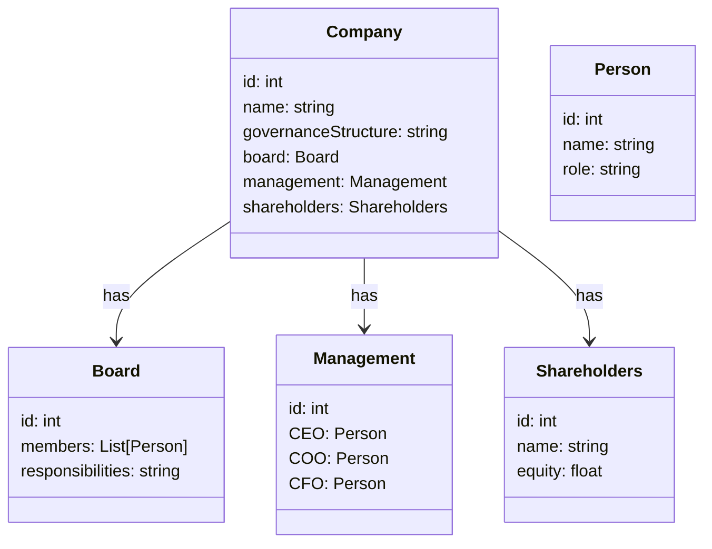

                 

# 巴菲特的公司治理观点

## 关键词：巴菲特，公司治理，投资策略，股东价值，董事会管理，风险管理

## 摘要：本文详细探讨巴菲特的公司治理观点，分析其投资策略、董事会管理、股东价值最大化等核心理念，并结合实际案例进行深入剖析，为读者提供全面的见解和实践建议。

---

# 第1章：巴菲特的背景与投资理念

## 1.1 巴菲特的基本情况

### 1.1.1 巴菲特的生平简介

沃伦·巴菲特（Warren Buffett），1934年8月31日出生于美国内布拉斯州奥马哈市，是世界著名投资家、企业家和慈善家。他创立的伯克希尔哈撒韦公司（Berkshire Hathaway）是全球最有影响力的公司之一。巴菲特的投资理念和管理风格深受投资者和商界人士的推崇。

### 1.1.2 巴菲特的投资哲学

巴菲特的投资哲学以“价值投资”为核心，强调购买具有持续竞争优势和良好管理的公司，长期持有，避免频繁交易。他认为市场的短期波动无法预测，但优质公司的长期价值是可以评估的。

### 1.1.3 巴菲特的公司治理理念

巴菲特认为，公司治理是确保公司长期成功的关键因素。他主张建立透明、高效的治理结构，确保股东利益最大化，同时强调管理层的责任和能力。

---

## 1.2 公司治理的基本概念

### 1.2.1 公司治理的定义

公司治理是指公司如何管理和控制其业务活动，确保公司目标的实现和利益相关者的权益得到保护。它涉及董事会、管理层、股东和其他利益相关者之间的关系。

### 1.2.2 公司治理的核心要素

公司治理的核心要素包括：

1. **董事会**：负责监督公司战略、财务和管理层的表现。
2. **管理层**：执行董事会的决策，管理日常运营。
3. **股东**：拥有公司股权，参与公司重大决策。
4. **利益相关者**：包括员工、客户、债权人等。

### 1.2.3 公司治理的重要性

良好的公司治理能够提高公司的透明度和责任感，降低风险，增强投资者信心，促进公司长期稳定发展。

---

# 第2章：巴菲特的公司治理核心观点

## 2.1 股东价值最大化

### 2.1.1 股东价值的概念

股东价值是指公司为股东创造的财富，通常通过公司市值和股东权益的增加来衡量。

### 2.1.2 股东价值与公司治理的关系

良好的公司治理能够确保管理层的行为符合股东利益，从而实现股东价值最大化。

### 2.1.3 巴菲特如何实现股东价值最大化

巴菲特通过选择具有持续竞争优势和良好治理结构的公司，长期持有，避免短期市场波动的干扰。

---

## 2.2 董事会的作用

### 2.2.1 董事会的职责

董事会负责制定公司战略，监督管理层的表现，确保公司合规运营。

### 2.2.2 董事会的结构

伯克希尔哈撒韦的董事会由独立董事和管理层组成，独立董事占大多数，确保董事会的独立性和高效性。

### 2.2.3 巴菲特对董事会的管理方式

巴菲特注重董事会的独立性和专业性，确保董事会能够有效监督公司运营。

---

# 第3章：巴菲特的公司治理实践

## 3.1 伯克希尔哈撒韦的治理模式

### 3.1.1 伯克希尔哈撒韦的股权结构

伯克希尔哈撒韦是一家控股公司，旗下拥有多家子公司，股权结构分散，但巴菲特和芒格（Charlie Munger）是公司的重要决策者。

### 3.1.2 董事会的构成与运作

伯克希尔哈撒韦的董事会由独立董事和管理层组成，独立董事负责监督公司运营，管理层负责日常管理。

### 3.1.3 股东大会的作用

伯克希尔哈撒韦每年召开股东大会，股东参与公司重大决策，确保股东的知情权和参与权。

---

## 3.2 巴菲特的控股公司治理策略

### 3.2.1 控股公司的治理原则

巴菲特注重控股公司的治理结构，确保子公司具有独立的治理机制，同时保持对子公司的监督和控制。

### 3.2.2 控股公司的董事会管理

伯克希尔哈撒韦通过控股子公司，确保子公司董事会的独立性和高效性，提升子公司治理水平。

### 3.2.3 控股公司的股东关系管理

巴菲特注重与股东的沟通，通过股东大会和年报等形式，向股东传递公司信息，增强股东信心。

---

# 第4章：巴菲特的公司治理评价标准

## 4.1 公司治理的评估指标

### 4.1.1 股东权益回报率（ROE）

ROE = 净利润 / 平均股东权益

### 4.1.2 股东权益比率

股东权益比率 = 股东权益 / 总资产

### 4.1.3 公司治理评分体系

巴菲特通过评估公司的治理结构、管理层能力和财务状况，对公司治理进行评分。

---

## 4.2 巴菲特的选股标准

### 4.2.1 高质量的管理层

巴菲特注重管理层的能力和道德水平，认为管理层是公司治理的关键因素。

### 4.2.2 强大的财务状况

巴菲特选择财务健康、债务低的公司，确保公司长期稳定发展。

### 4.2.3 可持续的竞争优势

巴菲特关注公司是否具有独特的竞争优势，如品牌、技术或市场地位。

---

# 第5章：巴菲特的公司治理与投资策略

## 5.1 投资策略与公司治理的关系

### 5.1.1 公司治理对投资决策的影响

良好的公司治理能够降低投资风险，提高投资回报。

### 5.1.2 投资策略如何影响公司治理

巴菲特通过投资，推动公司治理的改善，提升公司价值。

### 5.1.3 巴菲特如何通过治理结构选择投资标的

巴菲特注重公司的治理结构，选择具有透明、高效的治理结构的公司进行投资。

---

## 5.2 风险管理与公司治理

### 5.2.1 风险管理在公司治理中的作用

风险管理是公司治理的重要组成部分，能够降低公司运营风险，保护股东利益。

### 5.2.2 巴菲特的风险管理策略

巴菲特通过分散投资、选择具有稳定收益的公司等方式，降低投资风险。

### 5.2.3 公司治理如何降低投资风险

良好的公司治理能够提高公司透明度，降低信息不对称，减少投资风险。

---

# 第6章：系统分析与架构设计

## 6.1 问题场景介绍

## 6.2 项目介绍

## 6.3 系统功能设计（领域模型Mermaid类图）

## 6.4 系统架构设计（Mermaid架构图）

## 6.5 系统接口设计

## 6.6 系统交互（Mermaid序列图）

---

# 第7章：项目实战

## 7.1 环境安装

## 7.2 核心实现源代码

## 7.3 代码应用解读与分析

## 7.4 实际案例分析

---

# 第8章：总结与最佳实践

## 8.1 总结

## 8.2 最佳实践Tips

## 8.3 注意事项

## 8.4 拓展阅读

---

作者：AI天才研究院/AI Genius Institute & 禅与计算机程序设计艺术 /Zen And The Art of Computer Programming

