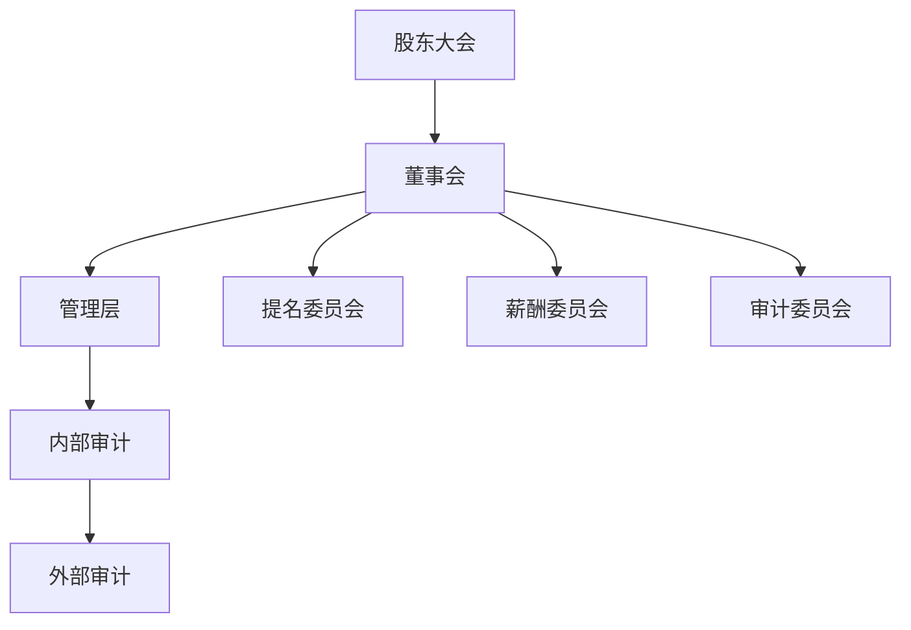
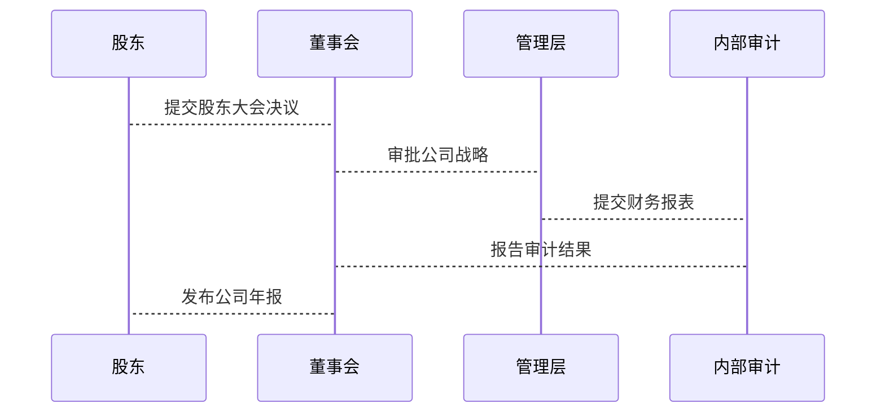

                 


```markdown
# 巴菲特的公司治理观：股东利益至上

> 关键词：巴菲特，公司治理，股东利益，董事会，管理层激励

> 摘要：本文深入探讨巴菲特的公司治理理念，强调股东利益至上的原则，并通过详细分析其背后的理论、实践和数学模型，为读者提供全面的理解和应用指南。

---

# 第一部分：背景介绍

## 第1章：巴菲特的生平与投资哲学
### 1.1 巴菲特的生平简介
#### 1.1.1 巴菲特的成长经历
沃伦·巴菲特（Warren Buffett）于1934年8月30日出生于美国堪萨斯州的奥马哈市。他的父亲Howard Buffett是一位成功的律师和政治家，母亲Leila Buffett则来自一个富裕的家庭。巴菲特从小就展现出对数字和投资的天赋，他在高中时期就展现出对股票市场的兴趣，并在19岁时开始进行股票投资。

#### 1.1.2 巴菲特的投资理念
巴菲特的投资哲学可以概括为“价值投资”，即寻找那些具有持续竞争优势、良好管理和稳固财务基础的公司进行长期投资。他认为市场短期是投票机，但长期是称重机，因此强调长期投资和价值发现。

#### 1.1.3 巴菲特的公司治理思想
巴菲特的公司治理思想深深植根于他的价值投资理念。他认为，一个公司能否长期为股东创造价值，关键在于其治理结构是否能够确保股东利益的最大化。他强调，公司治理的核心是确保管理层和董事会能够代表股东的利益，并以股东的利益为最高指导原则。

### 1.2 公司治理的基本概念
#### 1.2.1 公司治理的定义与内涵
公司治理是指通过一系列机制和规则，确保公司各个利益相关方（股东、董事会、管理层、员工、债权人等）之间的权利和义务得到合理分配和有效执行。其核心在于平衡各方利益，确保公司长期稳定发展。

#### 1.2.2 公司治理的核心要素
公司治理的核心要素包括：
1. **董事会结构**：董事会是公司治理的核心，负责监督和指导管理层，确保公司战略的制定和执行符合股东利益。
2. **管理层激励**：通过合理的激励机制，确保管理层的行为与股东利益一致。
3. **透明度与披露**：公司需要向股东和其他利益相关方提供真实、准确的信息，增强信任。
4. **股东权利保护**：确保股东在公司治理中的权利得到充分尊重和保护。

#### 1.2.3 公司治理的目标与意义
公司治理的目标是实现公司长期价值最大化，同时平衡各方利益。良好的公司治理可以提升公司声誉、降低融资成本、提高管理效率，从而为股东创造更大的价值。

---

# 第二部分：巴菲特的公司治理原则

## 第3章：股东至上的治理原则
### 3.1 股东的权利与义务
#### 3.1.1 股东的基本权利
股东的基本权利包括：
1. **投票权**：股东有权参与公司重大决策的投票，如选举董事、批准公司章程修改等。
2. **收益权**：股东有权分享公司的利润，通常通过股息和股价上涨实现。
3. **知情权**：股东有权了解公司的财务状况、经营成果等重要信息。
4. **参与权**：股东有权参与公司股东大会，表达意见和建议。

#### 3.1.2 股东的义务与责任
股东的义务包括：
1. **遵守公司章程**：股东必须遵守公司章程和相关法律法规。
2. **承担有限责任**：股东仅需承担其出资额范围内的责任，无需为公司的债务承担无限责任。
3. **维护公司利益**：股东应以公司整体利益为重，避免因个人利益损害公司利益。

#### 3.1.3 股东与公司利益的关系
股东是公司的所有者，公司治理的核心目标是实现股东利益的最大化。然而，股东利益并非孤立存在，需要在与其他利益相关方的关系中找到平衡点。

### 3.2 股东利益最大化的实现
#### 3.2.1 股东利益最大化的定义
股东利益最大化是指通过合理的公司治理结构和机制，确保股东的投资能够获得最大化的收益和价值。

#### 3.2.2 股东利益最大化的实现路径
1. **优化董事会结构**：确保董事会成员具有高度的专业性和独立性，能够有效监督管理层，并代表股东利益。
2. **建立合理的激励机制**：通过股权激励等方式，将管理层的利益与股东利益绑定，确保管理层的行为与股东利益一致。
3. **提高透明度与披露水平**：通过公开透明的信息披露，增强股东对公司运营的信任，减少信息不对称带来的风险。
4. **加强股东参与**：通过股东大会和其他渠道，鼓励股东积极参与公司治理，行使自己的权利。

## 第4章：董事会的结构与责任
### 4.1 董事会的组成与职责
#### 4.1.1 董事会的组成原则
1. **独立性**：董事会成员应具有较高的独立性，避免受到管理层或其他利益相关方的干扰。
2. **专业性**：董事会成员应具备相应的专业背景和能力，能够对公司战略和运营提供专业的指导和建议。
3. **多样性**：董事会成员应具有多样化的背景和经验，以增强董事会的决策能力和整体素质。

#### 4.1.2 董事会的主要职责
1. **制定公司战略**：董事会负责制定公司的发展战略，确保公司长期目标的实现。
2. **监督管理层**：董事会对管理层的行为进行监督，确保管理层的行为符合公司利益和股东利益。
3. **评估公司绩效**：董事会负责评估公司绩效，确保公司运营符合预期目标。
4. **风险管理**：董事会负责识别和评估公司面临的风险，并制定相应的风险管理策略。

#### 4.1.3 董事会的独立性与专业性
独立性和专业性是董事会有效履行职责的关键因素。独立的董事会能够客观地评估管理层的表现，并在必要时做出调整。专业的董事会成员能够提供专业的建议和指导，帮助公司实现长期价值最大化。

### 4.2 董事会的运作机制
#### 4.2.1 董事会的决策机制
董事会的决策机制包括定期召开董事会会议，讨论公司重大事项，并做出决策。董事会的决策应遵循民主集中制原则，确保决策的科学性和合理性。

#### 4.2.2 董事会的监督机制
董事会的监督机制包括：
1. **审计委员会**：负责监督公司的财务报告和内部审计工作，确保财务信息的真实性和准确性。
2. **提名委员会**：负责提名董事会成员和高级管理人员，确保公司治理结构的合理性和有效性。
3. **薪酬委员会**：负责制定管理层的薪酬方案，确保薪酬与公司绩效挂钩，激励管理层为股东创造更大价值。

#### 4.2.3 董事会的评估与改进
董事会应定期对自身的运作进行评估，发现问题并及时改进。评估内容包括董事会成员的履职情况、董事会决策的科学性、董事会与管理层的沟通效率等。

## 第5章：管理层的激励与监督
### 5.1 管理层的激励机制
#### 5.1.1 激励机制的定义
激励机制是指通过一定的奖励和惩罚措施，激发管理层的积极性和创造力，使其为公司创造更大的价值。

#### 5.1.2 激励机制的类型
1. **股权激励**：通过给予管理层一定比例的股权，将管理层的个人利益与公司利益绑定，激励管理层为公司创造更大的价值。
2. **奖金激励**：通过给予奖金的方式，激励管理层在短期内实现公司目标。
3. **长期激励**：通过给予股票期权等方式，激励管理层长期关注公司发展，避免短期行为。

#### 5.1.3 激励机制的设计原则
1. **公平性**：激励机制的设计应公平合理，确保管理层的努力与回报成正比。
2. **有效性**：激励机制应有效激发管理层的积极性，避免形式主义。
3. **可持续性**：激励机制应具有可持续性，能够长期激励管理层为公司创造价值。

### 5.2 管理层的监督机制
#### 5.2.1 监督机制的定义
监督机制是指通过一定的机制和措施，确保管理层的行为符合公司利益和股东利益，防止管理层滥用职权或进行不当行为。

#### 5.2.2 监督机制的类型
1. **董事会监督**：董事会是公司治理的核心，负责监督管理层的行为，确保管理层的行为符合公司利益和股东利益。
2. **审计监督**：通过内部审计和外部审计，监督公司财务状况和经营成果，确保公司财务信息的真实性和准确性。
3. **股东监督**：股东可以通过股东大会和其他渠道，对公司治理进行监督，确保公司治理符合股东利益。

#### 5.2.3 监督机制的实施
1. **建立监督机构**：公司应建立专门的监督机构，如审计委员会、提名委员会等，负责监督管理层的行为。
2. **加强信息披露**：公司应加强信息披露，通过公开财务报表和公司治理报告，增强股东和其他利益相关方对公司治理的监督。
3. **规范权力分配**：公司应规范权力分配，确保各权力机构之间的权力制衡，避免权力过于集中。

---

# 第三部分：数学模型与分析

## 第6章：公司治理的数学模型
### 6.1 公司价值评估模型
#### 6.1.1 净现值模型
净现值（Net Present Value，NPV）是公司价值评估的重要工具之一。NPV = ∑(CF_t / (1 + r)^t) - 初始投资，其中CF_t为第t年的现金流，r为折现率。

#### 6.1.2 内在价值模型
巴菲特的内在价值模型认为，公司的内在价值是其未来现金流的现值。内在价值 = ∑(CF_t / (1 + r)^t)。

#### 6.1.3 股东权益回报率
股东权益回报率（ROE）是衡量公司盈利能力的重要指标，ROE = 净利润 / 股东权益。

### 6.2 股东利益最大化的优化模型
#### 6.2.1 股权激励模型
股权激励模型可以通过期权定价模型（如Black-Scholes模型）进行评估。股票期权的价值 = S * N(d1) - K * e^(-rT) * N(d2)，其中S为股票价格，K为行权价，T为时间，r为无风险利率，N(d1)和N(d2)为标准正态分布的累积分布函数值。

#### 6.2.2 管理层激励与公司绩效的关系
通过回归分析可以评估管理层激励对公司绩效的影响。回归方程为：绩效 = β1 * 激励 + β2 * 控制变量 + ε。

---

# 第四部分：系统分析与架构设计

## 第7章：公司治理的系统架构
### 7.1 系统分析
公司治理的系统架构包括以下几个部分：
1. **股东**：股东是公司治理的核心，通过股东大会和董事会行使权利。
2. **董事会**：董事会是公司治理的决策机构，负责制定公司战略和监督管理层。
3. **管理层**：管理层是公司治理的执行机构，负责公司日常运营和管理。
4. **内部审计**：内部审计机构负责监督公司财务和运营，确保公司合规性和透明度。
5. **外部审计**：外部审计机构负责对公司财务报表进行独立审计，增强财务信息的可靠性和公信力。

### 7.2 系统架构设计
公司治理的系统架构设计可以用以下mermaid图表示：



### 7.3 接口设计
公司治理的接口设计包括股东大会、董事会会议、管理层汇报、审计报告等。

### 7.4 交互序列图
公司治理的交互序列图可以用以下mermaid图表示：



---

# 第五部分：项目实战

## 第8章：实际案例分析
### 8.1 伯克希尔 Hathaway的治理结构
伯克希尔 Hathaway的治理结构是巴菲特公司治理思想的典型代表。其治理结构包括：
1. **董事会**：由独立董事和管理层组成，独立董事占大多数。
2. **管理层**：由巴菲特和他的长期合作伙伴查理·芒格（Charlie Munger）领导，管理层享有广泛的决策权和自主权。
3. **股东权益保护**：通过股权激励机制，确保管理层的利益与股东利益一致。

### 8.2 案例分析与优化建议
1. **优化董事会结构**：增加独立董事比例，确保董事会的独立性和专业性。
2. **加强股东参与**：通过股东大会和其他渠道，鼓励股东积极参与公司治理。
3. **完善激励机制**：通过股权激励等方式，确保管理层的行为与股东利益一致。

---

# 第六部分：总结与展望

## 第9章：总结与展望
### 9.1 总结
巴菲特的公司治理观以股东利益至上为核心，强调通过优化董事会结构、加强股东参与、完善激励机制等方式，实现公司长期价值最大化。良好的公司治理能够有效平衡各方利益，为股东创造更大的价值。

### 9.2 展望
未来，随着全球经济的不断发展和公司治理环境的不断变化，公司治理将面临新的挑战和机遇。如何在复杂多变的环境中，进一步优化公司治理结构，实现股东利益最大化，是值得深入研究和探索的重要课题。

---

# 作者：AI天才研究院/AI Genius Institute & 禅与计算机程序设计艺术 /Zen And The Art of Computer Programming
```

