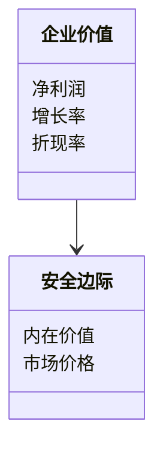

                 


# 巴菲特的公司管理哲学

> 关键词：巴菲特，公司管理哲学，价值投资，长期主义，股东资本主义

> 摘要：本文探讨巴菲特的公司管理哲学，分析其核心理念、管理风格及其对现代企业的影响。通过数学模型和系统设计，展示其哲学在实际管理中的应用，并结合项目实战提供实践指导。

---

## 第1章：背景介绍

### 1.1 巴菲特的生平简介

#### 1.1.1 早年经历
沃伦·巴菲特出生于1930年，美国堪萨斯州。他的父亲是律师和政治家，母亲是家庭主妇。巴菲特从小就展现对数字和投资的兴趣。

#### 1.1.2 教育背景
巴菲特在哥伦比亚大学学习，师从本杰明·格雷厄姆，学习价值投资理论。

#### 1.1.3 职业发展
巴菲特从1956年开始管理合伙企业，逐步建立伯克希尔·哈撒韦公司，成为投资界传奇。

---

### 1.2 巴菲特的投资哲学

#### 1.2.1 价值投资
寻找市场低估的公司，长期持有。

#### 1.2.2 安全边际
购买价格低于内在价值，确保投资安全。

#### 1.2.3 长期投资
不为短期波动担忧，关注企业长期价值。

---

### 1.3 公司管理哲学的背景

#### 1.3.1 投资哲学与管理哲学的结合
巴菲特的管理哲学基于其投资理念，追求股东价值最大化。

#### 1.3.2 现代企业中的应用
将长期主义和股东价值理念应用到企业管理中，强调企业文化、风险管理等。

---

## 第2章：核心概念与联系

### 2.1 核心概念分析

#### 2.1.1 价值投资
通过分析企业内在价值，寻找投资标的。

#### 2.1.2 长期主义
追求长期稳定增长，避免短期波动。

#### 2.1.3 股东资本主义
以股东利益为核心，关注长期价值。

---

### 2.2 核心概念之间的关系

#### 2.2.1 价值投资与长期主义
价值投资提供安全边际，长期主义确保持续增长。

#### 2.2.2 长期主义与股东资本主义
长期主义实现股东价值最大化。

#### 2.2.3 股东资本主义与企业治理
良好的治理结构确保股东价值。

---

## 第3章：算法原理与数学模型

### 3.1 价值投资的数学模型

#### 3.1.1 企业价值计算
$$ EV = \text{净利润} \times (1 + g) / (r - g) $$
其中，g为增长率，r为折现率。

#### 3.1.2 安全边际
$$ \text{安全边际} = \text{内在价值} - \text{市场价格} $$

---

## 第4章：系统分析与架构设计

### 4.1 问题场景介绍

#### 4.1.1 环境分析
假设一家公司采用巴菲特哲学，优化企业架构。

### 4.2 系统功能设计

#### 4.2.1 领域模型


### 4.3 系统架构设计

#### 4.3.1 模块划分
- 价值评估模块
- 风险管理模块
- 股东价值模块

#### 4.3.2 架构图


---

## 第5章：项目实战

### 5.1 环境安装

#### 5.1.1 工具准备
安装Python和相关库。

### 5.2 核心实现

#### 5.2.1 代码实现
```python
def calculate_ev(net_profit, growth_rate, discount_rate):
    return net_profit * (1 + growth_rate) / (discount_rate - growth_rate)
```

#### 5.2.2 应用解读
计算某公司的企业价值，评估是否低估。

---

## 第6章：最佳实践

### 6.1 小结
巴菲特的哲学强调长期价值和风险管理，值得企业在管理中借鉴。

### 6.2 注意事项
选择优质企业，避免短期波动。

### 6.3 拓展阅读
推荐书籍：《巴菲特传》。

---

作者：AI天才研究院

