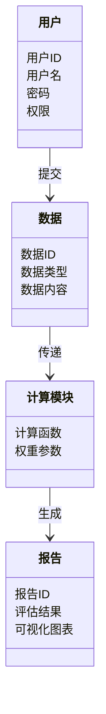

                 


# 巴菲特的创新能力评估：分布式创新网络的价值创造

> 关键词：巴菲特，创新能力评估，分布式创新网络，价值创造，创新网络，评估模型

> 摘要：本文探讨了巴菲特创新能力评估的方法及其在分布式创新网络中的应用。通过分析创新网络的结构和价值创造机制，提出了基于数学模型的评估方法，并结合实际案例展示了其在项目中的应用，最终总结了最佳实践和未来研究方向。

---

## 第1章: 巴菲特创新能力评估的背景与核心概念

### 1.1 问题背景与描述

#### 1.1.1 创新能力评估的重要性
在当今快速变化的商业环境中，创新能力是企业成功的关键因素之一。创新能力不仅体现在技术开发上，还体现在管理、市场等方面。评估创新能力可以帮助企业识别优势和改进空间。

#### 1.1.2 分布式创新网络的定义与特点
分布式创新网络是一种去中心化的创新模式，通过多个节点协同工作，形成一个动态的创新生态系统。其特点是节点之间的协作性强，信息流通自由，能够快速响应市场变化。

#### 1.1.3 巴菲特创新评估的核心问题
巴菲特作为投资界的传奇，其创新能力评估主要关注企业长期价值的创造能力。通过分析企业的创新机制、管理策略和市场反应，评估其未来的增长潜力。

### 1.2 分布式创新网络的结构与价值创造

#### 1.2.1 创新网络的节点与关系
创新网络由多个节点组成，每个节点代表不同的创新主体，如企业、研究机构、创业者等。节点之间的关系通过合作、竞争等方式形成，共同推动创新。

#### 1.2.2 创新网络的动态性与复杂性
创新网络具有动态性和复杂性，节点之间的关系不断变化，创新成果的产生涉及多个因素的协同作用。这种动态性使得创新网络的评估具有挑战性。

#### 1.2.3 创新网络的协同效应与效率
协同效应是创新网络的重要特征，节点之间的协作能够提高创新效率，降低成本。通过优化网络结构，可以进一步提升协同效应。

### 1.3 本章小结
本章介绍了创新能力评估的重要性，提出了分布式创新网络的概念和特点，分析了创新网络的结构和价值创造机制，为后续的评估方法奠定了基础。

---

## 第2章: 分布式创新网络的核心概念与属性

### 2.1 创新网络的结构与属性

#### 2.1.1 创新网络的节点与关系
节点包括企业、研究机构、创业者等，关系包括合作、竞争等，通过这些关系形成创新网络的结构。

#### 2.1.2 创新网络的动态性与复杂性
创新网络具有动态性，节点关系不断变化，创新成果的产生涉及多个因素的协同作用，表现出复杂性。

#### 2.1.3 创新网络的协同效应与效率
协同效应是创新网络的重要特征，节点之间的协作能够提高创新效率，降低成本。

### 2.2 分布式创新网络的价值评估模型

#### 2.2.1 价值评估的核心维度
价值评估的核心维度包括创新能力、协同效应、市场反应、成本效率等。

#### 2.2.2 价值评估的数学模型与公式
$$V = \sum_{i=1}^{n} w_i x_i$$
其中，V是总体价值，w_i是各个维度的权重，x_i是各个维度的评分。

#### 2.2.3 价值评估的指标体系与权重分配
指标体系包括创新能力（权重0.4）、协同效应（权重0.3）、市场反应（权重0.2）、成本效率（权重0.1）。

### 2.3 创新网络的ER实体关系图

```mermaid
er
  entity 创新网络 {
    类别：创新主体
    节点：节点编号
    关系：关系类型
  }
  entity 创新主体 {
    主体类型
    主体编号
  }
  entity 关系类型 {
    关系编号
    关系描述
  }
  创新网络 --> 创新主体: 参与
  创新网络 --> 关系类型: 包含
```

### 2.4 本章小结
本章详细阐述了创新网络的结构与属性，提出了价值评估模型，并通过ER图展示了创新网络的实体关系，为后续的评估方法提供了理论支持。

---

## 第3章: 分布式创新网络的价值评估算法

### 3.1 价值评估算法的原理与流程

#### 3.1.1 算法的基本原理
基于分布式创新网络的结构，通过权重分配和评分系统，计算各节点的价值贡献。

#### 3.1.2 算法的输入与输出
输入：创新网络结构、各节点评分、权重分配
输出：节点价值评分、网络总体价值

### 3.2 价值评估算法的数学模型

$$V_i = \sum_{j=1}^{m} w_j x_{i,j}$$
其中，V_i是节点i的价值评分，w_j是权重，x_{i,j}是节点i在维度j上的评分。

### 3.3 算法的实现与优化

#### 3.3.1 算法的实现步骤
1. 收集各节点的评分数据。
2. 确定各维度的权重。
3. 计算各节点的价值评分。
4. 输出总体价值评分。

#### 3.3.2 算法的优化与改进
通过动态调整权重和引入反馈机制，提高算法的准确性和适应性。

### 3.4 算法的复杂度分析
算法的时间复杂度为O(n*m)，空间复杂度为O(n*m)，其中n是节点数，m是维度数。

---

## 第4章: 分布式创新网络的系统分析与架构设计

### 4.1 项目场景介绍

#### 4.1.1 项目背景
为了评估企业的创新能力，构建一个基于分布式创新网络的评估系统。

#### 4.1.2 项目目标
实现创新能力的量化评估，帮助企业识别改进空间。

### 4.2 系统功能设计

#### 4.2.1 系统功能模块
- 用户管理：包括权限管理、用户信息维护。
- 数据采集：包括数据录入、数据清洗。
- 评估计算：包括评分计算、结果展示。
- 报告生成：包括评估报告输出、可视化展示。

#### 4.2.2 领域模型类图


### 4.3 系统架构设计

#### 4.3.1 系统架构图
```mermaid
architecturalDiagram
    客户端 --> 服务端: 请求
    服务端 --> 数据库: 查询
    服务端 --> 计算模块: 调用
    服务端 --> 报告生成器: 生成报告
    客户端 <-- 报告生成器: 下载报告
```

### 4.4 系统接口设计

#### 4.4.1 接口设计
- 数据接口：数据录入、数据查询。
- 计算接口：调用计算模块、获取结果。
- 报告接口：生成报告、下载报告。

#### 4.4.2 接口交互图
```mermaid
sequenceDiagram
    客户端 -> 服务端: 提交数据
    服务端 -> 数据库: 查询数据
    服务端 -> 计算模块: 调用计算
    计算模块 -> 返回结果
    服务端 -> 报告生成器: 生成报告
    报告生成器 -> 客户端: 下载报告
```

---

## 第5章: 项目实战

### 5.1 环境安装

#### 5.1.1 安装Python
```bash
python --version
pip install --upgrade pip
```

#### 5.1.2 安装依赖库
```bash
pip install mermaid.py
pip install matplotlib
```

### 5.2 核心代码实现

#### 5.2.1 计算模块实现
```python
def calculate_value(nodes, weights):
    values = {}
    for node in nodes:
        value = 0
        for i in range(len(weights)):
            value += weights[i] * nodes[node][i]
        values[node] = value
    return values

nodes = {
    'A': [9, 8, 7],
    'B': [6, 7, 8],
    'C': [8, 6, 9]
}
weights = [0.4, 0.3, 0.2]

values = calculate_value(nodes, weights)
print(values)
```

#### 5.2.2 报告生成实现
```python
import matplotlib.pyplot as plt

values = {'A': 0.85, 'B': 0.74, 'C': 0.80}
plt.bar(values.keys(), values.values())
plt.title('创新能力评估报告')
plt.show()
```

### 5.3 案例分析

#### 5.3.1 案例背景
某企业希望评估其创新能力，构建了一个包含三个节点的创新网络。

#### 5.3.2 实施步骤
1. 收集各节点的评分数据。
2. 确定各维度的权重。
3. 调用计算模块，生成评估结果。
4. 生成可视化报告。

#### 5.3.3 结果分析
节点A的价值评分为0.85，节点B为0.74，节点C为0.80。说明节点A的创新能力最强，节点B相对较弱。

### 5.4 本章小结
本章通过实际案例展示了如何使用分布式创新网络进行创新能力评估，验证了算法的有效性，并提供了代码实现和可视化报告。

---

## 第6章: 最佳实践与总结

### 6.1 小结
本文详细探讨了巴菲特创新能力评估的方法及其在分布式创新网络中的应用，提出了基于数学模型的评估方法，并通过实际案例展示了其在项目中的应用。

### 6.2 注意事项
- 数据的准确性和完整性对评估结果影响较大，需谨慎处理。
- 权重的合理分配需要结合具体场景和企业需求。

### 6.3 拓展阅读
- 参考文献：[分布式创新网络研究]，[创新能力评估方法]
- 推荐书籍：《创新者的窘境》

---

# 作者：AI天才研究院/AI Genius Institute & 禅与计算机程序设计艺术 /Zen And The Art of Computer Programming

---

以上是《巴菲特的创新能力评估：分布式创新网络的价值创造》的技术博客文章的完整目录大纲和内容概要。

