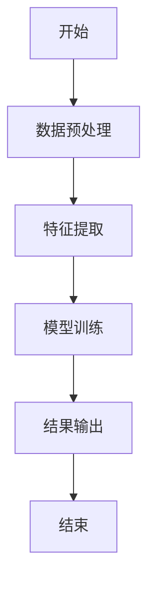
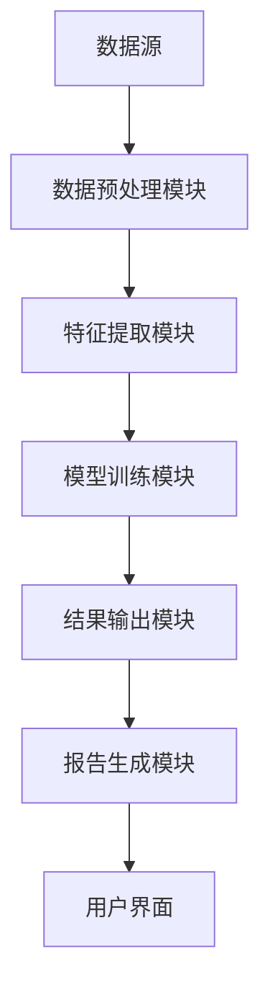

                 


```markdown
# 巴菲特的创新能力评估：如何判断公司的长期竞争力

## 关键词：巴菲特、创新能力评估、长期竞争力、投资分析、护城河、管理层能力

## 摘要：本文通过分析巴菲特的创新能力评估方法，详细探讨如何从公司竞争优势、管理层能力、财务指标等方面判断其长期竞争力。结合数学模型和实际案例，为读者提供一套系统化的评估体系。

---

## 第一部分: 巴菲特创新能力评估的背景与核心概念

### 第1章: 巴菲特投资理念与创新能力评估的背景

#### 1.1 巴菲特投资理念概述
- **价值投资哲学**：巴菲特定义价值投资，强调以合理价格买入具有持续竞争优势的公司。
- **长期竞争力的重要性**：巴菲通常关注公司能否在长期市场中保持优势，而创新能力是核心因素之一。
- **创新能力的定义**：创新能力指公司在市场中持续创新、改进产品或服务的能力，是保持竞争力的关键。

#### 1.2 创新能力评估的背景
- **创新驱动增长**：在科技迅速发展的今天，创新能力成为企业持续增长的关键。
- **投资者的视角**：投资者需要评估公司的创新能力，以判断其长期盈利能力。
- **竞争优势的核心**：创新能力是企业建立和维护竞争优势的关键因素。

### 第2章: 巴菲特创新能力评估的核心要素

#### 2.1 公司的竞争优势分析
- **护城河的定义**：护城河是指公司在市场上难以被竞争对手复制的独特优势。
- **护城河的类型**：
  - **成本优势**：公司在生产或运营中具有显著的成本优势。
  - **品牌优势**：强大的品牌影响力吸引消费者。
  - **技术优势**：拥有独特的技术或专利。
  - **网络效应**：用户数量增加，产品价值提升，形成正反馈。

#### 2.2 管理层能力评估
- **管理层的素质与风格**：领导者的智慧、决策能力和企业文化的建设能力。
- **管理层的历史表现**：过去的表现是未来决策的重要参考。
- **管理层的决策能力**：在关键时刻做出正确的决策。

#### 2.3 财务指标与创新能力的关系
- **财务健康状况的重要性**：健康的财务状况是公司创新的基础。
- **财务指标的评估**：通过ROE、毛利率等指标评估公司的盈利能力。
- **财务风险与创新能力的平衡**：在财务稳健的基础上，公司能更好地支持创新活动。

---

## 第二部分: 创新能力评估的数学模型与算法

### 第3章: 创新能力评估的数学模型

#### 3.1 加权评分法
- **评分模型的构建**：根据护城河、管理层能力、财务状况等维度，为每个维度赋予不同的权重。
- **权重的确定方法**：根据经验或历史数据确定各维度的权重。
- **评分模型的实现**：将各维度的评分加权求和，得到综合评分。

#### 3.2 财务指标与创新能力的回归分析
- **回归分析的原理**：通过统计方法，分析财务指标与创新能力之间的关系。
- **自变量与因变量的定义**：自变量为财务指标，因变量为创新能力评分。
- **回归模型的建立与验证**：通过数据拟合，验证模型的有效性。

### 第4章: 创新能力评估的算法实现

#### 4.1 算法流程图


#### 4.2 Python代码实现
```python
import pandas as pd
from sklearn.linear_model import LinearRegression

# 数据预处理
data = pd.read_csv('company_data.csv')
data = data.dropna()

# 特征提取
X = data[['ROE', '毛利率', '研发投入']]
y = data['创新能力评分']

# 模型训练
model = LinearRegression()
model.fit(X, y)

# 结果输出
print('回归系数:', model.coef_)
print('回归截距:', model.intercept_)
```

---

## 第三部分: 系统分析与架构设计

### 第5章: 系统分析与架构设计方案

#### 5.1 系统功能设计
- **数据收集模块**：收集公司的财务数据、市场数据等。
- **分析模块**：对数据进行处理和分析，评估创新能力。
- **评分系统**：根据分析结果，生成创新能力评分。
- **报告生成模块**：生成分析报告，提供投资建议。

#### 5.2 系统架构设计


---

## 第四部分: 项目实战

### 第6章: 项目实战：企业创新能力评估

#### 6.1 案例分析：特斯拉创新能力评估
- **护城河分析**：特斯拉在电动汽车领域的技术优势和品牌影响力。
- **管理层能力评估**：埃隆·马斯克的领导能力和战略眼光。
- **财务状况分析**：通过财务指标评估公司的创新能力。

#### 6.2 案例分析：苹果创新能力评估
- **护城河分析**：苹果在iOS生态系统和技术专利方面的优势。
- **管理层能力评估**：蒂姆·库克的管理能力和战略决策。
- **财务状况分析**：通过财务指标评估公司的创新能力。

---

## 第五部分: 工具与方法论

### 第7章: 巴菲特创新能力评估的工具与方法论

#### 7.1 评估工具
- **加权评分卡**：根据各维度的重要性，为每个维度赋予不同的权重。
- **SWOT分析**：从优势、劣势、机会、威胁四个方面分析公司。

#### 7.2 评估流程
- **数据收集**：收集公司的财务数据、市场数据等。
- **分析与评估**：根据核心要素进行分析，评估创新能力。
- **结果应用**：将评估结果应用于投资决策。

---

## 第六部分: 结论与展望

### 第8章: 结论与展望

#### 8.1 结论
- 巴菲特的创新能力评估方法为投资者提供了一套系统化的评估体系。
- 通过分析公司的竞争优势、管理层能力和财务状况，可以有效判断其长期竞争力。

#### 8.2 展望
- 结合人工智能和大数据技术，进一步优化创新能力评估模型。
- 进一步研究不同行业创新能力评估的差异化方法。

---

## 附录

### 附录A: 参考文献
-巴菲特投资思想的相关书籍和论文。

### 附录B: 巴菲特创新能力评估工具列表
- 加权评分卡
- SWOT分析工具
- 回归分析工具

### 附录C: 术语表
- 护城河：公司在市场中难以被竞争对手复制的独特优势。
- 创新能力：公司持续创新、改进产品或服务的能力。
- 回归分析：统计方法，用于分析变量之间的关系。

---

## 作者：AI天才研究院 & 禅与计算机程序设计艺术
```

