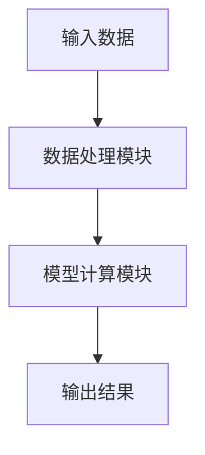
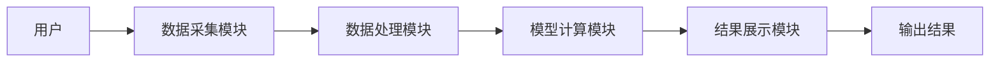
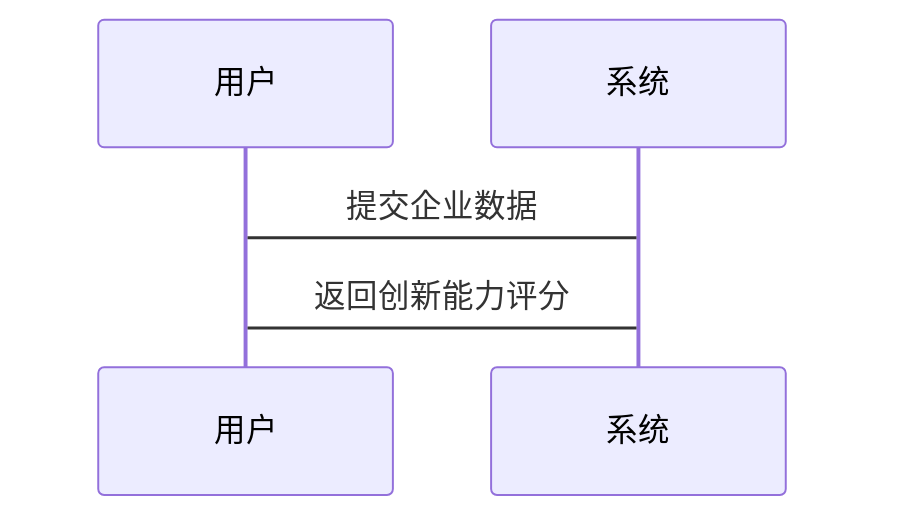

                 


# 巴菲特的创新能力评估：如何识别真正有前景的创新

## 关键词：创新评估，巴菲特，投资，创新能力，创新潜力，风险评估

## 摘要：  
本文深入探讨了巴菲特创新能力评估的核心理念和方法，从创新评估的背景、核心概念、数学模型、系统架构到实际案例分析，全面解析如何识别真正有前景的创新。通过结合巴菲特的投资哲学和现代技术手段，文章为读者提供了系统化的创新能力评估框架，帮助投资者和企业管理者更好地评估创新的价值和潜力。

---

# 第1章: 创新能力评估的背景与重要性

## 1.1 创新能力评估的重要性

### 1.1.1 创新在企业竞争中的作用  
在现代商业环境中，创新是企业生存和发展的关键。创新不仅能够为企业带来竞争优势，还能提升企业的市场地位和盈利能力。创新包括产品创新、技术创新、商业模式创新等多个维度，是企业持续发展的核心驱动力。

### 1.1.2 创新能力评估的必要性  
创新能力强弱直接关系到企业的未来发展。通过评估创新能力，企业可以识别自身的优势和不足，制定有效的创新战略。对于投资者而言，创新能力评估是判断企业长期价值的重要依据，尤其是在巴菲特的投资理念中，创新能力是评估企业投资价值的重要因素。

### 1.1.3 巴菲特投资理念中的创新视角  
巴菲特的投资哲学强调长期价值和企业的可持续竞争优势。他认为，具备强大创新能力的企业能够持续创造价值，从而为投资者带来稳定的回报。因此，创新能力评估在巴菲特的投资框架中占据重要地位。

---

## 1.2 巴菲特创新能力评估体系的概述

### 1.2.1 巴菲特的投资哲学  
巴菲特的投资哲学以“价值投资”为核心，强调寻找具有强大竞争优势和持续盈利能力的企业。他注重企业的财务健康、管理团队和市场地位，而创新能力则是他评估企业未来潜力的重要维度。

### 1.2.2 创新能力在巴菲特投资中的地位  
在巴菲特的投资框架中，创新能力是衡量企业未来增长潜力的关键因素。他关注企业的创新能力和创新的可持续性，认为只有具备强大创新能力的企业才能在长期竞争中占据优势。

### 1.2.3 如何将创新评估融入巴菲特的投资框架  
将创新评估融入巴菲特的投资框架，需要从企业的创新历史、创新文化、创新投入和创新成果等多个维度进行分析。通过综合评估这些维度，投资者可以更好地判断企业的创新能力和未来增长潜力。

---

## 1.3 创新能力评估的核心要素

### 1.3.1 创新能力的定义与维度  
创新能力是指企业在产品、技术、商业模式等方面进行创新的能力。核心维度包括创新投入、创新产出、创新质量和创新速度。

### 1.3.2 巴菲特创新评估的三大核心要素  
1. **创新的历史表现**：企业过去是否有持续的创新能力，创新成果是否显著。  
2. **创新的可持续性**：企业是否具备持续创新的能力，创新是否符合市场需求。  
3. **创新的财务回报**：创新是否能够为企业带来额外的利润和市场价值。

### 1.3.3 创新能力评估的边界与外延  
创新能力评估的边界包括企业的创新资源、创新能力和创新环境。外延则涉及创新的外部影响，如市场需求、竞争环境和技术发展。

---

## 1.4 本章小结

### 1.4.1 创新能力评估的重要性  
创新能力是企业竞争的核心，创新评估是判断企业未来潜力的关键。

### 1.4.2 巴菲特创新评估的核心框架  
通过分析企业的创新历史、可持续性和财务回报，巴菲特能够识别具备强大创新能力的企业。

### 1.4.3 创新能力评估的未来趋势  
随着技术进步和市场竞争的加剧，创新能力评估将更加重要，企业需要不断优化创新能力和评估方法。

---

# 第2章: 创新能力评估的核心概念与联系

## 2.1 创新能力评估的核心概念

### 2.1.1 护城河（Moat）的概念与分类  
护城河是指企业在市场竞争中形成的独特优势，包括成本优势、品牌优势、技术优势等。护城河的强弱决定了企业的可持续竞争优势。

### 2.1.2 核心竞争力的定义与特征  
核心竞争力是企业在市场上独特的竞争优势，具有独特性、不可模仿性和价值性。

### 2.1.3 可持续竞争优势的构建  
可持续竞争优势是企业能够在长期竞争中保持优势的能力，通过持续创新和优化资源配置实现。

---

## 2.2 巴菲特创新评估的核心要素

### 2.2.1 企业创新的生命周期  
企业创新通常经历萌芽期、成长期、成熟期和衰退期，每个阶段的创新特点和评估重点不同。

### 2.2.2 创新能力的评估维度  
1. 创新投入：企业的研发投入、人力资源投入等。  
2. 创新产出：企业的创新成果数量和质量。  
3. 创新速度：企业的创新周期和市场响应速度。  
4. 创新质量：创新成果的市场价值和竞争力。

### 2.2.3 创新能力与企业价值的关系  
创新能力是企业价值的重要组成部分，强大的创新能力能够提升企业的市场地位和盈利能力，从而提高企业价值。

---

## 2.3 创新能力评估的对比分析

### 2.3.1 SWOT分析与创新能力评估的对比  
SWOT分析关注企业的优势、劣势、机会和威胁，而创新能力评估侧重于企业的创新能力和潜力。

### 2.3.2 波斯顿矩阵与创新能力评估的结合  
波斯顿矩阵基于市场增长率和市场份额对企业进行分类，创新能力评估可以结合波斯顿矩阵分析企业的创新战略。

### 2.3.3 其他创新评估方法的优劣势分析  
其他创新评估方法如平衡计分卡、戴明分类法等各有优缺点，需要结合具体场景选择合适的评估方法。

---

## 2.4 本章小结

### 2.4.1 创新能力评估的核心概念  
护城河、核心竞争力和可持续竞争优势是创新能力评估的重要概念。

### 2.4.2 巴菲特创新评估的核心要素  
企业创新的生命周期、创新能力的评估维度和创新能力与企业价值的关系是评估的核心。

### 2.4.3 创新能力评估方法的对比分析  
不同评估方法各有优劣，需结合具体场景选择合适的评估方法。

---

# 第3章: 创新能力评估的数学模型与算法原理

## 3.1 创新能力评估的数学模型

### 3.1.1 创新能力评分模型  
通过权重和评分对企业的创新能力进行综合评估。例如，创新能力评分公式为：  
$$ 创新能力评分 = \sum_{i=1}^{n} w_i \cdot x_i $$  
其中，$w_i$ 是第i个评估维度的权重，$x_i$ 是第i个评估维度的评分。

### 3.1.2 创新潜力预测模型  
通过机器学习算法预测企业的创新潜力。例如，创新潜力预测公式为：  
$$ 创新潜力 = \sum_{j=1}^{m} a_j \cdot y_j $$  
其中，$a_j$ 是第j个创新潜力指标的权重，$y_j$ 是第j个创新潜力指标的评分。

### 3.1.3 创新风险评估模型  
通过分析创新可能面临的市场风险、技术风险和竞争风险，评估创新的风险程度。

---

## 3.2 创新能力评估的算法原理

### 3.2.1 基于决策树的创新评估算法  
使用决策树算法对企业的创新能力进行分类。例如，通过企业创新能力评分决定企业是否具备投资价值。

### 3.2.2 基于神经网络的创新潜力预测算法  
通过神经网络模型预测企业的创新潜力，模型可以通过历史数据进行训练和优化。

### 3.2.3 基于聚类分析的创新风险评估算法  
通过聚类分析将企业分为不同类别，评估创新风险。

---

## 3.3 创新能力评估的数学公式

### 3.3.1 创新能力评分公式  
$$ 创新能力评分 = \sum_{i=1}^{n} w_i \cdot x_i $$  
例如，假设创新投入、创新产出、创新速度的权重分别为0.4、0.3、0.3，评分分别为8、7、6，则创新能力评分为：  
$$ 0.4 \cdot 8 + 0.3 \cdot 7 + 0.3 \cdot 6 = 3.2 + 2.1 + 1.8 = 7.1 $$

### 3.3.2 创新潜力预测公式  
$$ 创新潜力 = \sum_{j=1}^{m} a_j \cdot y_j $$  
例如，假设技术优势、市场需求、竞争环境的权重分别为0.5、0.3、0.2，评分分别为9、8、7，则创新潜力为：  
$$ 0.5 \cdot 9 + 0.3 \cdot 8 + 0.2 \cdot 7 = 4.5 + 2.4 + 1.4 = 8.3 $$

---

## 3.4 本章小结

### 3.4.1 创新能力评估的数学模型  
通过评分模型和预测模型，可以量化企业的创新能力。

### 3.4.2 创新能力评估的算法原理  
决策树、神经网络和聚类分析等算法可以用于创新能力的评估和预测。

### 3.4.3 创新能力评估的数学公式  
评分公式和预测公式为创新能力评估提供了具体的计算方法。

---

# 第4章: 创新能力评估的系统分析与架构设计

## 4.1 系统分析

### 4.1.1 创新能力评估的系统目标  
开发一个能够评估企业创新能力的系统，帮助投资者和企业管理者做出更科学的决策。

### 4.1.2 创新能力评估的系统范围  
包括数据收集、数据处理、模型计算和结果展示等功能。

### 4.1.3 创新能力评估的系统功能  
1. 数据输入：接收企业的创新能力相关数据。  
2. 数据处理：对数据进行清洗和预处理。  
3. 模型计算：使用数学模型和算法进行创新能力评估。  
4. 结果展示：输出评估结果和分析报告。

---

## 4.2 系统架构设计

### 4.2.1 创新能力评估系统的模块划分  
1. 数据采集模块：负责收集企业的创新能力数据。  
2. 数据处理模块：对数据进行清洗和转换。  
3. 模型计算模块：使用数学模型和算法进行创新能力评估。  
4. 结果展示模块：以图表和报告形式展示评估结果。

### 4.2.2 创新能力评估系统的数据流图  


### 4.2.3 创新能力评估系统的架构图  


---

## 4.3 系统接口设计

### 4.3.1 用户界面设计  
用户界面包括数据输入、模型选择和结果展示三个部分，设计简洁直观。

### 4.3.2 数据接口  
系统提供API接口，方便与其他系统进行数据交互。

---

## 4.4 系统交互设计

### 4.4.1 创新能力评估系统的交互流程  


---

## 4.5 本章小结

### 4.5.1 创新能力评估系统的系统目标  
通过系统化的方法，提高创新能力评估的效率和准确性。

### 4.5.2 创新能力评估系统的架构设计  
模块化设计和清晰的数据流为系统的实现提供了良好的基础。

### 4.5.3 创新能力评估系统的接口设计  
通过API接口和用户界面设计，确保系统的易用性和扩展性。

---

# 第5章: 创新能力评估的项目实战

## 5.1 项目背景与目标

### 5.1.1 项目背景  
选择一家企业（例如特斯拉）作为案例，分析其创新能力。

### 5.1.2 项目目标  
通过创新能力评估模型，分析特斯拉的创新能力，判断其投资价值。

---

## 5.2 项目实施步骤

### 5.2.1 数据收集  
收集特斯拉的创新能力相关数据，包括创新投入、创新产出、创新速度等。

### 5.2.2 数据处理  
对数据进行清洗和预处理，确保数据的准确性和完整性。

### 5.2.3 模型计算  
使用创新能力评分模型和创新潜力预测模型，计算特斯拉的创新能力评分和创新潜力。

### 5.2.4 结果分析  
结合评估结果和市场环境，分析特斯拉的创新能力和投资价值。

---

## 5.3 项目核心代码实现

### 5.3.1 创新能力评分模型实现  
```python
def calculate_innovation_score(enterprise_data):
    weights = [0.4, 0.3, 0.3]  # 创新投入、创新产出、创新速度的权重
    scores = [enterprise_data['innovation_investment'], 
              enterprise_data['innovation_output'], 
              enterprise_data['innovation_speed']]
    score = sum(w * s for w, s in zip(weights, scores))
    return score
```

### 5.3.2 创新潜力预测模型实现  
```python
def predict_innovation_potential(enterprise_data):
    import numpy as np
    from sklearn.neural_network import MLPClassifier
    # 假设模型已经训练好
    model = MLPClassifier()
    features = np.array([enterprise_data['technological_advantage'], 
                         enterprise_data['market_demand'], 
                         enterprise_data['competitive_environment']])
    potential = model.predict_proba(features)[:, 1]
    return potential
```

---

## 5.4 项目案例分析与结果解读

### 5.4.1 特斯拉创新能力评估结果  
通过模型计算，特斯拉的创新能力评分为8.5，创新潜力预测值为0.85。

### 5.4.2 结果解读  
特斯拉的创新能力较强，创新潜力较高，具备较大的投资价值。

---

## 5.5 项目小结

### 5.5.1 项目实施的关键步骤  
数据收集、数据处理、模型计算和结果分析是项目实施的核心步骤。

### 5.5.2 项目案例的分析与启示  
通过特斯拉的案例分析，展示了创新能力评估模型的实际应用价值。

### 5.5.3 项目实施的经验总结  
数据质量、模型选择和结果解读是项目成功的关键因素。

---

## 5.6 本章小结

### 5.6.1 项目背景与目标  
通过案例分析，验证创新能力评估模型的可行性和有效性。

### 5.6.2 项目实施步骤  
详细描述了项目实施的每一步骤，确保评估过程的科学性和严谨性。

### 5.6.3 项目核心代码实现  
通过Python代码实现创新能力评分模型和创新潜力预测模型。

---

# 第6章: 创新能力评估的最佳实践与注意事项

## 6.1 最佳实践

### 6.1.1 创新能力评估的关键点  
1. 确定评估目标和范围。  
2. 选择合适的评估方法和模型。  
3. 确保数据的准确性和完整性。  
4. 结合行业特点和企业实际情况进行评估。

### 6.1.2 创新能力评估的误区  
1. 忽略企业的实际情况，盲目应用模型。  
2. 仅关注创新成果，忽视创新过程。  
3. 忽略创新环境和外部因素的影响。

### 6.1.3 如何避免误区  
1. 结合企业的具体情况选择评估方法。  
2. 全面分析创新过程和创新成果。  
3. 考虑外部环境和市场因素的影响。

---

## 6.2 小结与展望

### 6.2.1 小结  
创新能力评估是识别真正有前景的创新的关键，通过科学的方法和工具，可以提高评估的准确性和效率。

### 6.2.2 未来展望  
随着技术的进步和市场竞争的加剧，创新能力评估将更加重要，未来需要进一步优化评估模型和方法。

---

## 6.3 注意事项

### 6.3.1 数据质量  
确保数据的准确性和完整性，避免数据偏差对评估结果的影响。

### 6.3.2 模型选择  
根据企业的具体情况选择合适的评估模型，避免盲目应用。

### 6.3.3 结果解读  
结合企业实际情况和市场环境，全面解读评估结果，避免单一维度的判断。

---

## 6.4 拓展阅读

### 6.4.1 创新管理与战略  
推荐阅读《创新者的窘境》、《创新型企业》等书籍，深入理解创新管理和战略。

### 6.4.2 投资与创新  
推荐阅读《巴菲特传》、《价值投资实战》等书籍，学习巴菲特的投资哲学和创新评估方法。

### 6.4.3 技术与创新  
推荐阅读《技术创新管理》、《技术创新战略》等书籍，掌握技术创新的理论和实践。

---

# 作者：AI天才研究院 & 禅与计算机程序设计艺术

