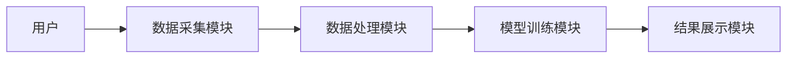
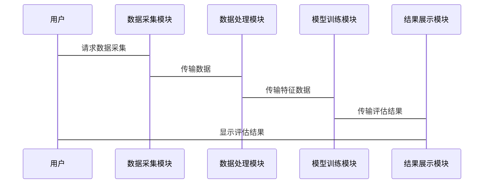

                 


---

# 巴菲特的创新能力评估：开源生态系统中的价值创造

---

## 关键词：
- 创新能力评估
- 开源生态系统
- 巴菲特投资理念
- 价值创造
- 人工智能

---

## 摘要：
本文探讨了如何在开源生态系统中评估创新能力和创造价值，结合巴菲特的投资理念，分析了开源生态系统的特点和创新价值的实现机制。文章提出了基于开源数据的创新能力评估模型，并通过机器学习和自然语言处理技术，详细阐述了算法原理和系统架构设计，最后通过项目实战展示了模型的应用。

---

# 第1章：创新能力评估的背景与概念

## 1.1 创新能力的定义与内涵
### 1.1.1 创新能力的定义
创新能力是指个体或组织在现有资源基础上，通过创造性思维和实践活动，提出新的解决方案或创造新价值的能力。它包括发现问题、解决问题、创新思维和执行力等多个方面。

### 1.1.2 创新能力的核心要素
创新能力的核心要素包括：
- 创新思维：包括发散思维、逻辑思维和批判性思维。
- 知识储备：包括技术知识、行业知识和管理知识。
- 执行能力：包括项目管理能力、团队协作能力和资源整合能力。

### 1.1.3 创新能力与企业价值的关系
创新能力是企业核心竞争力的重要组成部分。通过创新能力，企业可以不断推出新产品、优化流程、降低成本，从而实现可持续发展和价值创造。

---

## 1.2 开源生态系统的特点
### 1.2.1 开源生态系统的定义
开源生态系统是由开源项目、开发人员、企业、社区和技术平台组成的复杂系统。开源项目的代码和文档对所有人开放，允许自由使用、修改和分发。

### 1.2.2 开源生态系统的核心特征
开源生态系统的特征包括：
- 开放性：代码和资源对所有人开放。
- 协作性：开发者和企业可以协作开发和改进项目。
- 社区驱动：开源项目的发展依赖于社区的支持和贡献。
- 可扩展性：开源项目可以根据需求进行定制和扩展。

### 1.2.3 开源生态系统中的价值创造
开源生态系统通过协作和共享，降低了创新门槛，加速了技术传播，促进了技术进步。开源项目的价值不仅体现在代码本身，还体现在社区建设、知识共享和技术创新等方面。

---

## 1.3 巴菲特创新能力评估的背景
### 1.3.1 巴菲特投资理念的演变
巴菲特的投资理念以价值投资为核心，注重企业的基本面、管理层能力和长期竞争优势。创新能力是企业长期竞争优势的重要组成部分。

### 1.3.2 创新能力在投资决策中的重要性
创新能力是企业在市场竞争中保持优势的关键因素。具备创新能力的企业能够不断推出新产品、优化成本结构和适应市场变化。

### 1.3.3 开源生态系统与创新能力的关系
开源生态系统为企业提供了丰富的技术资源和协作平台，企业可以通过参与开源项目提升自身的创新能力。同时，企业对开源项目的贡献也可以提升其在行业中的影响力。

---

## 1.4 本章小结
本章介绍了创新能力的定义和核心要素，分析了开源生态系统的特征和价值创造机制，探讨了巴菲特创新能力评估的背景和意义。

---

# 第2章：创新能力评估的理论基础

## 2.1 创新能力评估的模型与方法
### 2.1.1 创新能力评估的主要模型
创新能力评估模型包括基于指标的评估模型、基于机器学习的评估模型和基于自然语言处理的评估模型。

### 2.1.2 开源生态系统中的创新评估方法
开源生态系统中的创新评估方法包括代码分析、社区贡献和项目影响力评估。

### 2.1.3 巴菲特创新能力评估的独特性
巴菲特创新能力评估的独特性在于其注重企业的长期价值和竞争优势，结合财务指标和创新能力指标进行综合评估。

---

## 2.2 开源生态系统中的价值创造机制
### 2.2.1 开源项目的价值来源
开源项目的价值来源于代码的开放性、社区的协作性和技术的先进性。

### 2.2.2 开源社区的协作模式
开源社区的协作模式包括代码贡献、问题解决和知识共享。社区成员可以通过代码审查、提交补丁和参与讨论等方式参与项目开发。

### 2.2.3 开源项目的可持续性
开源项目的可持续性依赖于社区的支持和企业的贡献。通过建立良好的治理机制和激励机制，可以确保开源项目的长期发展。

---

## 2.3 创新能力评估的指标体系
### 2.3.1 创新能力的关键指标
创新能力的关键指标包括创新成果数量、创新成果质量、创新成果转化率和创新团队能力。

### 2.3.2 开源生态系统中的评估维度
开源生态系统中的评估维度包括代码活跃度、社区贡献度和项目影响力。

### 2.3.3 巴菲特创新能力评估的指标权重
在巴菲特创新能力评估中，财务指标和创新能力指标的权重需要根据企业的具体情况进行调整。

---

## 2.4 本章小结
本章探讨了创新能力评估的模型与方法，分析了开源生态系统中的价值创造机制，提出了创新能力评估的指标体系。

---

# 第3章：创新能力评估的算法原理

## 3.1 创新能力评估的算法概述
### 3.1.1 基于开源数据的特征提取
基于开源数据的特征提取包括代码复杂度分析、代码变更频率分析和代码贡献者的活跃度分析。

### 3.1.2 基于机器学习的评估模型
基于机器学习的评估模型包括监督学习、无监督学习和半监督学习。监督学习模型可以通过历史数据进行训练，预测企业的创新能力。

### 3.1.3 基于自然语言处理的文本分析
基于自然语言处理的文本分析包括关键词提取、情感分析和主题模型构建。通过分析开源项目的文档和社区讨论，可以提取创新相关的关键词和主题。

---

## 3.2 基于开源数据的特征提取
### 3.2.1 数据预处理与清洗
数据预处理包括去除噪声、填充缺失值和数据标准化。

### 3.2.2 特征选择与降维
特征选择包括基于统计的特征选择和基于机器学习的特征选择。降维方法包括主成分分析（PCA）和线性判别分析（LDA）。

### 3.2.3 特征提取的算法实现
特征提取的算法实现包括基于Gini指数的特征选择和基于互信息的特征选择。

---

## 3.3 基于机器学习的评估模型
### 3.3.1 算法选择与模型构建
算法选择包括支持向量机（SVM）、随机森林（Random Forest）和梯度提升树（GBDT）。模型构建包括数据分割、模型训练和模型验证。

### 3.3.2 模型训练与优化
模型训练包括参数调优和交叉验证。模型优化包括正则化和集成学习。

### 3.3.3 模型评估与验证
模型评估包括准确率、召回率和F1分数。模型验证包括K折交叉验证和留出法。

---

## 3.4 基于自然语言处理的文本分析
### 3.4.1 文本预处理与分词
文本预处理包括去除停用词、分词和词干提取。分词方法包括基于词典的分词和基于统计的分词。

### 3.4.2 文本特征提取与表示
文本特征提取包括TF-IDF和词袋模型。文本表示包括词嵌入（Word2Vec）和句嵌入（BERT）。

### 3.4.3 文本分析的算法实现
文本分析的算法实现包括文本分类、情感分析和主题模型（LDA）。

---

## 3.5 本章小结
本章详细介绍了创新能力评估的算法原理，包括基于开源数据的特征提取、基于机器学习的评估模型和基于自然语言处理的文本分析。

---

# 第4章：创新能力评估的系统架构设计

## 4.1 系统功能设计
### 4.1.1 数据采集模块
数据采集模块负责从开源平台获取代码数据、项目文档和社区讨论数据。

### 4.1.2 数据处理模块
数据处理模块负责对采集到的数据进行清洗、转换和特征提取。

### 4.1.3 模型训练模块
模型训练模块负责基于特征数据进行模型训练和优化。

### 4.1.4 结果展示模块
结果展示模块负责将模型输出的结果以可视化的方式展示给用户。

---

## 4.2 系统架构设计
### 4.2.1 系统功能模块划分
系统功能模块包括数据采集模块、数据处理模块、模型训练模块和结果展示模块。

### 4.2.2 系统架构图
以下是系统架构设计的Mermaid图：



---

## 4.3 系统接口设计
### 4.3.1 数据接口
数据接口包括API接口和文件接口。API接口用于与开源平台进行数据交互，文件接口用于数据的本地存储和传输。

### 4.3.2 模型接口
模型接口包括模型训练接口和模型预测接口。模型训练接口用于训练创新能力评估模型，模型预测接口用于对目标企业进行创新能力评估。

---

## 4.4 系统交互设计
### 4.4.1 系统交互流程
系统交互流程包括数据采集、数据处理、模型训练和结果展示四个阶段。

### 4.4.2 交互流程图
以下是系统交互流程的Mermaid图：



---

## 4.5 本章小结
本章详细描述了创新能力评估系统的功能设计和架构设计，包括数据采集模块、数据处理模块、模型训练模块和结果展示模块的设计。

---

# 第5章：创新能力评估的项目实战

## 5.1 项目环境安装
### 5.1.1 安装Python和依赖库
安装Python和必要的依赖库，包括NumPy、Pandas、Scikit-learn、NLTK和Gensim。

### 5.1.2 安装开源平台的API接口
安装GitHub API和Gitee API，用于获取开源项目的代码和社区数据。

---

## 5.2 系统核心实现源代码
### 5.2.1 数据采集模块代码
```python
import requests

def get_project_data(owner, repo):
    url = f"https://api.github.com/repos/{owner}/{repo}/issues"
    response = requests.get(url)
    return response.json()
```

### 5.2.2 数据处理模块代码
```python
import pandas as pd

def preprocess_data(data):
    df = pd.DataFrame(data)
    df = df.dropna()
    return df
```

### 5.2.3 模型训练模块代码
```python
from sklearn.ensemble import RandomForestClassifier

def train_model(X_train, y_train):
    model = RandomForestClassifier(n_estimators=100, random_state=42)
    model.fit(X_train, y_train)
    return model
```

### 5.2.4 结果展示模块代码
```python
import matplotlib.pyplot as plt

def plot_results(results):
    plt.bar(range(len(results)), results)
    plt.xticks(range(len(results)), ['A', 'B', 'C', 'D'])
    plt.show()
```

---

## 5.3 代码应用解读与分析
### 5.3.1 数据采集模块的实现
数据采集模块通过GitHub API获取开源项目的代码和社区数据，为后续的数据处理和模型训练提供数据支持。

### 5.3.2 数据处理模块的实现
数据处理模块对采集到的数据进行清洗和特征提取，确保数据的准确性和完整性。

### 5.3.3 模型训练模块的实现
模型训练模块基于特征数据训练随机森林模型，评估企业的创新能力。

### 5.3.4 结果展示模块的实现
结果展示模块通过可视化的方式展示模型的评估结果，帮助用户直观理解评估结果。

---

## 5.4 实际案例分析
### 5.4.1 案例背景
以某科技公司为例，分析其创新能力。通过GitHub API获取其开源项目的代码和社区数据，进行特征提取和模型训练。

### 5.4.2 模型评估结果
模型评估结果显示该科技公司的创新能力在行业中处于较高水平，具有较大的投资价值。

### 5.4.3 案例分析总结
通过实际案例分析，验证了创新能力评估模型的有效性和准确性。

---

## 5.5 本章小结
本章通过项目实战展示了创新能力评估系统的实现过程，包括环境安装、代码实现和案例分析。

---

# 第6章：总结与展望

## 6.1 总结
本文探讨了如何在开源生态系统中评估创新能力和创造价值，提出了基于开源数据的创新能力评估模型，并通过机器学习和自然语言处理技术，详细阐述了算法原理和系统架构设计。通过项目实战，验证了模型的有效性和准确性。

## 6.2 未来展望
未来的研究方向包括：
- 建立更完善的创新能力评估指标体系。
- 开发更智能的创新能力评估算法。
- 拓展创新能力评估的应用场景。

---

# 作者：AI天才研究院 & 禅与计算机程序设计艺术

---

