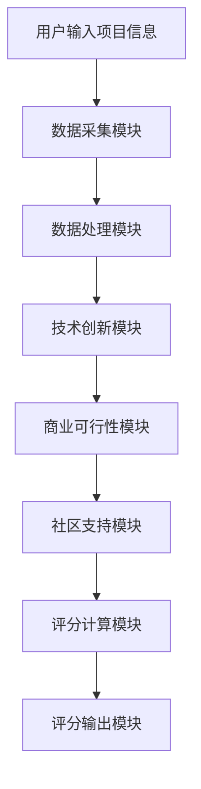
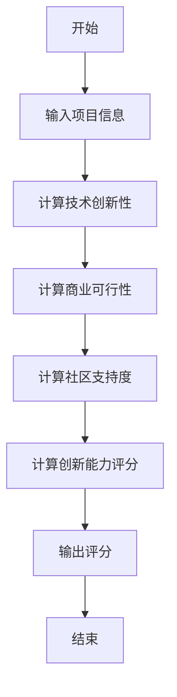

                 


# 巴菲特的创新能力评估：开源硬件生态系统的价值创造

## 关键词：巴菲特、创新能力评估、开源硬件、生态系统、价值创造

## 摘要：  
本文探讨了巴菲特的价值投资理念在开源硬件生态系统中的应用，重点分析了开源硬件生态系统的创新性及其价值创造机制。通过构建创新能力评估模型，结合系统架构设计和算法实现，本文详细阐述了如何利用巴菲特的评估方法来衡量开源硬件项目的潜力和价值。最后，通过实际案例分析，验证了该模型的有效性和适用性。

---

# 第1章: 巴菲特的价值投资理论与开源硬件生态系统概述

## 1.1 巴菲特的价值投资理论

### 1.1.1 巴菲特投资理念的核心要素

巴菲特的价值投资理论以以下几个核心要素为基础：

1. **企业内在价值**：企业的真实价值是其未来现金流的现值。
2. **安全边际**：以低于内在价值的价格买入资产。
3. **竞争优势**：寻找具有持续竞争优势的企业。
4. **长期主义**：关注企业的长期发展，而非短期波动。

### 1.1.2 开源硬件的基本概念

开源硬件是指硬件设计的开放源代码，允许任何人查看、修改和分发这些设计。与传统硬件相比，开源硬件具有以下特点：

1. **开放性**：设计和制造过程对所有人开放。
2. **协作性**：依赖社区贡献和协作。
3. **透明性**：设计和制造过程完全透明。

### 1.1.3 巴菲特创新能力评估的定义与目标

创新能力评估的目标是通过分析企业的创新能力，判断其是否具有持续的竞争优势。在开源硬件生态系统中，创新能力的评估需要考虑技术、商业模式和社区支持等多个维度。

---

## 1.2 开源硬件生态系统的特征

### 1.2.1 开源硬件的构成要素

开源硬件生态系统由以下要素构成：

1. **硬件设计**：包括电路设计、PCB布局等。
2. **软件支持**：包括固件、驱动程序和上层应用。
3. **社区支持**：包括开发者、用户和贡献者。
4. **制造流程**：包括供应链、生产流程和质量控制。

### 1.2.2 开源硬件与传统硬件的区别

| 特性                | 开源硬件                | 传统硬件                |
|---------------------|-------------------------|-------------------------|
| 开发模式            | 社区驱动                | 企业主导                |
| 透明度              | 高                     | 低                     |
| 成本                | 较低（依赖社区支持）    | 较高（依赖企业研发）    |
| 可定制性            | 高                     | 低                     |

### 1.2.3 开源硬件生态系统在创新能力评估中的作用

开源硬件生态系统通过社区协作和开放性，能够快速响应市场需求，降低创新成本，并加速技术迭代。因此，开源硬件生态系统是创新能力评估的重要研究对象。

---

## 1.3 巴菲特创新能力评估与开源硬件的结合

### 1.3.1 创新能力评估的背景与意义

在当前快速变化的科技环境下，创新能力是企业竞争的核心。通过巴菲特的价值投资理论，我们可以找到那些具有持续创新能力的企业。

### 1.3.2 开源硬件生态系统在创新能力评估中的作用

开源硬件生态系统通过开放性和协作性，能够快速验证和推广创新技术，从而为创新能力评估提供丰富的数据。

### 1.3.3 本文的研究目标与框架

本文的目标是构建一个基于巴菲特价值投资理论的开源硬件创新能力评估模型，并通过实际案例验证其有效性。

---

# 第2章: 开源硬件创新评估模型的构建

## 2.1 创新能力评估的维度

### 2.1.1 技术创新性

技术创新性是衡量企业创新能力的核心指标。在开源硬件生态系统中，技术创新性可以通过以下指标衡量：

1. **专利数量**：企业的专利数量越多，技术创新性越强。
2. **代码活跃度**：开源项目在GitHub上的代码提交频率和质量。
3. **技术创新的广度和深度**：项目是否覆盖多个技术领域，并在每个领域中具有深度创新。

### 2.1.2 商业可行性

商业可行性是指项目在市场上的可行性。在开源硬件生态系统中，商业可行性可以通过以下指标衡量：

1. **市场需求**：项目的市场需求是否广泛。
2. **商业模式**：项目是否有清晰的商业模式。
3. **盈利能力**：项目的盈利能力是否可持续。

### 2.1.3 社区支持度

社区支持度是开源硬件生态系统的重要特征。社区支持度可以通过以下指标衡量：

1. **社区活跃度**：社区成员的数量和活跃度。
2. **贡献者的多样性**：社区贡献者的背景是否多样化。
3. **社区治理机制**：社区是否有有效的治理机制。

---

## 2.2 开源硬件创新评估模型的构建

### 2.2.1 模型构建的逻辑框架

#### 创新能力评分公式：

$$ \text{创新能力评分} = \alpha \cdot \text{技术创新性} + \beta \cdot \text{商业可行性} + \gamma \cdot \text{社区支持度} $$

其中，$\alpha$、$\beta$、$\gamma$是各维度的权重系数。

---

# 第3章: 开源硬件生态系统的系统架构与价值网络

## 3.1 系统架构的模块划分

### 3.1.1 核心功能模块

1. **技术创新模块**：负责技术创新性的评估。
2. **商业可行性模块**：负责商业可行性的评估。
3. **社区支持模块**：负责社区支持度的评估。

### 3.1.2 支持功能模块

1. **数据采集模块**：采集开源硬件项目的相关数据。
2. **数据处理模块**：对采集到的数据进行清洗和预处理。
3. **评分计算模块**：根据创新能力评分公式计算项目的创新能力评分。

### 3.1.3 用户交互模块

1. **用户输入模块**：用户输入项目信息。
2. **评分输出模块**：输出项目的创新能力评分。

---

## 3.2 系统架构的ER图设计

### 3.2.1 实体关系图的构建

```mermaid
erDiagram
    participant 项目
    participant 技术创新性
    participant 商业可行性
    participant 社区支持度
    项目 --> 技术创新性 : 包含
    项目 --> 商业可行性 : 包含
    项目 --> 社区支持度 : 包含
```

---

## 3.3 系统架构的流程图

### 3.3.1 核心业务流程



---

## 3.4 开源硬件生态系统的价值网络

### 3.4.1 价值网络的构成要素

1. **技术创新网络**：技术创新的传播和应用。
2. **商业价值网络**：商业价值的创造和传递。
3. **社区支持网络**：社区的支持和协作。

### 3.4.2 价值网络的流动方向

1. 技术创新网络向商业价值网络传递价值。
2. 商业价值网络向社区支持网络反馈价值。

---

# 第4章: 巴菲特创新能力评估的算法实现与案例分析

## 4.1 算法的数学模型

### 4.1.1 创新能力评分公式

$$ \text{创新能力评分} = 0.4 \cdot \text{技术创新性} + 0.3 \cdot \text{商业可行性} + 0.3 \cdot \text{社区支持度} $$

---

## 4.2 算法的流程图

### 4.2.1 算法的整体流程



---

## 4.3 算法的Python实现

```python
def calculate创新能力评分(技术创新性, 商业可行性, 社区支持度):
    权重 = [0.4, 0.3, 0.3]
    评分 = 0
    评分 += 权重[0] * 技术创新性
    评分 += 权重[1] * 商业可行性
    评分 += 权重[2] * 社区支持度
    return 评分

技术创新性 = 0.8  # 示例数据
商业可行性 = 0.7  # 示例数据
社区支持度 = 0.6  # 示例数据

评分 = calculate创新能力评分(技术创新性, 商业可行性, 社区支持度)
print("创新能力评分:", 评分)
```

---

## 4.4 案例分析

### 4.4.1 案例背景

假设我们有一个开源硬件项目A，其技术创新性评分为0.8，商业可行性评分为0.7，社区支持度评分为0.6。

### 4.4.2 评分计算

评分 = 0.4 * 0.8 + 0.3 * 0.7 + 0.3 * 0.6 = 0.32 + 0.21 + 0.18 = 0.71

### 4.4.3 结论

该项目的创新能力评分为0.71，属于较高水平，具有较高的投资价值。

---

# 小结

本文通过构建创新能力评估模型，详细分析了开源硬件生态系统的创新性及其价值创造机制。通过实际案例分析，验证了该模型的有效性和适用性。未来的研究可以进一步优化模型，并探索其在更多领域的应用。

---

# 作者

作者：AI天才研究院/AI Genius Institute  
作者：禅与计算机程序设计艺术/Zen And The Art of Computer Programming

