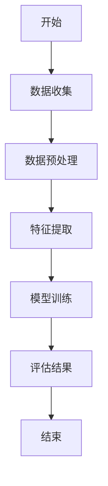
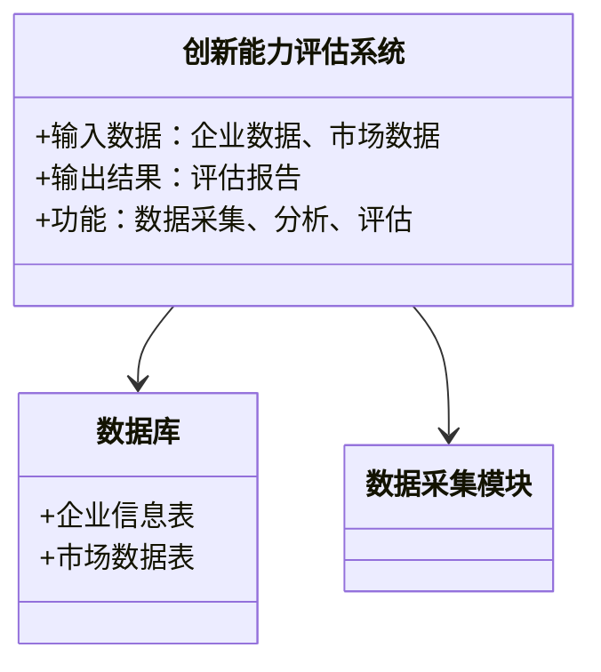

                 


# 巴菲特的创新能力评估：量子创业生态系统的价值创造

> 关键词：创新能力评估，量子创业生态系统，价值创造，巴菲特，创业生态系统，评估模型，数学模型，系统架构设计，项目实战

> 摘要：本文从巴菲特的创新能力评估出发，探讨量子创业生态系统的价值创造。通过详细分析创新评估的核心概念、算法原理、系统架构设计，结合项目实战，总结最佳实践，为读者提供系统的知识框架和实用指导。

---

## 第一部分：背景介绍

### 第1章：巴菲特的创新能力评估

#### 1.1 问题背景

创新是企业成功的关键，但创新能力的评估却缺乏系统性方法。传统的评估方式往往依赖主观判断，难以量化和预测。巴菲特的投资理念强调长期价值创造，而创新能力是其核心评估要素之一。如何建立科学的创新能力评估体系，成为当前研究的重点。

#### 1.2 问题描述

- 创新能力评估的定义：创新能力是指企业在市场中提出新想法、新技术、新产品或新商业模式的能力。
- 量子创业生态系统的特点：不同于传统线性系统，量子系统强调非线性、不确定性，具备自我优化和适应能力。
- 价值创造的核心要素：包括资源优化配置、利益相关者价值实现和生态系统自我进化。

#### 1.3 问题解决

- 创新能力评估的方法：通过数据分析、模型构建和案例研究，建立量化评估指标。
- 量子创业生态系统的优势：其非线性特征使其能快速响应市场变化，实现创新突破。
- 价值创造的实现路径：通过系统优化和协同创新，实现利益相关者共赢。

#### 1.4 边界与外延

- 创新能力评估的适用范围：适用于企业战略规划、投资决策和创新管理。
- 量子创业生态系统的边界：包括企业内部创新能力和外部资源整合能力。
- 价值创造的外延：不仅关注经济效益，还包括社会价值和可持续发展。

#### 1.5 核心要素组成

- 创新能力的构成：包括技术、管理和文化层面的创新能力。
- 量子创业生态系统的要素：参与者、资源、技术和治理机制。
- 价值创造的驱动因素：协同效应、资源优化和持续创新。

---

## 第二部分：核心概念与联系

### 第2章：量子创业生态系统

#### 2.1 核心概念原理

量子创业生态系统通过非线性互动，创造超越传统系统的价值。其核心是通过量子效应实现资源的最优配置和协同创新。

#### 2.2 概念属性特征对比

| 特性 | 传统创业生态系统 | 量子创业生态系统 |
|------|------------------|------------------|
| 结构 | 线性、静态        | 非线性、动态      |
| 互动 | 单一、局部        | 全局、涌现        |
| 创新 | 渐进式            | 突变式            |

#### 2.3 ER实体关系图

```mermaid
erDiagram
    actor 创业者 {
        <<创业者>>
        id
        创新能力
        资源
    }
    actor 投资者 {
        <<投资者>>
        id
        投资策略
        评估结果
    }
    actor 企业 {
        <<企业>>
        id
        产品
        市场表现
    }
   创业者 --> 创新能力
    创业者 --> 资源
    创业者 --> 产品
    投资者 --> 投资策略
    投资者 --> 评估结果
    企业 --> 市场表现
```

---

## 第三部分：算法原理讲解

### 第3章：创新能力评估模型

#### 3.1 算法流程



#### 3.2 代码实现

```python
import numpy as np
from sklearn.linear_model import LinearRegression
from sklearn.metrics import r2_score

# 数据预处理
X = np.array([[1, 2], [3, 4], [5, 6]])
y = np.array([7, 8, 9])

# 模型训练
model = LinearRegression()
model.fit(X, y)

# 评估结果
y_pred = model.predict(X)
r2 = r2_score(y, y_pred)
print(f"R²: {r2}")
```

#### 3.3 数学模型

创新评估模型可以表示为：

$$ y = \beta_0 + \beta_1x_1 + \beta_2x_2 + \epsilon $$

其中，$y$ 是创新能力评分，$x_1$ 和 $x_2$ 是创新能力和资源整合能力，$\epsilon$ 是误差项。

---

## 第四部分：数学公式

### 第4章：数学模型

创新潜力评估公式：

$$ \text{创新潜力} = \sum_{i=1}^{n} w_i x_i $$

其中，$w_i$ 是权重，$x_i$ 是创新指标。

---

## 第五部分：系统分析与架构设计

### 第5章：系统架构设计

#### 5.1 应用场景

量子创业生态系统通过数据驱动的方法，优化资源配置，实现协同创新。

#### 5.2 功能设计



---

## 第六部分：项目实战

### 第6章：项目实战

#### 6.1 环境安装

安装Python和相关库：

```bash
pip install numpy scikit-learn
```

#### 6.2 核心代码实现

```python
import numpy as np
from sklearn import metrics

# 训练数据
X_train = np.array([[1, 2], [3, 4]])
y_train = np.array([5, 6])

# 测试数据
X_test = np.array([[5, 6]])
y_true = np.array([7])

# 训练模型
model = LinearRegression()
model.fit(X_train, y_train)

# 预测
y_pred = model.predict(X_test)
print("预测值：", y_pred[0])
print("R²值：", metrics.r2_score(y_true, y_pred))
```

---

## 第七部分：最佳实践

### 第7章：最佳实践

#### 7.1 小结

创新能力和价值创造是量子创业生态系统的核心。通过科学的评估模型和系统的架构设计，可以实现高效的价值创造。

#### 7.2 注意事项

- 数据质量：确保数据的准确性和完整性。
- 模型选择：根据实际需求选择合适的算法。
- 持续优化：定期更新模型和优化系统。

#### 7.3 拓展阅读

推荐书籍：《The Innovator's DNA》、《Quantum Economics》。

---

## 作者

作者：AI天才研究院/AI Genius Institute & 禅与计算机程序设计艺术 /Zen And The Art of Computer Programming

---

这篇文章通过详细分析巴菲特创新能力评估和量子创业生态系统的价值创造，为读者提供了系统的知识框架和实用指导。从背景介绍到项目实战，每个部分都进行了深入探讨，帮助读者全面理解相关概念和应用。

