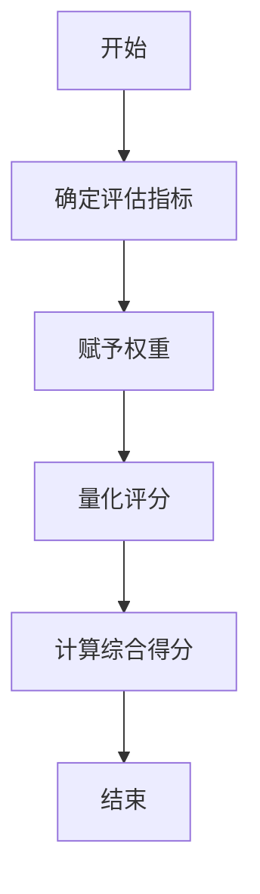
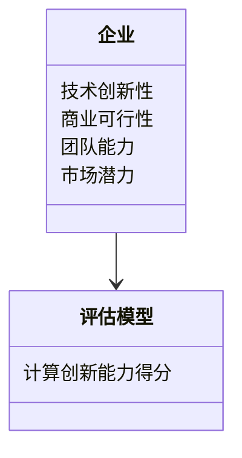

                 


# 巴菲特的创新能力评估：量子初创企业的价值创造潜力分析

> 关键词：巴菲特，创新能力评估，量子初创企业，价值潜力，投资分析

> 摘要：本文通过分析巴菲特的投资理念，结合量子初创企业的特点，构建创新能力评估模型，探讨其在价值创造中的潜力。文章从背景、模型、算法、系统设计、项目实战到总结，系统性地阐述了创新能力评估的理论与实践。

---

## 第1章 巴菲特投资理念与创新能力评估概述

### 1.1 巴菲特的投资理念

#### 1.1.1 巴菲特的价值投资理论

巴菲特的价值投资理论强调以合理价格投资于优秀企业。他的核心思想包括：

1. **长期投资**：巴菲特倡导长期投资而非短期交易，认为市场波动不应影响长期价值判断。
2. **安全边际**：投资时应考虑企业的内在价值与市场价格的差距，确保有足够的安全边际。
3. **企业质量**：投资于具有强大竞争优势、良好管理和稳定现金流的企业。

#### 1.1.2 巴菲特的长期投资策略

巴菲特的投资策略基于对企业基本面的深入分析，重点关注企业的盈利能力、财务健康状况和管理层质量。他认为，优秀的企业具有持续创造价值的能力，而这种能力是长期投资的基石。

#### 1.1.3 巴菲特对创新能力的重视

尽管巴菲特以价值投资闻名，但他也高度重视企业的创新能力。他认为，创新能力是企业在竞争中保持优势的关键因素，尤其是在科技快速发展的今天，创新能力决定了企业的长期生存能力。

---

### 1.2 创新能力评估的背景

#### 1.2.1 创新能力在企业价值中的作用

创新能力是企业核心竞争力的体现。在量子初创企业中，创新能力直接决定了企业的技术优势、产品迭代速度和市场拓展能力。创新能力强的企业能够更快响应市场需求，抓住新兴机会。

#### 1.2.2 创新能力评估的必要性

在快速变化的市场环境中，仅靠传统财务指标评估企业价值已不足以应对挑战。创新能力评估能够补充财务分析的不足，帮助投资者更全面地评估企业的潜在价值。

#### 1.2.3 创新能力评估的边界与外延

创新能力评估的边界包括企业的技术储备、研发能力、管理效率和市场响应速度。其外延则涉及企业文化的创新氛围、团队协作能力和外部资源整合能力。

---

### 1.3 量子初创企业的特点

#### 1.3.1 量子初创企业的定义与特征

量子初创企业是指在量子计算、人工智能等新兴技术领域成立的初创公司。这些企业通常具有技术创新性强、成长速度快、市场潜力大等特点。

#### 1.3.2 量子初创企业的创新模式

量子初创企业的创新模式包括技术驱动型创新、市场驱动型创新和商业模式创新。技术驱动型创新是其核心，主要体现在量子算法、量子芯片设计等领域。

#### 1.3.3 量子初创企业的价值创造潜力

量子初创企业的价值创造潜力主要体现在技术创新带来的市场优势、技术壁垒带来的竞争保护以及潜在的高成长性。这些因素使得量子初创企业在资本市场具有较高的估值潜力。

---

## 第2章 巴菲特创新能力评估模型的核心概念

### 2.1 创新能力评估的核心要素

#### 2.1.1 技术创新性

技术创新性是量子初创企业创新能力的核心要素。它包括企业的技术储备、研发能力、专利数量和技术领先性。技术创新性强的企业能够更快地推出新产品，占领市场。

#### 2.1.2 商业可行性

商业可行性关注技术的市场应用潜力。量子初创企业需要将技术创新转化为实际产品，并满足市场需求。这要求企业在技术研发的同时，注重产品的商业化能力。

#### 2.1.3 团队能力

团队能力是创新能力的基石。量子初创企业的团队结构、管理水平和协作效率直接影响企业的创新能力。优秀的企业管理层能够更好地协调资源，推动创新。

#### 2.1.4 市场潜力

市场潜力决定了技术创新的经济价值。量子初创企业需要关注目标市场的规模、增长速度和竞争格局。较大的市场潜力意味着更高的商业价值。

---

### 2.2 核心概念的属性特征对比

#### 2.2.1 技术创新性与商业可行性的对比

| 特性       | 技术创新性 | 商业可行性 |
|------------|------------|------------|
| 侧重点     | 技术突破   | 市场需求   |
| 评估指标   | 专利数量   | 市场容量   |
| 对企业价值的影响 | 技术壁垒   | 市场份额   |

#### 2.2.2 团队能力与市场潜力的关联

团队能力直接影响市场潜力的实现。优秀的团队能够更好地把握市场需求，快速调整策略，从而将市场潜力转化为实际收益。

#### 2.2.3 核心概念的综合评估

创新能力评估需要综合考虑技术创新性、商业可行性、团队能力和市场潜力。这四个要素相互关联，共同决定企业的创新能力和价值潜力。

---

## 第3章 巴菲特创新能力评估模型的算法原理

### 3.1 算法原理

创新能力评估模型基于多因素加权评分法。通过对企业创新能力的核心要素进行评分，计算加权后的综合得分，评估企业的创新能力。

#### 3.1.1 算法流程

1. **确定评估指标**：技术创新性、商业可行性、团队能力、市场潜力。
2. **赋予权重**：根据企业类型和行业特点，赋予各指标不同权重。
3. **量化评分**：对各指标进行量化评分，满分10分。
4. **计算综合得分**：综合得分 = ∑(各指标得分 × 权重)。

#### 3.1.2 Mermaid流程图



#### 3.1.3 Python代码实现

```python
def calculate_innovation_score(technology, commercial, team, market):
    weights = {'technology': 0.4, 'commercial': 0.3, 'team': 0.2, 'market': 0.1}
    score = (technology * weights['technology'] + 
             commercial * weights['commercial'] + 
             team * weights['team'] + 
             market * weights['market'])
    return score

# 示例数据
technology = 8
commercial = 7
team = 9
market = 6

score = calculate_innovation_score(technology, commercial, team, market)
print(f"创新能力评分为：{score}")
```

#### 3.1.4 数学模型与公式

创新能力评估模型的数学公式如下：

$$ \text{创新得分} = \sum_{i=1}^{n} (w_i \times s_i) $$

其中，$w_i$ 是第 $i$ 个指标的权重，$s_i$ 是第 $i$ 个指标的评分。

---

## 第4章 系统分析与架构设计

### 4.1 系统功能设计

#### 4.1.1 系统功能模块

1. **数据输入模块**：输入企业的创新能力评估指标。
2. **评估计算模块**：计算创新能力综合得分。
3. **结果展示模块**：输出评估结果。

#### 4.1.2 领域模型类图



---

## 第5章 项目实战

### 5.1 环境安装

#### 5.1.1 安装Python环境

```bash
python --version
pip install numpy pandas matplotlib
```

---

### 5.2 核心代码实现

#### 5.2.1 评估模型代码

```python
import numpy as np

def calculate_score(technology, commercial, team, market):
    weights = np.array([0.4, 0.3, 0.2, 0.1])
    features = np.array([technology, commercial, team, market])
    score = np.dot(weights, features)
    return score

# 示例数据
technology = 9
commercial = 8
team = 7
market = 6

score = calculate_score(technology, commercial, team, market)
print(f"创新能力评分为：{score}")
```

---

## 第6章 总结与展望

### 6.1 总结

本文通过分析巴菲特的投资理念，结合量子初创企业的特点，构建了创新能力评估模型，并详细阐述了其算法原理和系统设计。创新能力评估模型能够帮助企业识别和量化创新能力，为投资者提供决策支持。

### 6.2 展望

未来，随着量子计算等技术的快速发展，创新能力评估模型需要进一步优化，引入更多动态因素，如实时市场反馈和团队调整能力。同时，模型的应用范围也可以扩展到更多类型的初创企业，帮助投资者更好地评估企业价值。

---

## 作者

作者：AI天才研究院/AI Genius Institute & 禅与计算机程序设计艺术 /Zen And The Art of Computer Programming

