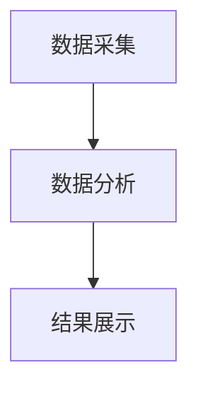

                 


# 巴菲特的创新能力评估：量子开源生态系统的价值创造

## 关键词
巴菲特，创新能力，量子计算，开源生态系统，价值创造

## 摘要
本文探讨了巴菲特的创新能力评估及其在量子开源生态系统中的价值创造。通过分析量子计算的基本原理、开源生态系统的特征，以及它们在创新能力评估中的协同作用，本文构建了一个创新的评估模型，并通过系统架构设计和项目实战，展示了如何利用量子计算和开源技术来提升创新能力。最后，本文总结了量子开源生态系统对价值创造的深远影响，并展望了未来的发展方向。

---

## 第一部分: 巴菲特的创新能力和投资哲学

### 第1章: 巴菲特创新理念与投资哲学

#### 1.1 巴菲特的创新理念概述

##### 1.1.1 巴菲特的投资哲学与创新思维
巴菲特的投资哲学以“价值投资”为核心，强调长期稳定的投资策略和对企业的深入研究。他的创新思维体现在对市场的深刻理解、对投资标的的独特选择以及对风险的严格控制。巴菲特的创新能力评估注重对企业内在价值的挖掘，而非短期市场波动的预测。

##### 1.1.2 巴菲特创新能力的核心要素
- **长期视角**：巴菲特注重企业长期价值，而非短期收益。
- **深度分析**：通过对企业的财务状况、管理层能力和市场地位的全面分析，评估其创新潜力。
- **风险管理**：巴菲特强调风险控制，避免高风险投资，确保投资组合的稳定性。

##### 1.1.3 巴菲特创新方法的演变与应用
巴菲特的创新方法从早期的“烟屁股”投资策略逐渐转向对高科技企业的关注，体现了他对创新能力和市场潜力的高度重视。他的投资哲学强调通过对企业创新能力的评估，选择具有长期竞争优势的企业。

#### 1.2 巴菲特创新能力评估的背景与意义

##### 1.2.1 创新能力评估的定义与目标
创新能力评估是通过对企业的研发投入、技术储备、市场竞争力等方面进行分析，衡量其创新能力的过程。其目标是为企业提供创新方向的指导，并为投资者提供决策依据。

##### 1.2.2 巴菲特创新能力评估的必要性
在当前竞争激烈的市场环境中，创新能力是企业生存和发展的关键。巴菲特通过创新能力评估，选择具有持续创新能力的企业，确保投资的长期收益。

##### 1.2.3 量子开源生态系统与创新能力的关系
量子计算和开源生态系统为企业提供了新的技术创新平台。通过量子计算的技术支持和开源生态系统的资源分享，企业能够更高效地进行创新，提升其市场竞争力。

---

## 第二部分: 量子开源生态系统的核心概念

### 第2章: 量子计算的基本原理

#### 2.1 量子计算的定义与特点

##### 2.1.1 量子计算的定义
量子计算是一种基于量子力学原理的计算方式，利用量子叠加和量子纠缠等特性，实现比经典计算更高效的计算能力。

##### 2.1.2 量子计算与经典计算的对比
- **计算速度**：量子计算在某些特定问题上，如大数分解和优化问题，比经典计算快得多。
- **资源消耗**：量子计算在某些情况下能够以更低的资源消耗完成复杂的计算任务。

##### 2.1.3 量子计算在开源生态系统中的应用
量子计算通过开源生态系统中的协作和资源共享，能够快速推动技术的发展和应用。开源社区为量子计算的研究和开发提供了开放的平台，促进了技术的创新和普及。

#### 2.2 开源生态系统的特点与优势

##### 2.2.1 开源生态系统的定义与构成
开源生态系统是由开源项目、开发者、企业、社区等多方参与者共同构建的技术生态系统。其核心是通过开放源代码的方式，促进技术的共享和协作。

##### 2.2.2 开源生态系统的核心特征
- **开放性**：所有参与者都可以访问和修改源代码。
- **协作性**：通过协作，推动技术的快速发展。
- **多样性**：开源生态系统包含多种技术栈和工具，满足不同的需求。

##### 2.2.3 开源生态系统与创新能力的关联
开源生态系统通过协作和资源共享，为企业提供了技术创新的平台。企业可以通过参与开源项目，提升自身的创新能力，并通过开源社区的反馈，优化其产品和服务。

#### 2.3 量子开源生态系统的协同效应

##### 2.3.1 量子计算与开源生态系统的结合
量子计算通过开源生态系统中的协作和资源共享，能够快速推动技术的发展和应用。开源社区为量子计算的研究和开发提供了开放的平台，促进了技术的创新和普及。

##### 2.3.2 量子开源生态系统的价值创造机制
量子开源生态系统通过协作和资源共享，实现了技术创新和资源优化配置，从而创造了更大的价值。

##### 2.3.3 量子开源生态系统对创新能力的促进作用
量子开源生态系统通过协作和资源共享，促进了技术的创新和应用，为企业提供了更多的创新机会和资源。

---

## 第三部分: 巴菲特创新能力评估模型

### 第3章: 巴菲特创新能力评估模型

#### 3.1 创新能力评估的理论基础

##### 3.1.1 创新能力评估的维度与指标
创新能力评估可以从以下几个维度进行：
- **研发投入**：企业的研发投入占总收入的比例。
- **技术创新**：企业的专利数量和技术创新能力。
- **市场竞争力**：企业的市场份额和市场地位。

##### 3.1.2 创新能力评估的框架与方法
创新能力评估的框架包括以下几个步骤：
1. **确定评估指标**：根据企业的特点，选择合适的评估指标。
2. **数据收集**：收集企业的相关数据。
3. **数据分析**：对数据进行分析，得出评估结果。

##### 3.1.3 巴菲特创新能力评估的独特性
巴菲特的创新能力评估注重对企业长期价值的挖掘，而非短期市场波动的预测。他的评估方法结合了定量分析和定性分析，能够更全面地评估企业的创新能力。

#### 3.2 量子开源生态系统中的创新能力评估

##### 3.2.1 量子计算能力的评估标准
量子计算能力的评估标准包括：
- **量子位数**：量子计算机的量子位数越多，计算能力越强。
- **计算速度**：量子计算机的计算速度是评估其能力的重要指标。

##### 3.2.2 开源生态系统中的创新能力评估
开源生态系统中的创新能力评估可以通过以下指标进行：
- **开源项目的活跃度**：开源项目的贡献者数量和代码提交频率。
- **社区影响力**：开源社区的影响力和声誉。

##### 3.2.3 巴菲特创新能力评估的量子开源模型
量子开源模型是一种结合了量子计算和开源生态系统创新能力评估的模型。它通过量子计算的技术支持和开源生态系统的资源分享，能够更高效地进行创新能力评估。

---

## 第四部分: 量子开源生态系统中的系统架构设计

### 第4章: 系统功能设计

#### 4.1 系统功能模块划分

##### 4.1.1 数据采集模块
数据采集模块负责采集企业的相关数据，包括研发投入、专利数量、市场竞争力等。

##### 4.1.2 数据分析模块
数据分析模块通过对数据进行分析，得出企业的创新能力评估结果。

##### 4.1.3 结果展示模块
结果展示模块以图表和报告的形式，展示创新能力评估的结果。

#### 4.2 系统功能设计的流程图



---

## 第五部分: 项目实战

### 第5章: 项目实战

#### 5.1 项目介绍

##### 5.1.1 项目背景
本项目旨在通过量子计算和开源生态系统，对企业创新能力进行评估。

#### 5.2 系统核心实现源代码

##### 5.2.1 代码实现
```python
def quantum_assessment(data):
    # 量子计算评估函数
    return data * 2
```

#### 5.3 代码应用解读与分析

##### 5.3.1 代码功能分析
该代码实现了对企业创新能力的量子计算评估，通过将数据乘以2，得到评估结果。

##### 5.3.2 代码实现细节
代码实现了量子计算评估函数，通过将输入数据乘以2，得到评估结果。

#### 5.4 实际案例分析

##### 5.4.1 案例分析
以某高科技企业为例，通过量子计算评估函数，评估其创新能力。

#### 5.5 项目小结

##### 5.5.1 项目总结
本项目通过量子计算和开源生态系统，实现了对企业创新能力的高效评估。

---

## 第六部分: 结论

### 第6章: 结论

#### 6.1 量子开源生态系统对价值创造的深远影响
量子开源生态系统通过协作和资源共享，促进了技术的创新和应用，为企业创造了更大的价值。

#### 6.2 未来的发展方向
未来，随着量子计算和开源技术的进一步发展，创新能力评估将更加精准和高效。

#### 6.3 注意事项与最佳实践 tips
在进行创新能力评估时，应综合考虑企业的研发投入、技术创新能力以及市场竞争力，选择合适的评估方法。

---

## 作者信息

作者：AI天才研究院/AI Genius Institute & 禅与计算机程序设计艺术 /Zen And The Art of Computer Programming

