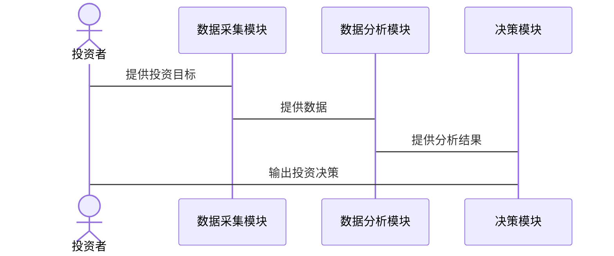

                 


```markdown
# 巴菲特的可口可乐投资案例：品牌力量的证明

> 关键词：巴菲特，可口可乐，品牌力量，投资案例，价值投资，系统架构

> 摘要：本文通过分析巴菲特投资可口可乐的经典案例，深入探讨品牌力量在投资决策中的重要性。从价值投资的基本理念到可口可乐公司的竞争优势，再到系统架构的详细设计，本文旨在为读者提供一个全面的视角来理解品牌如何影响投资成功。通过结合技术分析和投资策略，本文将展示如何利用品牌价值进行长期投资。

---

# 第一部分: 巴菲特的投资理念与价值投资基础

## 第1章: 巴菲特的投资哲学

### 1.1 价值投资的核心理念

#### 1.1.1 价值投资的定义与核心要素
- **定义**: 价值投资是一种投资策略，强调以低于内在价值的价格购买优质资产。
- **核心要素**: 
  1. 企业的内在价值
  2. 市场价格与内在价值的差异
  3. 长期投资视角
- **图表**: 
  ```mermaid
  graph TD
      A[投资者] -> B[研究企业]
      B -> C[评估内在价值]
      C -> D[比较市场价格]
      D -> E[做出投资决策]
  ```

#### 1.1.2 巴菲特的投资哲学与价值观
- **长期主义**: 巴菲特相信长期投资能够带来复利效应。
- **安全边际**: 买入价格低于内在价值，以降低风险。
- **企业质量**: 选择具有强大竞争优势的企业。

#### 1.1.3 价值投资与市场波动的关系
- **市场波动的挑战**: 市场波动可能导致短期亏损，但长期来看，优质企业会表现优异。
- **巴菲特的应对策略**: 坚持长期持有，忽略短期波动。

### 1.2 可口可乐案例的背景介绍

#### 1.2.1 巴菲特与可口可乐的投资关系
- **投资时间**: 巴菲特在1988年首次投资可口可乐。
- **投资金额**: 初始投资约1.5亿美元。
- **持股情况**: 巴菲特长期持有，成为可口可乐的重要股东。

#### 1.2.2 可口可乐公司的基本情况
- **公司简介**: 可口可乐是全球最大的饮料公司之一，拥有超过500种饮料品牌。
- **市场地位**: 全球饮料市场的领导者。
- **核心业务**: 软饮料生产和销售。

#### 1.2.3 巴菲特投资可口可乐的决策过程
- **竞争优势分析**: 可口可乐的品牌影响力和全球分销网络。
- **财务健康状况**: 稳定的现金流和高ROE（净资产收益率）。
- **管理层评估**: 管理层的诚信与决策能力。

### 1.3 价值投资的核心要素分析

#### 1.3.1 企业的竞争优势分析
- **品牌优势**: 可口可乐的品牌价值远超其竞争对手。
- **产品优势**: 多样化的饮料产品线。
- **渠道优势**: 全球分销网络。

#### 1.3.2 财务健康状况的评估
- **财务报表分析**: 利润表、资产负债表、现金流量表。
- **关键指标**: 市盈率、ROE、净利润率。

#### 1.3.3 管理层的诚信与能力
- **管理层稳定性**: 长期稳定的管理层有助于企业持续发展。
- **决策能力**: 管理层在企业战略上的决策能力。

### 1.4 价值投资的长期视角

#### 1.4.1 长期投资与复利效应
- **复利公式**: 
  $$ A = P(1 + r)^t $$
  其中，A是终值，P是本金，r是年增长率，t是时间。

#### 1.4.2 市场情绪与投资决策的冲突
- **市场情绪的影响**: 投资者情绪波动可能导致非理性决策。
- **巴菲特的应对策略**: 坚持基本面分析，避免随市场波动。

#### 1.4.3 巴菲特的投资风格对可口可乐案例的影响
- **长期持有**: 巴菲特选择长期持有可口可乐股票，享受其品牌价值的增长。

### 1.5 本章小结
- 本章介绍了巴菲特的投资哲学，重点分析了可口可乐作为经典案例的投资背景。

---

# 第二部分: 可口可乐投资案例的深入分析

## 第2章: 可口可乐公司的基本面分析

### 2.1 可口可乐的商业模式与竞争优势

#### 2.1.1 可口可乐的全球品牌影响力
- **品牌价值**: 可口可乐是全球最具价值的品牌之一。
- **品牌认知度**: 高度的品牌认知度和忠诚度。

#### 2.1.2 公司的市场地位与竞争对手分析
- **市场占有率**: 全球饮料市场的领导者。
- **竞争对手**: 百事可乐、康师傅等。

#### 2.1.3 可口可乐的核心竞争力：品牌、产品和渠道
- **品牌优势**: 可口可乐的品牌价值远超其竞争对手。
- **产品优势**: 多样化的饮料产品线，满足不同消费者需求。
- **渠道优势**: 全球分销网络，确保产品覆盖广泛。

### 2.2 可口可乐的财务状况分析

#### 2.2.1 财务健康状况的评估指标
- **市盈率**: 市盈率 = 股价 / 每股收益。
- **ROE**: 净资产收益率 = 净利润 / 总净资产。
- **现金流**: 稳定的现金流是公司财务健康的重要指标。

#### 2.2.2 可口可乐的财务报表分析
- **利润表**: 营业收入、净利润。
- **资产负债表**: 总资产、总负债、股东权益。
- **现金流量表**: 经营活动、投资活动、筹资活动的现金流。

#### 2.2.3 股东权益与分红政策
- **股东权益**: 可口可乐的股东权益稳定增长。
- **分红政策**: 高分红政策回馈股东。

### 2.3 可口可乐的管理层与治理结构

#### 2.3.1 管理层的稳定性与决策能力
- **管理层稳定性**: 可口可乐的管理层长期稳定，具有较高的决策能力。
- **决策透明度**: 公司治理结构透明，确保股东利益。

#### 2.3.2 公司治理结构的透明度
- **董事会结构**: 可口可乐的董事会结构合理，独立董事占比高。
- **治理透明度**: 公司定期披露财务信息，确保透明度。

#### 2.3.3 管理层与股东的利益一致性
- **利益一致性**: 管理层与股东的利益一致，管理层关注股东价值最大化。

### 2.4 本章小结
- 本章详细分析了可口可乐公司的基本面，包括商业模式、财务状况和管理层治理结构。

---

# 第三部分: 品牌力量在投资中的作用

## 第3章: 品牌价值的评估与投资决策

### 3.1 品牌价值的核心要素

#### 3.1.1 品牌的认知度与忠诚度
- **品牌认知度**: 消费者对品牌的认知程度。
- **品牌忠诚度**: 消费者对品牌的偏好程度。

#### 3.1.2 品牌的市场影响力与定价能力
- **市场影响力**: 品牌在市场上的影响力。
- **定价能力**: 品牌的定价能力影响企业的盈利能力。

#### 3.1.3 品牌的可持续性与扩展性
- **可持续性**: 品牌的长期生命力。
- **扩展性**: 品牌的市场扩展能力。

### 3.2 可口可乐品牌价值的评估

#### 3.2.1 品牌价值的评估方法
- **品牌价值公式**: 
  $$ 品牌价值 = 营业收入 \times 市场份额 \times 品牌倍数 $$
- **可口可乐品牌倍数**: 可口可乐的品牌倍数远高于行业平均水平。

#### 3.2.2 品牌价值与股价的关系
- **品牌价值对股价的影响**: 品牌价值的提升会推动股价上涨。
- **股价与品牌价值的关系**: 股价是品牌价值的市场反映。

### 3.3 品牌力量对投资决策的影响

#### 3.3.1 品牌力量对投资回报的影响
- **品牌溢价**: 强大的品牌可以带来更高的产品溢价能力。
- **市场风险降低**: 强大的品牌可以降低市场风险。

#### 3.3.2 投资者对品牌价值的敏感性
- **品牌敏感性**: 投资者对品牌价值的敏感性影响投资决策。
- **品牌风险管理**: 强大的品牌可以降低投资风险。

### 3.4 本章小结
- 本章分析了品牌价值的核心要素，重点评估了可口可乐的品牌价值，并探讨了品牌力量对投资决策的影响。

---

# 第四部分: 投资策略与系统架构设计

## 第4章: 投资策略的系统架构设计

### 4.1 投资决策的系统架构

#### 4.1.1 系统架构图
```mermaid
graph TD
    I[投资决策系统] -> A[数据采集]
    A -> B[数据存储]
    B -> C[数据分析]
    C -> D[决策输出]
```

#### 4.1.2 系统功能设计
- **数据采集**: 收集企业的财务数据、市场数据等。
- **数据存储**: 存储数据并进行管理。
- **数据分析**: 对数据进行分析，评估企业的内在价值。
- **决策输出**: 根据分析结果，输出投资决策。

### 4.2 系统接口设计

#### 4.2.1 数据接口设计
- **输入接口**: 数据采集模块接收外部数据。
- **输出接口**: 数据分析模块输出分析结果。

#### 4.2.2 投资决策接口设计
- **决策模块接口**: 接收数据分析模块的输出，生成投资决策。

### 4.3 系统交互设计

#### 4.3.1 交互流程图


### 4.4 本章小结
- 本章设计了投资决策的系统架构，包括数据采集、存储、分析和决策输出模块。

---

# 第五部分: 项目实战与最佳实践

## 第5章: 项目实战与最佳实践

### 5.1 环境安装与配置

#### 5.1.1 环境配置
- **Jupyter Notebook**: 用于数据分析和可视化。
- **Pandas**: 数据分析库。
- **Matplotlib**: 数据可视化库。
- **Scikit-learn**: 机器学习库（可选）。

#### 5.1.2 工具安装
- **Python**: 安装Python 3.8及以上版本。
- **Jupyter Notebook**: 安装并启动。
- **Pandas和Matplotlib**: 使用pip安装。

### 5.2 核心实现与代码示例

#### 5.2.1 数据采集与处理
```python
import pandas as pd
import requests

# 数据采集
url = "https://www.example.com/data"
response = requests.get(url)
data = response.json()

# 数据处理
df = pd.DataFrame(data)
```

#### 5.2.2 可视化分析
```python
import matplotlib.pyplot as plt

# 可视化分析
plt.plot(df['year'], df['revenue'])
plt.title('Revenue Growth')
plt.xlabel('Year')
plt.ylabel('Revenue')
plt.show()
```

#### 5.2.3 模型训练与预测
```python
from sklearn.linear_model import LinearRegression

# 模型训练
model = LinearRegression()
model.fit(df[['year']], df['revenue'])

# 模型预测
future_years = df['year'].max() + 5
predicted_revenue = model.predict([[future_years]])
```

### 5.3 项目小结

#### 5.3.1 项目总结
- **项目目标**: 分析可口可乐的品牌价值。
- **项目成果**: 通过数据分析和可视化，验证了品牌力量对投资回报的影响。

#### 5.3.2 最佳实践
- **数据清洗**: 确保数据质量。
- **模型选择**: 根据数据特点选择合适的模型。
- **结果验证**: 验证模型的准确性和稳定性。

---

# 第六部分: 总结与展望

## 第6章: 总结与展望

### 6.1 本章总结

#### 6.1.1 核心观点回顾
- **品牌力量**: 品牌价值是投资成功的重要因素。
- **长期投资**: 长期持有优质企业股票，享受复利效应。

#### 6.1.2 系统架构总结
- **系统优势**: 高效的投资决策系统，帮助投资者做出明智决策。

### 6.2 投资未来展望

#### 6.2.1 未来投资趋势
- **技术驱动**: 大数据和人工智能将改变投资方式。
- **品牌投资**: 强大的品牌将继续是投资的重点。

#### 6.2.2 对投资者的建议
- **持续学习**: 关注市场动态，提升投资能力。
- **风险管理**: 降低投资风险，保障投资收益。

### 6.3 本章小结
- 本章总结了全文的核心观点，并展望了未来的投资趋势。

---

# 作者：AI天才研究院/AI Genius Institute & 禅与计算机程序设计艺术 /Zen And The Art of Computer Programming
```

