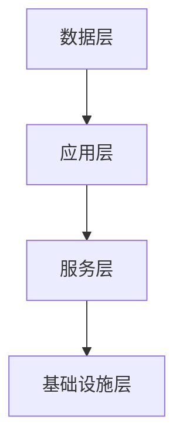

                 


# 巴菲特的周期性行业投资：数字化转型中的传统产业重生

**关键词**：巴菲特，周期性行业，数字化转型，传统产业重生，价值投资，系统架构

**摘要**：  
本文探讨了巴菲特的周期性行业投资策略在数字化转型中的应用，分析了周期性行业的特点及其在数字化转型中的重生机会。通过结合技术背景、系统架构设计和实际案例，本文详细阐述了如何利用数字化技术提升周期性行业的竞争力，实现传统产业的可持续发展。文章从投资逻辑、数字化转型背景、行业案例分析、系统架构设计等多个维度展开，为投资者和技术从业者提供了深入的分析和实践指导。

---

## 第一部分：周期性行业的投资逻辑

### 第1章：周期性行业的特点与投资机会

#### 1.1 周期性行业的定义与分类
周期性行业是指其业绩波动与经济周期高度相关的企业，常见的周期性行业包括能源、材料、金融、汽车制造和房地产等。周期性行业的波动性可以通过以下维度分析：
- **经济敏感性**：周期性行业的产品需求与整体经济状况密切相关。
- **行业波动性**：周期性行业的业绩波动较大，通常在经济繁荣时表现优异，经济衰退时受到重创。

#### 1.2 巴菲特的周期性行业投资策略
巴菲特在周期性行业的投资策略强调长期视角和价值挖掘：
- **低谷投资**：在行业低谷时买入优质资产，等待周期反转。
- **企业基本面分析**：关注企业的财务健康状况、竞争优势和管理层能力。
- **安全边际**：通过安全边际确保投资的安全性。

#### 1.3 周期性行业的投资机会
周期性行业在数字化转型中的投资机会主要体现在：
- **技术驱动的效率提升**：通过数字化技术优化生产流程，降低运营成本。
- **数据驱动的决策支持**：利用大数据和人工智能技术提高投资决策的准确性。

---

### 第2章：周期性行业的数字化转型背景

#### 2.1 数字化转型的定义与趋势
数字化转型是指通过数字技术的应用，重构企业商业模式、业务流程和决策方式。周期性行业的数字化转型是企业应对市场波动、提升竞争力的重要手段。

#### 2.2 数字化转型对周期性行业的影响
数字化转型通过以下方式改变周期性行业的格局：
- **数据驱动的决策**：通过实时数据分析，企业能够快速响应市场变化。
- **智能化生产**：利用物联网和工业自动化技术优化生产流程。
- **客户体验提升**：通过数字化手段增强客户互动，提高客户满意度。

#### 2.3 数字化转型的核心技术
- **大数据技术**：用于收集和分析海量数据，支持精准决策。
- **人工智能技术**：用于预测市场趋势和优化业务流程。
- **物联网技术**：用于设备监控和生产过程的智能化管理。

---

### 第3章：周期性行业的数字化转型路径

#### 3.1 数字化转型的关键步骤
1. **业务流程重构**：优化企业内部流程，消除低效环节。
2. **数据驱动的决策支持**：建立数据分析平台，支持业务决策。
3. **数字化生态系统构建**：整合产业链资源，构建协同发展的生态体系。

#### 3.2 数字化转型的技术实现
- **大数据分析平台**：使用Hadoop、Spark等技术处理海量数据。
- **人工智能算法**：应用机器学习算法进行市场趋势预测。
- **物联网系统**：通过传感器和边缘计算技术实现设备监控。

---

### 第4章：周期性行业数字化转型的案例分析

#### 4.1 银行业的数字化转型
- **案例背景**：传统银行业的服务效率低下，客户体验差。
- **数字化转型措施**：
  - 引入人工智能技术进行客户画像分析。
  - 建立在线银行平台，提供便捷的金融服务。
- **效果评估**：客户满意度提升，运营成本降低。

#### 4.2 制造业的数字化转型
- **案例背景**：传统制造业生产效率低，库存管理混乱。
- **数字化转型措施**：
  - 引入物联网技术进行设备监控。
  - 应用工业自动化技术优化生产流程。
- **效果评估**：生产效率提升，库存周转率提高。

#### 4.3 零售业的数字化转型
- **案例背景**：传统零售业面临线上竞争激烈，客户体验差。
- **数字化转型措施**：
  - 建立线上销售渠道，实现全渠道覆盖。
  - 应用大数据技术进行精准营销。
- **效果评估**：客户粘性增强，销售额增长显著。

---

## 第二部分：系统架构与数字化解决方案

### 第5章：系统架构设计

#### 5.1 系统架构的核心要素
- **数据层**：包括数据采集、存储和分析。
- **应用层**：包括业务逻辑处理和用户界面设计。
- **服务层**：包括API接口和微服务设计。
- **基础设施层**：包括服务器、网络和存储设备。

#### 5.2 系统架构设计图


---

### 第6章：系统实现与项目实战

#### 6.1 环境安装
- **大数据平台**：安装Hadoop、Spark等技术。
- **人工智能平台**：安装TensorFlow、PyTorch等框架。
- **物联网平台**：安装MQTT协议的物联网中间件。

#### 6.2 核心实现代码
```python
import pandas as pd
from sklearn import linear_model

# 示例数据加载
data = pd.read_csv('industry_data.csv')

# 建立线性回归模型
model = linear_model.LinearRegression()
model.fit(data[['GDP_growth', 'unemployment_rate']], data['revenue'])

# 预测未来 revenue
future_GDP = 0.03
future_unemployment = 5.5
predicted_revenue = model.predict([[future_GDP, future_unemployment]])
print(predicted_revenue)
```

#### 6.3 案例分析与小结
通过以上系统架构和代码实现，周期性行业能够有效应对市场波动，提升竞争力。数字化转型不仅提高了企业的运营效率，还为企业带来了新的增长点。

---

## 第三部分：总结与展望

### 第7章：总结与展望

#### 7.1 总结
- 巴菲特的周期性行业投资策略在数字化转型中展现出新的活力。
- 数字化技术的应用为周期性行业带来了效率提升和成本优化的机会。
- 通过系统架构设计和技术创新，周期性行业能够实现可持续发展。

#### 7.2 展望
- 技术创新将继续推动周期性行业的数字化转型。
- 数据驱动的决策将成为投资决策的核心。
- 可持续发展将成为周期性行业的重要发展方向。

---

## 作者：AI天才研究院 & 禅与计算机程序设计艺术

---

**本文为原创文章，转载请注明出处。**

