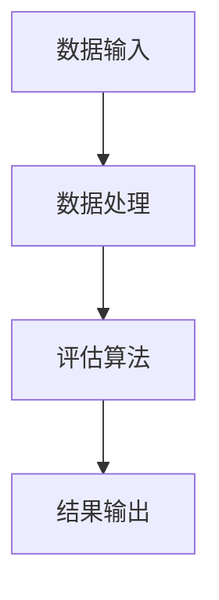

                 


# 巴菲特的品牌价值理论：在数字经济中的新解读

## 关键词：品牌价值，数字经济，巴菲特理论，价值评估，算法模型

## 摘要：本文将深入探讨巴菲特品牌价值理论在数字经济中的新发展与应用。通过分析品牌价值的核心要素、评估方法以及数字经济带来的变化，结合数学模型和实际案例，展示如何在数字化时代准确评估品牌价值。

---

# 第一部分：品牌价值理论的背景与核心概念

## 第1章：品牌价值理论的起源与发展

### 1.1 品牌价值的定义与内涵

#### 1.1.1 品牌价值的定义
品牌价值是指品牌为企业或组织带来的超额收益，是品牌在市场中所具有的无形资产价值。品牌价值的核心在于消费者的认知、忠诚度和品牌声誉。

#### 1.1.2 品牌价值的核心要素
| 核心要素 | 描述 |
|----------|------|
| 品牌认知 | 消费者对品牌的识别和理解程度 |
| 品牌忠诚度 | 消费者对品牌的偏好和持续购买意愿 |
| 品牌声誉 | 品牌在市场中的信誉和形象 |

#### 1.1.3 品牌价值与企业价值的关系
品牌价值是企业价值的重要组成部分，它通过消费者的信任和忠诚度为企业创造长期收益。

### 1.2 品牌价值理论的历史演变

#### 1.2.1 传统品牌价值理论
传统品牌价值理论主要关注品牌知名度和市场占有率，注重品牌在市场中的直接影响力。

#### 1.2.2 数字经济时代品牌价值理论的新发展
在数字经济时代，品牌价值的评估更加注重数据驱动的分析和消费者行为的深度洞察。

#### 1.2.3 当代品牌价值理论的现状
当前，品牌价值理论结合了传统营销学和数据科学，形成了以消费者行为分析、大数据驱动的品牌资产评估为核心的新框架。

## 第2章：数字经济中的品牌价值特征

### 2.1 数字经济对品牌价值的影响

#### 2.1.1 数据驱动的品牌价值评估
通过收集和分析消费者数据，企业可以更精准地评估品牌价值。

#### 2.1.2 数字化营销对品牌价值的重塑
数字化营销工具如社交媒体、搜索引擎优化等，显著影响了品牌价值的评估方式。

#### 2.1.3 用户行为数据与品牌价值的关系
用户行为数据（如点击率、转化率）成为评估品牌价值的重要指标。

### 2.2 数字经济中的品牌资产构成

#### 2.2.1 品牌认知与品牌忠诚度
在数字经济中，品牌认知更多依赖于在线互动和社交媒体，而品牌忠诚度则通过数据分析来衡量。

#### 2.2.2 品牌形象与品牌声誉
品牌形象通过社交媒体和在线评论得以快速传播，品牌声誉受到消费者实时反馈的影响。

#### 2.2.3 品牌创新与品牌可持续性
在数字经济时代，品牌创新和可持续性是品牌价值的重要组成部分，反映了品牌适应市场变化的能力。

---

# 第二部分：品牌价值评估的数学模型与算法

## 第3章：品牌价值评估的核心算法

### 3.1 品牌价值评估的加权评分法

#### 3.1.1 加权评分法的基本原理
加权评分法通过将多个品牌评估指标赋予不同的权重，计算出品牌的综合价值。

#### 3.1.2 加权评分法的数学模型
$$ \text{品牌价值} = \sum_{i=1}^{n} w_i \times v_i $$
其中，\( w_i \) 是第 \( i \) 个指标的权重，\( v_i \) 是第 \( i \) 个指标的评估值。

#### 3.1.3 实际应用示例
假设品牌A的三个指标分别为知名度（权重0.4）、忠诚度（权重0.3）、声誉（权重0.3），评估值分别为80、70、85，则品牌价值为：
$$ 0.4 \times 80 + 0.3 \times 70 + 0.3 \times 85 = 32 + 21 + 25.5 = 78.5 $$

### 3.2 品牌价值评估的层次分析法（AHP）

#### 3.2.1 层次分析法的基本原理
层次分析法通过构建指标层次结构，计算各指标的权重，从而评估品牌价值。

#### 3.2.2 层次分析法的步骤
1. 构建层次结构图。
2. 填写判断矩阵。
3. 计算权重向量。
4. 计算一致性检验。

#### 3.2.3 层次分析法的优缺点
| 优点 | 缺点 |
|------|------|
| 结构清晰 | 计算复杂 |
| 结果直观 | 易受主观因素影响 |

### 3.3 品牌价值评估的机器学习算法

#### 3.3.1 机器学习算法的基本原理
通过训练数据，机器学习模型可以自动识别品牌价值的关键特征。

#### 3.3.2 常见的机器学习算法
- 线性回归
- 支持向量机（SVM）
- 随机森林

#### 3.3.3 机器学习算法的应用
使用消费者行为数据训练模型，预测品牌价值。

---

## 第4章：品牌价值评估的系统架构

### 4.1 系统架构设计

#### 4.1.1 系统功能模块划分
- 数据采集模块
- 数据处理模块
- 评估算法模块
- 结果展示模块

#### 4.1.2 系统架构的Mermaid图


### 4.2 系统功能设计

#### 4.2.1 数据采集模块
负责收集消费者行为数据、市场数据等。

#### 4.2.2 数据分析模块
对数据进行清洗、预处理和特征提取。

#### 4.2.3 结果展示模块
以可视化的方式展示品牌价值评估结果。

---

## 第五部分：项目实战

### 第5章：品牌价值评估系统开发

#### 5.1 环境配置
安装必要的Python库，如pandas、numpy、scikit-learn。

#### 5.2 核心代码实现
```python
import pandas as pd
from sklearn.linear_model import LinearRegression

# 数据预处理
data = pd.read_csv('brand_data.csv')
X = data[['知名度', '忠诚度', '声誉']]
y = data['品牌价值']

# 训练模型
model = LinearRegression()
model.fit(X, y)

# 预测品牌价值
new_brand = [[80, 70, 85]]
print(model.predict(new_brand))
```

#### 5.3 项目小结
通过实际项目，展示了如何利用机器学习算法进行品牌价值评估。

---

## 第六部分：最佳实践与小结

### 第6章：总结与展望

#### 6.1 总结
本文探讨了巴菲特品牌价值理论在数字经济中的应用，介绍了多种品牌价值评估算法，并通过实际案例展示了如何在数字化时代评估品牌价值。

#### 6.2 注意事项
在实际应用中，应结合具体业务场景选择合适的评估方法，并注意数据质量和模型的可解释性。

#### 6.3 拓展阅读
建议深入学习机器学习在市场营销中的应用，探索更多品牌价值评估的方法。

---

## 作者：AI天才研究院（AI Genius Institute） & 禅与计算机程序设计艺术（Zen And The Art of Computer Programming）

---

这篇文章全面解析了巴菲特品牌价值理论在数字经济中的新解读，结合理论分析和实际案例，为读者提供了深入的品牌价值评估方法和实践指导。

