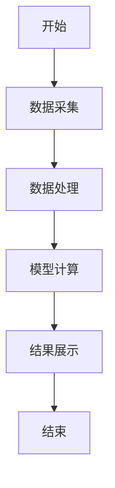
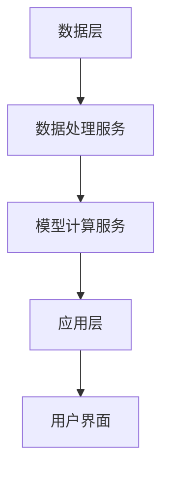

                 


# 巴菲特的品牌价值评估更新：数字化时代的品牌资产

## 关键词

- 巴菲特
- 品牌价值评估
- 数字化时代
- 品牌资产
- 企业价值

## 摘要

在数字化时代，品牌价值评估成为企业战略管理的重要组成部分。本文基于巴菲特的投资理念，结合数字化工具和方法，系统性地更新了品牌价值评估的框架和方法。通过分析品牌资产的构成、评估模型的创新以及系统的实现，本文提供了理论与实践相结合的品牌价值评估解决方案，帮助企业在数字化时代有效管理和优化品牌资产。

---

# 第一部分：品牌价值评估的背景与核心概念

## 第1章：品牌价值评估的背景与重要性

### 1.1 品牌价值评估的背景

#### 1.1.1 品牌价值评估的定义

品牌价值评估是通过量化方法衡量品牌在市场中的价值，是企业战略决策的重要依据。在数字化时代，品牌价值不仅体现在传统的产品和服务上，还体现在企业的数字化资产、用户互动和数据积累等方面。

#### 1.1.2 数字化时代品牌价值评估的重要性

在数字化时代，品牌价值评估的重要性主要体现在以下几个方面：
1. **数据驱动的决策**：通过数据收集和分析，品牌价值评估可以更加精准地反映品牌的真实价值。
2. **动态调整**：品牌价值在数字化时代更加动态，企业需要实时调整品牌策略。
3. **投资评估**：对于投资者而言，品牌价值是评估企业长期价值的重要指标。

#### 1.1.3 巴菲特投资理念与品牌价值的关系

巴菲特的投资理念强调长期价值和企业的基本面分析。品牌价值是企业基本面的重要组成部分，巴菲特的“企业护城河”概念与品牌价值密切相关。在数字化时代，品牌资产的稳定性、客户忠诚度和市场影响力是企业护城河的重要组成部分。

### 1.2 数字化时代品牌资产的核心特征

#### 1.2.1 品牌资产的定义与构成

品牌资产是指品牌在市场中产生的超额价值，主要包括品牌知名度、品牌认知度、品牌忠诚度和品牌联想等方面。在数字化时代，品牌资产还包括用户数据、数字化内容和社交媒体影响力等。

#### 1.2.2 数字化时代品牌资产的变化

1. **数据化**：品牌资产可以通过数据进行量化，例如用户点击率、转化率和社交媒体互动量等。
2. **实时性**：品牌资产的变化可以实时追踪和评估。
3. **互动性**：品牌与消费者之间的互动频率和质量对品牌资产的影响更加显著。

#### 1.2.3 品牌资产与企业价值的关系

品牌资产是企业价值的重要组成部分。通过提升品牌资产，企业可以增强市场竞争力，提高客户忠诚度，从而实现更高的市场价值。

---

## 第2章：巴菲特品牌价值评估的核心概念

### 2.1 品牌价值评估的框架

#### 2.1.1 品牌价值评估的维度

1. **财务维度**：包括品牌对销售收入、利润和资产回报率的贡献。
2. **市场维度**：包括品牌在市场中的知名度、市场份额和竞争地位。
3. **消费者维度**：包括消费者对品牌的认知、忠诚度和购买意愿。

#### 2.1.2 品牌价值评估的关键指标

1. **品牌知名度**：通过市场调研和消费者调查进行评估。
2. **品牌忠诚度**：通过消费者行为数据分析进行评估。
3. **品牌认知度**：通过市场份额和品牌曝光度进行评估。

#### 2.1.3 品牌价值评估的流程

1. **数据收集**：收集品牌相关的财务数据、市场数据和消费者数据。
2. **数据分析**：利用数据分析工具对数据进行清洗、建模和分析。
3. **评估与调整**：根据分析结果调整品牌策略，优化品牌资产。

### 2.2 品牌价值与企业价值的关联

#### 2.2.1 品牌价值对企业财务表现的影响

品牌价值的提升可以带来更高的销售收入和利润率，从而提高企业的财务表现。

#### 2.2.2 品牌价值与企业市场地位的关系

品牌价值的高低直接影响企业的市场地位。高品牌价值的企业更容易在市场竞争中占据优势。

#### 2.2.3 品牌价值与企业长期发展的关系

品牌价值是企业长期发展的基石。通过持续提升品牌价值，企业可以增强市场竞争力和抗风险能力。

---

## 第3章：数字化时代品牌资产的评估方法

### 3.1 传统品牌价值评估方法

#### 3.1.1 品牌价值的财务评估方法

财务评估方法主要包括基于收益的品牌价值评估和基于资产的品牌价值评估。

1. **基于收益的品牌价值评估**：通过预测品牌带来的未来现金流，使用贴现现金流模型计算品牌价值。
2. **基于资产的品牌价值评估**：通过评估品牌资产对整体资产价值的贡献来计算品牌价值。

#### 3.1.2 品牌价值的市场评估方法

市场评估方法主要包括市场比较法和交易案例法。

1. **市场比较法**：通过比较同行业类似品牌的价值，估算目标品牌的价值。
2. **交易案例法**：通过分析同类品牌的交易案例，估算目标品牌的价值。

#### 3.1.3 品牌价值的消费者评估方法

消费者评估方法主要包括问卷调查法和焦点小组讨论法。

1. **问卷调查法**：通过调查消费者对品牌的态度和行为，估算品牌价值。
2. **焦点小组讨论法**：通过组织焦点小组讨论，深入了解消费者对品牌的认知和偏好。

### 3.2 数字化时代品牌资产的评估创新

#### 3.2.1 数据驱动的品牌价值评估

数据驱动的品牌价值评估方法通过收集和分析大量的消费者数据、市场数据和品牌互动数据，更加精准地评估品牌价值。

1. **消费者行为分析**：通过分析消费者的点击率、转化率和购买行为，评估品牌的市场影响力。
2. **社交媒体分析**：通过分析社交媒体上的品牌提及量、情感倾向和互动频率，评估品牌的口碑影响力。

#### 3.2.2 数字化工具在品牌资产评估中的应用

1. **数据分析工具**：使用Python、R和SQL等工具进行数据分析。
2. **可视化工具**：使用Tableau和Power BI等工具进行数据可视化。
3. **机器学习模型**：使用机器学习算法进行品牌价值预测和分类。

#### 3.2.3 品牌资产的动态评估方法

1. **实时监测**：通过实时数据流监测品牌资产的变化。
2. **动态调整**：根据实时监测结果动态调整品牌策略。

---

## 第4章：巴菲特品牌价值评估模型的更新

### 4.1 巴菲特品牌价值评估模型的演变

#### 4.1.1 传统品牌价值评估模型

传统品牌价值评估模型主要包括基于收益的评估模型和基于资产的评估模型。

1. **基于收益的评估模型**：通过预测品牌带来的未来现金流，使用贴现现金流模型计算品牌价值。
2. **基于资产的评估模型**：通过评估品牌资产对整体资产价值的贡献来计算品牌价值。

#### 4.1.2 数字化时代品牌价值评估模型的改进

数字化时代品牌价值评估模型的改进主要体现在以下几个方面：
1. **数据驱动**：引入消费者数据、市场数据和品牌互动数据进行评估。
2. **动态调整**：根据实时数据动态调整品牌价值评估结果。
3. **机器学习**：使用机器学习算法进行品牌价值预测和分类。

#### 4.1.3 巴菲特品牌价值评估模型的核心要素

1. **品牌知名度**：品牌在市场中的知名度是品牌价值的重要组成部分。
2. **品牌忠诚度**：消费者对品牌的忠诚度是品牌价值的重要指标。
3. **品牌认知度**：消费者对品牌的认知程度是品牌价值的重要因素。

### 4.2 数字化时代品牌价值评估的数学模型

#### 4.2.1 品牌价值评估的公式

品牌价值可以表示为：

$$
\text{品牌价值} = \alpha \times \text{品牌知名度} + \beta \times \text{品牌忠诚度} + \gamma \times \text{品牌认知度}
$$

其中，$\alpha$、$\beta$和$\gamma$是权重系数，表示品牌知名度、品牌忠诚度和品牌认知度对品牌价值的贡献程度。

#### 4.2.2 品牌价值的动态调整模型

品牌价值的动态调整模型可以表示为：

$$
\text{品牌价值}_t = \text{品牌价值}_{t-1} + \delta \times (\text{新增品牌资产} - \text{损失品牌资产})
$$

其中，$\delta$是调整系数，表示新增品牌资产和损失品牌资产对品牌价值的影响程度。

#### 4.2.3 品牌价值与企业价值的关联公式

品牌价值与企业价值的关联公式可以表示为：

$$
\text{企业价值} = \text{品牌价值} + \text{其他资产价值} + \text{负债价值}
$$

其中，品牌价值是企业价值的重要组成部分，其他资产价值和负债价值是企业价值的其他组成部分。

---

## 第5章：品牌价值评估的系统分析与架构设计

### 5.1 品牌价值评估系统的功能设计

#### 5.1.1 系统功能模块划分

1. **数据采集模块**：负责采集品牌相关的数据，包括消费者数据、市场数据和品牌互动数据。
2. **数据处理模块**：负责对采集的数据进行清洗、转换和预处理。
3. **模型计算模块**：负责使用机器学习模型进行品牌价值评估。
4. **结果展示模块**：负责将评估结果以可视化的方式展示出来。

#### 5.1.2 系统功能流程图



#### 5.1.3 系统功能的实现方式

1. **数据采集模块**：使用爬虫技术采集品牌相关的数据，包括社交媒体数据、市场数据和消费者数据。
2. **数据处理模块**：使用Python的Pandas库进行数据清洗和预处理。
3. **模型计算模块**：使用机器学习算法进行品牌价值预测，例如使用随机森林回归算法。
4. **结果展示模块**：使用Tableau进行数据可视化。

### 5.2 品牌价值评估系统的架构设计

#### 5.2.1 系统架构的分层设计

系统架构分为数据层、服务层和应用层。

1. **数据层**：负责存储品牌相关的数据，包括消费者数据、市场数据和品牌互动数据。
2. **服务层**：负责处理数据和计算品牌价值，包括数据处理服务和模型计算服务。
3. **应用层**：负责接收用户的请求，调用服务层的功能，返回评估结果。

#### 5.2.2 系统架构的模块化设计



#### 5.2.3 系统架构的可扩展性设计

系统架构设计为模块化结构，方便后续功能的扩展和升级。

---

## 第6章：品牌价值评估的项目实战

### 6.1 项目环境与工具安装

#### 6.1.1 项目开发环境的搭建

1. **操作系统**：建议使用Linux或Windows系统。
2. **编程语言**：使用Python作为主要编程语言。
3. **开发工具**：使用PyCharm或VS Code作为开发工具。

#### 6.1.2 数据采集工具的安装与配置

1. **爬虫工具**：使用Scrapy或BeautifulSoup进行数据采集。
2. **数据存储工具**：使用MongoDB或MySQL进行数据存储。

#### 6.1.3 品牌价值评估系统的部署

1. **服务器部署**：使用云服务器（例如AWS、阿里云）部署系统。
2. **前端部署**：使用静态网站生成工具（例如Vue.js）生成前端页面。

### 6.2 项目核心代码实现

#### 6.2.1 数据清洗与预处理代码

```python
import pandas as pd

# 读取数据
df = pd.read_csv('brand_data.csv')

# 删除缺失值
df.dropna(inplace=True)

# 去重
df.drop_duplicates(inplace=True)

# 转换数据类型
df['date'] = pd.to_datetime(df['date'])
```

#### 6.2.2 品牌价值评估模型的实现

```python
from sklearn.ensemble import RandomForestRegressor

# 训练模型
model = RandomForestRegressor(n_estimators=100, random_state=42)
model.fit(X_train, y_train)

# 预测品牌价值
y_pred = model.predict(X_test)
```

#### 6.2.3 系统交互界面的开发

```python
from flask import Flask, request, jsonify

app = Flask(__name__)

@app.route('/evaluate_brand', methods=['POST'])
def evaluate_brand():
    # 获取输入数据
    data = request.json
    # 调用模型进行预测
    result = model.predict([[data['feature1'], data['feature2'], ...]])
    return jsonify({'brand_value': result[0].tolist()})
```

### 6.3 项目总结与成果展示

通过本项目，我们成功开发了一个品牌价值评估系统，能够实时监测和评估品牌资产，帮助企业更好地管理品牌价值。系统采用数据驱动的方法，结合机器学习算法，提高了品牌价值评估的准确性和实时性。

---

## 第7章：品牌价值评估的最佳实践与小结

### 7.1 最佳实践 tips

1. **数据驱动**：品牌价值评估需要依赖大量的数据支持，确保数据的准确性和完整性。
2. **动态调整**：品牌价值在数字化时代是动态变化的，需要实时监测和动态调整。
3. **机器学习**：利用机器学习算法进行品牌价值预测和分类，提高评估的准确性和效率。

### 7.2 项目小结

通过本文的系统分析和项目实战，我们深入探讨了数字化时代品牌价值评估的方法和工具，结合巴菲特的投资理念，提出了品牌价值评估的新思路和新方法。未来，随着技术的不断发展，品牌价值评估将更加智能化和数据化，为企业创造更大的价值。

---

## 作者

**作者：AI天才研究院/AI Genius Institute & 禅与计算机程序设计艺术 /Zen And The Art of Computer Programming**

---

以上是《巴菲特的品牌价值评估更新：数字化时代的品牌资产》的部分内容，完整文章将包含更多详细内容和章节，确保读者能够全面理解品牌价值评估的数字化更新和实际应用。

