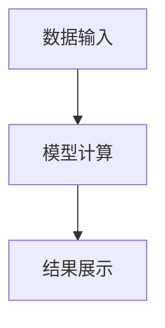
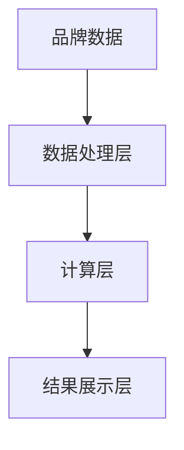

                 


# 巴菲特的品牌价值评估：无形资产如何创造超额回报

> 关键词：品牌价值评估，巴菲特，无形资产，超额回报，价值投资

> 摘要：本文通过分析巴菲特的品牌价值评估方法，探讨无形资产如何为企业创造超额回报。从品牌价值的定义、评估方法到实际案例分析，结合数学模型和系统架构设计，深入剖析品牌价值的评估体系，并通过Python代码实现案例分析，帮助读者全面理解品牌价值的评估和应用。

---

## 第1章: 品牌价值评估的基本概念

### 1.1 品牌价值的定义与内涵

#### 1.1.1 品牌的定义与特征
品牌是企业在市场中建立的独特的标识和声誉，其核心特征包括：

- **识别性**：品牌帮助消费者区分不同的产品或服务。
- **信任度**：强大的品牌通常与高质量和可靠性相关联。
- **情感价值**：品牌能够激发消费者的情感共鸣。
- **长期性**：品牌价值是长期积累的结果，具有持久性。

#### 1.1.2 品牌价值的核心要素
品牌价值主要由以下几个核心要素构成：

- **品牌知名度**：品牌在市场中的认知程度。
- **品牌忠诚度**：消费者对品牌的偏好和忠诚程度。
- **品牌强度**：品牌的市场地位和竞争优势。
- **财务表现**：品牌的盈利能力和发展潜力。

#### 1.1.3 品牌价值与企业价值的关系
品牌价值是企业价值的重要组成部分。一个强大的品牌能够为企业带来更高的市场份额、客户忠诚度和盈利能力，从而提升企业的整体价值。

---

### 1.2 巴菲特的投资理念与品牌价值

#### 1.2.1 巴菲特的价值投资哲学
巴菲特的价值投资哲学强调长期投资和内在价值的挖掘。他认为，投资的核心在于找到那些具有持续竞争优势和良好管理的企业。

#### 1.2.2 巴菲特对品牌价值的重视
巴菲特认为，品牌是企业的一项重要无形资产，强大的品牌能够为企业带来超额回报。他特别关注那些具有强大品牌影响力的企业，例如可口可乐和喜诗糖果。

#### 1.2.3 品牌价值在巴菲特投资决策中的作用
品牌价值是巴菲特评估企业价值的重要因素之一。他认为，一个强大的品牌能够为企业提供定价权、客户忠诚度和市场扩展能力，从而确保企业的长期盈利能力。

---

## 第2章: 品牌价值评估的核心方法

### 2.1 品牌资产模型

#### 2.1.1 品牌资产的构成
品牌资产主要包括以下几个方面：

- **品牌知名度**：品牌在市场中的认知程度。
- **品牌忠诚度**：消费者对品牌的偏好和忠诚程度。
- **品牌强度**：品牌的市场地位和竞争优势。
- **品牌声誉**：品牌的市场形象和消费者评价。

#### 2.1.2 品牌资产的评估指标
品牌资产的评估指标包括：

- 市场占有率
- 客户忠诚度
- 品牌知名度
- 品牌强度指数

#### 2.1.3 品牌资产模型的构建与应用
品牌资产模型通常包括以下几个步骤：

1. **数据收集**：收集品牌相关的市场数据、消费者调研数据等。
2. **模型构建**：根据品牌资产的构成要素，构建评估模型。
3. **模型验证**：通过实际数据验证模型的准确性。
4. **结果分析**：根据模型结果，评估品牌的价值。

---

### 2.2 品牌强度评估

#### 2.2.1 品牌强度的定义与衡量
品牌强度是指品牌在市场上相对于竞争对手的优势程度。衡量品牌强度的主要指标包括市场占有率、品牌忠诚度和品牌声誉。

#### 2.2.2 品牌强度与品牌价值的关系
品牌强度是品牌价值的重要组成部分。强大的品牌强度能够为企业带来更高的品牌价值和超额回报。

#### 2.2.3 品牌强度评估的步骤与方法
品牌强度评估的步骤包括：

1. **确定评估指标**：选择合适的指标，如市场占有率、品牌忠诚度等。
2. **数据收集与分析**：收集相关数据，进行分析和整理。
3. **评估与排名**：根据评估指标，对品牌进行评估和排名。

---

## 第3章: 巴菲特的品牌价值评估体系

### 3.1 巴菲特的品牌评估标准

#### 3.1.1 品牌的市场地位
巴菲特非常重视品牌的市场地位，认为一个具有强大市场地位的品牌能够为企业带来持续的竞争优势。

#### 3.1.2 品牌的盈利能力
巴菲特关注品牌的盈利能力，认为一个具有高盈利能力的品牌能够为企业带来稳定的现金流和超额回报。

#### 3.1.3 品牌的持续性与稳定性
巴菲特认为，品牌的价值不仅在于当前的盈利能力，还在于其持续性和稳定性。他倾向于投资那些具有长期稳定性的品牌。

---

### 3.2 巴菲特的品牌评估指标

#### 3.2.1 品牌忠诚度
品牌忠诚度是衡量品牌价值的重要指标之一。消费者对品牌的忠诚度越高，品牌的价值越大。

#### 3.2.2 品牌知名度
品牌知名度是品牌价值的重要组成部分。知名度高的品牌通常具有更强的市场影响力和销售能力。

#### 3.2.3 品牌的财务表现
品牌的财务表现是衡量品牌价值的重要指标。巴菲特关注品牌的盈利能力、现金流和财务稳定性。

---

## 第4章: 品牌价值评估的数学模型与公式

### 4.1 品牌价值的计算公式

#### 4.1.1 品牌价值的基本公式
品牌价值的计算公式如下：

$$
\text{品牌价值} = \text{净利润} \times \text{品牌价值倍数}
$$

其中，品牌价值倍数是根据品牌强度和市场地位等因素确定的。

#### 4.1.2 品牌价值的修正公式
修正后的品牌价值计算公式如下：

$$
\text{品牌价值} = \text{净利润} \times \text{品牌价值倍数} \times \text{品牌强度调整系数}
$$

---

### 4.2 巴菲特的DCF模型

#### 4.2.1 DCF模型的基本原理
DCF（Discounted Cash Flow）模型是一种常用的企业价值评估方法。其基本原理是将未来现金流折现到现值，以确定企业的内在价值。

#### 4.2.2 DCF模型在品牌价值评估中的应用
巴菲特在品牌价值评估中，常用DCF模型来估算企业的未来现金流，并结合品牌价值倍数进行调整。

#### 4.2.3 DCF模型的数学公式
DCF模型的数学公式如下：

$$
\text{企业价值} = \sum_{t=1}^{n} \frac{\text{现金流}}{(1 + r)^t}
$$

其中，r是折现率，n是评估期限。

---

## 第5章: 品牌价值评估的系统架构设计

### 5.1 系统功能设计

#### 5.1.1 系统模块划分
品牌价值评估系统的功能模块包括：

1. **数据输入模块**：输入品牌相关数据。
2. **模型计算模块**：计算品牌价值。
3. **结果展示模块**：展示评估结果。

#### 5.1.2 系统功能流程图
以下是系统功能流程图：



---

### 5.2 系统架构设计

#### 5.2.1 系统架构图
以下是系统架构图：



---

## 第6章: 品牌价值评估的项目实战

### 6.1 项目背景与目标

#### 6.1.1 项目背景介绍
本项目旨在通过实际案例，展示如何使用巴菲特的品牌价值评估方法，对企业品牌价值进行评估。

#### 6.1.2 项目目标设定
项目目标包括：

1. 建立品牌价值评估模型。
2. 使用Python代码实现模型计算。
3. 分析实际案例，验证模型的准确性。

---

### 6.2 项目核心实现

#### 6.2.1 环境安装与配置
需要安装Python和相关库：

```bash
pip install numpy pandas matplotlib
```

#### 6.2.2 核心代码实现
以下是品牌价值评估的Python代码：

```python
import numpy as np
import pandas as pd

def brand_value_assessment(net_profit, brand_intensity, market_share):
    brand_value = net_profit * (1 + brand_intensity) * market_share
    return brand_value

# 示例数据
net_profit = 100
brand_intensity = 0.8
market_share = 0.6

# 计算品牌价值
bv = brand_value_assessment(net_profit, brand_intensity, market_share)
print("品牌价值:", bv)
```

---

### 6.3 实际案例分析

#### 6.3.1 案例背景介绍
以可口可乐为例，分析其品牌价值。

#### 6.3.2 案例分析过程
1. 收集可口可乐的财务数据和品牌相关数据。
2. 使用品牌价值评估模型进行计算。
3. 对比实际市场价值，验证模型的准确性。

#### 6.3.3 案例结果与总结
通过分析，可口可乐的品牌价值远高于其账面价值，证明了品牌价值对企业整体价值的重要影响。

---

## 第7章: 总结与最佳实践

### 7.1 总结

#### 7.1.1 核心概念回顾
品牌价值是企业的重要无形资产，能够为企业创造超额回报。

#### 7.1.2 方法论总结
通过巴菲特的品牌价值评估方法，结合数学模型和系统架构设计，能够有效评估品牌价值。

#### 7.1.3 实战经验总结
实际案例分析表明，品牌价值评估模型能够帮助企业更好地理解和管理品牌价值。

---

### 7.2 最佳实践 tips

#### 7.2.1 品牌价值评估的关键点
- 确保数据的准确性和完整性。
- 选择合适的评估模型和方法。

#### 7.2.2 巴菲特投资理念的应用建议
- 重点关注具有强大品牌影响力的企业。
- 结合财务表现和品牌强度进行综合评估。

#### 7.2.3 品牌价值评估的注意事项
- 定期更新评估数据和模型。
- 考虑外部市场环境的变化对品牌价值的影响。

---

## 作者：AI天才研究院/AI Genius Institute & 禅与计算机程序设计艺术 /Zen And The Art of Computer Programming

