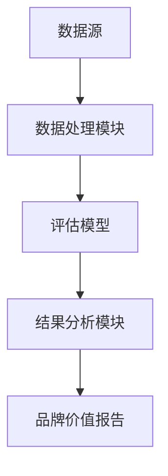
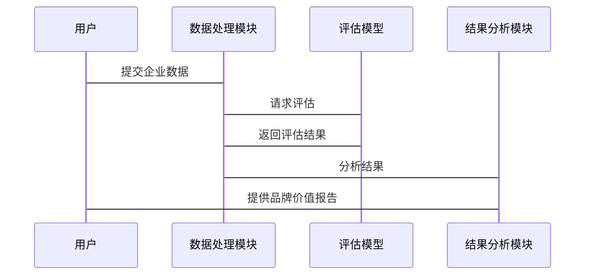

                 


# 巴菲特的品牌价值评估：无形资产的重要性

## 关键词：巴菲特，品牌价值，无形资产，价值投资，企业评估

## 摘要：  
本文深入探讨了巴菲特的价值投资理念中品牌价值的重要性，分析了无形资产在企业价值评估中的关键作用。通过理论分析、数学模型和实际案例，展示了如何量化品牌价值，并将其纳入企业整体价值评估体系中。本文旨在帮助投资者和企业管理者更好地理解和应用品牌价值评估方法。

---

# 第一部分：引言

## 第1章：巴菲特的价值投资理念

### 1.1 价值投资的基本原则

1.1.1 价值投资的定义与核心理念  
价值投资是一种投资策略，强调以低于公平价值的价格购买优质资产。巴菲特的价值投资理念强调企业的基本面分析，尤其是企业的盈利能力、财务健康和长期竞争优势。

1.1.2 巴菲特的投资策略  
巴菲特的投资策略包括：  
- **长期持有**：投资优质企业，长期持有，分享企业成长的成果。  
- **安全边际**：以低于内在价值的价格买入，确保投资的安全性。  
- **竞争优势**：投资具有持续竞争优势的企业，例如强大的品牌、独特的商业模式等。

1.1.3 无形资产在价值投资中的重要性  
在巴菲特的投资理念中，无形资产（如品牌、客户忠诚度、管理团队等）是企业长期竞争优势的核心。品牌价值直接影响企业的市场份额、定价能力和盈利能力。

---

## 第2章：品牌价值评估的背景与重要性

### 2.1 无形资产的定义与分类

2.1.1 无形资产的定义  
无形资产是指企业拥有或控制的，没有实物形态的长期资产，包括品牌、专利、商标、客户关系、商誉等。

2.1.2 无形资产的分类  
- **可识别无形资产**：如专利、商标、品牌等。  
- **不可识别无形资产**：如商誉。

2.1.3 品牌价值在无形资产中的地位  
品牌是企业的重要无形资产，其价值体现在企业的市场地位、客户忠诚度和盈利能力上。

### 2.2 品牌价值评估的背景

2.2.1 全球化背景下的品牌竞争  
在全球化竞争中，品牌价值是企业核心竞争力的重要体现。强大的品牌能够为企业带来更高的市场份额和定价能力。

2.2.2 数字经济时代品牌价值的变化  
在数字经济时代，品牌价值的评估更加复杂，但也更加重要。社交媒体、数据驱动的营销策略等都在影响品牌价值的动态变化。

2.2.3 巴菲特投资理念与品牌价值的结合  
巴菲特的长期价值投资理念与品牌价值评估高度契合。品牌价值是企业长期竞争优势的重要组成部分，也是巴菲特评估企业内在价值的关键因素。

### 2.3 品牌价值评估的重要性

2.3.1 企业决策中的品牌价值考量  
品牌价值是企业战略决策的重要依据，包括并购、品牌延伸、市场进入等。

2.3.2 品牌价值对股价的影响  
品牌价值直接影响企业的市场地位和盈利能力，进而影响股价表现。

2.3.3 品牌价值对长期投资价值的贡献  
品牌价值是企业长期竞争优势的核心，是企业内在价值的重要组成部分。

---

# 第二部分：品牌价值评估的核心概念

## 第3章：品牌价值的构成要素

### 3.1 品牌的核心要素

3.1.1 品牌名称  
品牌名称是品牌的核心识别元素，直接影响消费者的记忆和认知。

3.1.2 品牌标识  
品牌标识（如 logo）是品牌视觉形象的核心，帮助消费者快速识别品牌。

3.1.3 品牌声誉  
品牌声誉是消费者对品牌的信任度和好感度，直接影响品牌的市场地位和销售能力。

### 3.2 影响品牌价值的因素

3.2.1 市场地位  
市场地位包括品牌的市场份额、市场影响力和竞争地位。强大的市场地位意味着品牌具有更强的定价能力和抗风险能力。

3.2.2 财务表现  
财务表现是品牌价值的重要支撑，包括企业的盈利能力、现金流和财务健康状况。

3.2.3 管理团队  
管理团队的能力和战略决策直接影响品牌的发展和价值提升。

3.2.4 客户忠诚度  
客户忠诚度是品牌价值的重要体现，忠诚的客户会持续选择品牌，为企业带来稳定的收入和利润。

3.2.5 创新能力  
创新能力是品牌保持长期竞争优势的关键，能够帮助品牌不断推出新产品和服务，满足市场需求。

### 3.3 品牌价值与企业价值的关系

3.3.1 品牌价值对企业整体价值的贡献  
品牌价值是企业内在价值的重要组成部分，直接影响企业的市场价值和长期盈利能力。

3.3.2 品牌价值与企业市场价值的关联  
品牌价值与企业的市场价值（如股价）密切相关。强大的品牌价值能够提升企业的市场估值和股价表现。

---

## 第4章：品牌价值评估的理论基础

### 4.1 无形资产评估的理论框架

4.1.1 无形资产评估的基本概念  
无形资产评估是指对企业拥有的无形资产进行价值量化的过程，包括品牌、专利、商标等。

4.1.2 无形资产评估的方法  
常用的无形资产评估方法包括：  
- **市场法**：基于市场交易案例进行比较分析。  
- **收益法**：基于未来现金流的折现值进行评估。  
- **成本法**：基于资产的重置成本进行评估。

4.1.3 无形资产评估的挑战  
无形资产评估的难度在于其无形性和主观性，品牌价值的量化需要综合考虑多种因素。

### 4.2 品牌价值评估的特殊性

4.2.1 品牌的不可见性  
品牌价值是无形的，无法直接观察和测量，需要通过市场表现和消费者行为来间接评估。

4.2.2 品牌价值的主观性  
品牌价值的评估具有一定的主观性，不同评估方法和评估者可能得出不同的结果。

4.2.3 品牌价值的动态变化  
品牌价值会随着市场环境、消费者偏好和企业战略的变化而动态调整。

---

# 第三部分：品牌价值评估的系统分析与架构设计

## 第5章：系统分析与架构设计方案

### 5.1 问题场景介绍

5.1.1 项目介绍  
本项目旨在设计一个品牌价值评估系统，基于巴菲特的价值投资理念，量化品牌价值并评估企业的内在价值。

5.1.2 系统功能设计  
系统功能包括：  
- 数据收集与处理：收集企业的财务数据、市场数据和品牌相关数据。  
- 评估模型：基于收益法和市场法，构建品牌价值评估模型。  
- 结果分析：生成品牌价值报告，为企业决策提供支持。

### 5.2 系统架构设计

5.2.1 系统架构图  
以下是一个品牌价值评估系统的架构图：



5.2.2 系统交互设计  
以下是一个系统交互流程图：



---

# 第四部分：项目实战

## 第6章：品牌价值评估的项目实战

### 6.1 环境安装

6.1.1 Python环境安装  
安装Python 3.x，确保环境满足项目需求。

6.1.2 数据处理工具安装  
安装Pandas、NumPy、Scikit-learn等数据分析库。

### 6.2 系统核心实现

6.2.1 数据收集与预处理  
收集企业的财务数据、市场数据和品牌相关数据，进行清洗和标准化处理。

6.2.2 评估模型实现  
基于收益法和市场法，构建品牌价值评估模型。以下是一个Python代码示例：

```python
import pandas as pd
import numpy as np

# 示例数据
data = {
    'Revenue': [100, 200, 150, 250, 300],
    'Net Income': [20, 40, 30, 50, 60],
    'Brand Value': [50, 100, 70, 120, 150]
}

df = pd.DataFrame(data)

# 收益法模型
def calculate_brand_value(revenue, net_income):
    return revenue * 0.1 + net_income * 0.2

# 市场法模型
def calculate_market_value(revenue, brand_value):
    return revenue * 0.15 + brand_value * 0.3

# 评估结果
brand_value = df['Revenue'].apply(lambda x: calculate_brand_value(x, df['Net Income']))
market_value = df['Revenue'].apply(lambda x: calculate_market_value(x, df['Brand Value']))

print("Brand Value:", brand_value)
print("Market Value:", market_value)
```

### 6.3 实际案例分析

6.3.1 案例介绍  
以某企业为例，分析其品牌价值评估过程。  
- 数据收集：收集该企业的Revenue、Net Income和Brand Value数据。  
- 模型实现：应用收益法和市场法进行评估。  
- 结果分析：生成品牌价值报告，为企业决策提供支持。

### 6.4 项目小结

6.4.1 项目总结  
通过实际案例分析，验证了品牌价值评估模型的有效性。  
- 项目实现了品牌价值的量化评估。  
- 评估结果为企业决策提供了有力支持。

6.4.2 经验与启示  
- 数据质量是品牌价值评估的关键。  
- 模型选择需要根据企业实际情况进行调整。  
- 品牌价值评估是一个动态过程，需要持续监测和更新。

---

# 第五部分：总结与展望

## 第7章：最佳实践与总结

### 7.1 总结

7.1.1 核心内容回顾  
本文深入探讨了巴菲特的品牌价值评估理念，分析了无形资产在企业价值评估中的重要性。通过理论分析、系统设计和实际案例，展示了品牌价值评估的实现过程。

7.1.2 关键结论  
- 品牌价值是企业长期竞争优势的核心。  
- 品牌价值评估需要综合考虑多种因素。  
- 无形资产是企业内在价值的重要组成部分。

### 7.2 最佳实践 tips

7.2.1 数据收集与处理  
- 确保数据的准确性和完整性。  
- 使用数据分析工具进行清洗和预处理。

7.2.2 模型选择与实现  
- 根据企业实际情况选择合适的评估方法。  
- 结合收益法和市场法进行综合评估。

7.2.3 持续监测与更新  
- 定期更新品牌价值评估结果。  
- 根据市场环境变化调整评估模型。

### 7.3 未来展望

7.3.1 品牌价值评估的未来趋势  
随着数字经济的发展，品牌价值评估将更加复杂和重要。  
- 数据驱动的评估方法将更加普及。  
- 人工智能技术将被应用于品牌价值预测和评估。

7.3.2 技术创新与应用  
- 大数据技术将为品牌价值评估提供更强大的支持。  
- 人工智能算法将提升品牌价值预测的准确性和效率。

---

# 作者：AI天才研究院 & 禅与计算机程序设计艺术

---

通过以上结构，本文详细分析了巴菲特的品牌价值评估理念，探讨了无形资产在企业价值评估中的重要性，并通过理论分析和实际案例展示了品牌价值评估的实现过程。希望本文能够为投资者和企业管理者提供有价值的参考和启发。

