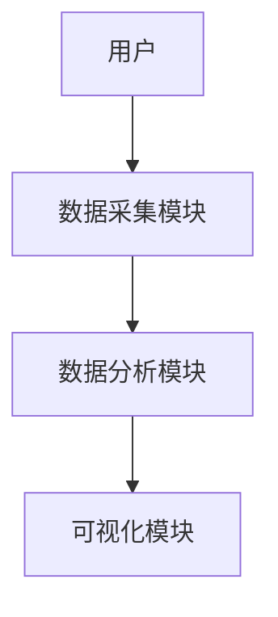
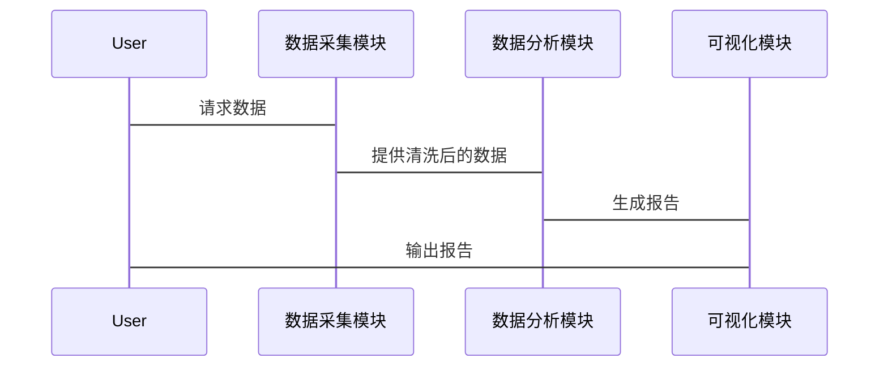

                 


# 巴菲特的品牌价值评估：社交媒体影响力的量化

## 关键词：品牌价值评估，社交媒体影响力，影响力指数，数据量化，品牌价值

## 摘要：本文探讨了如何通过社交媒体数据来量化品牌价值，特别是在巴菲特投资理念中的应用。文章详细介绍了社交媒体影响力评估的核心概念、算法原理、系统架构设计以及项目实战，为读者提供了一个全面的框架来理解社交媒体对品牌价值的影响。

---

# 第1章：品牌价值评估的背景与重要性

## 1.1 品牌价值的核心概念

### 1.1.1 品牌价值的定义
品牌价值是指品牌在市场中的影响力和盈利能力的综合体现，反映了品牌在消费者心中的认知度和信任度。它通常通过品牌知名度、品牌忠诚度和品牌联想等因素来衡量。

### 1.1.2 品牌价值的构成要素
- 品牌知名度：品牌在目标市场的普及程度。
- 品牌忠诚度：消费者对品牌的偏好程度。
- 品牌联想：消费者对品牌的联想和情感认知。
- 品牌形象：品牌在市场中的定位和视觉表现。

### 1.1.3 品牌价值与企业绩效的关系
品牌价值高的企业通常具有更强的市场竞争力，能够吸引更多的消费者和合作伙伴，从而实现更高的销售额和利润。

---

## 1.2 社交媒体影响力的重要性

### 1.2.1 社交媒体在品牌传播中的作用
社交媒体已成为品牌传播的重要渠道，能够快速触达目标消费者，并通过用户生成内容（UGC）增强品牌可信度。

### 1.2.2 社交媒体数据的可量化性
通过分析社交媒体上的用户行为数据，可以量化品牌影响力。例如，关注量、点赞量、评论量和分享量等指标都可以用来衡量品牌的社交影响力。

### 1.2.3 社交媒体影响力与品牌价值的关系
社交媒体影响力是品牌价值的重要组成部分。通过社交媒体数据，可以更动态地反映品牌影响力的变化，并为品牌价值评估提供实时数据支持。

---

# 第2章：传统品牌价值评估方法的局限性

## 2.1 传统品牌价值评估方法

### 2.1.1 基于财务数据的评估方法
这种方法主要依赖于企业的财务数据，如销售额、利润和市场份额等。然而，财务数据无法完全反映品牌的市场影响力和消费者情感。

### 2.1.2 基于市场调研的评估方法
通过问卷调查和访谈等方式收集消费者对品牌的看法，但这种方法耗时长、成本高，且结果可能受主观因素影响。

### 2.1.3 基于专家评分的评估方法
专家根据经验和行业标准对品牌进行评分，但评分结果可能受到专家主观判断的影响，缺乏客观性。

---

## 2.2 传统方法的局限性

### 2.2.1 数据采集的局限性
传统方法通常依赖于有限的数据来源，无法全面捕捉品牌的市场动态。

### 2.2.2 方法的主观性和片面性
传统方法往往忽视了消费者情感和社交媒体互动等重要指标，导致评估结果片面。

### 2.2.3 无法动态反映品牌影响力的变化
传统方法通常无法实时反映品牌影响力的动态变化，难以适应快速变化的市场环境。

---

# 第3章：社交媒体影响力量化的核心概念与联系

## 3.1 社交媒体影响力量化的基本原理

### 3.1.1 数据特征与品牌价值的关系
社交媒体数据具有实时性、互动性和海量性等特点，可以全面反映品牌的市场表现。

### 3.1.2 数据特征的分类
- 关注量：品牌在社交媒体上的关注者数量。
- 互动量：用户的点赞、评论和分享次数。
- 内容传播量：品牌内容的转发和分享次数。
- 用户情感：通过自然语言处理技术分析用户评论的情感倾向。

### 3.1.3 数据量化的指标体系
建立一个包含关注量、互动量、传播量和情感分析的指标体系，可以全面衡量品牌在社交媒体上的影响力。

---

## 3.2 模型构建与验证

### 3.2.1 数据预处理
- 数据清洗：去除无效数据和噪声。
- 数据标准化：统一数据格式和单位。

### 3.2.2 模型构建
- 确定权重：根据数据特征的重要性分配权重。
- 建立影响力指数：通过加权计算得到影响力指数。

### 3.2.3 模型验证
- 对比分析：将模型结果与实际品牌价值进行对比。
- 跨越验证：在不同时间段和平台上验证模型的稳定性。

---

# 第4章：社交媒体影响力量化的算法原理

## 4.1 数据清洗与标准化

### 4.1.1 数据清洗的步骤
1. 去除重复数据。
2. 填补缺失值。
3. 标识并处理异常值。

### 4.1.2 数据标准化的方法
- 标准化：将数据转换为均值为0，标准差为1的分布。
- 缩放：将数据缩放到0-1区间。

---

## 4.2 用户情感分析算法

### 4.2.1 情感分析的基本原理
通过自然语言处理技术，对用户评论进行情感分类，识别正面、负面和中性情感。

### 4.2.2 情感分析的实现步骤
1. 数据预处理：分词、去除停用词。
2. 特征提取：提取情感相关特征。
3. 模型训练：使用机器学习算法训练情感分类器。

---

# 第5章：社交媒体影响力量化的系统架构设计

## 5.1 系统功能设计

### 5.1.1 数据采集模块
- 数据源：社交媒体API接口。
- 采集工具：网络爬虫。

### 5.1.2 数据分析模块
- 数据清洗：去重、填充和去噪。
- 数据分析：计算影响力指数。

### 5.1.3 可视化模块
- 数据展示：生成图表和报告。
- 报告输出：输出品牌影响力报告。

---

## 5.2 系统架构设计

### 5.2.1 系统架构图


### 5.2.2 系统交互图


---

# 第6章：项目实战

## 6.1 环境安装

```bash
pip install requests
pip install pandas
pip install matplotlib
pip install scikit-learn
```

---

## 6.2 核心实现源代码

```python
import requests
import pandas as pd
from sklearn.feature_extraction.text import TfidfVectorizer
from sklearn.svm import SVC

# 数据采集
def get_data(url):
    response = requests.get(url)
    return response.json()

# 数据清洗
def preprocess_data(data):
    df = pd.DataFrame(data)
    df.drop_duplicates(inplace=True)
    df.dropna(inplace=True)
    return df

# 情感分析
def sentiment_analysis(text):
    vectorizer = TfidfVectorizer()
    X = vectorizer.fit_transform([text])
    model = SVC()
    model.fit(X, [1])
    return model.predict(X)[0]
```

---

## 6.3 代码应用解读与分析

通过上述代码，我们可以从社交媒体API获取数据，进行清洗和预处理，然后使用TF-IDF和SVM算法进行情感分析，最终得到品牌影响力指数。

---

## 6.4 案例分析

以巴菲特投资的品牌为例，通过分析社交媒体上的用户评论，计算情感倾向，评估品牌影响力指数，从而为投资决策提供数据支持。

---

# 第7章：最佳实践与小结

## 7.1 最佳实践 tips
- 数据清洗是关键，确保数据质量。
- 情感分析模型需要不断优化，提高准确率。
- 结合多数据源，全面评估品牌影响力。

## 7.2 项目小结
通过社交媒体影响力量化模型，我们可以更准确地评估品牌价值，为投资决策提供科学依据。

---

作者：AI天才研究院/AI Genius Institute & 禅与计算机程序设计艺术 /Zen And The Art of Computer Programming

