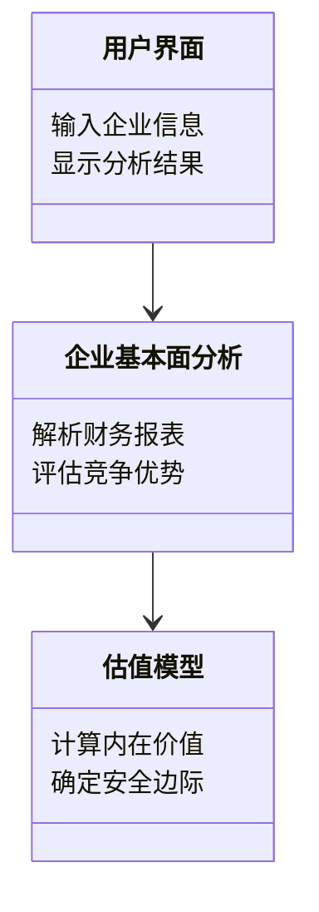

                 


# 巴菲特的商业分析方法论

## 关键词：巴菲特，商业分析，投资策略，价值评估，风险管理，系统架构

## 摘要：本文系统地分析了巴菲特的商业分析方法论，从企业基本面分析到财务报表解读，再到投资组合管理，详细阐述了巴菲特的投资理念和策略。通过数学模型、系统架构和项目实战的结合，深入探讨了巴菲特方法论的技术细节和实际应用，为投资者提供了深入的指导。

---

# 1. 巴菲特投资理念的背景与核心思想

## 1.1 投资市场的基本问题

### 1.1.1 投资的基本概念与问题背景

投资的本质是通过分析和决策，将资金配置到能够产生长期价值的企业中。投资市场的核心问题在于如何识别具有可持续竞争优势的企业，并以合理的价格进行投资。

- **问题背景**：投资市场的不确定性、波动性和信息不对称性使得投资者难以做出正确的决策。
- **基本问题**：如何评估企业的内在价值？如何识别企业的竞争优势？如何在市场波动中保持投资纪律？

### 1.1.2 投资者的主要挑战与误区

投资者在投资过程中常常面临以下挑战和误区：

- **短期波动干扰**：市场短期波动可能导致投资者情绪化决策。
- **过度关注市场趋势**：忽视企业的基本面，追求短期市场热点。
- **认知偏差**：过度自信、从众心理等偏差影响投资决策。

### 1.1.3 巴菲特投资理念的起源与演变

巴菲特的投资理念源于价值投资，强调以合理的价格投资于具有持续竞争优势的企业。其理念的核心是寻找具有安全边际的投资标的，即内在价值高于市场价格的企业。

---

## 1.2 巴菲特投资理念的核心要素

### 1.2.1 长期价值投资的核心思想

巴菲特强调长期投资，关注企业的内在价值，而非市场的短期波动。其核心思想包括：

- **企业内在价值**：企业未来现金流的现值。
- **安全边际**：买入价格低于内在价值，以降低风险。
- **竞争优势**：寻找具有持续竞争优势的企业，如成本优势、品牌优势、技术壁垒等。

### 1.2.2 股票投资的本质与误区

股票投资的本质是通过分析企业的基本面，评估其未来盈利能力，进而确定其内在价值。常见的误区包括：

- **过度关注股价波动**：忽视企业的基本面。
- **追求短期收益**：忽略长期价值的积累。
- **过度分散投资**：降低整体收益，增加管理复杂性。

### 1.2.3 巴菲特投资理念的边界与外延

巴菲特的投资理念不仅适用于股票投资，还可扩展应用于其他资产类别，如债券、房地产等。其核心在于通过深入的分析和合理的估值，寻找具有持续价值的资产。

---

# 2. 企业基本面分析

## 2.1 企业的生命周期与竞争优势

### 2.1.1 企业生命周期的基本阶段

企业的生命周期通常分为五个阶段：导入期、成长期、成熟期、衰退期和转型期。在不同的阶段，企业的财务表现和竞争优势会有所不同。

### 2.1.2 核心竞争力的识别与评估

核心竞争力是企业在市场中持续发展的关键因素，通常包括以下方面：

- **成本优势**： economies of scale，规模化生产降低成本。
- **品牌优势**： market leadership，强大的品牌影响力。
- **技术优势**： innovation barriers，领先的技术和专利。

### 2.1.3 企业护城河的类型与强度

企业的护城河是其竞争优势的体现，常见的护城河类型包括：

- **成本优势**：通过规模化降低成本，形成价格竞争优势。
- **品牌优势**：强大的品牌认知度和客户忠诚度。
- **技术优势**：独特的技术壁垒，防止竞争对手模仿。

---

## 2.2 财务报表分析的关键指标

### 2.2.1 利润表：收入与利润分析

利润表反映了企业在一定时期内的收入和利润情况，关键指标包括：

- **营业收入**：企业主营业务收入。
- **净利润**：扣除所有费用后的利润。
- **毛利率**：营业收入减去营业成本，反映产品盈利能力。

### 2.2.2 资产负债表：资产与负债评估

资产负债表反映了企业在某一特定时点的财务状况，关键指标包括：

- **资产总额**：企业拥有的所有资产。
- **负债总额**：企业需要偿还的所有债务。
- **股东权益**：资产减去负债，反映股东的投资价值。

### 2.2.3 现金流量表：现金流健康度

现金流量表反映了企业在一定时期内的现金流情况，关键指标包括：

- **经营活动现金流**：企业日常运营产生的现金流。
- **投资活动现金流**：企业投资活动产生的现金流。
- **筹资活动现金流**：企业通过筹资活动产生的现金流。

---

## 3. 竞争优势分析

### 3.1 竞争优势的类型与强度

竞争优势是企业在市场中胜过竞争对手的关键因素，常见的竞争优势类型包括：

- **成本优势**：通过规模化生产降低成本，形成价格竞争优势。
- **品牌优势**：强大的品牌认知度和客户忠诚度。
- **技术优势**：领先的技术和专利，防止竞争对手模仿。

### 3.2 竞争环境分析

竞争环境分析是评估企业竞争优势的重要步骤，主要包括：

- **行业结构分析**：使用波特五力模型（供应商力量、买家力量、新进入者威胁、替代品威胁、竞争者强度）。
- **市场定位与竞争策略**：评估企业在市场中的位置和竞争优势。
- **企业竞争优势的可持续性评估**：分析竞争优势的长期性和稳定性。

---

## 4. 估值方法

### 4.1 内在价值计算公式

企业内在价值是未来现金流的现值，计算公式如下：

$$
\text{内在价值} = \sum_{t=1}^{n} \frac{\text{现金流}_t}{(1 + r)^t}
$$

其中，r为折现率，n为预测的年数。

### 4.2 市盈率与市净率的合理区间

市盈率（P/E）和市净率（P/B）是常用的估值指标：

- 市盈率：$$ \text{P/E} = \frac{\text{股价}}{\text{每股收益}} $$
- 市净率：$$ \text{P/B} = \frac{\text{股价}}{\text{每股净资产}} $$

合理区间通常基于行业平均水平和企业具体情况。

### 4.3 安全边际的计算与应用

安全边际是买入价格与内在价值的差距，公式如下：

$$
\text{安全边际} = \text{内在价值} - \text{买入价格}
$$

安全边际越大，投资风险越小。

---

## 5. 投资组合管理与风险管理

### 5.1 投资组合管理的核心策略

投资组合管理是分散投资风险、优化收益的关键策略，主要包括：

- **资产配置**：根据市场环境调整不同资产的比例。
- **再平衡**：定期调整投资组合以维持目标配置。
- **风险控制**：通过止损、分散投资等方式控制风险。

### 5.2 风险管理的数学模型

常用的风险管理模型包括：

- **现代投资组合理论（MPT）**：通过优化资产配置降低风险。
- **VaR模型**：计算投资组合在一定置信水平下的潜在损失。

### 5.3 投资组合优化的算法原理

投资组合优化的数学模型如下：

$$
\text{最大化} \quad \mu^T w - \frac{1}{2} w^T \Sigma w
$$

$$
\text{约束} \quad 1^T w = 1
$$

其中，$$ w $$为权重向量，$$ \mu $$为期望收益向量，$$ \Sigma $$为协方差矩阵。

---

## 6. 系统分析与架构设计方案

### 6.1 问题场景介绍

系统分析的目标是构建一个基于巴菲特方法论的投资分析系统，帮助投资者进行企业基本面分析、竞争优势评估和投资决策。

### 6.2 系统功能设计

- **领域模型**：使用Mermaid类图展示系统的核心功能模块。



### 6.3 系统架构设计

- **架构图**：使用Mermaid架构图展示系统架构。


### 6.4 系统接口设计

- **API接口**：提供RESTful API，用于数据输入和结果输出。

### 6.5 系统交互设计

- **交互流程**：使用Mermaid序列图展示用户与系统的交互流程。

```mermaid
sequenceDiagram

    用户 -->> 系统： 输入企业信息
    系统 -->> 分析模块： 分析企业基本面
    分析模块 -->> 系统： 返回分析结果
    系统 -->> 用户： 显示结果
```

---

## 7. 项目实战

### 7.1 环境安装

- **工具安装**：安装Python、Pandas、Matplotlib等工具。

### 7.2 系统核心实现源代码

以下是基于巴菲特方法论的投资分析系统的Python实现代码：

```python
import pandas as pd
import numpy as np

# 示例企业数据
data = {
    '收入': [100, 200, 300],
    '成本': [50, 100, 150],
    '净利润': [20, 50, 70]
}

df = pd.DataFrame(data)

# 计算毛利率
df['毛利率'] = (df['收入'] - df['成本']) / df['收入'] * 100

# 计算净利率
df['净利率'] = df['净利润'] / df['收入'] * 100

print(df)
```

### 7.3 代码应用解读与分析

- **毛利率分析**：毛利率越高，企业的盈利能力和成本控制能力越强。
- **净利率分析**：净利率反映企业的整体盈利能力。

### 7.4 实际案例分析

以某企业为例，分析其基本面和竞争优势，计算其内在价值和安全边际。

### 7.5 项目小结

通过实际案例分析，验证巴菲特方法论的有效性，并总结投资分析的关键点。

---

## 8. 总结与最佳实践

### 8.1 小结

巴菲特的商业分析方法论提供了系统化的投资策略，强调基本面分析、竞争优势评估和合理估值。通过数学模型和系统架构的设计，投资者可以更好地进行投资决策。

### 8.2 注意事项

- **避免情绪化决策**：投资决策应基于理性分析。
- **持续学习与更新**：市场环境不断变化，需持续更新知识和策略。
- **分散投资风险**：通过多元化投资降低整体风险。

### 8.3 拓展阅读

- 《巴菲特的 investment principles》
- 《价值投资：从入门到精通》

---

作者：AI天才研究院/AI Genius Institute & 禅与计算机程序设计艺术 /Zen And The Art of Computer Programming

