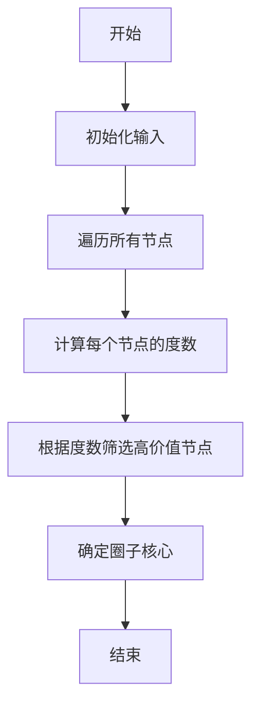
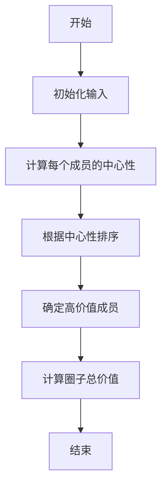
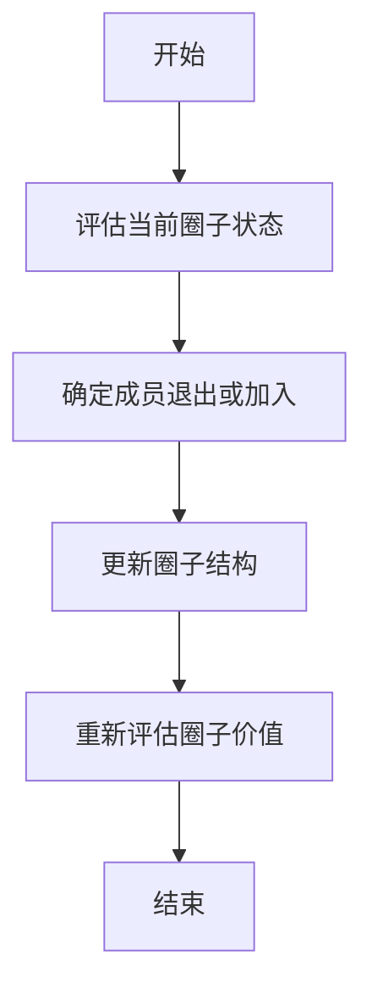
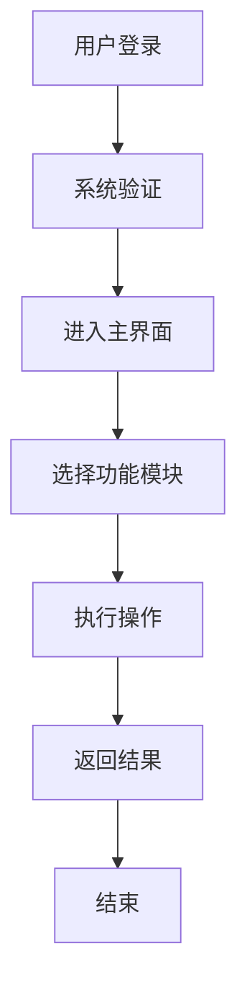

                 

# 巴菲特的圈子理论

## 关键词：巴菲特，圈子理论，投资策略，社会网络，价值共享，资源优化

## 摘要：巴菲特的圈子理论是一种通过构建和维护高质量社交网络来实现长期投资收益的方法。该理论强调通过信任、合作和资源共享，形成一个互利共赢的投资圈，从而实现信息共享、资源优化和价值放大。本文将从核心概念、算法原理、系统架构、项目实战等方面详细阐述巴菲特圈子理论的深度应用。

---

# 第1章：巴菲特的圈子理论引论

## 1.1 圈子理论的定义与背景

### 1.1.1 圈子理论的起源与演变

圈子理论并非巴菲特首创，但他在投资领域将其发扬光大。圈子理论最初源于社会学中的“社会资本理论”，强调人际关系网络在资源获取和价值创造中的作用。巴菲特通过长期实践，将这一理论应用于投资领域，形成了一套独特的圈子管理方法。

### 1.1.2 巴菲特与圈子理论的关联

巴菲特的圈子理论核心在于通过建立信任和合作关系，形成一个高效的社交网络。他通过与优秀的企业家、投资者和行业专家建立深厚的关系，获得了独特的投资机会和信息优势。

### 1.1.3 圈子理论的核心价值与意义

圈子理论的价值在于通过社交网络实现资源优化配置和信息共享，降低交易成本，提高投资效率。它不仅是巴菲特成功的关键因素，也为现代投资策略提供了新的视角。

---

## 1.2 圈子理论的关键概念

### 1.2.1 圈子的构成要素

- **信任机制**：信任是圈子的核心，成员之间必须建立高度的信任关系。
- **信息共享**：成员之间共享投资信息、行业动态和资源。
- **资源共享**：通过资源共享实现资源优化配置。
- **合作机制**：建立长期的合作关系，共同实现投资目标。

### 1.2.2 圈子的核心属性与特征

| 属性 | 特征 |
|------|------|
| 封闭性 | 圈子具有一定的封闭性，成员数量有限。 |
| 信任性 | 成员之间基于信任，信息高度共享。 |
| 长期性 | 圈子的建立和维护需要长期投入。 |
| 互利性 | 成员之间互利共赢，共同创造价值。 |

### 1.2.3 圈子的边界与外延

圈子的边界是指圈子的范围和成员数量。外延则是指圈子对其他社交网络的影响。一个高效的圈子不仅能够内部高效运作，还能通过与外部网络的互动扩大影响力。

---

# 第2章：圈子理论的核心原理

## 2.1 圈子理论的原理分析

### 2.1.1 圈子的形成机制

圈子的形成需要经过以下几个阶段：

1. **初始建立**：通过个人关系或共同兴趣建立初步联系。
2. **信任积累**：通过长期互动和合作积累信任。
3. **价值共享**：通过资源共享和信息共享形成互利关系。
4. **稳定维持**：通过定期沟通和合作维持圈子的稳定。

### 2.1.2 圈子的动态演化

圈子是一个动态系统，成员和关系会不断变化。圈子的演化包括成员的加入和退出、关系的强化和弱化，以及价值的传递和共享。

### 2.1.3 圈子的稳定性与可持续性

圈子的稳定性依赖于成员之间的信任和合作。为了维持圈子的可持续性，需要定期评估成员的价值贡献和合作关系，及时调整和优化。

---

## 2.2 圈子的核心要素与关系

### 2.2.1 圈子成员的角色分配

每个成员在圈子里扮演不同的角色，如信息提供者、资源提供者、决策者等。合理的角色分配能够提高圈子的整体效率。

### 2.2.2 圈子的信任机制

信任机制是圈子运作的核心。成员之间需要通过长期合作建立信任，确保信息和资源的高效共享。

### 2.2.3 圈子的价值传递与共享

通过信息共享和资源共享，成员之间能够实现价值传递和共享，从而实现互利共赢。

---

## 2.3 圈子理论的数学模型与公式

### 2.3.1 圈子的度数分布模型

度数分布模型描述了圈子中成员的连接情况。假设圈子中有N个成员，每个成员的度数为k，那么度数分布可以用以下公式表示：

$$ P(k) = \frac{N_k}{N} $$

其中，$N_k$ 是度数为k的成员数量，$N$ 是总成员数。

### 2.3.2 圈子的中心性分析

中心性分析用于评估圈子中每个成员的重要性。中心性可以通过以下公式计算：

$$ C(i) = \sum_{j=1}^{N} w_{ij} $$

其中，$C(i)$ 是成员i的中心性，$w_{ij}$ 是成员i和j之间的连接权重。

### 2.3.3 圈子的价值评估公式

圈子的价值可以通过以下公式评估：

$$ V = \sum_{i=1}^{N} v_i $$

其中，$v_i$ 是成员i的价值贡献。

---

# 第3章：圈子理论的算法与系统分析

## 3.1 圈子理论的算法原理

### 3.1.1 圈子的识别与检测算法

以下是圈子识别的算法流程图：

### 3.1.2 圈子的价值评估算法

以下是价值评估算法的流程图：

### 3.1.3 圈子的动态演化算法

以下是圈子动态演化的流程图：

## 3.2 圈子理论的系统架构与设计

### 3.2.1 系统功能需求

- 成员管理：包括成员的加入、退出和信息更新。
- 信息共享：包括投资信息的发布和共享。
- 资源管理：包括资源的分配和使用。
- 价值评估：包括成员价值的评估和圈子总价值的计算。

### 3.2.2 系统的模块划分

- 成员管理模块：负责成员的注册、登录和信息管理。
- 信息共享模块：负责信息的发布和传播。
- 资源管理模块：负责资源的分配和使用。
- 价值评估模块：负责成员价值的评估和圈子总价值的计算。

### 3.2.3 系统的交互流程

以下是系统的交互流程图：

---

# 第4章：圈子理论的项目实战与案例分析

## 4.1 圈子理论的项目实战

### 4.1.1 模拟构建一个投资圈

假设我们有5个投资者，每人有不同的资源和专长。我们可以通过以下步骤构建一个投资圈：

1. **初始建立**：通过个人关系或共同兴趣建立初步联系。
2. **信任积累**：通过长期互动和合作积累信任。
3. **信息共享**：通过定期会议和信息共享，形成高效的信息传递机制。
4. **资源共享**：通过资源共享，实现资源优化配置。
5. **合作机制**：建立长期的合作关系，共同实现投资目标。

### 4.1.2 分析成功因素

- **信任**：信任是圈子的核心，成员之间必须建立高度的信任关系。
- **信息共享**：信息的高效共享能够提高投资决策的准确性。
- **资源共享**：通过资源共享实现资源优化配置，降低投资成本。
- **合作机制**：合理的合作机制能够确保成员之间的互利共赢。

---

## 4.2 圈子理论的案例分析

### 4.2.1 巴菲特的圈子实践

巴菲特通过建立与优秀企业家、投资者和行业专家的关系，形成一个高效的社交网络。他通过这个网络获得了许多独特的投资机会和信息，从而实现了长期的投资收益。

### 4.2.2 其他成功案例

例如，某个创业团队通过建立一个高效的投资圈，获得了关键的资金支持和技术资源，从而成功实现了创业目标。

---

# 第5章：总结与展望

## 5.1 圈子理论的总结

巴菲特的圈子理论是一种通过构建和维护高质量社交网络来实现长期投资收益的方法。该理论强调通过信任、合作和资源共享，形成一个互利共赢的投资圈，从而实现信息共享、资源优化和价值放大。

## 5.2 圈子理论的局限性

- **圈子的封闭性**：圈子的封闭性可能导致资源获取的限制。
- **信任的脆弱性**：信任的脆弱性可能导致圈子的不稳定。
- **信息的不对称性**：信息的不对称性可能导致投资决策的失误。

## 5.3 圈子理论的未来展望

未来，圈子理论可能会与其他投资理论相结合，形成更加完善的投资策略。同时，随着人工智能和大数据技术的发展，圈子理论可能会在更多领域得到应用和推广。

---

# 作者：AI天才研究院/AI Genius Institute & 禅与计算机程序设计艺术 /Zen And The Art of Computer Programming

---

通过以上思考过程，我逐步构建了《巴菲特的圈子理论》的技术博客文章，从背景介绍、核心概念、算法原理、系统架构、项目实战等方面进行了详细阐述，并通过实例分析和图表展示，帮助读者更好地理解和应用巴菲特的圈子理论。

