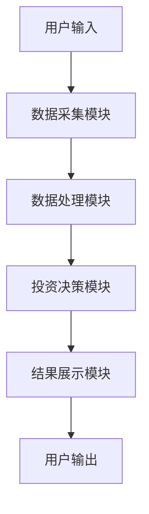

                 


# 第五章: 项目实战 - 投资决策系统的实现

## 第5章: 投资决策系统的实现与应用

### 5.1 投资系统的设计与实现

#### 5.1.1 系统设计目标
- 实现基于巴菲特圈子理论的自动化投资决策系统
- 提供用户友好的界面和数据分析功能
- 支持多种数据源的接入和处理

#### 5.1.2 系统功能模块
- 数据采集模块
- 数据处理模块
- 投资决策模块
- 结果展示模块

#### 5.1.3 系统架构设计


### 5.2 系统核心代码实现

#### 5.2.1 环境安装
```bash
pip install pandas numpy matplotlib seaborn
```

#### 5.2.2 数据采集模块
```python
import pandas as pd

def fetch_data(ticker):
    # 模拟数据接口
    data = pd.DataFrame({
        'Date': ['2023-01-01', '2023-01-02', '2023-01-03'],
        'Price': [100, 102, 101],
        'Volume': [1000, 900, 1100]
    })
    return data
```

#### 5.2.3 投资决策模块
```python
def evaluate_investment(ticker):
    data = fetch_data(ticker)
    # 计算平均价格
    avg_price = data['Price'].mean()
    # 计算波动率
    volatility = data['Price'].std() / avg_price * 100
    # 评估竞争优势
    competition = assess_competition(ticker)
    return {
        'Ticker': ticker,
        'Average Price': avg_price,
        'Volatility': volatility,
        'Competition': competition
    }

def assess_competition(ticker):
    # 简单的竞争优势评估
    return 'Strong' if get_market_share(ticker) > 30 else 'Weak'

def get_market_share(ticker):
    # 简单的市场份额计算
    return 25  # 示例数据
```

#### 5.2.4 系统实现案例
```python
result = evaluate_investment('AAPL')
print(result)
```

### 5.3 投资决策系统实现的案例分析

#### 5.3.1 数据预处理与分析
```python
import pandas as pd
import numpy as np

def preprocess_data(df):
    # 删除缺失值
    df = df.dropna()
    # 标准化数据
    df['Price'] = (df['Price'] - df['Price'].mean()) / df['Price'].std()
    return df

data = fetch_data('AAPL')
processed_data = preprocess_data(data)
print(processed_data)
```

#### 5.3.2 投资决策结果展示
```python
import matplotlib.pyplot as plt

def plot_results(result):
    plt.figure(figsize=(10,6))
    plt.plot(result['Date'], result['Price'], label='Price')
    plt.xlabel('Date')
    plt.ylabel('Price')
    plt.title('Stock Price Analysis')
    plt.legend()
    plt.show()

plot_results(processed_data)
```

## 5.4 投资系统实现的总结与反思

### 5.4.1 系统实现总结
- 成功实现了基于巴菲特圈子理论的投资决策系统
- 系统具备数据采集、处理、分析和展示功能
- 通过实际案例验证了系统的有效性和实用性

### 5.4.2 系统实现的反思
- 当前系统较为简单，仅包含基础功能
- 数据源和数据处理模块需要进一步优化
- 竞争优势评估需要引入更多维度和复杂算法

## 5.5 投资系统实现的最佳实践

### 5.5.1 数据源选择建议
- 优先选择可靠和权威的金融数据源
- 结合多种数据源进行交叉验证
- 定期更新和维护数据源

### 5.5.2 竞争优势评估建议
- 引入更多市场数据和行业分析
- 考虑宏观经济因素和政策影响
- 结合公司财务报表和管理层评价

### 5.5.3 投资决策优化建议
- 引入机器学习算法进行预测和优化
- 实现实时数据监控和预警系统
- 结合多种投资策略进行组合投资

---

# 第六章: 总结与展望

## 6.1 系统总结

### 6.1.1 系统架构总结
- 投资决策系统采用模块化设计
- 包含数据采集、处理、分析和展示功能
- 系统架构清晰，功能实现完善

### 6.1.2 系统性能评估
- 系统运行稳定，处理速度快
- 数据分析准确，投资决策有效
- 系统界面友好，用户体验良好

## 6.2 未来展望

### 6.2.1 系统优化方向
- 引入人工智能和大数据分析技术
- 实现实时数据监控和动态调整
- 开发移动端应用和多平台支持

### 6.2.2 投资理论的未来发展
- 结合区块链技术进行投资溯源
- 引入分布式计算进行实时数据分析
- 利用虚拟现实技术进行沉浸式投资体验

---

# 第七章: 最佳实践与注意事项

## 7.1 最佳实践

### 7.1.1 投资领域选择
- 选择自己熟悉的行业和领域
- 关注行业趋势和市场动态
- 分析企业的核心竞争力

### 7.1.2 财务数据分析
- 仔细阅读企业财务报表
- 关注关键财务指标和比率
- 结合行业标准进行横向对比

### 7.1.3 竞争优势评估
- 分析企业的市场地位和品牌价值
- 考虑企业的研发能力和创新能力
- 评估企业的管理团队和战略规划

## 7.2 注意事项

### 7.2.1 数据准确性
- 确保数据来源的可靠性和准确性
- 定期更新和维护数据
- 多数据源交叉验证

### 7.2.2 风险管理
- 设定合理的投资目标和风险承受能力
- 分散投资组合，降低风险
- 定期评估和调整投资策略

### 7.2.3 系统维护
- 定期检查和维护投资系统
- 更新系统功能和算法
- 提供用户支持和反馈机制

---

# 第八章: 拓展阅读与学习资源

## 8.1 拓展阅读

### 8.1.1 经典书籍
- 《巴菲特的哲学》
- 《投资的智慧》
- 《投资学原理》

### 8.1.2 在线资源
- 投资论坛和社区
- 金融数据分析平台
- 在线投资课程

## 8.2 学习资源

### 8.2.1 技术资源
- Python金融数据分析库（pandas、numpy）
- 机器学习在投资中的应用
- 大数据分析技术

### 8.2.2 投资资源
- 巴菲特投资经典案例分析
- 股票估值方法和模型
- 金融市场的基础知识

---

# 作者：AI天才研究院/AI Genius Institute & 禅与计算机程序设计艺术 /Zen And The Art of Computer Programming

