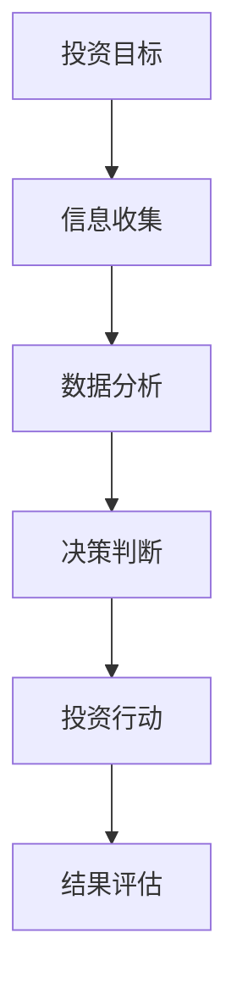
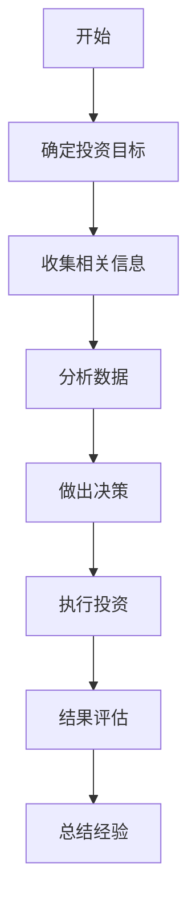

                 

# 巴菲特的圈子理论：投资你懂的领域

## 关键词：
- 巴菲特、投资理论、能力圈、价值投资、长期投资

## 摘要：
本文深入探讨了巴菲特的“圈子理论”，即“投资你懂的领域”。文章首先介绍了巴菲特的生平和投资理念，详细阐述了“能力圈”的定义、边界和扩展。接着，从系统分析的角度，构建了投资决策的系统架构，并通过数学模型量化分析投资机会。在项目实战部分，选择具体行业进行案例分析，展示了如何应用巴菲特的圈子理论进行投资决策。最后，总结了构建能力圈的最佳实践，包括风险管理、长期投资心态和持续学习的重要性，为读者提供了全面的指导和启发。

---

# 第一部分：巴菲特的圈子理论概述

## 第1章：巴菲特的生平与投资理念

### 1.1 巴菲特的生平简介

沃伦·巴菲特（Warren Buffett）是世界上最著名的投资者之一，被誉为“股神”。他于1934年8月30日出生在美国奥马哈市。巴菲特的早年生活并不富裕，但他从小就展现出对数字和投资的天赋。他在高中时就阅读了本杰明·格雷厄姆的《证券分析》，并开始研究股票市场。

巴菲特的职业生涯始于1950年代，他通过合伙公司（Ben Graham's合伙企业）积累了丰富的投资经验。1965年，他收购了伯克希尔哈撒韦公司（Berkshire Hathaway），并将其转变为一个多元化的投资集团。巴菲特以他的投资理念和慈善事业闻名，他倡导通过“Giving Pledge”承诺将大部分财富捐给慈善事业。

### 1.2 巴菲特的投资理念

巴菲特的投资理念以价值投资为核心，强调寻找被市场低估的优秀企业进行长期投资。他的投资哲学可以概括为以下几个方面：

1. **价值投资**：寻找那些具有持续竞争优势、良好管理团队和合理估值的企业。
2. **长期投资**：避免频繁交易，长期持有优质股票，通过复利效应实现财富增长。
3. **安全边际**：在投资时留有安全边际，即以低于内在价值的价格买入股票，以降低风险。

---

## 第2章：巴菲特的圈子理论核心概念

### 2.1 圈子理论的定义与背景

巴菲特的“圈子理论”（Circle Theory）是其投资哲学的重要组成部分。他强调投资者应专注于自己熟悉的企业和行业，即“投资你懂的领域”。这一理论的核心在于，投资者只有在自己熟悉的能力范围内进行投资，才能更好地评估企业的价值和潜在风险。

### 2.2 巴菲特的“能力圈”概念

巴菲特的能力圈理论包括以下几个核心要素：

1. **能力圈的定义**：能力圈是指投资者在知识、经验和资源等方面能够准确评估企业价值的范围。
2. **能力圈的边界**：能力圈的边界由投资者的行业知识、财务分析能力和市场理解力决定。
3. **能力圈的扩展**：通过不断学习和实践，逐步扩大能力圈的范围，但必须确保在每个阶段都保持对投资标的深刻理解。

---

## 第3章：巴菲特圈子理论的哲学基础

### 3.1 巴菲特的投资哲学

巴菲特的投资哲学强调以下几点：

1. **投资的目的是创造长期财富**：通过选择优质企业，实现财富的长期增长。
2. **风险与收益的平衡**：在投资中，收益与风险是相伴而行的，必须在两者之间找到平衡点。
3. **心理因素的重要性**：投资者的心理状态（如贪婪和恐惧）会影响投资决策，必须加以控制。

### 3.2 巴菲特的价值观

巴菲特的价值观贯穿于他的投资决策中：

1. **长期投资的重要性**：避免短期波动，关注企业的长期价值。
2. **持续学习的价值**：通过不断学习和实践，提升自己的能力圈。
3. **社会责任的价值**：通过慈善事业回馈社会，实现个人与社会的双赢。

---

## 第4章：巴菲特圈子理论的实践应用

### 4.1 巴菲特的选股标准

巴菲特的选股标准可以归纳为以下几个方面：

1. **企业基本面**：包括企业的盈利能力、财务状况和市场地位。
2. **竞争优势**：企业是否具有独特的竞争优势，如成本优势、品牌优势等。
3. **管理团队**：企业的管理层是否具备诚信和能力。
4. **估值水平**：企业的股票价格是否低于其内在价值。

### 4.2 巴菲特的长期投资策略

巴菲特的长期投资策略包括以下几个步骤：

1. **确定投资目标**：明确投资的长期目标和风险承受能力。
2. **构建投资组合**：选择具有长期竞争优势的企业，构建多元化投资组合。
3. **持续监控与调整**：定期评估投资组合的表现，根据市场变化进行适当调整。

---

## 第5章：巴菲特圈子理论的系统分析

### 5.1 投资决策的系统架构

投资决策的系统架构可以分为以下几个模块：

1. **信息收集**：收集企业的财务数据、行业分析和市场动态。
2. **数据分析**：对收集到的数据进行分析，评估企业的内在价值。
3. **决策判断**：根据分析结果，判断是否符合投资标准。
4. **投资行动**：执行投资决策，购买或卖出股票。
5. **结果评估**：评估投资结果，总结经验教训。

### 5.2 投资决策的系统架构图

### 5.3 投资决策的流程图

---

## 第6章：项目实战

### 6.1 投资分析案例

假设我们选择一家零售企业进行投资分析，以下是具体步骤：

1. **行业分析**：了解零售行业的市场现状、竞争格局和未来趋势。
2. **企业基本面分析**：评估企业的盈利能力、财务状况和管理团队。
3. **竞争优势分析**：判断企业是否具有独特的竞争优势。
4. **估值分析**：计算企业的内在价值，确定其股票是否低估。

### 6.2 投资评分系统

为了量化分析投资机会，我们可以构建一个投资评分系统，如下所示：

$$
\text{投资评分} = w_1 \times \text{基本面评分} + w_2 \times \text{竞争优势评分} + w_3 \times \text{估值评分}
$$

其中，$w_1$、$w_2$、$w_3$分别是基本面评分、竞争优势评分和估值评分的权重，通常设定为0.4、0.3和0.3。

---

## 第7章：最佳实践与总结

### 7.1 构建和扩展能力圈

1. **不断学习**：通过阅读书籍、参加培训和交流，提升自己的知识和技能。
2. **专注于熟悉的领域**：选择自己熟悉的企业和行业进行投资，避免盲目扩张。
3. **持续实践**：通过不断的实践，积累经验，逐步扩大能力圈。

### 7.2 风险管理

1. **分散投资**：通过多元化投资，降低单一投资的风险。
2. **设定止损点**：在投资决策中设定止损点，避免重大损失。
3. **保持耐心**：长期投资需要耐心，避免因短期波动而做出错误决策。

### 7.3 长期投资心态

1. **避免贪婪和恐惧**：在投资中保持理性和冷静，避免被市场情绪左右。
2. **坚持长期视角**：关注企业的长期价值，而非短期收益。
3. **持续学习和反思**：通过不断学习和反思，提升自己的投资能力。

---

## 结论

巴菲特的圈子理论强调“投资你懂的领域”，这不仅是一种投资策略，更是一种生活哲学。通过专注于自己熟悉的能力圈，投资者可以更好地评估企业的价值，降低投资风险，并实现长期的财富增长。希望本文能够为读者在投资道路上提供一些启发和指导。

---

## 作者

作者：AI天才研究院/AI Genius Institute & 禅与计算机程序设计艺术 /Zen And The Art of Computer Programming

