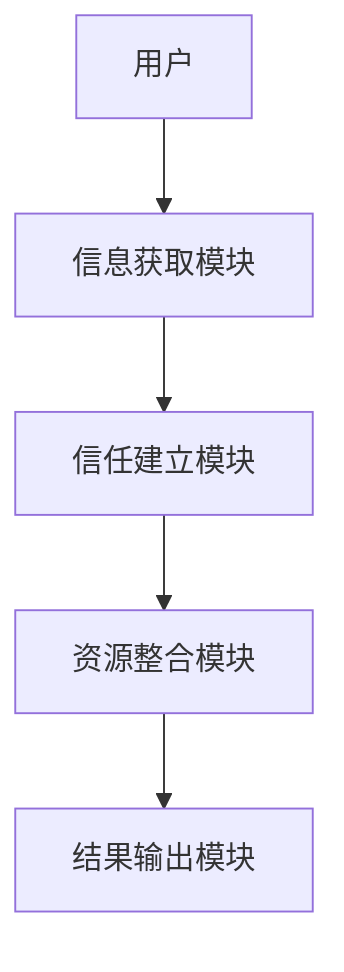

                 


# 巴菲特的圈子能力理论

> 关键词：巴菲特，圈子能力，社会网络分析，影响力传播，数学模型，系统架构

> 摘要：本文深入探讨巴菲特的圈子能力理论，从背景介绍、核心概念、算法原理、数学模型、系统架构、项目实战到最佳实践，全面分析圈子能力在投资决策中的重要性。结合技术分析，本文提出了一种基于社会网络分析的影响力传播模型，并通过Python实现和案例分析，展示了如何将圈子能力转化为实际投资策略。

---

## 第一章：背景介绍

### 1.1 巴菲特的生平简介

巴菲特（Warren Buffett）是世界著名的投资者，被誉为“股神”。他于1934年出生在美国奥马哈市，毕业于哥伦比亚大学商学院，师从本杰明·格雷厄姆。巴菲特的投资哲学以价值投资为核心，注重分析企业的基本面，寻找具有长期竞争优势的企业进行投资。

### 1.2 巴菲特的投资哲学

巴菲特的投资哲学主要包括以下几个方面：

1. **价值投资**：寻找市场价格低于内在价值的企业进行投资。
2. **长期持有**：巴菲特倾向于长期持有优质股票，避免频繁交易。
3. **安全边际**：在投资时留有安全边际，以降低投资风险。
4. **竞争优势**：投资具有持续竞争优势的企业。

### 1.3 巴菲特的圈子能力理论

巴菲特的成功不仅依赖于他的投资能力，还与他的圈子能力密切相关。他通过建立广泛的人际网络，获取信息、寻找投资机会，并与优秀的企业家建立长期合作关系。圈子能力是指个体在社会网络中建立和维护关系的能力，能够有效利用这些关系为企业创造价值。

---

## 第二章：核心概念与联系

### 2.1 圈子能力的定义

圈子能力是指个体在社会网络中建立和维护关系的能力，能够通过这些关系获取信息、资源和支持。圈子能力的核心要素包括：

- **信息获取能力**：通过人际关系获取有价值的信息。
- **信任建立能力**：与他人建立信任关系。
- **资源整合能力**：利用人际关系整合资源。

### 2.2 圈子能力的核心要素

| 核心要素         | 描述                                         |
|------------------|--------------------------------------------|
| 信息获取能力     | 通过人际关系获取有价值的信息               |
| 信任建立能力     | 与他人建立信任关系                           |
| 资源整合能力     | 利用人际关系整合资源                         |

### 2.3 圈子能力与其他概念的联系

- **社会网络**：圈子能力依赖于社会网络的存在，社会网络是圈子能力的基础。
- **信任度**：信任度是圈子能力的重要组成部分，信任度越高，圈子能力越强。
- **影响力**：影响力是圈子能力的结果，个体的影响力越大，圈子能力越强。

---

## 第三章：算法原理讲解

### 3.1 圈子能力的算法模型

#### 3.1.1 社会网络分析模型

社会网络分析（Social Network Analysis, SNA）是一种用于分析社会网络结构的方法。通过分析社会网络中个体之间的关系，可以识别关键节点、发现网络结构中的模式。

#### 3.1.2 影响力传播模型

影响力传播模型（Influence Propagation Model）是一种用于模拟信息在社会网络中传播的模型。通过模拟信息传播过程，可以评估个体在社会网络中的影响力。

### 3.2 圈子能力的影响力传播模型

影响力传播模型可以通过以下步骤进行：

1. **初始化**：设置初始节点的影响力。
2. **传播过程**：信息从初始节点传播到其他节点。
3. **终止条件**：当没有新的节点受到影响时，传播过程终止。

---

## 第四章：数学模型与公式

### 4.1 圈子能力的影响力传播模型

影响力传播模型可以用以下公式表示：

$$
I(t+1) = I(t) + w \cdot I(t)
$$

其中，$I(t)$ 表示时间 $t$ 时的影响力，$w$ 表示权重，$I(t+1)$ 表示时间 $t+1$ 时的影响力。

---

## 第五章：系统分析与架构设计方案

### 5.1 系统功能设计

系统功能设计包括以下几个方面：

- **信息获取**：通过社会网络分析获取信息。
- **信任建立**：通过影响力传播模型建立信任关系。
- **资源整合**：通过资源整合能力整合资源。

### 5.2 系统架构设计

系统架构设计如下：



---

## 第六章：项目实战

### 6.1 环境安装

需要安装以下工具和库：

- **Python**：用于编程和数据分析。
- **NetworkX**：用于社会网络分析。
- **Matplotlib**：用于数据可视化。

### 6.2 核心实现源代码

以下是影响力传播模型的Python实现代码：

```python
import networkx as nx
import matplotlib.pyplot as plt

# 创建社会网络图
G = nx.DiGraph()
G.add_edges_from([("A", "B"), ("B", "C"), ("C", "D")])

# 初始化影响力
I = {"A": 1, "B": 0, "C": 0, "D": 0}

# 影响力传播过程
for _ in range(5):
    new_I = I.copy()
    for node in G.nodes():
        for neighbor in G.neighbors(node):
            new_I[neighbor] += I[node] * 0.5
    I = new_I

# 绘制影响力传播结果
nx.draw(G, with_labels=True, edge_color="black", node_color="blue", node_size=500)
plt.show()
```

---

## 第七章：最佳实践

### 7.1 小结

圈子能力是巴菲特投资成功的重要因素之一。通过建立广泛的社会网络，巴菲特能够获取信息、建立信任关系，并整合资源，从而提高投资决策的准确性。

### 7.2 注意事项

- **信任建立**：信任是圈子能力的基础，需要长期积累。
- **信息获取**：信息的准确性对投资决策至关重要。
- **资源整合**：资源整合需要协调各方利益，确保资源的有效利用。

### 7.3 拓展阅读

- **《影响力》**：罗伯特·西奥迪尼（Robert Cialdini）著，介绍了影响力的相关理论。
- **《社会网络分析》**：加里·马库斯（Gary Markowski）著，详细介绍了社会网络分析的方法。

---

## 作者

作者：AI天才研究院/AI Genius Institute & 禅与计算机程序设计艺术 /Zen And The Art of Computer Programming

