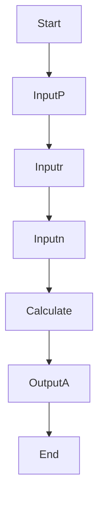
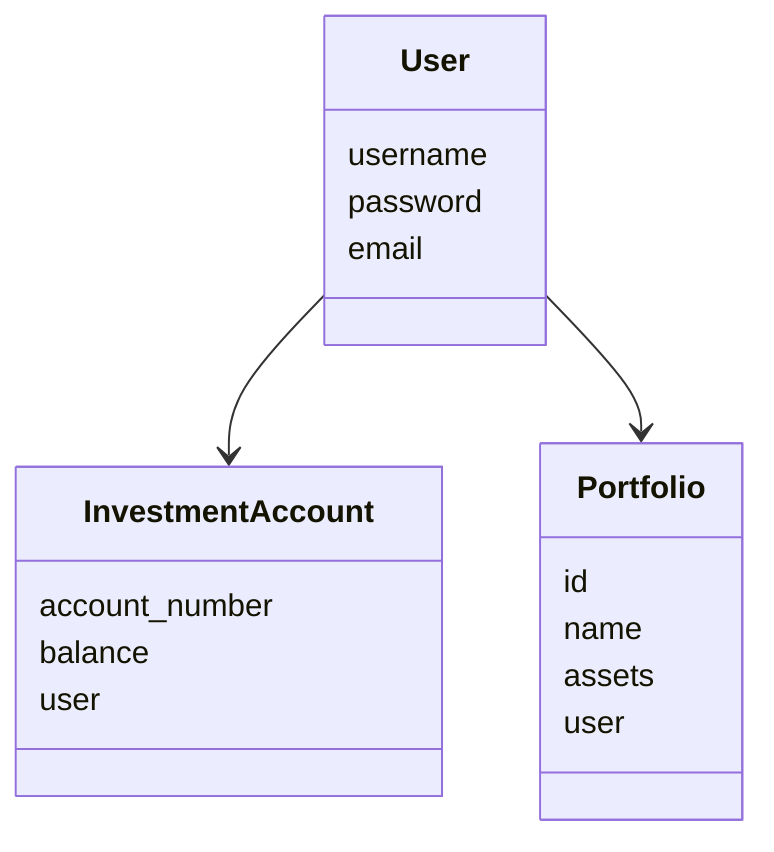
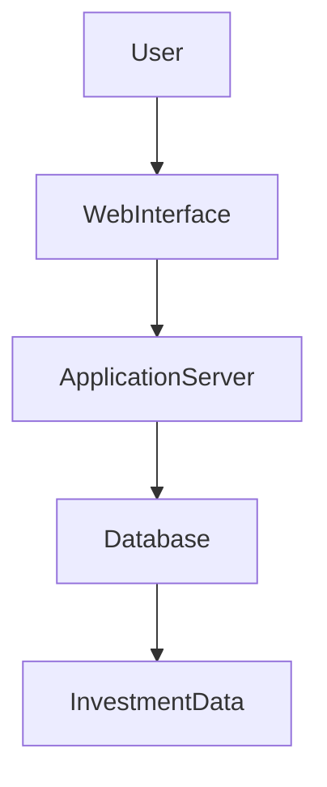
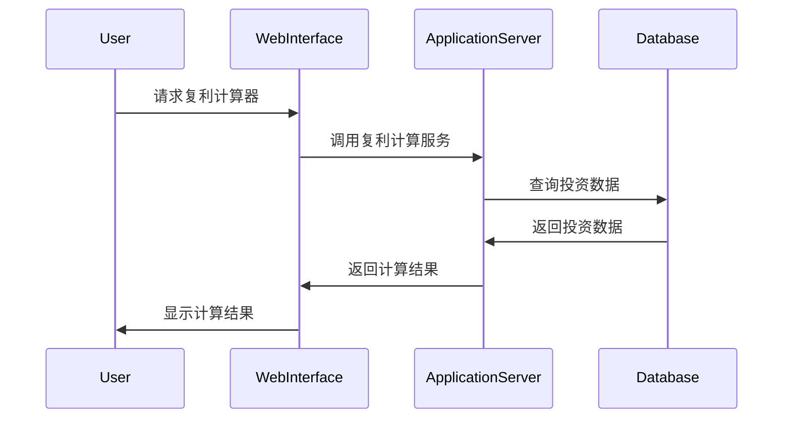

                 


# 巴菲特的复利效应投资观

> 关键词：巴菲特，复利效应，投资哲学，价值投资，长期投资，数学模型

> 摘要：本文将探讨巴菲特的复利效应投资观，结合技术背景和投资理念，分析复利效应的数学模型、算法原理、系统设计和实际应用。通过详细讲解，帮助读者理解复利效应在投资中的重要性，并通过Python代码和实际案例，展示如何在投资中应用复利效应。

---

# 第一部分：背景介绍

## 第1章：巴菲特的生平与投资理念

### 1.1 巴菲特的生平简介

沃伦·巴菲特（Warren Buffett）是世界著名投资家、慈善家和商界领袖，被誉为“股神”。他于1934年8月30日出生在美国奥马哈市，毕业于哥伦比亚大学，师从本杰明·格雷厄姆（Benjamin Graham），格雷厄姆的“价值投资”理论对巴菲特的投资理念影响深远。

巴菲特的早年经历充满了对投资的热爱和天赋。他在15岁时开始购买股票，16岁时通过撰写股票分析报告赚取了第一桶金。他的投资理念逐渐成熟，强调长期投资、价值投资和安全边际。巴菲特通过自己的投资实践，证明了价值投资的可行性，并积累了巨额财富。

### 1.2 巴菲特的投资理念

巴菲特的投资理念以“价值投资”为核心，强调购买被市场低估的优质企业股票，并长期持有。他相信市场短期波动不可预测，但长期趋势可以通过对企业基本面的分析来把握。以下是巴菲特投资理念的核心要素：

1. **长期投资**：巴菲prefers长期持有优质股票，避免频繁交易，以复利效应最大化投资收益。
2. **价值投资**：寻找具有持续竞争优势和良好管理的企业，以低于其内在价值的价格买入。
3. **安全边际**：在投资时留有安全边际，即以低于内在价值的价格买入，以降低投资风险。
4. **分散投资**：虽然巴菲特以集中投资著称，但他也强调通过投资不同行业的优质企业来分散风险。

巴菲特的哲学是“不做空头，只做多头”，他认为市场短期波动会带来机会，但长期趋势将由优质企业的成长驱动。

---

## 第2章：复利效应的定义与重要性

### 2.1 复利效应的基本概念

复利效应是一种指数增长现象，指的是资金在投资过程中，本金和已获得的利息（或收益）再次投资，从而产生更多的收益。复利效应的核心在于“利滚利”，即每期的收益再投资，从而加速资金的增长。

### 2.2 复利效应的核心要素

1. **初始本金（Principal, P）**：初始投资的本金，是复利计算的基础。
2. **投资收益率（Rate of Return, r）**：投资的年化收益率，通常以小数表示（例如，10%的收益率表示为0.1）。
3. **投资时间跨度（Number of Periods, n）**：投资的年数或月数，时间跨度越长，复利效应越显著。

### 2.3 复利效应的数学模型

复利计算的数学公式是理解复利效应的关键。以下是常见的复利计算公式：

#### 复利计算公式
$$ A = P \times (1 + r)^n $$

其中：
- \( A \) 表示最终金额
- \( P \) 表示初始本金
- \( r \) 表示年化收益率
- \( n \) 表示投资年数

#### 年金计算公式
$$ A = P \times \frac{(1 + r)^n - 1}{r} $$

该公式用于计算等额年金的终值，适用于定期定额投资的情况。

### 2.4 复利效应的对比分析

为了更好地理解复利效应，我们可以将其与简单利息进行对比：

#### 复利与单利的对比表格

| 指标 | 复利 | 单利 |
|------|------|------|
| 计算方式 | 每期利息加入本金 | 只计算本金产生的利息 |
| 适用场景 | 长期投资 | 短期借款 |

通过对比可以发现，复利效应在长期投资中具有显著的优势，尤其是在高收益率和长投资时间的情况下，复利效应能够带来指数级增长。

#### 复利效应的ER实体关系图

复利效应的实体关系图展示了复利计算的核心要素及其关系：


---

## 第3章：复利效应的算法原理

### 3.1 复利计算的流程图

以下是复利计算的流程图，展示了复利计算的步骤：



### 3.2 复利计算的Python代码实现

以下是一个简单的复利计算代码示例：

```python
def compound_interest(P, r, n):
    A = P * (1 + r) ** n
    return A

# 示例计算
P = 10000  # 初始本金
r = 0.1    # 年化收益率为10%
n = 10     # 投资年数

result = compound_interest(P, r, n)
print(f"最终金额为：${result:.2f}")
```

### 3.3 投资收益率对复利的影响

投资收益率是复利计算中的关键因素。较高的收益率将加速资金的增长。例如，以10%的年化收益率投资10年，初始本金10000美元的最终金额为：

$$ A = 10000 \times (1 + 0.1)^{10} = 25937.42 \text{美元} $$

---

## 第4章：复利效应的系统设计

### 4.1 投资系统场景介绍

假设我们正在设计一个投资管理系统，目标是通过复利效应帮助投资者实现财富增长。该系统需要实现以下功能：

1. 用户注册与登录
2. 资产配置建议
3. 复利计算器
4. 投资组合跟踪

### 4.2 系统功能设计

#### 领域模型类图



#### 系统架构设计



#### 系统交互设计



---

## 第5章：复利效应的项目实战

### 5.1 环境安装

为了运行复利计算器代码，需要安装以下工具：

1. Python 3.x
2. pip（用于安装必要的库）

安装步骤如下：

```bash
python --version
pip install numpy
pip install matplotlib
```

### 5.2 复利计算器代码实现

以下是复利计算器的完整代码示例：

```python
import matplotlib.pyplot as plt
import numpy as np

def compound_interest(P, r, n):
    A = P * (1 + r) ** n
    return A

# 示例计算
P = 10000  # 初始本金
r = 0.1    # 年化收益率为10%
n = np.arange(1, 11)  # 投资年数为1到10年

# 计算每年的复利金额
A = [compound_interest(P, r, year) for year in n]

# 绘制复利增长曲线
plt.figure(figsize=(10, 6))
plt.plot(n, A)
plt.title('复利增长曲线')
plt.xlabel('年数')
plt.ylabel('金额（美元）')
plt.grid(True)
plt.show()
```

### 5.3 投资组合优化分析

假设我们有一个投资组合，初始本金为10000美元，年化收益率为10%，投资时间为10年。通过复利计算，最终金额为25937.42美元。以下是投资组合的优化分析：

1. **分散投资**：通过投资不同行业的优质企业，分散投资风险。
2. **定期定额投资**：通过定期定额投资，平滑市场波动，利用复利效应实现长期增长。
3. **长期持有**：避免频繁交易，减少交易成本和税收，最大化复利效应。

---

## 第6章：复利效应的最佳实践

### 6.1 投资注意事项

1. **选择优质企业**：投资具有持续竞争优势和良好管理的公司。
2. **避免过度杠杆**：高杠杆会增加投资风险，影响复利效应的实现。
3. **长期持有**：复利效应在长期投资中表现最为显著。
4. **定期调整投资组合**：根据市场变化和个人财务状况，定期调整投资组合。

### 6.2 投资小结

通过本文的分析，我们可以得出以下结论：

1. 复利效应是实现财富增长的重要工具。
2. 巴菲特的价值投资理念与复利效应相辅相成。
3. 通过长期投资和分散投资，可以最大化复利效应的效果。

### 6.3 扩展阅读

1. 《富爸爸穷爸爸》（Rich Dad Poor Dad）—— 罗伯特·清崎
2. 《证券分析》（Security Analysis）—— 本杰明·格雷厄姆
3. 《巴菲特致股东的信》（Letters to Shareholders）—— 沃伦·巴菲特

---

# 结语

通过本文的详细分析，我们了解了巴菲特的复利效应投资观，并结合技术背景和投资理念，探讨了复利效应的数学模型、算法原理、系统设计和实际应用。希望读者能够通过本文，更好地理解复利效应在投资中的重要性，并能够在实际投资中应用这些知识。

---

**作者：AI天才研究院/AI Genius Institute & 禅与计算机程序设计艺术/Zen And The Art of Computer Programming**

