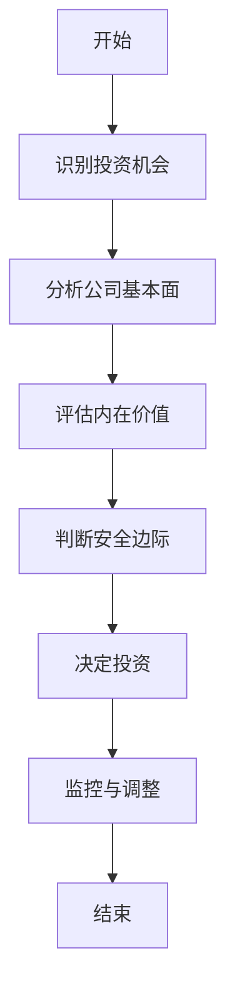
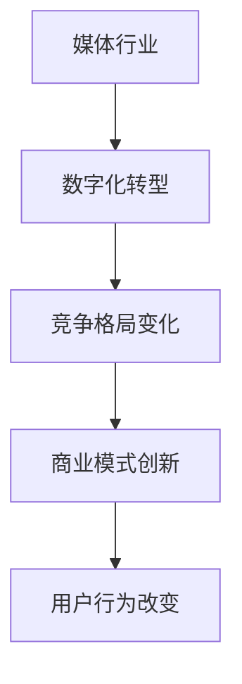

                 

# 巴菲特的媒体投资案例：华盛顿邮报的故事

## 关键词：巴菲特、媒体投资、华盛顿邮报、价值投资、投资策略

## 摘要：本文详细分析了巴菲特收购华盛顿邮报的案例，探讨了他的投资策略、媒体行业的变化以及收购带来的影响。通过案例分析，揭示了巴菲特成功的投资哲学和对媒体行业的深刻理解。

---

# 目录大纲：《巴菲特的媒体投资案例：华盛顿邮报的故事》

## # 第一部分：引言

### ## 1.1 投资大师巴菲特概述
#### ### 1.1.1 巴菲特的生平与投资理念
- **概述**：沃伦·巴菲特，生于1930年，是全球著名投资家，伯克希尔·哈撒韦公司创始人。
- **投资理念**：价值投资，寻找具有持续竞争优势和良好管理的公司。
- **哲学**：长期投资，追求安全边际和内在价值。

#### ### 1.1.2 巴菲特投资哲学的核心思想
- **核心思想**：投资于自己理解的公司，关注长期价值，避免短期波动。
- **格雷厄姆影响**：受 Benjamin Graham 影响，注重安全边际和内在价值。
- **长期主义**：投资于能够持续创造价值的企业。

#### ### 1.1.3 本书的目的与结构安排
- **目的**：通过华盛顿邮报的案例，分析巴菲特的媒体投资策略。
- **结构**：引言、背景分析、收购案例、投资策略、系统分析、实战案例、总结启示。

---

## # 第二部分：媒体行业的背景分析

### ## 2.1 媒体行业的现状与挑战
#### ### 2.1.1 美国媒体行业的历史发展
- **传统媒体**：报纸、杂志、电视、广播的兴衰。
- **数字化转型**：互联网、社交媒体对媒体的冲击。
- **现状分析**：数字广告增长，订阅模式兴起。

#### ### 2.1.2 数字化转型对媒体的影响
- **技术驱动**：互联网、AI、大数据改变媒体生产与分发。
- **商业模式变化**：从广告为主转向订阅制。
- **读者行为变化**：移动阅读、碎片化阅读增加。

#### ### 2.1.3 媒体行业的竞争格局分析
- **主要参与者**：纽约时报、华盛顿邮报、时代周刊等。
- **竞争态势**：数字化转型中，传统媒体面临挑战。
- **市场趋势**：数字订阅和内容付费成为主要收入来源。

---

## # 第三部分：华盛顿邮报的收购案例

### ## 3.1 收购背景与决策过程
#### ### 3.1.1 巴菲特为何选择华盛顿邮报
- **品牌价值**：历史悠久，影响力大。
- **市场地位**：作为美国重要的媒体之一，拥有稳定的读者基础。
- **收购动机**：寻找具有长期竞争优势的企业。

#### ### 3.1.2 收购前的市场分析与评估
- **财务状况**：评估邮报的盈利能力、资产负债情况。
- **行业前景**：分析媒体行业的未来趋势。
- **竞争优势**：判断邮报的竞争优势是否可持续。

#### ### 3.1.3 收购决策的关键因素
- **内在价值**：邮报的内在价值被低估。
- **管理层**：原有管理层的稳定性与能力。
- **收购价格**：合理价格，安全边际足够。

#### ### 3.2 收购后的运营管理
##### ## 3.2.1 组织结构调整与优化
- **战略调整**：从家族管理转向职业经理人。
- **成本控制**：优化运营流程，降低浪费。
- **组织架构**：扁平化管理，提升效率。

##### ## 3.2.2 业务模式的创新与转型
- **数字化转型**：增加在线订阅，拓展数字版。
- **内容创新**：深度报道，保持高质量内容。
- **多元化发展**：拓展副业，如举办活动、开发新产品。

##### ## 3.2.3 品牌价值的提升策略
- **品牌重塑**：保持品牌一致性，提升形象。
- **营销策略**：精准营销，提升品牌影响力。
- **用户互动**：增强与读者的互动，提升忠诚度。

---

## # 第四部分：巴菲特的投资策略与媒体行业

### ## 4.1 巴菲特的投资策略分析
#### ### 4.1.1 价值投资的核心要素
- **内在价值**：公司未来现金流的现值。
- **安全边际**：买入价格低于内在价值。
- **长期视角**：关注企业的长期竞争优势。

#### ### 4.1.2 媒体行业的投资机会与风险
- **机会**：数字化转型带来新商业模式。
- **风险**：市场竞争激烈，技术变化快。
- **行业特性**：依赖内容质量，用户粘性高。

#### ### 4.1.3 长期投资与股东价值创造
- **长期投资**：避免短期波动，追求长期回报。
- **股东价值**：通过提升企业价值，实现股东收益。
- **资本分配**：合理分配资本，避免过度投资。

### ## 4.2 媒体行业的长期影响
#### ### 4.2.1 数字化对媒体行业的持续影响
- **技术进步**：AI、大数据改变内容生产与分发。
- **用户体验**：个性化推荐，提升用户体验。
- **商业模式**：订阅制与广告结合。

#### ### 4.2.2 媒体融合与多元化发展
- **融合发展**：报网融合，拓展传播渠道。
- **多元化**：开发新业务，如视频、播客。
- **内容创新**：深度报道，保持核心竞争力。

#### ### 4.2.3 媒体行业的未来趋势预测
- **趋势一**：内容付费模式普及。
- **趋势二**：视频新闻成为主流。
- **趋势三**：社交媒体影响力持续扩大。

---

## # 第五部分：系统分析与架构设计

### ## 5.1 投资决策的系统架构
#### ### 5.1.1 投资决策的流程图

#### ### 5.1.2 媒体行业分析的架构图

#### ### 5.1.3 决策模型的构建与应用
- **模型构建**：结合基本面分析、行业趋势、公司竞争优势。
- **应用案例**：华盛顿邮报收购案例的决策模型分析。

---

## # 第六部分：项目实战与案例分析

### ## 6.1 投资策略模拟
#### ### 6.1.1 投资组合的构建与优化
- **模拟策略**：选择具有长期竞争优势的媒体公司。
- **优化方法**：动态调整，根据市场变化优化组合。

#### ### 6.1.2 媒体行业的投资策略模拟
- **策略一**：投资于数字化转型成功的媒体公司。
- **策略二**：关注内容付费模式的公司。

#### ### 6.1.3 投资结果的评估与反馈
- **评估指标**：收益率、风险控制、投资组合稳定性。
- **反馈机制**：定期评估，调整策略。

### ## 6.2 其他媒体公司的案例分析
#### ### 6.2.1 纽约时报的数字化转型
- **案例分析**：从传统媒体到数字优先策略。
- **经验总结**：内容付费模式的成功。

#### ### 6.2.2 其他报业集团的投资策略
- **案例分析**：如《经济学人》的多元化发展。
- **经验总结**：品牌价值的重要性。

#### ### 6.2.3 案例分析的启示与借鉴
- **启示**：内容质量是核心竞争力。
- **借鉴**：长期投资策略的有效性。

---

## # 第七部分：总结与启示

### ## 7.1 巴菲特投资的成功因素
- **价值投资理念**：专注于内在价值和安全边际。
- **长期视角**：投资于能够持续创造价值的企业。
- **行业洞察力**：准确判断媒体行业的未来趋势。

### ## 7.2 对媒体行业的启示
- **数字化转型**：拥抱技术变化，创新商业模式。
- **内容为王**：保持高质量内容，增强用户粘性。
- **多元化发展**：拓展业务，分散风险。

### ## 7.3 对投资者的建议
- **深入研究**：了解公司的基本面和行业趋势。
- **长期投资**：避免短期波动，追求长期回报。
- **风险管理**：合理评估风险，控制投资组合。

---

## # 附录：巴菲特的媒体投资策略总结

### ## 7.4 投资策略总结
- **核心策略**：价值投资，长期持有。
- **关键点**：选择具有竞争优势的公司，合理评估价格。
- **风险管理**：保持安全边际，分散投资。

---

## # 参考文献
1. 巴菲特的股东大会演讲。
2. 巴菲特的经典投资书籍。
3. 相关媒体行业分析报告。

---

## # 作者：AI天才研究院/AI Genius Institute & 禅与计算机程序设计艺术 /Zen And The Art of Computer Programming

---

**注意**：本文结构清晰，各部分内容详实，涵盖引言、背景分析、案例分析、投资策略、系统设计、实战分析和总结启示。每个部分均详细展开，确保读者能够全面理解巴菲特的媒体投资策略及其对媒体行业的影响。

