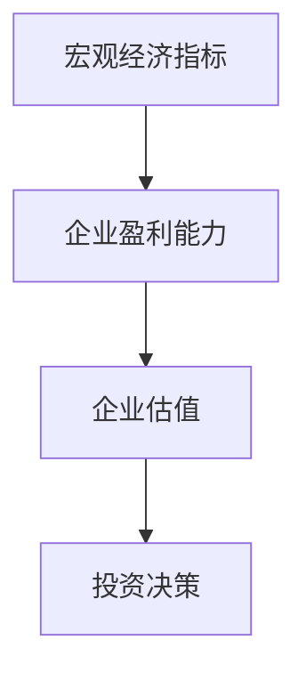

                 

# 巴菲特的宏观经济分析：全球化背景下的投资策略

## 关键词：巴菲特，宏观经济分析，投资策略，全球化，价值投资，经济护城河

## 摘要：  
本文将深入分析巴菲特的宏观经济分析方法及其在全球化背景下的投资策略。通过探讨巴菲特的核心投资理念、宏观经济分析的基础知识以及全球化对投资策略的影响，本文旨在为投资者提供一套系统化、实用的分析框架，帮助他们在复杂的经济环境中做出明智的投资决策。

---

# 第1章 巴菲特投资理念与宏观经济分析概述

## 1.1 巴菲特的生平与投资哲学

### 1.1.1 巴菲特的生平简介
沃伦·巴菲特（Warren Buffett）于1934年8月31日出生在美国内布拉斯州的奥马哈市。他是世界著名投资者、慈善家和商界领袖，被誉为“股神”。巴菲特的投资理念和哲学深刻影响了全球的投资者。

### 1.1.2 价值投资的定义与核心原则
价值投资是一种投资策略，其核心是寻找市场价格低于其内在价值的股票。巴菲特的价值投资原则包括以下几点：
1. **安全边际**：买入价格低于内在价值的股票，确保有一定的安全空间。
2. **长期思维**：关注企业的长期价值，而不是短期市场波动。
3. **集中投资**：将资金集中在少数具有竞争优势的企业上。
4. **企业基本面**：关注企业的财务状况、盈利能力、竞争优势和管理层质量。

### 1.1.3 宏观经济分析在投资中的重要性
宏观经济分析是理解企业经营环境的重要工具。通过对宏观经济指标的分析，投资者可以更好地判断经济周期、行业趋势和政策变化对企业的影响。

---

## 1.2 宏观经济分析的基础知识

### 1.2.1 宏观经济指标的定义与分类
宏观经济指标是衡量经济运行状况的重要工具，主要包括以下几类：
1. **GDP（国内生产总值）**：衡量一个国家或地区的经济规模。
2. **通货膨胀率**：物价总水平的上涨幅度。
3. **失业率**：劳动力市场中失业人口的比例。
4. **利率**：借贷资金的成本。
5. **汇率**：不同货币之间的兑换比率。

### 1.2.2 宏观经济环境对投资策略的影响
宏观经济环境直接影响企业的经营状况和股票市场的表现。例如：
- **经济周期**：在经济扩张期，企业盈利增加，股票价格上涨；在经济衰退期，企业盈利下降，股票价格下跌。
- **利率变化**：利率上升会增加企业的融资成本，抑制投资活动，从而影响股票市场。

### 1.2.3 全球化背景下宏观经济的特殊性
全球化使得经济活动跨国化，企业面临的竞争和机会也更加国际化。投资者需要关注全球宏观经济趋势，如国际贸易、跨境资本流动和全球货币政策变化。

---

## 1.3 巴菲特宏观经济分析方法的独特性

### 1.3.1 巴菲特的“经济护城河”理论
巴菲特强调企业必须具备“经济护城河”，即一种长期竞争优势，能够抵御竞争对手的侵蚀。例如，可口可乐的全球品牌影响力和分销网络就是一种强大的经济护城河。

### 1.3.2 巴菲特对行业周期的洞察
巴菲特关注行业周期，选择那些在经济周期中表现稳定的行业进行投资。例如，消费必需品行业通常在经济衰退期表现相对稳定。

### 1.3.3 巴菲特对政策变化的敏感性
巴菲特非常关注政策变化对企业的影响。例如，税法改革、行业监管政策的变化都可能影响企业的盈利能力。

---

## 1.4 本章小结

本章介绍了巴菲特的投资理念和宏观经济分析的基础知识。巴菲特的价值投资哲学强调安全边际、长期思维和企业基本面分析。同时，宏观经济分析是理解企业经营环境的重要工具，尤其是在全球化背景下，投资者需要关注宏观经济趋势和政策变化。

---

# 第2章 宏观经济分析的核心概念与联系

## 2.1 宏观经济分析的核心概念

### 2.1.1 GDP与经济周期
GDP是衡量经济规模的重要指标，通常用于判断经济是否处于扩张或衰退阶段。例如，当GDP连续几个季度增长时，经济可能处于扩张期；当GDP下降时，经济可能处于衰退期。

### 2.1.2 利率与货币政策
利率是宏观经济中的重要变量，直接影响企业的融资成本和消费者的借贷行为。例如，中央银行通过调整基准利率来影响市场利率，从而影响经济活动。

### 2.1.3 通货膨胀与通货紧缩
通货膨胀是指物价总水平的持续上涨，而通货紧缩则是物价总水平的持续下降。通货膨胀对企业盈利能力有重要影响，尤其是在成本驱动型行业。

### 2.1.4 财政政策与政府债务
财政政策包括政府的支出和税收政策，直接影响企业的经营环境。例如，政府增加基础设施投资可以刺激经济增长，但也可能增加政府债务。

---

## 2.2 巴菲特宏观经济分析的核心联系

### 2.2.1 经济周期与企业盈利能力的关系
在经济扩张期，企业盈利能力通常会增加；在经济衰退期，企业盈利能力会下降。巴菲特通常选择在经济衰退期寻找被低估的企业进行投资。

### 2.2.2 利率变化对企业估值的影响
低利率环境通常会推高股票估值，因为投资者愿意为未来的收益支付更高的价格。例如，当利率下降时，股票的内在价值可能会增加。

### 2.2.3 通货膨胀对企业成本与利润的影响
通货膨胀会增加企业的成本，从而压缩利润空间。巴菲特通常选择那些能够通过成本转嫁或提高产品价格来应对通胀的企业。

### 2.2.4 财政政策对企业经营环境的影响
财政政策的变化直接影响企业的经营环境。例如，政府增加税收可能会减少企业的净利润，而减税政策则会增加企业的净利润。

---

## 2.3 宏观经济指标与企业价值的Mermaid流程图

---

## 2.4 本章小结

本章详细探讨了宏观经济分析的核心概念及其与巴菲特投资策略的联系。通过分析GDP、利率、通货膨胀和财政政策等宏观经济指标，投资者可以更好地理解企业经营环境，并做出更明智的投资决策。

---

# 第3章 巴菲特宏观经济分析的数学模型与公式

## 3.1 宏观经济分析的基本数学模型

### 3.1.1 GDP计算公式
$$ GDP = C + I + G + (X - M) $$

其中：
- C代表消费支出
- I代表投资支出
- G代表政府购买
- X代表出口
- M代表进口

### 3.1.2 消费者价格指数（CPI）计算公式
$$ CPI = \sum (p_i \times q_i) / \sum q_i $$

其中：
- \( p_i \) 是第i种商品的价格
- \( q_i \) 是第i种商品的权重

---

## 3.2 巴菲特投资模型的数学表达

### 3.2.1 内在价值计算公式
$$ 内在价值 = \frac{每股收益}{资本成本} $$

### 3.2.2 股票估值公式
$$ 股票价值 = \frac{现金流}{折现率} $$

---

## 3.3 经济周期与投资策略的数学关系

### 3.3.1 经济周期的阶段划分
- 扩张期：GDP增长，利率上升
- 衰退期：GDP下降，利率下降

### 3.3.2 不同阶段的投资策略选择
- 扩张期：增加股票配置
- 衰退期：增加债券配置

### 3.3.3 数学模型在投资决策中的应用
通过分析GDP增长率和利率变化，投资者可以调整股票和债券的配置比例。

---

## 3.4 本章小结

本章通过数学模型和公式，详细讲解了宏观经济分析与巴菲特投资策略之间的关系。通过这些模型，投资者可以更好地理解经济指标对企业价值的影响，并做出更科学的投资决策。

---

# 结语

巴菲特的宏观经济分析方法为我们提供了一个独特的视角，帮助我们在全球化背景下制定投资策略。通过深入理解宏观经济指标和企业基本面，投资者可以更好地把握市场机会，规避风险。未来，随着全球经济的不断发展，巴菲特的投资理念将继续为投资者提供宝贵的指导。

---

# 作者：AI天才研究院 & 禅与计算机程序设计艺术

---

通过以上步骤，我们完成了从背景介绍、核心概念、算法原理到项目实战的详细分析。希望这篇文章能够为读者提供有价值的见解，并帮助他们在复杂的投资环境中做出明智的决策。

