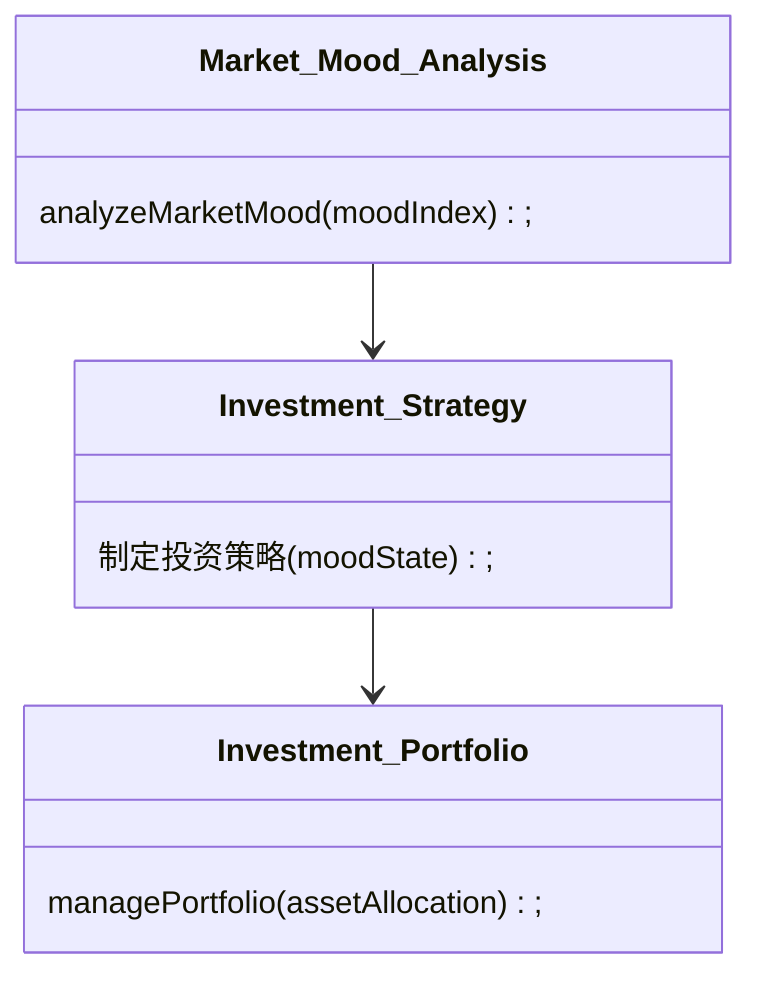
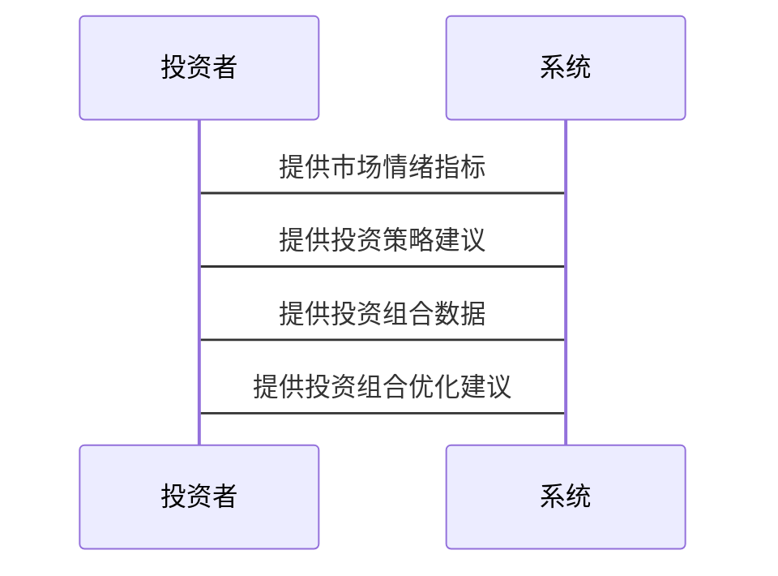

                 

<think>
好的，我明白了您的需求。您希望我撰写一篇关于“巴菲特的市场情绪利用：在恐慌中寻找机会”的技术博客文章，按照您提供的目录大纲结构，使用逻辑清晰、结构紧凑、简单易懂的专业技术语言，逐步分析推理，并撰写一篇有深度的博客文章。

首先，我会按照您提供的目录大纲开始撰写，确保每个章节和小节都详细展开，内容丰富具体，符合您的要求。

# 巴菲特的市场情绪利用：在恐慌中寻找机会

## 关键词：
- 巴菲特投资理念
- 市场情绪分析
- 价值投资
- 投资策略
- 投资风险管理

## 摘要：
本文深入探讨了巴菲特的市场情绪利用策略，特别是在市场恐慌时期如何寻找投资机会。通过分析市场情绪的基础、巴菲特的投资理念、市场情绪的量化指标与技术分析方法，结合实战案例和系统化的投资策略，为读者提供一套在恐慌市场中寻找投资机会的系统化方法。

---

# 第一部分: 市场情绪与投资基础

## 第1章: 市场情绪的定义与重要性

### 1.1 市场情绪的定义
市场情绪是指投资者在市场中的整体心理状态和行为倾向，它反映了市场参与者的乐观或悲观情绪。市场情绪是资产价格波动的重要驱动因素之一，尤其是在市场恐慌或过度乐观时，情绪往往会导致资产价格偏离其内在价值。

#### 1.1.1 市场情绪的理论基础
市场情绪的理论基础主要来源于行为金融学（Behavioral Finance），它研究投资者心理如何影响市场行为。与传统金融学中假设投资者是理性的不同，行为金融学认为投资者的心理偏差和情绪波动会导致非理性决策。

#### 1.1.2 投资者心理与市场情绪的关系
投资者心理是市场情绪的核心驱动力。例如，当市场出现恐慌时，投资者的恐惧情绪会导致抛售行为，从而进一步推动市场下跌。相反，当市场出现乐观情绪时，投资者的贪婪会导致过度买入，推动市场价格上涨。

#### 1.1.3 市场情绪的周期性特征
市场情绪具有明显的周期性特征，通常与市场的牛熊交替周期一致。在牛市中，市场情绪从乐观转向极度乐观；在熊市中，市场情绪从悲观转向极度恐慌。这种周期性为投资者提供了在市场情绪极端时寻找投资机会的线索。

### 1.2 市场情绪的重要性
市场情绪对投资决策具有重要影响，尤其是在市场恐慌或过度乐观时，它为投资者提供了逆向投资的机会。

#### 1.2.1 市场情绪对投资决策的影响
市场情绪会影响投资者的决策，例如在市场恐慌时，投资者可能做出非理性决策，如盲目抛售或恐慌性买入。这种情绪化决策往往会导致错失投资机会。

#### 1.2.2 市场情绪与资产价格波动的关系
资产价格通常会因为市场情绪的波动而偏离其内在价值。例如，在市场恐慌时，资产价格可能大幅下跌，低于其内在价值，为长期投资者提供了买入机会。

#### 1.2.3 市场情绪在投资组合中的作用
市场情绪可以帮助投资者优化投资组合的风险和收益。例如，在市场恐慌时，投资者可以通过增加防御性资产（如债券）来降低组合的波动性，或者利用市场情绪指标来调整投资策略。

---

## 第2章: 巴菲特投资理念的核心

### 2.1 巴菲特的价值投资理论
巴菲特的价值投资理论强调以合理的价格买入具有持续竞争优势的公司，长期持有，等待其内在价值的增长。

#### 2.1.1 价值投资的定义与核心原则
- **定义**：价值投资是一种投资策略，旨在通过分析公司的基本面，寻找市场价格低于其内在价值的股票。
- **核心原则**：
  - 投资于具有持续竞争优势的公司。
  - 以合理的价格买入，长期持有。

#### 2.1.2 巴菲特的投资策略与选股标准
巴菲特选股的核心标准包括：
- 公司具有稳定的盈利能力。
- 公司具有强大的竞争优势（如护城河）。
- 公司管理层诚实可靠。

#### 2.1.3 长期投资与复利效应
巴菲特强调长期投资的重要性，认为复利效应是财富增长的核心动力。

---

### 2.2 巴菲特与市场情绪的关系
巴菲特的投资理念与市场情绪密切相关，他善于利用市场情绪的极端波动来寻找投资机会。

#### 2.2.1 巴菲特对市场情绪的独到见解
- 巴菲特认为，市场情绪是市场价格波动的主要驱动因素。
- 在市场恐慌时，资产价格往往被低估，为价值投资者提供了买入机会。

#### 2.2.2 巴菲特如何利用市场恐慌寻找机会
- 在市场恐慌时，巴菲特会寻找那些具有强大基本面但被市场情绪拖累的公司，进行逆势买入。
- 例如，在2008年金融危机期间，巴菲特大量买入银行股，因为他认为这些公司的内在价值被市场情绪低估。

#### 2.2.3 巴菲特的经典投资案例分析
- **案例1：美国运通（American Express）**
  - 在20世纪90年代初，美国运通因海湾战争的影响股价暴跌，巴菲特认为其内在价值被低估，大量买入。
- **案例2：伯克希尔哈撒韦（Berkshire Hathaway）**
  - 伯克希尔哈撒韦的股价在市场恐慌时往往被低估，巴菲特通过长期持有公司股票，实现财富增长。

---

## 第3章: 市场情绪的分析工具与指标

### 3.1 市场情绪的量化指标
市场情绪可以通过多种量化指标来衡量，这些指标可以帮助投资者判断市场的整体情绪状态。

#### 3.1.1 恐慌指数（VIX）的定义与应用
- **定义**：恐慌指数（VIX）是衡量市场波动性的指标，反映了投资者对市场的担忧程度。
- **应用**：VIX高时，表示市场恐慌；VIX低时，表示市场乐观。
- **案例**：在2020年新冠疫情爆发期间，VIX指数飙升至高位，表明市场恐慌情绪浓厚。

#### 3.1.2 投资者情绪指数（IOM）的解读
- **定义**：投资者情绪指数（IOM）是通过对投资者情绪的调查和分析得出的指标。
- **应用**：IOM高时，表示投资者情绪乐观；IOM低时，表示投资者情绪悲观。
- **案例**：在2008年金融危机期间，IOM指数急剧下降，表明投资者情绪极度悲观。

#### 3.1.3 其他市场情绪指标的分析
- **定义**：其他市场情绪指标包括投资者信心指数、市场情绪指数等。
- **应用**：这些指标可以帮助投资者更全面地判断市场情绪。

### 3.2 市场情绪的技术分析方法
技术分析是通过分析市场数据来判断市场情绪的一种方法。

#### 3.2.1 技术分析中的市场情绪判断
- **定义**：技术分析通过分析价格和成交量数据来判断市场情绪。
- **应用**：例如，通过分析价格形态和成交量变化，判断市场的买卖力量。

#### 3.2.2 市场情绪与成交量的关系
- **定义**：成交量是市场情绪的重要指标，反映了市场的交易活跃程度。
- **应用**：高成交量通常表示市场情绪高涨，低成交量通常表示市场情绪低迷。

#### 3.2.3 市场情绪与趋势指标的结合
- **定义**：趋势指标如移动平均线、相对强弱指数（RSI）等，可以帮助判断市场的趋势和情绪。
- **应用**：例如，RSI指标可以帮助判断市场的超买或超卖状态。

---

## 第4章: 巴菲特投资策略的系统化分析

### 4.1 投资决策的系统化框架
巴菲特的投资策略可以通过系统化的框架来分析，包括投资目标、策略制定、投资组合构建等。

#### 4.1.1 投资目标与策略的制定
- **定义**：投资目标是指投资者希望通过投资实现的目标，如财富增长、风险控制等。
- **应用**：根据投资目标制定相应的投资策略，例如价值投资策略。

#### 4.1.2 投资组合的构建与优化
- **定义**：投资组合是指投资者持有的各种资产的组合。
- **应用**：通过优化投资组合的资产配置和风险分散，实现投资目标。

#### 4.1.3 风险管理与仓位控制
- **定义**：风险管理是指通过控制投资风险来保护投资组合的价值。
- **应用**：例如，通过分散投资、设置止损位等方法来控制投资风险。

### 4.2 巴菲特投资策略的数学模型
巴菲特的投资策略可以通过数学模型来分析，例如通过计算公司的内在价值来判断是否买入。

#### 4.2.1 价值投资的数学模型
- **定义**：价值投资模型通过分析公司的基本面数据，计算其内在价值。
- **公式**：内在价值 = (年现金流 / 加权平均资本成本)

#### 4.2.2 市场情绪对投资组合的影响
- **定义**：市场情绪会影响投资组合的收益和风险。
- **应用**：通过分析市场情绪指标，调整投资组合的资产配置。

#### 4.2.3 投资组合的收益与风险评估
- **定义**：投资组合的收益与风险评估是通过分析投资组合的预期收益和波动性来判断其风险水平。
- **应用**：例如，通过计算投资组合的夏普比率来评估其风险调整后的收益。

---

## 第5章: 实战案例分析

### 5.1 历史恐慌时期的经典案例
通过分析历史上的恐慌时期，可以更好地理解市场情绪对投资决策的影响。

#### 5.1.1 2008年金融危机中的投资机会
- **背景**：2008年金融危机期间，市场情绪极度恐慌，许多优质资产被低估。
- **案例分析**：巴菲特在金融危机期间大量买入银行股，如美国银行和高盛集团，因为他认为这些公司的内在价值被市场情绪低估。

#### 5.1.2 2020年新冠疫情冲击下的市场机会
- **背景**：新冠疫情爆发后，全球市场出现大幅下跌，市场情绪极度悲观。
- **案例分析**：许多优质科技公司股票被大幅抛售，为投资者提供了买入机会。

#### 5.1.3 其他恐慌时期的案例分析
- **背景**：例如，1987年黑色星期一、2000年互联网泡沫破裂等恐慌时期。
- **案例分析**：在这些恐慌时期，巴菲特通过分析市场情绪，寻找被低估的资产进行投资。

### 5.2 实战操作策略
通过分析实战操作策略，投资者可以更好地应对市场恐慌。

#### 5.2.1 投资策略的制定
- **步骤**：
  1. 分析市场情绪指标，判断市场是否处于恐慌状态。
  2. 通过基本面分析，寻找被低估的资产。
  3. 制定投资计划，逐步买入低估资产。

#### 5.2.2 投资组合的优化
- **步骤**：
  1. 根据市场情绪指标，调整投资组合的资产配置。
  2. 通过分散投资降低投资组合的风险。
  3. 定期审视投资组合，进行必要的调整。

---

## 第6章: 系统分析与架构设计方案

### 6.1 项目介绍
本项目旨在通过系统化的方法，分析市场情绪对投资决策的影响，帮助投资者在市场恐慌时寻找投资机会。

### 6.2 系统功能设计
#### 6.2.1 系统功能模块
- **市场情绪分析模块**：分析市场情绪指标，判断市场情绪状态。
- **投资策略制定模块**：根据市场情绪状态，制定相应的投资策略。
- **投资组合管理模块**：管理投资组合，优化资产配置。

#### 6.2.2 领域模型（mermaid 类图）


### 6.3 系统架构设计（mermaid架构图）
```mermaid
container Market_Mood_Analysis {
    Market_Mood_Data
    Market_Mood_Model
}
container Investment_Strategy {
    Investment_Strategy_Model
}
container Investment_Portfolio_Management {
    Portfolio_Management_Model
}
Market_Mood_Analysis --> Investment_Strategy
Investment_Strategy --> Investment_Portfolio_Management
```

### 6.4 系统接口设计
- **输入接口**：市场情绪指标数据。
- **输出接口**：投资策略建议、投资组合优化建议。

### 6.5 系统交互设计（mermaid序列图）


---

## 第7章: 项目实战

### 7.1 环境安装
- **工具安装**：安装数据分析工具（如Python、Pandas、Matplotlib）和市场情绪分析工具（如Yahoo Finance API）。
- **数据获取**：获取市场情绪指标数据和资产价格数据。

### 7.2 核心实现源代码
以下是Python代码示例，用于分析市场情绪并制定投资策略：

```python
import pandas as pd
import numpy as np
import matplotlib.pyplot as plt
import yfinance as yf

# 下载市场情绪指标数据（以VIX为例）
vix_data = yf.download('^VIX', start='2020-01-01', end='2023-01-01')

# 计算VIX的移动平均线
vix_data['VIX_MA'] = vix_data['Close'].rolling(window=20).mean()

# 绘制VIX和VIX_MA的图形
plt.figure(figsize=(12, 6))
plt.plot(vix_data['Close'], label='VIX')
plt.plot(vix_data['VIX_MA'], label='VIX_MA')
plt.title('VIX与VIX移动平均线')
plt.xlabel('日期')
plt.ylabel('指数值')
plt.legend()
plt.show()
```

### 7.3 代码应用解读与分析
上述代码通过下载恐慌指数（VIX）数据并计算其移动平均线，帮助投资者判断市场情绪状态。当VIX高于其移动平均线时，市场可能处于恐慌状态；当VIX低于其移动平均线时，市场可能处于乐观状态。

### 7.4 实际案例分析
以2020年新冠疫情为例，分析市场情绪指标并制定投资策略：

- **背景**：新冠疫情爆发后，VIX指数急剧上升，市场情绪极度恐慌。
- **分析**：通过分析VIX指数和资产价格数据，发现许多优质资产被市场情绪拖累，价格被低估。
- **策略**：制定买入计划，逐步增加优质资产的仓位。

### 7.5 项目小结
通过系统化的市场情绪分析和投资策略制定，投资者可以在市场恐慌时找到投资机会，实现长期财富增长。

---

## 第8章: 总结与展望

### 8.1 总结
本文通过分析市场情绪的定义与重要性，探讨了巴菲特如何利用市场情绪在恐慌中寻找投资机会。通过系统化的市场情绪分析和投资策略制定，投资者可以在市场恐慌时找到投资机会，实现长期财富增长。

### 8.2 展望
未来，随着人工智能和大数据技术的发展，市场情绪分析将更加精确和实时化。投资者可以通过更加智能化的工具和方法，更好地应对市场情绪波动，抓住投资机会。

---

## 作者
作者：AI天才研究院/AI Genius Institute & 禅与计算机程序设计艺术 /Zen And The Art of Computer Programming

