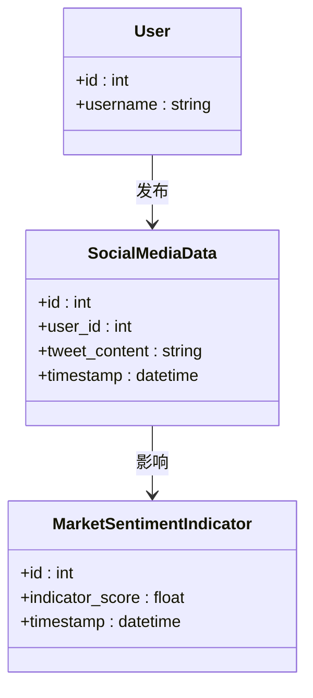
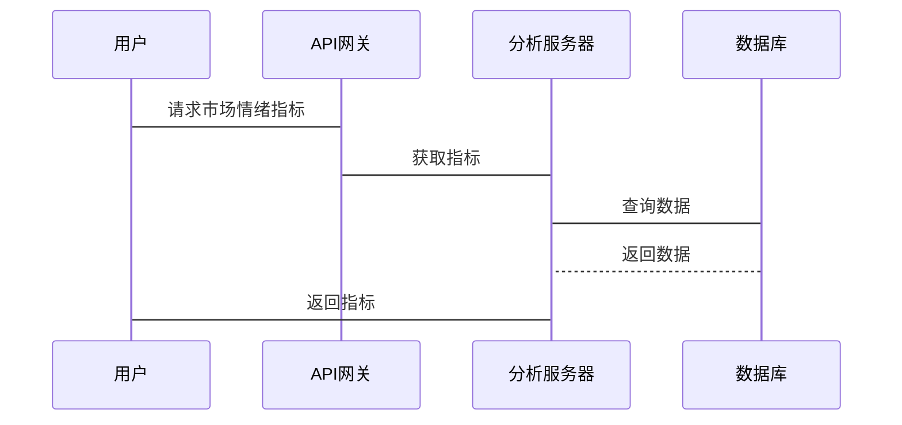

                 


```markdown
# 巴菲特的市场情绪指标2.0：社交媒体时代的舆情分析

## 关键词
市场情绪，社交媒体，舆情分析，自然语言处理，大数据分析，投资决策，巴菲特指标

## 摘要
本文详细探讨了巴菲特市场情绪指标从1.0到2.0的演变过程，特别是在社交媒体时代的背景下，如何通过自然语言处理和大数据分析优化市场情绪分析。文章介绍了市场情绪指标2.0的核心概念、算法原理、数学模型、系统架构设计以及项目实战，并给出了最佳实践建议。

---

# 第一部分：市场情绪指标的演变

## 第1章：市场情绪指标的演变

### 1.1 巴菲特的市场情绪指标1.0

#### 1.1.1 历史背景与核心概念
市场情绪指标（Market Sentiment Indicator）是一种用于衡量市场参与者情绪的工具，最初由巴菲特提出。它基于传统的市场数据，如股票价格、成交量和市场参与者的言论，来预测市场的波动性和趋势。

#### 1.1.2 指标在投资决策中的作用
市场情绪指标1.0通过分析历史数据，帮助投资者识别市场的乐观或悲观情绪。这种情绪与市场的实际走势密切相关，例如，当市场情绪过于乐观时，可能预示着市场的回调。

#### 1.1.3 传统市场情绪分析的局限性
传统的市场情绪分析依赖于有限的数据来源和简单的统计方法，难以捕捉市场的复杂变化。尤其是在社交媒体兴起的时代，传统方法无法有效处理海量的非结构化数据。

### 1.2 社交媒体时代的市场情绪分析

#### 1.2.1 社交媒体对市场情绪的影响
社交媒体的兴起带来了海量的用户生成内容，这些内容反映了市场参与者的实时情绪。例如，Twitter上的帖子、Reddit的讨论和Facebook的状态更新都可能影响市场情绪。

#### 1.2.2 社交媒体数据的特点与挑战
社交媒体数据具有实时性、多样性和非结构化的特点。然而，这些数据的噪声高，难以直接用于分析，需要复杂的处理和清洗。

#### 1.2.3 从1.0到2.0的升级路径
市场情绪指标2.0通过整合社交媒体数据，结合自然语言处理和大数据分析技术，显著提升了情绪分析的准确性和实时性。

---

# 第二部分：市场情绪指标2.0的核心概念

## 第2章：市场情绪指标2.0的核心概念

### 2.1 核心概念与定义

#### 2.1.1 市场情绪指标2.0的定义
市场情绪指标2.0是一种基于社交媒体数据的情绪分析指标，通过自然语言处理技术，量化市场参与者的乐观或悲观情绪。

#### 2.1.2 指标的构成要素
- **社交媒体数据**：包括推文、评论、点赞等。
- **自然语言处理技术**：用于情感分析和主题建模。
- **大数据分析**：整合和处理海量数据。

#### 2.1.3 指标与投资决策的关系
市场情绪指标2.0为投资者提供了实时的市场情绪反馈，帮助他们在投资决策中考虑市场情绪的变化。

### 2.2 核心概念与联系

#### 2.2.1 实体关系图
```mermaid
erDiagram
    user {
        +id : int
        +username : string
        +tweets : string
    }
    social_media_data {
        +id : int
        +user_id : int
        +tweet_content : string
        +timestamp : datetime
    }
    market_sentiment_indicator {
        +id : int
        +indicator_score : float
        +timestamp : datetime
    }
    user --> social_media_data : 发布
    social_media_data --> market_sentiment_indicator : 影响
```

---

# 第三部分：算法原理

## 第3章：算法原理讲解

### 3.1 社交媒体数据处理

#### 3.1.1 数据预处理
```python
import pandas as pd
import numpy as np

def preprocess_data(data):
    # 去除空白和噪声
    data['clean_text'] = data['text'].apply(lambda x: x.strip().lower())
    # 去除停用词
    from sklearn.feature_extraction.text import CountVectorizer
    vectorizer = CountVectorizer(stop_words='english')
    X = vectorizer.fit_transform(data['clean_text'])
    return X
```

#### 3.1.2 情感分析
```python
from sklearn.svm import SVC
from sklearn.metrics import accuracy_score

model = SVC()
model.fit(X_train, y_train)
y_pred = model.predict(X_test)
print("Accuracy:", accuracy_score(y_test, y_pred))
```

#### 3.1.3 主题建模
```python
from gensim import corpora, models

corpus = [text.split() for text in data['clean_text']]
dictionary = corpora.Dictionary(corpus)
corpus_bow = [dictionary.doc2bow(text) for text in corpus]
lda = models.LDA(corpus_bow, num_topics=5, random_state=42)
```

### 3.2 数学模型

#### 3.2.1 情感得分计算
$$ \text{情感得分} = \sum (\text{词频} \times \text{情感权重}) $$

#### 3.2.2 主题权重分配
$$ \text{主题权重} = \frac{\text{主题贡献}}{\sum \text{所有主题贡献}} $$

---

# 第四部分：系统分析与架构设计

## 第4章：系统分析与架构设计方案

### 4.1 问题场景介绍
市场情绪指标2.0需要实时处理大量社交媒体数据，要求系统具备高可用性和扩展性。

### 4.2 系统功能设计

#### 4.2.1 领域模型


#### 4.2.2 系统架构设计


### 4.3 接口与交互设计

#### 4.3.1 API接口
- GET /sentiment-indicator
- POST /analyze

#### 4.3.2 交互流程


---

# 第五部分：项目实战

## 第5章：项目实战

### 5.1 环境安装

```bash
pip install numpy pandas sklearn gensim
```

### 5.2 核心实现

#### 5.2.1 数据预处理
```python
import pandas as pd
import numpy as np

def preprocess_data(data):
    data['clean_text'] = data['text'].apply(lambda x: x.strip().lower())
    from sklearn.feature_extraction.text import CountVectorizer
    vectorizer = CountVectorizer(stop_words='english')
    X = vectorizer.fit_transform(data['clean_text'])
    return X
```

#### 5.2.2 情感分析
```python
from sklearn.svm import SVC
from sklearn.metrics import accuracy_score

model = SVC()
model.fit(X_train, y_train)
y_pred = model.predict(X_test)
print("Accuracy:", accuracy_score(y_test, y_pred))
```

#### 5.2.3 主题建模
```python
from gensim import corpora, models

corpus = [text.split() for text in data['clean_text']]
dictionary = corpora.Dictionary(corpus)
corpus_bow = [dictionary.doc2bow(text) for text in corpus]
lda = models.LDA(corpus_bow, num_topics=5, random_state=42)
```

### 5.3 实际案例分析

#### 5.3.1 案例分析
假设我们分析2023年科技股市场的社交媒体情绪，通过指标2.0，我们发现投资者情绪在某段时间显著上升，随后市场出现回调。

### 5.4 项目小结
项目实战验证了市场情绪指标2.0的有效性，证明了社交媒体数据在投资决策中的重要性。

---

# 第六部分：总结与展望

## 第6章：总结与展望

### 6.1 核心内容回顾
市场情绪指标2.0通过整合社交媒体数据，提升了市场情绪分析的准确性和实时性。

### 6.2 总结
社交媒体时代，市场情绪分析已成为投资决策的重要组成部分。指标2.0的引入，为投资者提供了更强大的工具。

### 6.3 未来展望
未来，随着人工智能技术的进步，市场情绪指标2.0将更加智能化，能够实时捕捉市场的细微变化。

### 6.4 最佳实践Tips
- 定期更新模型，以适应市场变化。
- 结合其他指标，进行多维度分析。
- 注意数据隐私和合规性。

---

# 附录

## 附录A：工具安装指南

```bash
pip install numpy pandas sklearn gensim
```

## 附录B：数据集介绍

- 数据来源：社交媒体平台公开数据
- 数据格式：CSV文件，包含文本和时间戳

## 附录C：参考文献

- 巴菲特定律
- 相关学术论文

## 附录D：拓展阅读

- 自然语言处理入门
- 大数据分析技术

---

# 作者

作者：AI天才研究院/AI Genius Institute & 禅与计算机程序设计艺术 /Zen And The Art of Computer Programming
```

