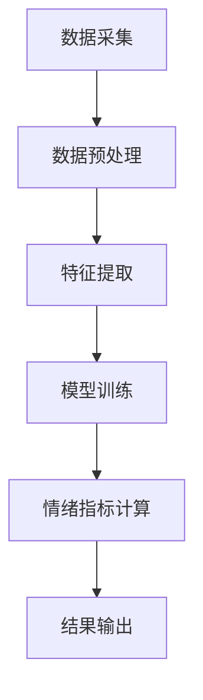
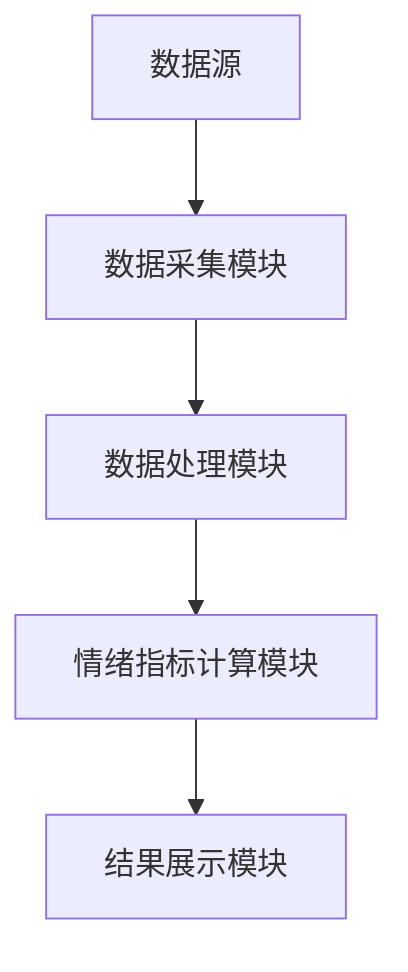

                 


# 巴菲特的市场情绪指标：如何利用大众心理

> 关键词：巴菲特、市场情绪、投资者心理、投资策略、情绪指标

> 摘要：本文将深入探讨巴菲特如何利用市场情绪指标进行投资决策，分析市场情绪指标的核心概念、算法原理、系统架构设计以及实际投资案例，帮助读者理解如何利用大众心理制定有效的投资策略。

---

## 第一部分: 市场情绪指标概述

### 第1章: 市场情绪与投资心理学基础

#### 1.1 市场情绪的基本概念

- **市场情绪的定义**：市场情绪是指投资者在特定市场环境下的整体心理状态，通常表现为乐观或悲观。
- **市场情绪的核心要素**：
  - 投资者的心理预期
  - 市场参与者的交易行为
  - 市场信息的传播与解读
- **市场情绪与投资决策的关系**：市场情绪直接影响投资者的决策，进而影响市场价格波动。

#### 1.2 巴菲特的投资理念与市场情绪

- **巴菲特的投资哲学**：
  - 长期投资，价值投资
  - 避免短期市场波动干扰
  - 重视企业内在价值
- **巴菲特对市场情绪的看法**：
  - 市场情绪是短期波动的主要原因
  - 投资者应避免被市场情绪左右
  - 市场情绪可以帮助识别投资机会
- **巴菲特如何利用市场情绪做出投资决策**：
  - 在市场情绪低落时寻找低估资产
  - 在市场情绪高涨时警惕过热资产

#### 1.3 市场情绪指标的定义与作用

- **市场情绪指标的定义**：通过量化手段衡量市场参与者情绪的指标。
- **市场情绪指标的核心作用**：
  - 识别市场趋势
  - 评估市场风险
  - 辅助投资决策
- **市场情绪指标的分类与特点**：
  - 系统性指标（如恐慌指数）
  - 非系统性指标（如投资者情绪调查）

### 第2章: 市场情绪指标的核心概念与联系

#### 2.1 市场情绪指标的核心原理

- **市场情绪指标的构成要素**：
  - 市场价格波动
  - 交易量变化
  - 投资者情绪调查数据
- **市场情绪指标的数学模型**：
  - 基于统计学的模型（如标准差、波动率）
  - 基于自然语言处理的模型（如情感分析）
- **市场情绪指标的计算方法**：
  - 数据采集与处理
  - 情感分析与情绪分类
  - 指标合成与输出

#### 2.2 市场情绪指标与投资决策的关系

- **市场情绪指标在投资决策中的应用**：
  - 识别市场拐点
  - 评估投资风险
  - 制定投资策略
- **市场情绪指标与投资风险的关系**：
  - 高市场情绪伴随高风险
  - 低市场情绪伴随低风险
- **市场情绪指标与投资收益的关系**：
  - 高市场情绪可能导致收益下降
  - 低市场情绪可能导致收益上升

#### 2.3 市场情绪指标的核心属性对比

- **不同市场情绪指标的对比分析**：
  | 指标名称 | 数据来源 | 计算方法 | 指标特点 |
  |----------|----------|----------|----------|
  | 恐慌指数 | 市场价格波动 | 标准差计算 | 反映市场恐慌程度 |
  | 投资者情绪调查 | 投资者问卷 | 情感分类 | 反映投资者情绪分布 |
- **市场情绪指标的优缺点分析**：
  - 优点：量化市场情绪，提供投资参考
  - 缺点：指标滞后，存在误差
- **市场情绪指标的选择标准**：
  - 数据来源的可靠性
  - 指标的敏感性
  - 指标的稳定性

### 第3章: 市场情绪指标的算法原理

#### 3.1 市场情绪指标的计算流程

- **数据采集与处理**：
  - 数据源：市场交易数据、新闻数据、社交媒体数据
  - 数据预处理：清洗、归一化
- **数据分析与建模**：
  - 特征提取：提取关键情绪指标
  - 模型训练：构建情绪分类模型
- **情绪指标的计算与输出**：
  - 计算情绪指标
  - 可视化展示

#### 3.2 市场情绪指标的数学模型

- **情绪指标的数学表达式**：
  $$\text{情绪指标} = \alpha \times \text{价格波动} + \beta \times \text{交易量变化}$$
  其中，$\alpha$ 和 $\beta$ 是权重系数。
- **情绪指标的权重分配**：
  - 价格波动：权重较高
  - 交易量变化：权重较低
- **情绪指标的动态调整**：
  - 根据市场变化实时更新权重

#### 3.3 市场情绪指标的算法流程图



### 第4章: 市场情绪指标的系统架构设计

#### 4.1 系统功能设计

- **数据采集模块**：负责采集市场数据
- **数据处理模块**：对数据进行清洗和预处理
- **情绪指标计算模块**：计算市场情绪指标
- **结果展示模块**：以可视化方式展示指标

#### 4.2 系统架构图



---

## 第二部分: 市场情绪指标的系统实现

### 第5章: 系统实现与应用

#### 5.1 数据采集与处理

- **数据采集工具**：
  - Python的pandas库
  - 用于采集市场交易数据
- **数据预处理代码**：
  ```python
  import pandas as pd

  # 读取数据
  data = pd.read_csv('market_data.csv')

  # 数据清洗
  data.dropna(inplace=True)
  data['date'] = pd.to_datetime(data['date'])
  data.set_index('date', inplace=True)
  ```

#### 5.2 情绪指标计算与建模

- **情绪指标计算代码**：
  ```python
  import numpy as np

  def calculate_emotion_index(data):
      # 计算价格波动
      volatility = data['price'].std()
      # 计算交易量变化
      volume_change = data['volume'].pct_change().mean()
      # 计算情绪指数
      emotion_index = np.sqrt(volatility ** 2 + volume_change ** 2)
      return emotion_index

  emotion_index = calculate_emotion_index(data)
  ```

#### 5.3 系统交互设计

- **系统交互流程图**：
  ```mermaid
  graph TD
      A[用户输入数据] --> B[系统处理数据]
      B --> C[计算情绪指标]
      C --> D[展示结果]
  ```

---

## 第三部分: 投资策略与案例分析

### 第6章: 投资策略与案例分析

#### 6.1 投资策略制定

- **基于市场情绪的分阶段投资策略**：
  - 在市场情绪低落时增加投资
  - 在市场情绪高涨时减少投资

#### 6.2 投资案例分析

- **案例1：2008年金融危机期间的市场情绪分析**：
  - 市场情绪从乐观转向悲观
  - 投资者情绪指标显示恐慌情绪上升
  - 投资者应避免追高，寻找低估资产

#### 6.3 投资决策与市场情绪的关系

- **市场情绪对投资决策的影响**：
  - 过高的市场情绪可能导致资产泡沫
  - 过低的市场情绪可能导致资产低估

---

## 第四部分: 总结与展望

### 第7章: 总结与展望

#### 7.1 总结

- 本文深入分析了巴菲特的市场情绪指标
- 探讨了市场情绪指标的算法原理
- 结合实际案例分析了市场情绪对投资决策的影响

#### 7.2 展望

- 市场情绪指标的优化与改进
- 基于人工智能的市场情绪分析
- 市场情绪指标在量化投资中的应用

---

## 参考文献

- 巴菲特《巴菲特致股东的信》
- 《投资学》相关文献
- 作者：AI天才研究院/AI Genius Institute  
  禅与计算机程序设计艺术/Zen And The Art of Computer Programming

