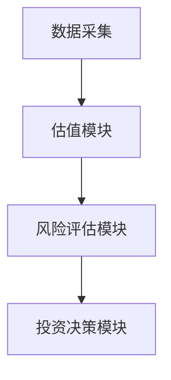
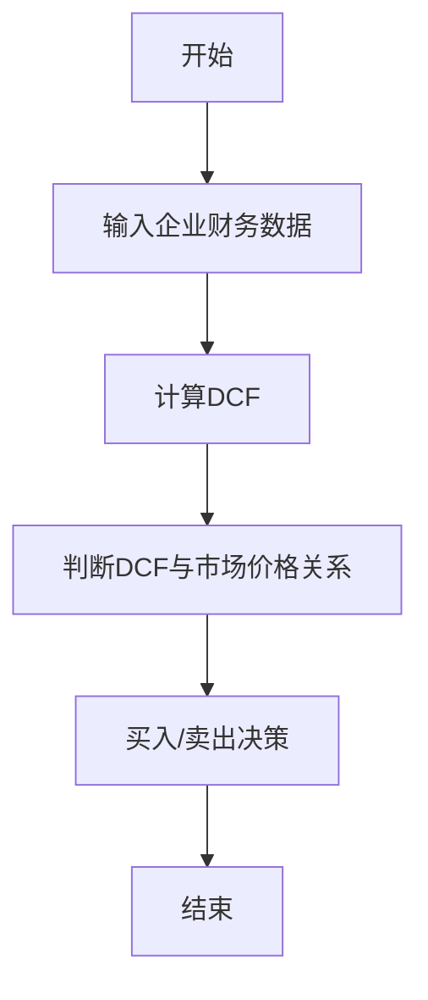

                 


# 巴菲特的市场择时观点更新：长期主义在当代的应用

> 关键词：巴菲特，市场择时，长期主义，投资策略，风险管理，价值投资

> 摘要：本文将深入探讨巴菲特的市场择时观点及其长期主义投资策略在当代的应用。通过分析长期主义的核心理念、市场择时的策略优化以及实际案例，结合技术分析、系统架构和项目实战，为投资者提供科学的决策参考。

---

## 第一部分：长期主义概述

### 第1章：长期主义的核心概念

#### 1.1 长期主义的定义与特征

长期主义是一种投资哲学，强调以长期视角看待市场波动和企业价值。其核心特征包括：

- **时间维度**：关注长期趋势而非短期波动。
- **价值驱动**：注重企业内在价值而非市场情绪。
- **风险控制**：通过分散投资和安全边际降低风险。

#### 1.2 长期主义的数学模型

长期主义的内在价值可以用以下公式表示：

$$ V = \text{DCF} = \sum_{t=1}^{n} \frac{\text{CF}_t}{(1 + r)^t} $$

其中，DCF为现金流的现值，CF_t为第t年的现金流，r为折现率。

### 第2章：长期主义与市场择时

#### 2.1 市场择时的理论基础

市场择时是一种通过预测市场波动来优化投资收益的策略。巴菲特认为，市场择时并非易事，但可以通过对企业价值的深入研究来降低风险。

#### 2.2 长期主义视角下的市场择时策略

- **估值指标分析**：通过市盈率（P/E）和市净率（P/B）等指标判断市场估值水平。
- **企业基本面分析**：关注企业的盈利能力、成长性和竞争优势。
- **周期性分析**：利用经济周期理论进行市场择时。

### 第3章：长期主义的风险管理

#### 3.1 风险管理的数学模型

风险调整后的收益可以通过夏普比率（Sharpe Ratio）衡量：

$$ \text{夏普比率} = \frac{\text{投资组合收益} - \text{无风险收益率}}{\text{投资组合收益的标准差}} $$

#### 3.2 巴菲特的风险管理方法

- **分散投资**：通过投资不同行业的企业降低风险。
- **安全边际**：确保买入价格低于内在价值。
- **长期持有**：避免频繁交易以降低交易成本。

---

## 第二部分：投资策略与系统架构

### 第4章：价值投资的系统架构

#### 4.1 投资决策系统的模块划分

- 数据采集模块：收集企业财务数据和市场数据。
- 估值模块：计算企业内在价值和市场估值。
- 风险评估模块：评估投资组合的风险水平。
- 投资决策模块：基于上述分析做出投资决策。

#### 4.2 系统架构图



### 第5章：算法原理与技术实现

#### 5.1 投资决策算法



#### 5.2 代码实现

```python
def calculateDCF(cash_flows, discount_rate):
    return sum(cash_flow / (1 + discount_rate) ** t for t, cash_flow in enumerate(cash_flows))

DCF = calculateDCF([100, 120, 150], 0.1)
print(f"DCF: {DCF}")
```

---

## 第三部分：长期主义在当代的应用

### 第6章：案例分析与实战

#### 6.1 美国市场的长期主义投资

- **案例背景**：2008年金融危机后，巴菲特通过长期持有优质企业股票实现收益。
- **分析**：通过DCF模型评估企业价值，选择具有持续盈利能力的企业。

#### 6.2 中国市场的长期主义策略

- **策略调整**：结合中国经济特点，选择具有成长性的行业和企业。
- **风险控制**：通过分散投资和动态调整投资组合降低风险。

### 第7章：长期主义的现代意义

#### 7.1 数字化与智能化投资

- **技术驱动**：利用大数据和人工智能优化投资决策。
- **创新工具**：开发新的估值模型和风险管理算法。

#### 7.2 未来投资趋势

- **可持续投资**：关注ESG（环境、社会、治理）因素。
- **全球化视角**：在全球范围内寻找投资机会。

---

## 第四部分：总结与展望

### 第8章：长期主义的总结

- 长期主义是一种科学的投资哲学，结合基本面分析和风险管理，能够帮助投资者在市场波动中实现稳健收益。
- 通过系统化的方法和技术创新，长期主义在当代投资中具有重要的现实意义。

### 第9章：未来投资策略的优化

- 持续优化投资模型，结合新兴技术提升投资效率。
- 加强跨市场和跨行业的投资研究，寻找新的增长点。

---

## 作者信息

作者：AI天才研究院/AI Genius Institute & 禅与计算机程序设计艺术 /Zen And The Art of Computer Programming

