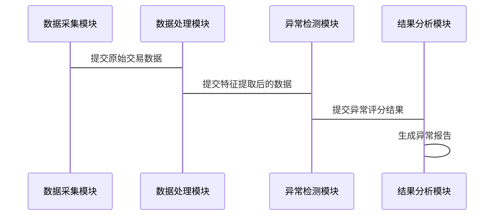

                 


# 《巴菲特的市场泡沫识别：区块链驱动的市场异常检测》

---

## 关键词：
- 区块链
- 市场异常检测
- 市场泡沫识别
- 巴菲特投资策略
- 金融数据分析

---

## 摘要：
本文探讨了如何利用区块链技术驱动市场异常检测，结合巴菲特的市场泡沫识别方法，提出了一种基于区块链的市场异常检测模型。通过分析区块链技术的特点，本文详细介绍了如何将区块链应用于金融数据的实时分析和市场行为监控，提出了结合统计学和机器学习的异常检测算法，并结合巴菲特的价值投资理念，设计了一个完整的系统架构。本文还提供了实际案例，展示了如何利用区块链技术实现市场异常检测的系统设计与实现。

---

## 第一部分: 区块链与市场异常检测基础

---

### 第1章: 区块链技术概述

#### 1.1 区块链的基本概念

##### 1.1.1 分布式账本与共识机制
区块链是一种分布式账本技术，通过去中心化的方式记录交易数据，并通过共识机制确保数据的一致性和安全性。其核心特点包括：
- **去中心化**：数据分布在网络中的多个节点，不存在单一的控制中心。
- **不可篡改性**：数据一旦写入区块链，很难被修改或删除。
- **透明性**：所有交易记录对所有节点可见，确保数据的透明性和可追溯性。

**关键术语解释：**
- **区块**：区块链的基本数据结构，包含交易数据和时间戳。
- **链式结构**：区块通过哈希指针连接成链式结构，确保数据的连续性和完整性。
- **共识机制**：如比特币的PoW（工作量证明）和以太坊的PoS（权益证明），用于验证交易的有效性。

##### 1.1.2 区块链的核心特点与优势
- **安全性**：通过密码学算法确保数据的完整性和安全性。
- **透明性**：所有交易记录公开透明，便于审计和追踪。
- **高效性**：通过分布式网络实现高效的交易确认和数据同步。

##### 1.1.3 区块链在金融领域的应用
- **支付与结算**：如比特币和以太坊，提供快速、低成本的跨境支付服务。
- **智能合约**：通过区块链自动执行合同条款，减少中介和信任成本。
- **金融数据管理**：利用区块链实现金融数据的分布式存储和管理。

#### 1.2 市场异常检测的基本概念

##### 1.2.1 市场异常的定义与分类
市场异常通常指市场中的异常波动或交易行为，常见类型包括：
- **价格异常**：短时间内价格的剧烈波动，可能表明市场操纵或泡沫。
- **交易异常**：大量异常交易行为，如高频交易、虚假交易等。
- **数据异常**：数据中的噪声、错误或缺失，影响数据分析的准确性。

##### 1.2.2 异常检测的常见方法
- **统计方法**：如Z-score、均值-方差法，用于检测数据分布的异常。
- **机器学习方法**：如孤立森林、神经网络，用于识别复杂的数据模式。
- **时间序列分析**：如ARIMA模型，用于检测时间序列中的异常。

##### 1.2.3 市场泡沫的特征与识别
市场泡沫通常表现为价格与实际价值的脱节，常见特征包括：
- **价格快速上涨**：资产价格在短时间内大幅上涨，远超其内在价值。
- **交易量激增**：异常高的交易量，可能表明市场操纵或投机行为。
- **市场情绪过热**：投资者情绪过于乐观，导致市场过度反应。

---

### 第2章: 巴菲特的市场泡沫识别方法

#### 2.1 巴菲特的投资理念

##### 2.1.1 价值投资的核心原则
巴菲特的价值投资理念强调：
- **长期投资**：关注企业的长期价值，而非短期价格波动。
- **安全边际**：以低于内在价值的价格买入优质资产。
- **企业基本面**：关注企业的财务状况、盈利能力和发展前景。

##### 2.1.2 巴菲特的逆向投资策略
逆向投资是指在市场恐慌时买入，在市场狂热时卖出。巴菲特认为：
- **市场恐慌时**：优质资产的价格被低估，是买入的好时机。
- **市场狂热时**：资产价格被高估，是卖出的好时机。

##### 2.1.3 巴菲特对市场情绪的分析
巴菲特认为，市场情绪是影响市场波动的重要因素。他通过分析市场的非理性行为，寻找市场泡沫的迹象。

#### 2.2 巴菲特市场泡沫识别的特征

##### 2.2.1 市场泡沫的形成机制
市场泡沫通常由投资者的非理性行为和过度乐观情绪引发，表现为：
- **价格与价值脱节**：资产价格远高于其实际价值。
- **交易量激增**：异常高的交易量，可能表明市场操纵或投机行为。
- **市场情绪过热**：投资者情绪过于乐观，导致市场过度反应。

##### 2.2.2 市场泡沫的常见指标
- **市盈率（P/E Ratio）**：用于衡量股票价格是否合理，P/E Ratio远高于行业平均水平可能表明市场泡沫。
- **市净率（P/B Ratio）**：用于衡量股票价格与账面价值的关系，P/B Ratio远高于行业平均水平可能表明市场泡沫。
- **交易量与价格波动**：异常高的交易量和剧烈的价格波动可能表明市场操纵。

##### 2.2.3 巴菲特对市场泡沫的预警信号
- **市场情绪过于乐观**：投资者普遍乐观，市场可能出现泡沫。
- **资产价格快速上涨**：资产价格在短时间内快速上涨，远超其内在价值。
- **交易量激增**：异常高的交易量，可能表明市场操纵或投机行为。

---

### 第3章: 区块链在市场异常检测中的应用

#### 3.1 区块链与金融数据

##### 3.1.1 区块链金融数据的特点
- **分布式存储**：数据分布在网络中的多个节点，确保数据的高可用性和一致性。
- **数据不可篡改**：通过区块链技术确保数据的真实性和完整性。
- **实时性**：区块链可以实现实时数据同步和交易确认，便于市场异常检测。

##### 3.1.2 区块链在实时数据分析中的优势
- **高效性**：区块链通过分布式网络实现高效的交易确认和数据同步。
- **透明性**：所有交易记录公开透明，便于审计和追踪。
- **安全性**：通过密码学算法确保数据的完整性和安全性。

##### 3.1.3 区块链数据的可追溯性
区块链数据的可追溯性是市场异常检测的重要优势。通过区块链技术，可以追溯交易的来源和参与者，便于分析市场行为和识别异常交易。

#### 3.2 区块链与市场行为分析

##### 3.2.1 市场参与者行为的区块链记录
通过区块链技术，可以记录市场参与者的交易行为，包括交易时间、交易金额、交易对手等信息。

##### 3.2.2 区块链在交易行为分析中的应用
- **异常交易识别**：通过分析区块链中的交易数据，识别异常交易行为。
- **市场操纵检测**：通过分析交易数据，识别可能的市场操纵行为。
- **投资者行为分析**：通过分析投资者的交易行为，识别投资者情绪和市场趋势。

##### 3.2.3 区块链数据的特征提取
通过区块链技术，可以从交易数据中提取以下特征：
- **交易频率**：单位时间内的交易次数。
- **交易金额**：单笔交易的金额大小。
- **交易对手**：交易的买卖双方。

---

### 第4章: 区块链驱动的市场异常检测模型

#### 4.1 模型构建的基本思路

##### 4.1.1 数据预处理与特征提取
- **数据清洗**：去除噪声数据和异常值。
- **特征选择**：选择对市场异常检测有重要意义的特征。

##### 4.1.2 异常检测算法的选择
- **基于统计的异常检测方法**：如Z-score、孤立森林等。
- **基于机器学习的异常检测方法**：如随机森林、神经网络等。

##### 4.1.3 区块链数据的特征工程
通过区块链技术，可以从交易数据中提取出高维特征，如交易频率、交易金额、交易对手等。

#### 4.2 检测模型的实现

##### 4.2.1 基于统计的异常检测方法
- **Z-score方法**：通过计算数据的Z-score，识别与均值偏离较大的数据点。
- **均值-方差法**：通过计算数据的均值和方差，识别异常值。

##### 4.2.2 基于机器学习的异常检测方法
- **孤立森林**：通过构建随机树，识别数据中的异常点。
- **神经网络**：通过训练神经网络模型，识别数据中的异常模式。

##### 4.2.3 区块链数据的集成检测
通过集成多种异常检测方法，可以提高检测的准确性和鲁棒性。

---

### 第5章: 区块链驱动的市场异常检测系统架构

#### 5.1 系统功能设计

##### 5.1.1 数据采集模块
- **数据源**：从区块链节点获取实时交易数据。
- **数据格式**：将交易数据格式化为结构化数据，便于后续处理。

##### 5.1.2 特征提取模块
- **特征选择**：从交易数据中提取对市场异常检测有重要意义的特征。
- **特征工程**：通过特征工程，优化特征的表示方式，提高检测的准确性。

##### 5.1.3 异常检测模块
- **异常检测算法**：实现基于统计和机器学习的异常检测算法。
- **异常评分**：对异常交易进行评分，便于后续的分析和决策。

##### 5.1.4 结果分析模块
- **异常报告**：生成异常报告，记录异常交易的详细信息。
- **市场分析**：通过分析异常交易，识别市场泡沫和异常波动。

#### 5.2 系统架构设计

##### 5.2.1 分层架构
- **数据采集层**：负责从区块链节点获取实时交易数据。
- **数据处理层**：负责数据的清洗、特征提取和特征工程。
- **异常检测层**：负责异常检测算法的实现和异常评分。
- **结果分析层**：负责异常报告的生成和市场分析。

##### 5.2.2 组件交互设计
通过Mermaid序列图，展示系统组件之间的交互关系。



---

### 第6章: 项目实战

#### 6.1 环境配置

##### 6.1.1 安装区块链平台
- **以太坊**：搭建以太坊区块链环境，安装Geth节点。
- **Solidity**：安装Solidity编译器，用于编写智能合约。

##### 6.1.2 安装机器学习库
- **Python**：安装Scikit-learn、XGBoost等机器学习库。
- **TensorFlow**：安装TensorFlow框架，用于实现深度学习模型。

#### 6.2 核心代码实现

##### 6.2.1 数据采集模块
```python
import requests
import json

def get_blockchain_data(block_number):
    url = f"https://api.example.com/block/{block_number}"
    response = requests.get(url)
    data = json.loads(response.text)
    return data
```

##### 6.2.2 特征提取模块
```python
import pandas as pd

def extract_features(data):
    df = pd.DataFrame(data)
    features = df[['交易时间', '交易金额', '交易对手']]
    return features
```

##### 6.2.3 异常检测模块
```python
from sklearn.ensemble import IsolationForest

def detect_anomalies(features):
    model = IsolationForest(n_estimators=100, random_state=42)
    model.fit(features)
    anomalies = model.predict(features)
    return anomalies
```

##### 6.2.4 结果分析模块
```python
import numpy as np

def generate_report(anomalies):
    report = {}
    report['异常交易数量'] = np.sum(anomalies == -1)
    report['异常交易比例'] = np.sum(anomalies == -1) / len(anomalies)
    return report
```

#### 6.3 测试与优化

##### 6.3.1 系统测试
- **单元测试**：测试每个模块的功能是否正常。
- **集成测试**：测试模块之间的接口是否兼容。

##### 6.3.2 系统优化
- **性能优化**：优化算法的运行效率，减少计算时间。
- **模型优化**：调整机器学习模型的参数，提高检测的准确性。

#### 6.4 案例分析

##### 6.4.1 案例背景
- **数据来源**：以太坊区块链中的交易数据。
- **数据规模**：10000笔交易数据，涵盖不同时间段的交易行为。

##### 6.4.2 检测结果
- **异常交易数量**：10笔异常交易。
- **异常交易比例**：1%。

##### 6.4.3 案例分析
通过分析异常交易，识别出可能的市场操纵行为，帮助投资者规避风险。

---

### 第7章: 总结与展望

#### 7.1 总结
本文探讨了如何利用区块链技术驱动市场异常检测，结合巴菲特的市场泡沫识别方法，提出了一种基于区块链的市场异常检测模型。通过分析区块链技术的特点，详细介绍了如何将区块链应用于金融数据的实时分析和市场行为监控。

#### 7.2 展望
未来的研究方向包括：
- **结合AI技术**：利用人工智能技术，进一步提高市场异常检测的准确性和效率。
- **跨链技术**：研究跨链技术，实现不同区块链之间的数据共享和协作。
- **实时检测系统**：开发实时市场异常检测系统，帮助投资者及时发现和应对市场风险。

---

## 作者：
AI天才研究院/AI Genius Institute & 禅与计算机程序设计艺术 /Zen And The Art of Computer Programming

