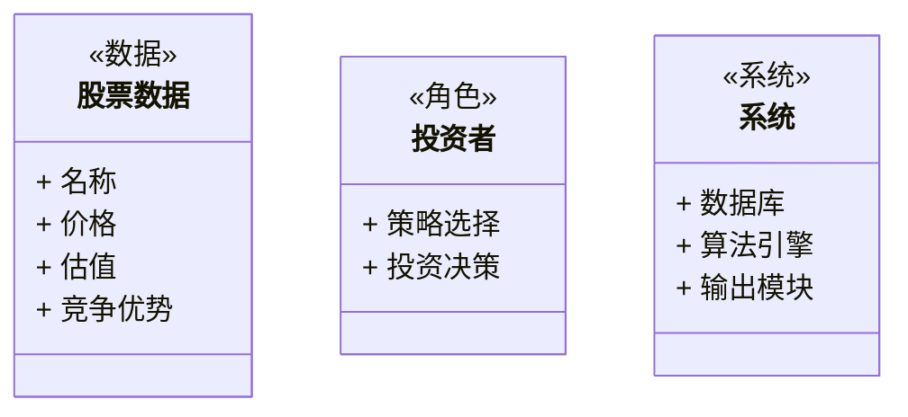

                 


```
# 巴菲特的年度股东信：投资智慧的精华总结

> 关键词：巴菲特, 价值投资, 股东信, 投资策略, 财务分析, 风险管理

> 摘要：本文通过分析巴菲特的年度股东信，总结其投资智慧的核心理念，包括价值投资、安全边际、企业竞争优势等，并结合技术语言和系统架构的方法，深入剖析巴菲特的投资策略和风险管理技巧。文章旨在为投资者提供一份基于技术视角的投资智慧精华总结。

---

## 第一部分: 巴菲特投资理念的背景与基础

### 第1章: 巴菲特投资理念概述

#### 1.1 巴菲特的生平与投资哲学
- **1.1.1 巴菲特的早期经历与投资起步**
  - 巴菲特的童年与青少年时期
  - 早期投资经历：购买第一只股票
- **1.1.2 巴菲特的投资哲学与价值投资理念**
  - 价值投资的定义与核心思想
  - 巴菲特的投资哲学：寻找具有持续竞争优势的企业
- **1.1.3 巴菲特投资理念的核心思想**
  - 长期投资 vs. 短期投机
  - 安全边际的概念与重要性

#### 1.2 巴菲特年度股东信的重要性
- **1.2.1 股东信的历史与演变**
  - 巴菲特股东信的起源与演变
  - 股东信的主要内容与结构
- **1.2.2 股东信的核心内容与价值**
  - 股东信的独特视角：巴菲特的思考方式
  - 股东信对投资者的启示与指导
- **1.2.3 股东信对投资者的启示**
  - 如何通过股东信学习投资智慧

---

## 第二部分: 价值投资的核心概念与背景

### 第2章: 价值投资的核心概念

#### 2.1 价值投资的定义与特征
- **2.1.1 价值投资的定义**
  - 价值投资的定义与范畴
  - 价值投资与其他投资策略的对比
- **2.1.2 价值投资的核心特征对比表**
  | 特征         | 价值投资         | 其他投资策略      |
  |--------------|------------------|------------------|
  | 时间跨度     | 长期持有         | 短期交易         |
  | 选股标准     | 低估值、高壁垒   | 高流动性和趋势   |
- **2.1.3 价值投资的实体关系图（Mermaid）**
  ```mermaid
  graph LR
  A[投资者] --> B[企业]
  B --> C[低估值]
  B --> D[高竞争优势]
  ```

#### 2.2 股票估值的数学模型与公式
- **2.2.1 股票内在价值的计算公式**
  $$ V = \frac{CF}{r - g} $$
  其中，CF代表现金流，r代表折现率，g代表增长率。
- **2.2.2 现金流贴现模型（DCF）的流程图（Mermaid）**
  ```mermaid
  graph TD
  A[现金流预测] --> B[确定折现率]
  B --> C[计算现值]
  C --> D[得出内在价值]
  ```

---

## 第三部分: 巴菲特投资策略的算法与实现

### 第3章: 投资策略的算法原理

#### 3.1 投资策略的算法原理
- **3.1.1 价值投资算法的流程图（Mermaid）**
  ```mermaid
  graph TD
  A[开始] --> B[筛选低估值企业]
  B --> C[评估企业竞争优势]
  C --> D[计算安全边际]
  D --> E[决定投资]
  E --> F[结束]
  ```
- **3.1.2 价值投资算法的Python实现**
  ```python
  def value_investment_strategy(stock_data):
      # 筛选低估值企业
      low_valuation_stocks = [stock for stock in stock_data if stock.value < stock_data.average_value]
      
      # 评估企业竞争优势
      competitive_stocks = []
      for stock in low_valuation_stocks:
          if stock竞争优势(stock) > 0.7:
              competitive_stocks.append(stock)
      
      # 计算安全边际
      safe_stocks = []
      for stock in competitive_stocks:
          if stock.price < stock.estimated_value * 0.9:
              safe_stocks.append(stock)
      
      return safe_stocks
  ```

---

## 第四部分: 巴菲特投资策略的系统架构设计

### 第4章: 系统架构设计

#### 4.1 系统功能设计（领域模型 Mermaid 类图）


#### 4.2 系统架构设计（Mermaid 架构图）


---

## 第五部分: 项目实战与案例分析

### 第5章: 项目实战

#### 5.1 项目环境安装
- Python环境：Python 3.8+
- 依赖库：pandas, numpy, matplotlib

#### 5.2 系统核心实现源代码
```python
import pandas as pd
import numpy as np

def calculate_intrinsic_value(cash_flow, discount_rate, growth_rate):
    return cash_flow / (discount_rate - growth_rate)

# 示例数据
data = {
    '公司': ['Company A', 'Company B', 'Company C'],
    '现金流': [100, 150, 200],
    '折现率': [0.1, 0.12, 0.08],
    '增长率': [0.05, 0.03, 0.04]
}

df = pd.DataFrame(data)

# 计算内在价值
intrinsic_values = []
for index, row in df.iterrows():
    iv = calculate_intrinsic_value(row['现金流'], row['折现率'], row['增长率'])
    intrinsic_values.append(iv)

df['内在价值'] = intrinsic_values
print(df)
```

---

## 第六部分: 总结与展望

### 第6章: 总结与展望

#### 6.1 总结
- 巴菲特投资理念的核心：价值投资、安全边际、长期持有
- 巴菲特股东信的价值：智慧的总结与分享

#### 6.2 展望
- 结合技术分析与巴菲特投资理念的更多可能性
- 数据驱动的投资策略与价值投资的结合

---

## 作者：AI天才研究院/AI Genius Institute & 禅与计算机程序设计艺术 /Zen And The Art of Computer Programming
```

