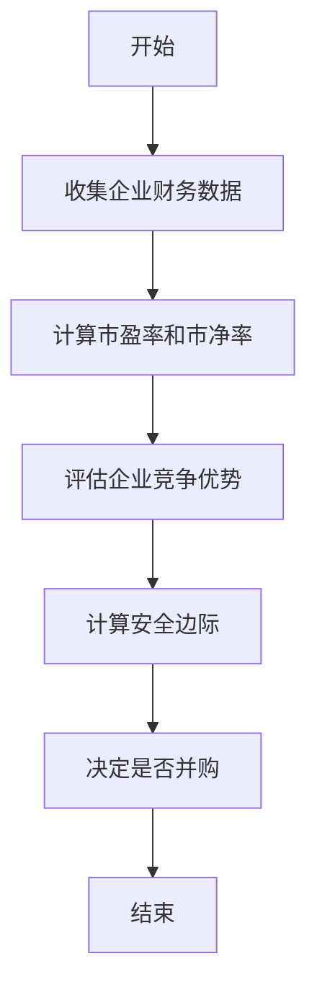
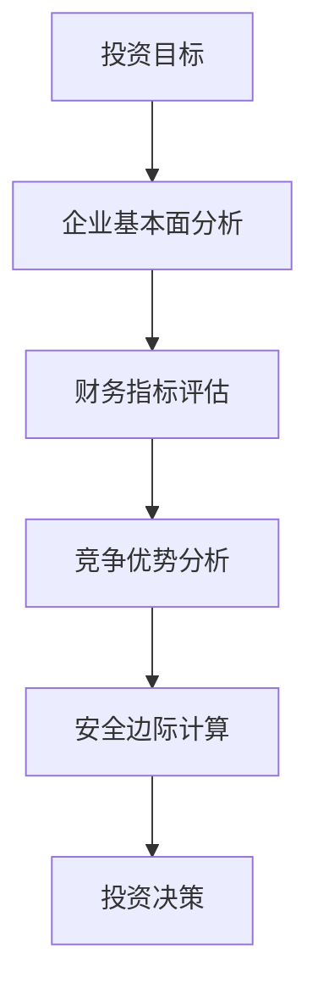
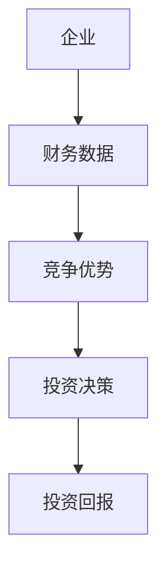
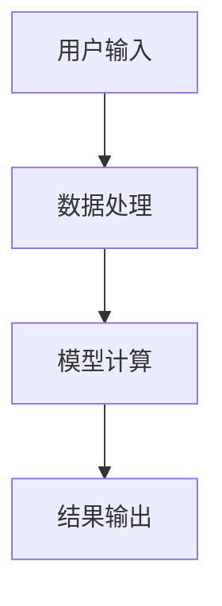
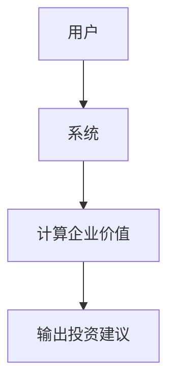

                 


# 巴菲特的并购投资策略

> 关键词：巴菲特、并购投资、价值投资、企业估值、安全边际、投资策略

> 摘要：本文系统地分析了巴菲特的并购投资策略，从其核心理念到具体操作方法，结合数学模型和实际案例，深入探讨了巴菲特的投资哲学、并购策略的关键要素、系统架构设计以及实际投资中的应用。通过本文，读者可以全面理解巴菲特并购投资的成功秘诀，并掌握如何将这些策略应用于实际投资中。

---

# 第1章 巴菲特并购投资策略概述

## 1.1 巴菲特投资理念的核心要素

### 1.1.1 巴菲特投资哲学的起源

沃伦·巴菲特是世界上最著名的投资者之一，他的投资哲学起源于对价值投资的深刻理解。巴菲特的投资理念可以追溯到他的老师本杰明·格雷厄姆，格雷厄姆的价值投资理论强调以低于企业内在价值的价格买入股票，并长期持有。

$$ 巴菲特的投资哲学 = 价值投资 × 长期持有 × 安全边际 $$

### 1.1.2 巴菲特投资理念的核心原则

巴菲特的投资理念可以用以下几个核心原则来概括：

1. **安全边际**：买入价格低于企业内在价值，确保投资的安全性。
2. **长期持有**：投资于具有持续竞争优势的企业，长期持有，避免频繁交易。
3. **企业竞争优势**：选择具有强大护城河的企业，确保企业能够持续盈利。

### 1.1.3 巴菲特并购策略的独特性

巴菲特的并购策略的独特性在于他不仅关注企业的财务数据，还关注企业的竞争优势和管理层素质。他倾向于投资那些具有强大护城河的企业，并通过长期持有实现超额收益。

---

## 1.2 并购投资的基本概念与特点

### 1.2.1 并购的定义与分类

并购（Mergers and Acquisitions, M&A）是指一家企业合并或收购另一家企业，以实现规模扩大、资源整合或市场扩张。并购可以分为以下几种类型：

- **横向并购**：同一行业内的并购。
- **纵向并购**：上下游产业的并购。
- **混合并购**：与企业主业无关的并购。

### 1.2.2 并购与投资的关系

并购是投资的一种形式，但不同于传统的证券投资，并购投资更注重对企业整体价值的评估和控制权的获取。

### 1.2.3 巴菲特并购策略的特殊性

巴菲特的并购策略具有以下特殊性：

1. **注重企业内在价值**：巴菲特通过对企业内在价值的评估，选择那些具有低估潜力的企业进行并购。
2. **长期持有**：巴菲特倾向于长期持有并购的企业，避免短期市场的波动。
3. **注重管理层素质**：巴菲特在并购过程中非常注重企业的管理层素质，认为优秀管理层是企业持续发展的关键。

---

## 1.3 巴菲特并购投资的核心要素

### 1.3.1 企业价值评估的关键指标

企业价值评估的关键指标包括：

- **市盈率（P/E）**：市盈率 = 股价 / 每股净利润
- **市净率（P/B）**：市净率 = 股价 / 每股净资产
- **EV/EBIT**：企业价值与息税折旧及摊销前利润之比。

### 1.3.2 并购中的风险与机会

并购中的风险包括：

- **估值风险**：企业估值过高可能导致并购成本超过预期。
- **整合风险**：企业并购后的整合可能遇到文化冲突、管理混乱等问题。
- **市场风险**：市场波动可能影响并购后的企业价值。

并购中的机会包括：

- **低估企业**：通过并购获得那些被市场低估的企业。
- **竞争优势**：通过并购获取具有强大竞争优势的企业。
- **长期收益**：通过长期持有并购的企业，获得持续的收益。

### 1.3.3 巴菲特并购策略的长期性

巴菲特的并购策略具有长期性，他倾向于长期持有企业，通过企业的持续盈利实现投资回报。

---

## 1.4 巴菲特并购投资的成功案例

### 1.4.1 可口可乐的并购案例

1985年，巴菲特通过可可可乐的并购案例展示了他对企业竞争优势和长期持有的投资理念。他通过长期持有可口可乐股票，获得了巨大的收益。

### 1.4.2 吉列刀片业务的并购案例

巴菲特通过吉列刀片业务的并购案例展示了他对企业价值评估和安全边际的重视。他以低于企业内在价值的价格收购了吉列刀片业务，并长期持有。

### 1.4.3 其他经典并购案例分析

其他经典并购案例包括美国运通、富国银行等，这些案例都体现了巴菲特的投资理念。

---

## 1.5 本章小结

本章系统地介绍了巴菲特并购投资策略的核心要素，包括他的投资哲学、并购策略的独特性以及成功案例分析。通过这些内容，读者可以全面理解巴菲特的投资理念和并购策略。

---

# 第2章 巴菲特并购投资的核心原则

## 2.1 巴菲特投资理念的数学模型

### 2.1.1 企业价值的计算公式

$$ 企业价值 = 净利润 × 市盈率 $$

### 2.1.2 投资回报率的计算公式

$$ 投资回报率 = (净利润 / 投资额) × 100\% $$

### 2.1.3 安全边际的数学表达

$$ 安全边际 = 市场价 < 灵活价值 $$

---

## 2.2 巴菲特并购策略的算法原理

### 2.2.1 企业价值评估的算法流程图



---

## 2.3 巴菲特并购策略的系统架构

### 2.3.1 投资框架的构建



---

## 2.4 巴菲特并购策略的系统接口

### 2.4.1 数据接口设计

- 输入接口：企业财务数据、行业数据、市场数据。
- 输出接口：企业价值评估结果、投资建议。

### 2.4.2 算法接口设计

- 输入接口：企业财务数据、行业数据、市场数据。
- 输出接口：企业价值评估结果、投资建议。

### 2.4.3 输出接口设计

- 投资建议：包括是否并购、并购价格、长期持有建议等。

---

## 2.5 本章小结

本章通过数学模型和算法流程图，详细介绍了巴菲特并购投资的核心原则，包括企业价值评估、投资回报率计算以及安全边际的数学表达。

---

# 第3章 巴菲特并购投资的核心要素分析

## 3.1 巴菲特并购投资的核心要素

### 3.1.1 企业竞争优势的分析

企业竞争优势包括：

- **成本优势**：企业生产成本低于竞争对手。
- **品牌优势**：强大的品牌影响力。
- **技术优势**：拥有独特的技术或专利。

### 3.1.2 财务状况的评估

财务状况的评估包括：

- **盈利能力**：净利润率、ROE等。
- **财务健康性**：资产负债率、流动比率等。
- **现金流**：自由现金流是否稳定。

### 3.1.3 行业地位的判断

行业地位的判断包括：

- **市场占有率**：企业在行业中的市场份额。
- **行业竞争格局**：行业的竞争程度和未来发展趋势。

---

## 3.2 巴菲特并购投资的数学模型

### 3.2.1 企业价值评估模型

$$ EV = EBIT × (EV/EBIT倍数) $$

### 3.2.2 投资回报率模型

$$ ROI = (净利润 / 投资额) × 100\% $$

### 3.2.3 安全边际模型

$$ 安全边际 = 市场价 < 灵活价值 $$

---

## 3.3 巴菲特并购策略的系统架构

### 3.3.1 投资框架的构建


---

## 3.4 本章小结

本章通过详细分析巴菲特并购投资的核心要素，包括企业竞争优势、财务状况评估以及行业地位判断，帮助读者全面理解巴菲特的投资理念。

---

# 第4章 巴菲特并购投资的系统分析与架构设计

## 4.1 问题场景介绍

并购投资需要解决的主要问题包括：

- 如何准确评估企业的内在价值？
- 如何选择具有竞争优势的企业？
- 如何制定长期的投资策略？

---

## 4.2 系统功能设计

### 4.2.1 领域模型mermaid类图



---

## 4.3 系统架构设计

### 4.3.1 系统架构mermaid图



---

## 4.4 系统接口设计

### 4.4.1 数据接口设计

- 输入接口：企业财务数据、行业数据、市场数据。
- 输出接口：企业价值评估结果、投资建议。

---

## 4.5 系统交互设计

### 4.5.1 系统交互mermaid序列图



---

## 4.6 本章小结

本章通过系统分析和架构设计，展示了如何将巴菲特的并购投资策略应用于实际投资中，包括系统功能设计、架构设计以及接口设计。

---

# 第5章 巴菲特并购投资的项目实战

## 5.1 环境安装

### 5.1.1 安装Python环境

```bash
python --version
pip install numpy pandas matplotlib
```

---

## 5.2 系统核心实现源代码

### 5.2.1 企业价值评估代码

```python
import numpy as np
import pandas as pd

def calculate_ev(company_data):
    ebit = company_data['EBIT']
    ev_ebit_multiple = company_data['EV/EBIT']
    ev = ebit * ev_ebit_multiple
    return ev

company_data = {'EBIT': 100, 'EV/EBIT': 15}
ev = calculate_ev(company_data)
print(f"企业价值：{ev}")
```

### 5.2.2 投资回报率代码

```python
def calculate_ro

