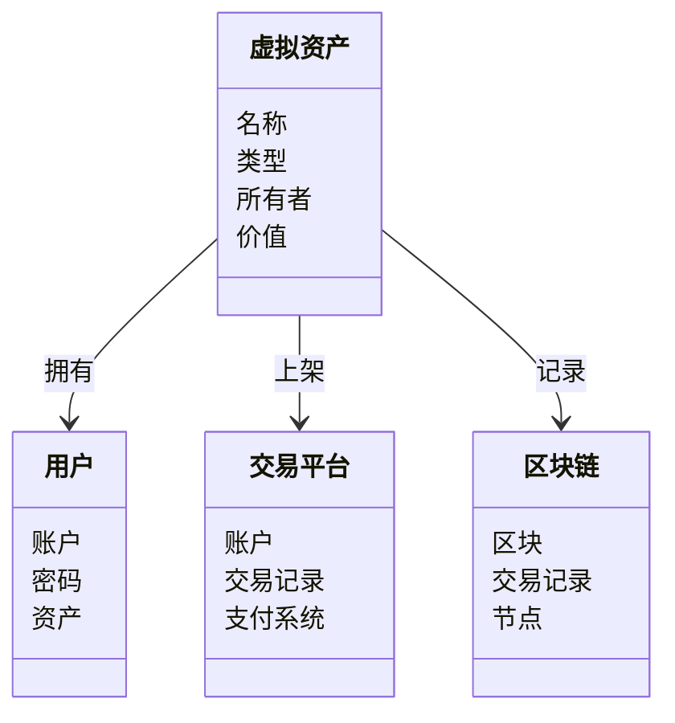
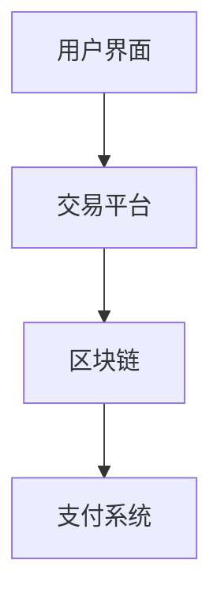
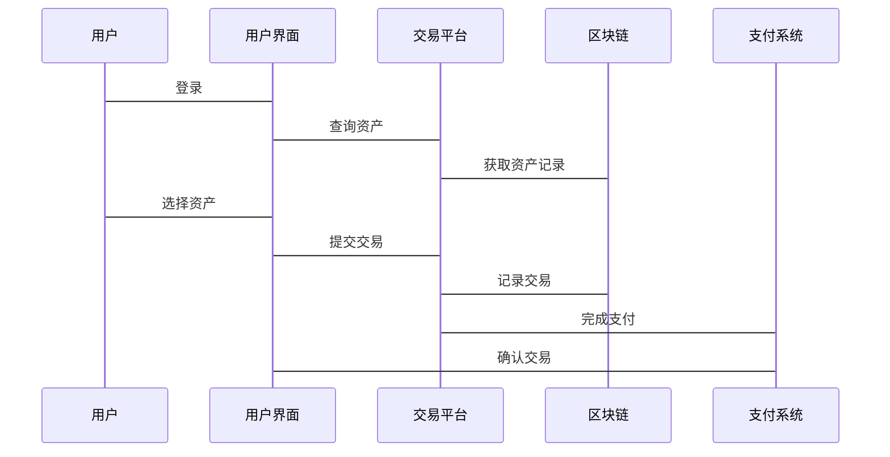
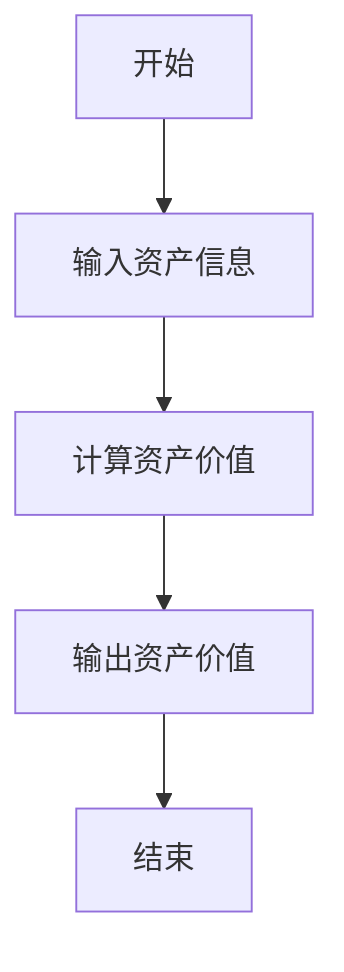
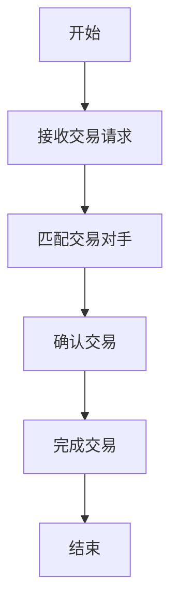

                 


# 巴菲特的并购策略在元宇宙虚拟资产整合中的新思路

> 关键词：巴菲特并购策略、元宇宙、虚拟资产、价值投资、NFT、数字资产整合

> 摘要：本文探讨了巴菲特的经典并购策略在元宇宙虚拟资产整合中的新应用，分析了虚拟资产的分类与特点，详细阐述了巴菲特并购策略的核心原则及其在元宇宙环境下的适应性，提出了虚拟资产整合的价值评估模型，并结合实际案例进行了策略创新与风险管理分析。

---

# 第一部分: 元宇宙与虚拟资产概述

## 第1章: 元宇宙与虚拟资产的基本概念

### 1.1 元宇宙的定义与特征

#### 1.1.1 元宇宙的概念起源

元宇宙（Metaverse）一词源于 Neal Stephenson 的科幻小说《雪崩》（Snow Crash），描述了一个通过虚拟现实技术构建的网络空间，用户通过虚拟身份在其中进行社交、交易和娱乐活动。近年来，随着区块链、AR/VR、人工智能等技术的快速发展，元宇宙的概念逐渐从科幻小说走向现实，成为科技行业的焦点。

#### 1.1.2 元宇宙的核心特征

元宇宙具有以下核心特征：

- **虚拟性**：用户通过虚拟身份在数字世界中进行互动。
- **开放性**：支持用户自由创建内容和应用。
- **持续性**：元宇宙中的资产和数据具有持久性，不会因用户离线而消失。
- **经济性**：元宇宙中存在虚拟货币、NFT（非同质化代币）等经济系统，支持虚拟资产的交易和价值流转。

#### 1.1.3 元宇宙与现实世界的联系

元宇宙不仅是虚拟空间，还与现实世界紧密相连。例如：

- **虚拟经济**：虚拟货币可以与现实货币进行兑换，支持虚拟资产的经济价值。
- **社交互动**：用户在元宇宙中的社交关系可以影响现实世界。
- **技术创新**：元宇宙的发展依赖于区块链、AR/VR、人工智能等技术的进步。

### 1.2 虚拟资产的定义与分类

#### 1.2.1 虚拟资产的定义

虚拟资产是指存在于数字世界中的资产，具有经济价值和可交易性。它们可以是虚拟货币、NFT、虚拟土地、虚拟物品等。

#### 1.2.2 虚拟资产的主要分类

虚拟资产可以分为以下几类：

- **虚拟货币**：如比特币、以太坊，用于虚拟世界中的交易和支付。
- **NFT（非同质化代币）**：代表独特的虚拟资产，如数字艺术品、虚拟土地等。
- **虚拟物品**：如游戏中的装备、道具，具有使用价值和交换价值。
- **虚拟服务**：如虚拟世界的会员服务、虚拟身份认证等。

#### 1.2.3 虚拟资产的经济属性

虚拟资产的经济属性包括以下方面：

- **稀缺性**：部分虚拟资产具有稀缺性，如NFT的唯一性。
- **流动性**：虚拟资产可以在不同的虚拟平台之间流动和交易。
- **价值波动性**：虚拟资产的价格受市场供需关系影响，波动较大。

### 1.3 元宇宙中虚拟资产的重要性

#### 1.3.1 虚拟资产在元宇宙中的作用

虚拟资产是元宇宙经济体系的核心，支持虚拟世界的运行和用户互动。例如，虚拟货币可以用于购买虚拟物品，NFT可以作为虚拟资产的所有权证明。

#### 1.3.2 虚拟资产的市场价值

虚拟资产的市场价值取决于其稀缺性、实用性、市场需求和技术创新。例如，NFT的市场价值不仅取决于其艺术价值，还取决于其背后的区块链技术和社区支持。

#### 1.3.3 虚拟资产的未来发展趋势

随着元宇宙的普及，虚拟资产的种类和应用将不断增加。例如，虚拟资产将不仅仅用于游戏和社交，还可以用于虚拟办公、虚拟教育等领域。

## 第2章: 巴菲特并购策略的核心理念

### 2.1 巴菲特并购策略的基本原则

#### 2.1.1 价值投资理念

巴菲特的价值投资理念强调以低于内在价值的价格买入优质资产。他认为，长期来看，资产的价值是由其基本面决定的，而不是短期市场波动。

#### 2.1.2 安全边际原则

安全边际是指资产的实际价值与购买价格之间的差距。巴菲特认为，通过购买低于内在价值的资产，可以降低投资风险。

#### 2.1.3 企业竞争优势分析

巴菲特注重分析企业的竞争优势，如成本优势、品牌优势、市场地位等。他认为，具有竞争优势的企业更有可能实现长期价值增长。

### 2.2 巴菲特并购策略的成功案例

#### 2.2.1 可口可乐案例分析

巴菲特在1985年投资可口可乐，认为其强大的品牌影响力和市场地位是长期竞争优势的体现。通过长期持有，他获得了稳定的股息收入和资产增值。

#### 2.2.2 富国银行案例分析

巴菲特在20世纪90年代投资富国银行，认为其在零售银行业务方面的竞争优势可以支持长期价值增长。然而，由于后续的市场波动和银行改革，该投资最终以亏损结束。

#### 2.2.3 巴菲特并购策略的共性总结

从巴菲特的成功案例中可以看出，他注重企业的基本面分析、竞争优势评估和长期价值判断。这些原则在虚拟资产的整合中具有重要的借鉴意义。

## 第3章: 元宇宙虚拟资产整合的挑战与机遇

### 3.1 元宇宙虚拟资产整合的背景

#### 3.1.1 元宇宙虚拟资产整合的必要性

随着元宇宙的快速发展，虚拟资产的种类和数量不断增加，如何高效整合这些资产，实现价值最大化成为一个重要问题。

#### 3.1.2 元宇宙虚拟资产整合的市场现状

目前，元宇宙中的虚拟资产整合主要集中在虚拟货币和NFT领域。例如，许多NFT平台通过区块链技术实现虚拟资产的跨平台交易。

#### 3.1.3 元宇宙虚拟资产整合的技术挑战

虚拟资产的整合需要解决数据互通、资产确权、交易安全等问题。例如，如何实现不同虚拟平台之间的资产互操作性是一个技术难题。

### 3.2 元宇宙虚拟资产整合的机遇

#### 3.2.1 虚拟资产的经济价值提升

通过整合虚拟资产，可以提高其经济价值。例如，NFT的跨平台交易可以增加其流动性，从而提升市场价值。

#### 3.2.2 元宇宙生态系统的完善

虚拟资产的整合可以完善元宇宙的生态系统，支持更多的应用场景。例如，虚拟货币可以用于购买虚拟物品，NFT可以作为虚拟资产的所有权证明。

#### 3.2.3 全球化虚拟资产市场的形成

虚拟资产的整合可以促进全球化虚拟资产市场的形成，支持跨国交易和经济活动。例如，虚拟货币可以成为全球化的支付工具。

---

# 第二部分: 巴菲特并购策略在元宇宙中的应用

## 第4章: 巴菲特并购策略与元宇宙虚拟资产的结合

### 4.1 巴菲特并购策略的可迁移性分析

#### 4.1.1 巴菲特并购策略的普适性

巴菲特的并购策略基于价值投资和长期投资理念，这些原则在虚拟资产的整合中同样适用。例如，通过分析虚拟资产的内在价值，可以选择具有长期增值潜力的资产进行投资。

#### 4.1.2 元宇宙虚拟资产的特殊性

虚拟资产的特殊性在于其虚拟性和数字化特点。例如，虚拟资产的价值不仅取决于其本身属性，还取决于其所在的生态系统和社区支持。

#### 4.1.3 策略结合的可能性

通过结合巴菲特的并购策略和虚拟资产的特点，可以制定出适合元宇宙虚拟资产整合的策略。例如，通过分析虚拟资产的内在价值和市场流动性，选择具有长期增值潜力的资产进行投资。

### 4.2 元宇宙虚拟资产整合中的价值评估

#### 4.2.1 虚拟资产的价值评估标准

虚拟资产的价值评估需要考虑以下因素：

- **内在价值**：虚拟资产的使用价值和市场价值。
- **流动性**：虚拟资产的交易活跃度和市场深度。
- **技术支撑**：虚拟资产的技术实现和生态系统支持。

#### 4.2.2 虚拟资产的市场流动性分析

市场流动性是虚拟资产价值评估的重要指标。流动性高的虚拟资产更容易交易，价值波动较小。例如，比特币和以太坊是流动性较高的虚拟货币。

#### 4.2.3 虚拟资产的长期增值潜力

长期增值潜力是虚拟资产价值评估的核心指标。例如，具有强大生态系统支持的NFT可能具有更高的长期增值潜力。

### 4.3 虚拟资产整合中的长期投资策略

#### 4.3.1 长期投资的定义与特点

长期投资是指将虚拟资产持有较长时间，以获得资产的长期增值。与短期交易相比，长期投资更注重资产的基本面分析和市场趋势判断。

#### 4.3.2 长期投资的优缺点

- **优点**：长期投资可以避免短期市场的波动风险，获得资产的长期增值。
- **缺点**：长期投资需要承担资产价格波动的风险，且需要较长的时间周期。

#### 4.3.3 长期投资在虚拟资产整合中的应用

通过长期投资策略，可以选择具有长期增值潜力的虚拟资产进行投资。例如，投资于具有强大生态系统支持的NFT项目，可以实现长期价值增长。

---

## 第5章: 元宇宙虚拟资产整合的策略创新

### 5.1 元宇宙虚拟资产整合中的策略创新

#### 5.1.1 虚拟资产的生态化整合

生态化整合是指将虚拟资产整合到一个统一的生态系统中，实现资产的跨平台交易和使用。例如，通过区块链技术实现虚拟资产的跨平台互操作性。

#### 5.1.2 虚拟资产的分布式治理

分布式治理是指通过区块链技术实现虚拟资产的去中心化管理，确保资产的安全性和透明性。例如，NFT的分布式治理可以实现资产的所有权和使用权分离。

#### 5.1.3 虚拟资产的跨平台融合

跨平台融合是指将虚拟资产整合到多个不同的虚拟平台中，实现资产的广泛流通和使用。例如，虚拟货币可以在不同的虚拟平台中作为通用货币使用。

### 5.2 元宇宙虚拟资产整合的新型模式

#### 5.2.1 虚拟资产的生态化整合

通过生态化整合，可以实现虚拟资产的高效流动和价值最大化。例如，NFT的生态化整合可以实现虚拟艺术品的跨平台展示和交易。

#### 5.2.2 虚拟资产的分布式治理

通过分布式治理，可以确保虚拟资产的安全性和透明性。例如，虚拟资产的所有权可以通过区块链技术实现去中心化管理。

#### 5.2.3 虚拟资产的跨平台融合

通过跨平台融合，可以实现虚拟资产的广泛流通和使用。例如，虚拟货币可以在不同的虚拟平台中作为通用货币使用。

## 第6章: 元宇宙虚拟资产整合的风险管理

### 6.1 元宇宙虚拟资产整合中的风险管理

#### 6.1.1 虚拟资产价格波动风险

虚拟资产的价格波动较大，投资者需要通过风险管理工具来降低价格波动带来的风险。例如，通过分散投资降低单一资产的价格波动风险。

#### 6.1.2 虚拟资产的技术风险

虚拟资产的技术风险包括技术漏洞、黑客攻击等。例如，虚拟货币的交易平台需要通过技术手段防范黑客攻击。

#### 6.1.3 虚拟资产的政策风险

虚拟资产的政策风险包括政府监管、法律法规变化等。例如，虚拟货币的监管政策变化可能会影响其市场价值。

### 6.2 元宇宙虚拟资产整合中的风险管理策略

#### 6.2.1 风险识别与评估

投资者需要识别虚拟资产整合中的各种风险，如价格波动风险、技术风险、政策风险等，并评估其对投资的影响。

#### 6.2.2 风险控制与应对策略

投资者可以通过分散投资、设置止损点、选择优质资产等方式来控制风险。例如，通过分散投资不同类型的虚拟资产，降低单一资产价格波动带来的风险。

#### 6.2.3 风险管理的组织与流程

虚拟资产的整合需要建立完善的风险管理组织和流程。例如，可以通过专业的风险管理团队和技术手段实现风险的实时监控和应对。

---

# 第三部分: 元宇宙虚拟资产整合的系统架构与实现

## 第7章: 元宇宙虚拟资产整合的系统架构设计

### 7.1 问题场景介绍

元宇宙虚拟资产整合的目标是实现虚拟资产的高效流动和价值最大化。为了实现这一目标，需要设计一个支持虚拟资产跨平台交易和使用的系统架构。

### 7.2 系统功能设计

#### 7.2.1 领域模型

领域模型需要包括以下核心实体：

- **虚拟资产**：包括虚拟货币、NFT、虚拟物品等。
- **用户**：虚拟资产的所有者。
- **交易平台**：支持虚拟资产的交易和使用。
- **区块链**：用于虚拟资产的记录和确权。

领域模型的类图如下：



### 7.3 系统架构设计

系统架构需要包括以下部分：

- **用户界面**：支持用户进行虚拟资产的交易和使用。
- **交易平台**：支持虚拟资产的交易和记录。
- **区块链**：用于虚拟资产的记录和确权。
- **支付系统**：支持虚拟资产的支付和结算。

系统架构的架构图如下：



### 7.4 系统接口设计

系统接口需要包括以下部分：

- **用户登录接口**：支持用户登录和身份验证。
- **资产查询接口**：支持用户查询其拥有的虚拟资产。
- **资产交易接口**：支持用户进行虚拟资产的交易和转移。
- **资产记录接口**：支持区块链对虚拟资产的记录和确权。

### 7.5 系统交互流程

系统交互流程如下：

1. **用户登录**：用户通过用户界面登录系统。
2. **资产查询**：用户查询其拥有的虚拟资产。
3. **资产交易**：用户选择虚拟资产进行交易，交易平台记录交易信息。
4. **资产记录**：区块链对交易记录进行确权和记录。
5. **资产使用**：用户使用虚拟资产进行支付或消费。

系统交互流程的序列图如下：



---

## 第8章: 元宇宙虚拟资产整合的算法实现

### 8.1 虚拟资产价值评估算法

虚拟资产价值评估算法需要考虑以下因素：

- **资产类型**：虚拟货币、NFT、虚拟物品等。
- **市场流动性**：资产的交易活跃度。
- **技术支撑**：资产的技术实现和生态系统支持。
- **长期增值潜力**：资产的市场趋势和竞争优势。

虚拟资产价值评估算法的流程图如下：



### 8.2 虚拟资产交易匹配算法

虚拟资产交易匹配算法需要考虑以下因素：

- **资产类型**：虚拟货币、NFT、虚拟物品等。
- **交易价格**：资产的市场价和用户出价。
- **交易时间**：交易的实时性和效率。
- **交易安全**：交易的安全性和可靠性。

虚拟资产交易匹配算法的流程图如下：



---

## 第9章: 元宇宙虚拟资产整合的项目实战

### 9.1 环境安装

为了实现元宇宙虚拟资产整合系统，需要安装以下环境：

- **区块链平台**：如 Ethereum、Solana。
- **交易平台**：如 OpenSea、NFT Market。
- **编程语言**：如 Python、Solidity。
- **开发工具**：如 MetaMask、Web3.py。

### 9.2 核心代码实现

以下是虚拟资产价值评估算法的核心代码：

```python
def assess_asset_value(asset_info):
    # 资产类型
    asset_type = asset_info['type']
    # 市场流动性
    liquidity = asset_info['liquidity']
    # 技术支撑
    technology = asset_info['technology']
    # 长期增值潜力
    growth_potential = asset_info['growth_potential']
    
    # 计算资产价值
    asset_value = liquidity * technology * growth_potential
    return asset_value
```

### 9.3 代码应用解读与分析

上述代码实现了虚拟资产价值评估的功能。通过输入资产信息，包括资产类型、市场流动性、技术支撑和长期增值潜力，计算出资产的综合价值。

### 9.4 实际案例分析

以NFT为例，评估一个NFT的市场价值：

```python
asset_info = {
    'type': 'NFT',
    'liquidity': 0.8,
    'technology': 0.9,
    'growth_potential': 0.7
}
assess_asset_value(asset_info)  # 输出: 0.504
```

### 9.5 项目小结

通过上述代码实现，可以对虚拟资产的价值进行科学评估，为虚拟资产的整合和交易提供技术支持。

---

# 第四部分: 元宇宙虚拟资产整合的优化与展望

## 第10章: 元宇宙虚拟资产整合的优化策略

### 10.1 优化策略的制定

为了进一步优化虚拟资产的整合，可以从以下几个方面入手：

- **技术优化**：通过技术创新提高虚拟资产的交易效率和安全性。
- **市场优化**：通过市场推广和教育，提高虚拟资产的市场认知度和流动性。
- **政策优化**：通过政策支持和监管，规范虚拟资产的市场秩序。

### 10.2 优化策略的实施

#### 10.2.1 技术优化

通过引入人工智能、区块链等技术，提高虚拟资产的交易效率和安全性。例如，通过智能合约实现虚拟资产的自动交易和管理。

#### 10.2.2 市场优化

通过市场推广和教育，提高虚拟资产的市场认知度和流动性。例如，通过社交媒体和线下活动，推广虚拟资产的优势和应用。

#### 10.2.3 政策优化

通过政策支持和监管，规范虚拟资产的市场秩序。例如，制定虚拟资产的法律法规，规范虚拟资产的交易和管理。

---

## 第11章: 元宇宙虚拟资产整合的未来展望

### 11.1 元宇宙虚拟资产整合的未来发展趋势

随着技术的进步和市场的成熟，元宇宙虚拟资产整合将朝着以下方向发展：

- **虚拟资产的多元化**：虚拟资产的种类和应用将不断增加。
- **虚拟资产的全球化**：虚拟资产的交易和使用将跨越国界，形成全球化的虚拟资产市场。
- **虚拟资产的智能化**：通过人工智能和大数据技术，实现虚拟资产的智能评估和管理。

### 11.2 元宇宙虚拟资产整合的未来挑战

元宇宙虚拟资产整合将面临以下挑战：

- **技术挑战**：虚拟资产的整合需要依赖先进的技术，如区块链、人工智能等。
- **市场挑战**：虚拟资产的市场波动性和流动性不足，可能影响其经济价值。
- **政策挑战**：虚拟资产的监管政策不明确，可能影响其市场发展。

### 11.3 元宇宙虚拟资产整合的未来机遇

元宇宙虚拟资产整合将面临以下机遇：

- **技术创新**：通过技术创新，实现虚拟资产的高效整合和管理。
- **市场扩展**：随着市场的成熟，虚拟资产的种类和应用将不断增加，市场空间广阔。
- **政策支持**：随着政策的完善，虚拟资产的市场秩序将更加规范，为虚拟资产的整合提供支持。

---

# 第五部分: 结语与最佳实践

## 第12章: 结语与最佳实践

### 12.1 最佳实践

- **长期投资**：通过长期投资策略，选择具有长期增值潜力的虚拟资产进行投资。
- **风险管理**：通过风险管理工具和策略，降低虚拟资产整合中的风险。
- **技术创新**：通过技术创新，实现虚拟资产的高效整合和管理。

### 12.2 小结

元宇宙虚拟资产整合是一个复杂而充满机遇的领域。通过结合巴菲特并购策略和虚拟资产的特点，可以制定出适合元宇宙虚拟资产整合的策略，实现虚拟资产的高效流动和价值最大化。

### 12.3 注意事项

- **风险提示**：虚拟资产的价格波动较大，投资者需要谨慎决策。
- **技术依赖**：虚拟资产的整合需要依赖先进的技术，投资者需要关注技术的发展和应用。
- **政策变化**：虚拟资产的监管政策可能发生变化，投资者需要关注政策的变化和影响。

### 12.4 拓展阅读

- **推荐书籍**：《巴菲特的智慧》、《区块链技术与应用》、《元宇宙：重构人类的数字未来》。
- **推荐网站**：CoinMarketCap、NFT Market、OpenSea。

---

# 作者：AI天才研究院/AI Genius Institute & 禅与计算机程序设计艺术 /Zen And The Art of Computer Programming

