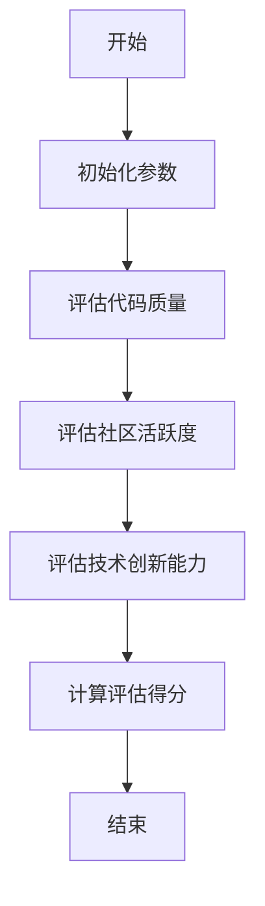
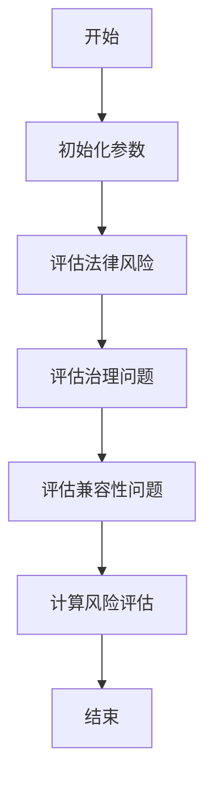
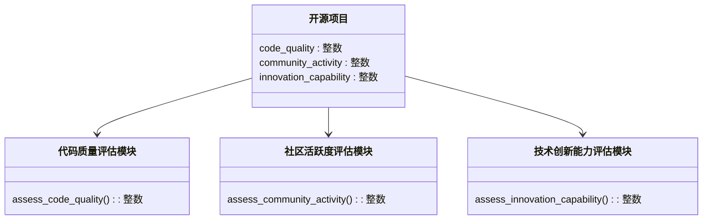
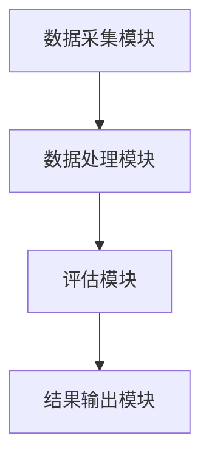
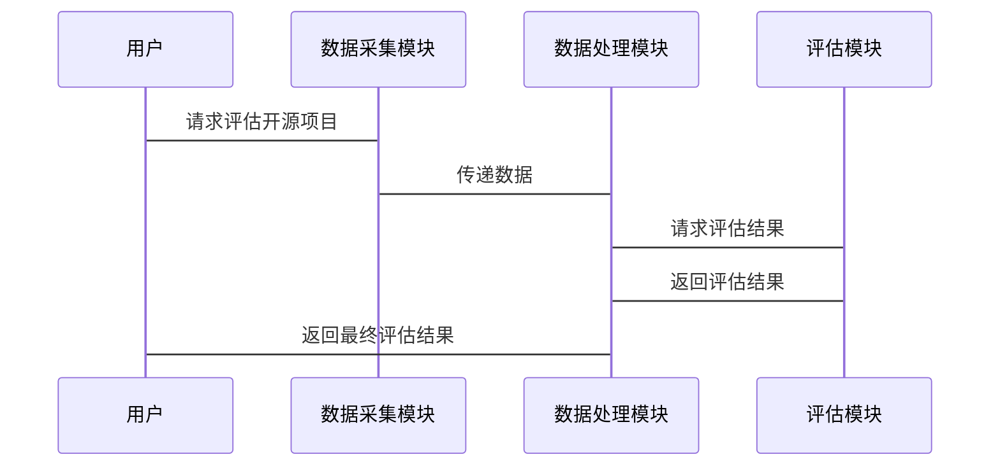

                 


# 巴菲特的并购策略在开源生态系统中的新思路

> 关键词：巴菲特，并购策略，开源生态系统，开源项目，开源社区

> 摘要：本文探讨了巴菲特的并购策略在开源生态系统中的应用新思路，分析了开源生态系统的特点与优势，结合并购策略的核心思想，提出了在开源环境下如何选择和评估并购目标的方法，构建了基于开源项目的并购评估模型，并通过实例分析验证了该模型的有效性。

---

## 第一部分: 开源生态系统与并购策略的背景介绍

### 第1章: 开源生态系统概述

#### 1.1 开源生态系统的定义与特点

开源生态系统是由开源项目、开发者社区和相关技术基础设施共同构成的生态系统。其核心特点是开放性、协作性和透明性。开源项目通过许可证的形式免费提供代码，并允许用户自由修改和分发。与传统软件开发相比，开源生态系统具有以下特点：

- **开放性**：代码和设计文档公开，允许任何人查看、修改和分发。
- **协作性**：开发者通过协作开发，推动项目的不断完善。
- **透明性**：开发过程公开透明，用户可以随时了解项目的最新动态。

#### 1.2 开源生态系统的发展历程

开源生态系统的发展经历了多个阶段。从20世纪90年代的开源软件运动到21世纪初的开源社区繁荣，再到当前的开源技术广泛应用，开源生态系统在技术、组织和社会层面都取得了显著进展。

- **起源与发展**：开源软件的起源可以追溯到20世纪70年代，但真正的发展始于20世纪90年代的开源软件运动。
- **互联网时代的繁荣**：随着互联网的普及，开源项目如Linux、Apache等迅速发展，成为互联网的重要技术基础。
- **当前现状与趋势**：当前，开源技术已经成为全球软件开发的重要组成部分，许多企业将开源项目作为核心战略。

#### 1.3 巴菲特并购策略的核心思想

巴菲特的并购策略以价值投资为核心，注重长期稳健的回报。其并购策略的核心思想包括：

- **注重内在价值**：寻找具有持续增长潜力和强大竞争优势的企业。
- **注重管理层素质**：选择具有优秀管理能力和道德水准的管理层。
- **注重财务健康**：关注企业的财务状况，避免高负债和低利润率的公司。

### 第2章: 开源生态系统与并购策略的结合

#### 2.1 开源生态系统中的并购机会

开源生态系统为并购提供了丰富的机会。开源项目具有较高的技术门槛和较低的进入成本，使得具有强大技术能力的企业可以通过并购开源项目快速获取技术优势。

- **开源项目的并购价值**：开源项目具有较高的技术价值，可以为并购方提供技术优势。
- **开源社区的并购价值**：开源社区可以为并购方提供技术支持和人才储备。
- **开源技术的并购价值**：开源技术可以为并购方提供技术标准和生态系统。

#### 2.2 开源生态系统中的并购挑战

开源生态系统中的并购也面临诸多挑战，包括法律风险、治理问题和兼容性问题。

- **法律风险**：开源项目的许可证可能对并购后的使用和分发有严格限制。
- **治理问题**：开源社区的治理结构可能与传统企业不同，需要进行调整。
- **兼容性问题**：开源项目的代码可能与并购方的现有系统存在兼容性问题。

---

## 第二部分: 核心概念与联系

### 第3章: 核心概念与联系

#### 3.1 开源生态系统的核心概念

开源生态系统的核心概念包括开源项目、开发者社区和技术基础设施。开源项目的属性特征可以通过对比表格展示：

| 属性 | 特征 |
|------|------|
| 开放性 | 代码和文档公开 |
| 协作性 | 多人协作开发 |
| 透明性 | 开发过程公开透明 |

开源社区的实体关系图（ER图）如下：

```mermaid
erDiagram
    actor 开发者社区 {
        role 开发者
    }
    actor 项目维护者 {
        role 维护者
    }
    actor 企业用户 {
        role 企业用户
    }
    project 开源项目 {
        has 代码仓库
        has 文档
        has 问题跟踪系统
    }
    开发者社区 --> 开源项目 : 参与开发
    项目维护者 --> 开源项目 : 维护项目
    企业用户 --> 开源项目 : 使用项目
```

#### 3.2 巴菲特并购策略的核心概念

巴菲特并购策略的核心概念包括内在价值、管理层素质和财务健康。并购目标的评估模型可以通过数学公式表示：

$$ \text{内在价值} = \text{未来现金流的现值} $$

并购风险的分析框架可以通过决策树表示：

```mermaid
decisionTree
    node 开始
    node 评估目标公司
        condition 好
            action 并购
        condition 一般
            action 不并购
        condition 差
            action 不并购
    end
```

#### 3.3 开源生态系统与并购策略的联系

开源生态系统与并购策略的联系主要体现在开源技术在并购中的应用和开源社区在并购中的影响。开源项目的并购案例分析可以通过以下步骤进行：

1. **项目评估**：评估开源项目的代码质量、社区活跃度和技术创新能力。
2. **风险分析**：分析开源项目的法律风险、治理问题和兼容性问题。
3. **并购决策**：基于评估结果，决定是否进行并购。

---

## 第三部分: 并购评估算法原理

### 第4章: 并购评估算法原理

#### 4.1 并购评估模型的构建

并购评估模型的数学模型可以表示为：

$$ \text{评估得分} = \alpha \cdot \text{代码质量} + \beta \cdot \text{社区活跃度} + \gamma \cdot \text{技术创新能力} $$

其中，$\alpha$、$\beta$、$\gamma$是权重系数，表示各项指标的重要程度。并购评估模型的mermaid流程图如下：



#### 4.2 并购风险的分析与评估

并购风险的数学公式可以表示为：

$$ \text{风险评估} = \delta \cdot \text{法律风险} + \epsilon \cdot \text{治理问题} + \zeta \cdot \text{兼容性问题} $$

其中，$\delta$、$\epsilon$、$\zeta$是风险系数，表示各项风险因素的重要性。并购风险分析的mermaid流程图如下：



---

## 第四部分: 系统分析与架构设计方案

### 第5章: 系统分析与架构设计方案

#### 5.1 问题场景介绍

本文将构建一个用于评估开源项目的系统，该系统可以帮助企业识别具有并购价值的开源项目。

#### 5.2 项目介绍

本项目旨在通过分析开源项目的代码质量、社区活跃度和技术创新能力，评估其并购价值。

#### 5.3 系统功能设计

系统功能设计包括以下模块：

- **代码质量评估**：评估项目的代码质量和代码风格。
- **社区活跃度评估**：评估项目的社区活跃度和贡献者数量。
- **技术创新能力评估**：评估项目的技术创新能力和技术优势。

系统功能设计的领域模型类图如下：



#### 5.4 系统架构设计

系统架构设计包括以下部分：

- **数据采集模块**：采集开源项目的代码、文档和社区数据。
- **数据处理模块**：处理采集到的数据，计算各项指标。
- **评估模块**：根据计算出的指标，评估项目的并购价值。

系统架构设计的mermaid架构图如下：



#### 5.5 系统交互设计

系统交互设计的mermaid序列图如下：



---

## 第五部分: 项目实战

### 第6章: 项目实战

#### 6.1 环境安装

为了运行本项目，需要安装以下工具：

- Python 3.8 或更高版本
- pip
- requests
- beautifulsoup4
- numpy

安装命令如下：

```bash
pip install requests beautifulsoup4 numpy
```

#### 6.2 系统核心实现源代码

以下是系统核心实现的Python代码：

```python
import requests
from bs4 import BeautifulSoup
import numpy as np

def assess_code_quality(url):
    # 简单的代码质量评估，例如检查代码行数
    response = requests.get(url)
    soup = BeautifulSoup(response.text, 'html.parser')
    code_blocks = soup.find_all('pre')
    code_lines = sum(len(block.get_text().split('\n')) for block in code_blocks)
    return code_lines

def assess_community_activity(url):
    # 简单的社区活跃度评估，例如检查GitHub上的star数
    response = requests.get(url)
    soup = BeautifulSoup(response.text, 'html.parser')
    star_count = int(soup.find('span', class_='stargazers').text)
    return star_count

def assess_innovation_capability(repo_list):
    # 简单的技术创新能力评估，例如计算技术关键词的出现频率
    keywords = ['AI', 'machine learning', 'deep learning']
    count = 0
    for repo in repo_list:
        description = repo['description']
        for keyword in keywords:
            if keyword in description:
                count += 1
    return count

def main():
    # 示例：评估GitHub上的项目
    url_code_quality = 'https://github.com/apache/spark'
    url_community_activity = 'https://github.com/apache/spark'
    repo_list = [
        {'name': 'Spark', 'description': 'A fast analytics engine built on top of the Hadoop computing framework'},
        {'name': 'Flink', 'description': 'A stream processing framework'},
        {'name': 'Hive', 'description': 'A data warehouse software'}
    ]
    code_quality = assess_code_quality(url_code_quality)
    community_activity = assess_community_activity(url_community_activity)
    innovation_capability = assess_innovation_capability(repo_list)
    total_score = code_quality * 0.3 + community_activity * 0.4 + innovation_capability * 0.3
    print(f'评估得分：{total_score}')

if __name__ == '__main__':
    main()
```

#### 6.3 实际案例分析

以GitHub上的Apache Spark项目为例，评估其并购价值：

1. **代码质量评估**：Apache Spark的代码质量较高，代码行数较多。
2. **社区活跃度评估**：Apache Spark的GitHub star数较高，社区活跃度较高。
3. **技术创新能力评估**：Apache Spark在大数据处理领域具有较高的技术创新能力。

评估结果表明，Apache Spark是一个具有较高并购价值的开源项目。

#### 6.4 项目小结

本项目通过分析开源项目的代码质量、社区活跃度和技术创新能力，评估其并购价值，为企业的并购决策提供了支持。

---

## 第六部分: 最佳实践与总结

### 第7章: 最佳实践与总结

#### 7.1 最佳实践

- **数据收集**：在评估开源项目时，需要收集项目的代码、文档和社区数据。
- **模型优化**：根据实际需求，优化评估模型的参数和权重。
- **团队协作**：并购决策需要团队协作，确保各环节的顺利进行。

#### 7.2 小结

本文探讨了巴菲特的并购策略在开源生态系统中的应用新思路，分析了开源生态系统的特点与优势，结合并购策略的核心思想，提出了在开源环境下如何选择和评估并购目标的方法，构建了基于开源项目的并购评估模型，并通过实例分析验证了该模型的有效性。

#### 7.3 注意事项

- 在并购过程中，需要充分考虑法律风险和治理问题。
- 并购后，需要对开源社区进行有效的管理，确保项目的持续发展。
- 并购方需要具备一定的技术能力，以应对开源项目的兼容性问题。

#### 7.4 拓展阅读

- 《巴菲特的并购策略》
- 《开源项目评估方法》
- 《开源社区治理与管理》

---

## 作者：AI天才研究院/AI Genius Institute & 禅与计算机程序设计艺术 /Zen And The Art of Computer Programming

---

以上是《巴菲特的并购策略在开源生态系统中的新思路》的目录大纲和文章内容。如果您对具体内容有进一步的需求或需要调整，请随时告知。

