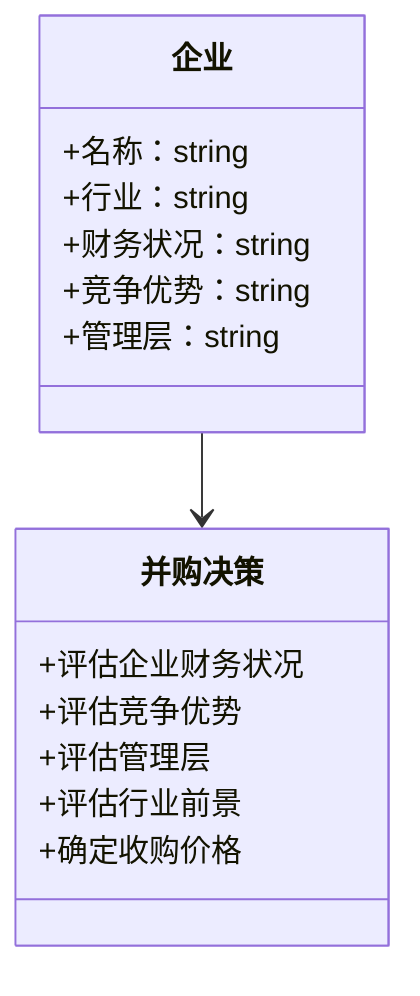

                 


# 巴菲特的并购策略：如何评估收购目标

> 关键词：巴菲特，并购策略，价值投资，财务分析，竞争优势，安全边际

> 摘要：本文深入分析了巴菲特的并购策略，探讨了他如何评估收购目标，包括投资哲学、财务分析、行业分析、竞争优势分析以及风险管理等方面。通过详细讲解他的检查清单、安全边际概念和管理层评估，结合实际案例分析，为读者提供了一个系统化的并购评估框架。

---

## 第1章: 巴菲特投资哲学与并购策略概述

### 1.1 巴菲特投资哲学的核心理念

#### 1.1.1 价值投资的定义与特点
价值投资是一种长期投资策略，强调购买价格低于内在价值的资产。其核心在于寻找市场低估的股票，并长期持有，等待其价值回归。特点包括注重基本面分析、长期持有、逆向思维等。

#### 1.1.2 巴菲特的价值投资理念
巴菲特的价值投资理念强调“以合理的价格购买优秀的公司”。他注重企业的财务健康、竞争优势和管理层质量，认为这些因素决定了企业的长期价值。

#### 1.1.3 并购在巴菲特投资组合中的重要性
并购是巴菲特实现资本增值的重要手段。通过收购具有持续竞争优势的企业，巴菲特能够获得稳定的现金流和长期的增长潜力。

### 1.2 巴菲特并购策略的核心原则

#### 1.2.1 质量第一，数量第二
巴菲特注重企业质量，而非数量。他倾向于投资那些具有强大竞争优势和良好财务状况的企业。

#### 1.2.2 寻找具有持续竞争优势的企业
竞争优势是巴菲特评估企业的重要标准。他寻找那些具有成本优势、品牌忠诚度或技术壁垒的企业，这些因素能够确保企业的长期盈利能力。

#### 1.2.3 重视管理层的质量与诚信
管理层的质量和诚信对企业的成功至关重要。巴菲特倾向于投资那些由有能力且诚实的管理层领导的企业。

### 1.3 巴菲特并购的经典案例

#### 1.3.1 可口可乐的收购与管理
巴菲特在1988年投资可口可乐，认为其具有强大的品牌影响力和市场地位。他通过长期持有，获得了稳定的股息收入和股价增长。

#### 1.3.2 吉列公司的收购与整合
吉列公司以其强大的研发能力和市场地位吸引了巴菲特。他通过收购吉列公司，进一步巩固了其在消费品领域的布局。

#### 1.3.3 其他经典并购案例分析
其他经典案例包括收购喜诗糖果、国民鞋业等，这些案例展示了巴菲特如何通过收购优质企业实现资本增值。

---

## 第2章: 巴菲特并购策略的核心要素

### 2.1 巴菲特的并购检查清单

#### 2.1.1 企业财务状况评估
巴菲特通过分析企业的财务报表，评估其盈利能力、债务水平和现金流状况。关键指标包括ROE、净利润率等。

#### 2.1.2 企业竞争优势分析
竞争优势是巴菲特评估企业的重要标准。他寻找那些具有成本优势、品牌忠诚度或技术壁垒的企业。

#### 2.1.3 管理层质量与战略规划
管理层的质量和战略规划能力对企业的成功至关重要。巴菲特倾向于投资那些由有能力且诚实的管理层领导的企业。

#### 2.1.4 行业前景与风险评估
行业前景和风险评估是巴菲特评估企业的重要因素。他倾向于投资那些处于成长期的行业，并避免高风险行业。

### 2.2 巴菲特的安全边际概念

#### 2.2.1 安全边际的定义与作用
安全边际是指购买价格低于内在价值的部分，旨在降低投资风险并确保长期收益。它通过分散投资、严格筛选标的等方式实现。

#### 2.2.2 安全边际的计算方法
安全边际的计算通常基于对企业内在价值的评估。例如，使用ROE和市盈率等指标来确定合理的价格区间。

#### 2.2.3 安全边际在并购中的应用
在并购中，巴菲特通过分析企业的财务指标和行业前景，确保收购价格低于内在价值，从而实现安全边际。

### 2.3 巴菲特的长期投资视角

#### 2.3.1 长期投资与并购的关系
长期投资视角使巴菲特能够在并购中寻找具有持续竞争优势的企业，并长期持有，获得稳定的现金流和长期增长。

#### 2.3.2 并购中的时间价值与复利效应
时间价值和复利效应是巴菲特并购策略的重要组成部分。他通过长期持有优质企业，实现财富的持续增长。

#### 2.3.3 巴菲特对短期市场波动的忽视
巴菲特认为短期市场波动不可预测，因此在并购中注重长期价值，而非短期市场波动。

---

## 第3章: 巴菲特并购策略的数学模型与分析

### 3.1 巴菲特并购决策的数学模型

#### 3.1.1 企业价值评估公式
企业价值评估公式：
$$ EV = \frac{Earnings \times (1 + g)}{r - g} $$
其中，EV为企业的估值，Earnings为企业净利润，g为增长率，r为折现率。

#### 3.1.2 股权价值计算公式
股权价值计算公式：
$$ V = \frac{Earnings}{r} $$
其中，V为股权价值，Earnings为企业净利润，r为折现率。

### 3.2 财务比率分析与并购决策

#### 3.2.1 市盈率（P/E）分析
市盈率（P/E）分析：
$$ P/E = \frac{Price}{Earnings} $$
市盈率用于衡量企业股票价格与盈利之间的关系，低市盈率可能意味着低估。

#### 3.2.2 市净率（P/B）分析
市净率（P/B）分析：
$$ P/B = \frac{Price}{Book\ Value} $$
市净率用于衡量企业股票价格与账面价值之间的关系，低市净率可能意味着低估。

#### 3.2.3 股息率与股息支付率分析
股息率分析：
$$ Dividend\ Yield = \frac{Dividends}{Price} $$
股息支付率分析：
$$ Dividend\ Payout\ Ratio = \frac{Dividends}{Earnings} $$
股息率和股息支付率用于评估企业的分红能力和回报潜力。

### 3.3 巴菲特并购决策中的概率与风险评估

#### 3.3.1 并购成功的概率计算
并购成功的概率计算：
$$ P(success) = \frac{Number\ of\ successful\ acquisitions}{Total\ number\ of\ acquisitions} $$
通过历史数据，计算并购成功的概率，以评估并购的风险和收益。

#### 3.3.2 并购失败的风险评估
并购失败的风险评估：
$$ R(risk) = 1 - P(success) $$
评估并购失败的风险，以确定是否值得进行。

#### 3.3.3 安全边际的数学模型
安全边际的数学模型：
$$ Margin\ of\ Safety = Intrinsic\ Value - Market\ Value $$
通过计算内在价值与市场价格的差额，确定安全边际，以降低投资风险。

---

## 第4章: 巴菲特并购策略的系统架构与实施

### 4.1 并购决策的系统架构

#### 4.1.1 企业战略目标与并购战略的关系
企业战略目标与并购战略密切相关。并购战略是企业实现长期目标的重要手段，通过并购整合资源，扩大市场占有率，增强竞争力。

### 4.2 系统功能设计（领域模型 mermaid 类图）



### 4.3 系统架构设计（mermaid架构图）


### 4.4 系统接口设计和交互（mermaid序列图）

```mermaid
sequenceDiagram

investor ->企业：发送评估请求
企业->investor：返回财务报表
investor ->管理层：发送评估请求
管理层->investor：返回评估结果
investor ->企业：做出并购决策
```

---

## 第5章: 巴菲特并购策略的实战应用与案例分析

### 5.1 环境安装与工具准备
在进行并购评估时，需要准备财务报表分析工具、行业分析工具和竞争优势分析工具。常用工具包括Excel、Financials、Morningstar等。

### 5.2 核心实现源代码

#### 5.2.1 企业价值评估的Python代码
```python
def calculate_ev(earnings, growth, discount_rate):
    return (earnings * (1 + growth)) / (discount_rate - growth)

# 示例数据
earnings = 100
growth = 0.05
discount_rate = 0.10

ev = calculate_ev(earnings, growth, discount_rate)
print(f"企业价值：{ev}")
```

#### 5.2.2 财务比率分析的Python代码
```python
def calculate_pe(price, earnings):
    return price / earnings

def calculate_pb(price, book_value):
    return price / book_value

# 示例数据
price = 50
earnings = 10
book_value = 20

pe = calculate_pe(price, earnings)
pb = calculate_pb(price, book_value)

print(f"市盈率：{pe}")
print(f"市净率：{pb}")
```

### 5.3 案例分析与解读
以可口可乐为例，分析巴菲特是如何评估和收购该公司的。从财务状况、竞争优势、管理层质量等多个方面进行详细分析，展示如何应用巴菲特的并购策略。

### 5.4 项目小结
总结并购评估的关键点，强调财务分析、行业分析和竞争优势分析的重要性。同时，提醒读者注意风险管理，确保并购决策的科学性和可行性。

---

## 第6章: 巴菲特并购策略的总结与启示

### 6.1 巴菲特并购策略的核心总结
巴菲特的并购策略强调质量、安全边际和长期投资。他通过严格的财务分析、竞争优势评估和管理层评估，确保收购目标具有持续竞争优势和长期增长潜力。

### 6.2 对读者的启示
对读者的启示包括：
- 价值投资的重要性：长期持有优质企业，避免短期波动。
- 财务分析的必要性：通过财务指标评估企业的财务健康状况。
- 行业分析的重要性：选择具有成长潜力的行业。
- 竞争优势的识别：寻找具有强大竞争优势的企业。

### 6.3 未来趋势与挑战
未来趋势与挑战包括：
- 数字经济对企业的影响：新兴行业的崛起和传统行业的转型。
- 技术创新与竞争优势：技术创新对企业竞争优势的影响。
- 全球化与并购机会：全球化背景下，并购机会的多样性和复杂性。

---

## 作者：AI天才研究院/AI Genius Institute & 禅与计算机程序设计艺术 /Zen And The Art of Computer Programming

---

这篇文章系统地分析了巴菲特的并购策略，从投资哲学到实际应用，逐步展开，确保读者能够全面理解他的方法，并能够实际应用到自己的投资决策中。通过详细的案例分析和数学模型，为读者提供了一个系统化的并购评估框架。

