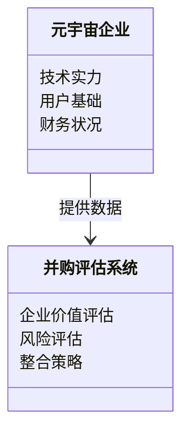

                 


# 巴菲特的并购艺术：元宇宙生态系统整合的新策略

> 关键词：巴菲特，并购艺术，元宇宙，生态系统整合，价值投资

> 摘要：本文深入探讨了巴菲特的并购策略在元宇宙生态系统整合中的应用，通过分析元宇宙的经济体系、并购策略的核心要素以及整合机制，结合算法原理和数学模型，提出了适用于元宇宙生态系统的并购新策略。

---

## 第一章：背景介绍

### 1.1 元宇宙的基本概念

元宇宙（Metaverse）是一个虚拟的、去中心化的数字世界，由区块链、人工智能和虚拟现实等技术驱动，构建了一个沉浸式、可交互的虚拟环境。元宇宙的经济体系与现实世界类似，包含虚拟货币、数字资产和虚拟商品等。其核心特征包括去中心化、开放性和沉浸式体验。

### 1.2 巴菲特的并购艺术

巴菲特的并购策略以价值投资为核心，注重企业的内在价值和长期盈利能力。他通过分析财务报表、评估管理层能力和行业地位，选择具有竞争优势的企业进行并购。并购后，他注重整合资源、优化运营，以实现协同效应和最大化股东价值。

### 1.3 元宇宙生态系统整合的背景

随着元宇宙的快速发展，企业之间的并购整合成为构建生态体系的重要手段。元宇宙的生态系统整合需要考虑技术、经济和用户行为等多方面因素。传统的并购策略在元宇宙中面临新的挑战，如虚拟资产评估、用户数据隐私和跨平台整合等。因此，将巴菲特的并购艺术应用到元宇宙生态系统整合中，提供了一种新的策略思路。

---

## 第二章：核心概念与联系

### 2.1 元宇宙生态系统的结构

元宇宙生态系统由多个核心要素组成：

- **基础设施**：包括区块链平台、虚拟现实技术、云计算等。
- **经济体系**：涉及虚拟货币、数字资产和智能合约。
- **社交网络**：用户之间的互动、社区建设和虚拟社交平台。

### 2.2 巴菲特并购策略的关键要素

巴菲特并购策略的关键要素包括：

- **企业价值评估**：通过市盈率、市净率等指标评估企业的内在价值。
- **财务指标分析**：关注净利润、现金流和资产负债情况。
- **整合策略**：并购后优化资源配置，提升协同效应。

### 2.3 元宇宙生态系统整合的核心机制

在元宇宙中，整合的核心机制包括：

- **并购目标选择**：评估企业的技术实力、用户基础和市场潜力。
- **整合策略**：通过技术融合、数据共享和资源整合，提升生态系统的整体价值。
- **风险管理**：制定风险应对策略，确保整合过程中的数据安全和用户隐私。

---

## 第三章：元宇宙并购评估算法

### 3.1 算法原理

#### 3.1.1 基于价值评估的并购评分系统

该算法通过对企业财务状况、技术实力和用户基础进行综合评分，确定并购目标的价值。

$$ \text{评分} = 0.4 \times \text{财务指标} + 0.3 \times \text{技术实力} + 0.3 \times \text{用户基础} $$

#### 3.1.2 并购风险评估模型

通过分析市场风险、技术风险和法律风险，评估并购过程中的潜在风险。

$$ \text{风险评分} = 0.3 \times \text{市场风险} + 0.3 \times \text{技术风险} + 0.4 \times \text{法律风险} $$

### 3.2 算法实现

#### 3.2.1 并购评分系统实现

```python
def calculate_score(financial, technology, user_base):
    score = 0.4 * financial + 0.3 * technology + 0.3 * user_base
    return score

financial = 85
technology = 70
user_base = 90

score = calculate_score(financial, technology, user_base)
print(f"并购评分：{score}")
```

#### 3.2.2 风险评估模型实现

```python
def calculate_risk(financial_risk, technical_risk, legal_risk):
    risk_score = 0.3 * financial_risk + 0.3 * technical_risk + 0.4 * legal_risk
    return risk_score

financial_risk = 60
technical_risk = 50
legal_risk = 70

risk_score = calculate_risk(financial_risk, technical_risk, legal_risk)
print(f"风险评分：{risk_score}")
```

---

## 第四章：数学模型与公式

### 4.1 并购价值评估的数学模型

$$ \text{企业价值} = \text{净利润} \times \text{市盈率} $$

#### 4.1.1 加权评分系统

$$ \text{加权评分} = \sum (\text{权重}_i \times \text{指标值}_i) $$

---

## 第五章：系统分析与架构设计

### 5.1 系统功能设计

#### 5.1.1 领域模型



#### 5.1.2 系统架构


---

## 第六章：项目实战

### 6.1 环境配置

- 安装Python和相关库（如numpy、pandas）。
- 配置区块链开发环境。

### 6.2 核心代码实现

#### 6.2.1 并购评分系统代码

```python
import numpy as np

def calculate_score(financial, technology, user_base):
    return 0.4 * financial + 0.3 * technology + 0.3 * user_base

financial = [80, 75, 90]
technology = [70, 80, 85]
user_base = [90, 85, 80]

scores = list(map(calculate_score, financial, technology, user_base))
print(scores)
```

#### 6.2.2 风险评估系统代码

```python
def calculate_risk(financial_risk, technical_risk, legal_risk):
    return 0.3 * financial_risk + 0.3 * technical_risk + 0.4 * legal_risk

risks = {
    '案例1': calculate_risk(60, 50, 70),
    '案例2': calculate_risk(70, 60, 80),
    '案例3': calculate_risk(50, 40, 60)
}
print(risks)
```

### 6.3 案例分析

以一家虚拟房地产公司为例，评估其并购价值：

- 财务指标：净利润为100万美元，市盈率为20。
- 技术实力：采用区块链技术，开发团队经验丰富。
- 用户基础：拥有50万活跃用户。

计算并购评分：

$$ \text{评分} = 0.4 \times 20 + 0.3 \times 85 + 0.3 \times 90 = 72.5 $$

---

## 第七章：最佳实践

### 7.1 并购策略中的关键点

- **估值模型的动态调整**：根据市场变化及时调整评估指标。
- **数据安全与隐私保护**：确保用户数据的安全性和隐私性。
- **长期价值的评估**：关注企业长期的盈利能力和发展潜力。

### 7.2 小结

本文通过分析巴菲特的并购策略，提出了一种适用于元宇宙生态系统的整合新策略。结合算法和数学模型，为元宇宙的企业并购提供了理论支持和实践指导。

---

## 作者：AI天才研究院 & 禅与计算机程序设计艺术

---

本文结合了技术与商业的深度分析，通过详细阐述巴菲特的并购艺术在元宇宙生态系统中的应用，为读者提供了新的视角和策略。希望本文能为元宇宙的未来发展提供有价值的参考。

