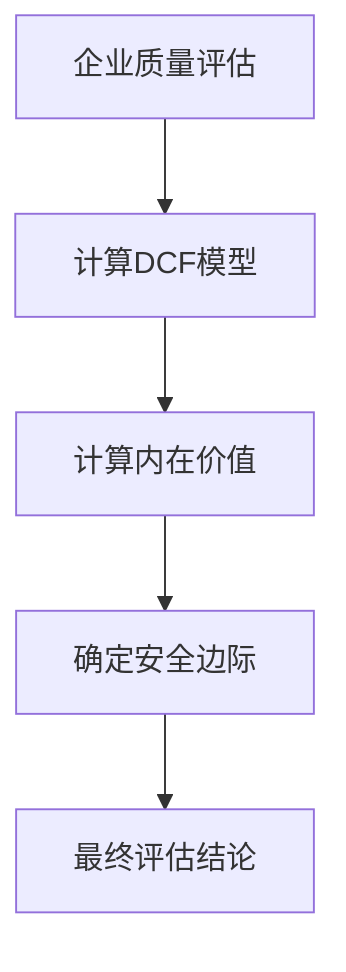
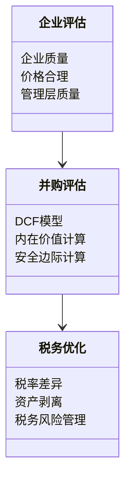
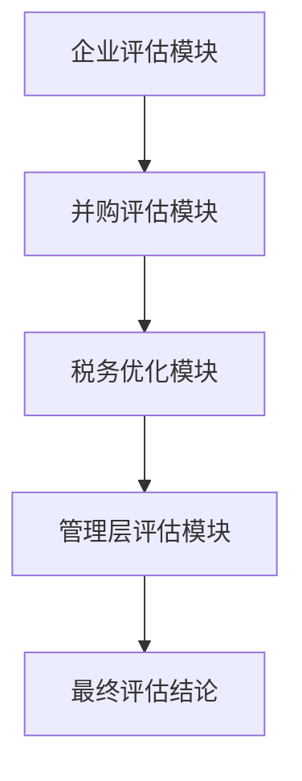

                 


```markdown
# 巴菲特的并购艺术：如何通过并购创造股东价值

> 关键词：巴菲特，并购，股东价值，投资理念，企业评估，税务优化

> 摘要：本文深入分析了巴菲特的并购策略和方法，探讨了如何通过并购创造股东价值。文章从巴菲特的投资理念出发，详细讲解了并购的核心标准、评估方法、税务优化策略以及成功案例。通过数学模型和系统架构设计，结合实际案例分析，为读者提供了全面的并购策略指南。

---

# 第一部分: 巴菲特并购艺术的核心理念

## 第1章: 背景介绍：并购的基本概念与巴菲特的投资理念

### 1.1 并购的基本概念

#### 1.1.1 什么是并购
- **定义**：并购是指一家企业通过购买其他企业的股权或资产，以实现战略目标的过程。
- **类型**：横向并购、纵向并购、混合并购。
- **特点**：资源整合、协同效应、市场扩张。

#### 1.1.2 并购的动机与目的
- **动机**：扩大市场份额、获取技术优势、优化资产结构。
- **目的**：提升企业竞争力、实现规模效应、创造股东价值。

### 1.2 巴菲特的投资理念

#### 1.2.1 价值投资理论
- **核心思想**：买入低于内在价值的股票，长期持有。
- **护城河概念**：寻找具有强大竞争优势的企业。
- **安全边际**：以低于内在价值的价格买入，降低风险。

#### 1.2.2 并购哲学
- **并购标准**：质量、价格、管理层。
- **并购动机**：寻找低估的优质资产，长期持有。
- **并购目标**：创造股东价值，实现长期收益。

---

## 第2章: 巴菲特并购的核心标准与评估方法

### 2.1 巴菲特并购的核心标准

#### 2.1.1 企业质量：护城河的构建与评估
- **护城河类型**：成本优势、品牌优势、技术优势、网络效应。
- **评估方法**：通过市场份额、利润率、ROE等指标评估企业竞争力。
- **案例分析**：可口可乐的护城河分析。

#### 2.1.2 价格合理：安全边际的计算与应用
- **安全边际公式**：安全边际 = 价格 < 内在价值 × 价格系数。
- **内在价值计算**：DCF模型、资产重置价值、清算价值。
- **案例分析**：吉列公司并购中的安全边际应用。

#### 2.1.3 管理层质量：管理层的诚信与能力
- **管理层评估**：管理层的历史表现、决策能力、企业忠诚度。
- **激励机制**：股权激励、绩效奖金、长期目标。
- **案例分析**：巴菲特对管理层的信任与合作。

### 2.2 并购评估的数学模型与公式

#### 2.2.1 企业价值评估的DCF模型
- **公式**：
  $$企业价值 = \sum_{t=1}^{n} \frac{CF_t}{(1+r)^t} + \frac{TV}{(1+r)^n}$$
  其中，CF_t为自由现金流，r为折现率，TV为终值。

#### 2.2.2 内在价值计算公式
- **公式**：
  $$内在价值 = \frac{DCF + 剩余价值}{折扣率}$$

#### 2.2.3 安全边际计算公式
- **公式**：
  $$安全边际 = 价格 < 内在价值 \times 价格系数$$

### 2.3 巴菲特并购评估方法的Mermaid流程图


---

## 第3章: 巴菲特并购的税务优化与杠杆策略

### 3.1 税务优化的并购策略

#### 3.1.1 利用税率差异进行税务优化
- **税率差异**：通过不同地区的税率差异降低税负。
- **资产剥离与重组**：通过重组优化税务负担。

#### 3.1.2 利用资产剥离与重组优化税务
- **资产剥离**：出售高税负资产，降低整体税负。
- **重组优化**：通过重组调整资产结构，降低税务风险。

#### 3.1.3 税务风险的评估与管理
- **税务风险评估**：评估并购中的税务风险，制定应对策略。
- **税务管理**：建立税务管理系统，监控税务风险。

### 3.2 杠杆在并购中的应用

#### 3.2.1 杠杆并购的定义与特点
- **定义**：利用杠杆（债务）进行并购，降低资本成本。
- **特点**：高杠杆、高风险、高回报。

#### 3.2.2 杠杆并购的风险与收益
- **风险**：债务负担加重，可能引发财务危机。
- **收益**：通过杠杆效应，放大收益。

#### 3.2.3 巴菲特对杠杆并购的态度
- **态度**：谨慎使用杠杆，并购后保持稳健的财务结构。
- **案例分析**：巴菲特并购中的杠杆应用。

---

## 第4章: 巴菲特并购的成功案例分析

### 4.1 可口可乐并购案

#### 4.1.1 案例背景与并购动机
- **背景**：可口可乐的市场地位和盈利能力。
- **并购动机**：巴菲特点购可口可乐，看重其强大的品牌和护城河。

#### 4.1.2 并购后的整合与管理
- **整合策略**：保持可口可乐的独立运营，优化管理。
- **管理模式**：长期持有，稳定投资收益。

#### 4.1.3 并购对股东价值的影响
- **股东价值提升**：通过并购实现长期收益。
- **案例分析**：可口可乐并购后的股价表现。

### 4.2 吉列公司并购案

#### 4.2.1 案例背景与并购动机
- **背景**：吉列公司的剃须刀业务和品牌优势。
- **并购动机**：巴菲认同吉列的商业模式和护城河。

#### 4.2.2 并购后的整合与管理
- **整合策略**：保持吉列的独立运营，优化供应链。
- **管理模式**：长期持有，稳定投资收益。

#### 4.2.3 并购对股东价值的影响
- **股东价值提升**：通过并购实现长期收益。
- **案例分析**：吉列公司并购后的股价表现。

---

## 第5章: 巴菲特并购的数学模型与公式

### 5.1 企业价值评估模型

#### 5.1.1 DCF模型的应用
- **公式**：
  $$企业价值 = \sum_{t=1}^{n} \frac{CF_t}{(1+r)^t} + \frac{TV}{(1+r)^n}$$
  其中，CF_t为自由现金流，r为折现率，TV为终值。

#### 5.1.2 内在价值计算公式
- **公式**：
  $$内在价值 = \frac{DCF + 剩余价值}{折扣率}$$

#### 5.1.3 安全边际计算公式
- **公式**：
  $$安全边际 = 价格 < 内在价值 \times 价格系数$$

---

## 第6章: 巴菲特并购的系统架构设计

### 6.1 系统功能设计

#### 6.1.1 领域模型Mermaid类图


#### 6.1.2 系统架构Mermaid架构图


---

## 第7章: 巴菲特并购的项目实战

### 7.1 环境安装与数据准备

#### 7.1.1 环境安装
- **工具安装**：安装Python、Mermaid、Jupyter Notebook。
- **数据准备**：收集目标企业的财务数据、行业数据。

### 7.2 核心实现与代码实现

#### 7.2.1 并购评估代码实现
```python
def calculate_intrinsic_value(enterprise_value, discounted_cash_flows, terminal_value, discount_rate):
    present_value_of_discounted_cash_flows = sum([DCF / (1 + discount_rate)**t for t, DCF in enumerate(discounted_cash_flows)])
    present_value_of_terminal_value = terminal_value / (1 + discount_rate)**len(discounted_cash_flows)
    intrinsic_value = (present_value_of_discounted_cash_flows + present_value_of_terminal_value) / (1 - 1/(1 + discount_rate)**len(discounted_cash_flows))
    return intrinsic_value
```

#### 7.2.2 税务优化代码实现
```python
def calculate_tax_optimization(tax_rate, income_before_tax):
    tax_savings = income_before_tax * (1 - tax_rate)
    return tax_savings
```

### 7.3 案例分析与结果解读

#### 7.3.1 案例分析
- **案例背景**：假设并购一家制造企业，财务数据如下：
  - 自由现金流：$100万
  - 折现率：8%
  - 终值：$500万
  - 内在价值：$1,250万
  - 安全边际：$1,000万

- **计算过程**：
  $$DCF = \sum_{t=1}^{5} \frac{100}{(1+0.08)^t} = 396.46$$
  $$TV = \frac{500}{(1+0.08)^5} = 298.05$$
  $$内在价值 = \frac{396.46 + 298.05}{0.08} = 1,250.51万$$
  $$安全边际 = 1,000 < 1,250.51$$

#### 7.3.2 结果解读
- **内在价值**：企业的内在价值为$1,250.51万。
- **安全边际**：以$1,000万的价格并购，低于内在价值，具有安全边际。

---

## 第8章: 总结与展望

### 8.1 总结
- **核心总结**：巴菲特并购的核心在于质量、价格和管理层。
- **成功因素**：通过价值投资理念、安全边际和税务优化实现股东价值最大化。

### 8.2 展望
- **未来趋势**：并购在企业扩张中的重要性将持续增加。
- **技术应用**：大数据和人工智能在并购评估中的应用将越来越广泛。

---

## 作者信息

作者：AI天才研究院/AI Genius Institute & 禅与计算机程序设计艺术/Zen And The Art of Computer Programming

---

* 本文旨在通过系统的分析和实践，帮助读者理解巴菲特的并购艺术，并通过实际案例和数学模型，提供创造股东价值的并购策略。

