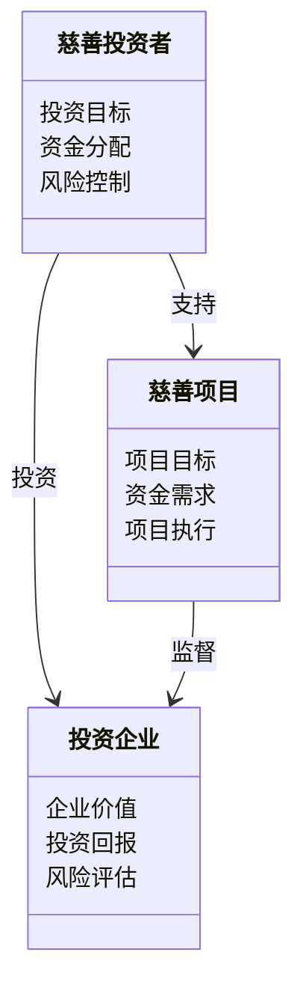
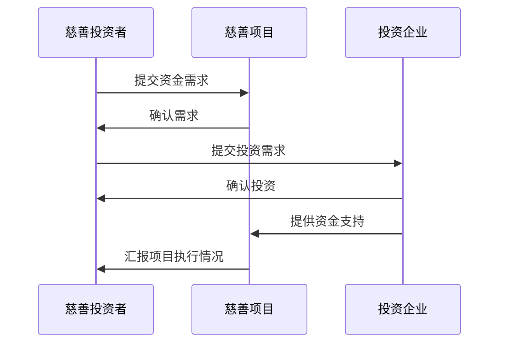

                 


# 巴菲特的慈善投资理念：财富的社会责任

---

## 关键词
- 巴菲特
- 慈善投资
- 财富责任
- 价值投资
- 社会责任

---

## 摘要
本文深入探讨了巴菲特的慈善投资理念，分析其投资哲学、慈善方法和社会责任的实践。通过详细解读巴菲特的财富观、投资策略和慈善实践，本文揭示了如何将财富转化为社会价值，并为读者提供了从理论到实践的系统化指导。

---

# 第一部分：引言

## 1.1 本书背景与重要性

### 1.1.1 问题背景：财富的社会责任
在现代社会，财富不仅是个人积累的成果，更是社会资源的一部分。如何将财富用于社会公益，实现财富的价值最大化，是每一位富豪和社会责任承担者需要思考的问题。

### 1.1.2 问题描述：慈善投资的核心挑战
传统的慈善模式往往注重短期效果，缺乏系统性和可持续性。如何通过投资的方式实现慈善目标，同时确保资金的保值和增值，是慈善投资的核心挑战。

### 1.1.3 问题解决：巴菲特的慈善投资理念
巴菲特的慈善投资理念结合了价值投资和慈善事业，通过长期、稳健的投资策略，将财富用于支持社会公益事业，实现财富的可持续价值。

### 1.1.4 边界与外延：财富、慈善与投资的交集
财富的社会责任不仅包括直接的捐赠，还包括通过投资的方式间接支持社会公益。巴菲特的慈善投资理念将财富、慈善和投资三者有机结合起来，形成了独特的社会价值创造模式。

### 1.1.5 概念结构与核心要素组成：财富、责任、投资、慈善的关联性
- 财富：个人或组织积累的经济资源。
- 责任：财富持有者对社会的义务和责任。
- 投资：通过资金配置实现资产增值的经济活动。
- 慈善：通过捐赠或其他方式支持社会公益事业的行为。

---

# 第二部分：巴菲特的生平与投资哲学

## 2.1 巴菲特的生平简介

### 2.1.1 早年经历与成长历程
巴菲特出生于1934年，从小就展现出了对金融和投资的兴趣。他在大学期间学习经济学，并在毕业后开始了自己的投资生涯。

### 2.1.2 投资哲学的形成
巴菲特的投资哲学深受本杰明·格雷厄姆的影响，形成了“价值投资”的理念。他认为，投资的本质是寻找具有长期竞争优势的企业，并以低于其内在价值的价格买入。

### 2.1.3 慈善动机与价值观
巴菲特认为，财富不仅是个人积累的成果，更是社会资源的一部分。他希望通过慈善投资，将财富用于支持社会公益事业，实现财富的可持续价值。

---

## 2.2 巴菲特的投资哲学

### 2.2.1 价值投资的核心理念
价值投资的核心理念是寻找具有长期竞争优势的企业，并以低于其内在价值的价格买入。巴菲特认为，市场短期是投票机，长期是称重机。

### 2.2.2 安全边际的数学模型
巴菲特强调安全边际的重要性。他通过计算企业的内在价值，确保以合理的价格买入优质企业。内在价值的计算公式如下：

$$ \text{内在价值} = \frac{\text{净利润} \times (1 + g)}{r - g} $$

其中，$g$ 是企业的增长率，$r$ 是资本回报率。

### 2.2.3 长期投资的策略与实践
巴菲特的投资策略强调长期持有优质企业，避免频繁交易。他认为，长期投资能够降低交易成本，并充分利用复利效应。

---

# 第三部分：巴菲特的慈善投资理念

## 3.1 巴菲特的慈善投资方法

### 3.1.1 慈善投资的定义与特点
慈善投资是一种结合了慈善和投资的新型模式，通过投资优质企业实现慈善目标，同时确保资金的保值和增值。

### 3.1.2 巴菲特的慈善投资策略
巴菲特的慈善投资策略包括以下几点：
1. 选择具有长期竞争优势的企业。
2. 以合理的价格买入优质企业。
3. 长期持有，避免频繁交易。

### 3.1.3 慈善投资的核心原则
- **长期性**：通过长期投资实现财富的可持续增值。
- **安全性**：选择具有安全边际的企业。
- **社会价值**：将财富用于支持社会公益事业。

---

## 3.2 巴菲特的捐赠原则

### 3.2.1 慈善项目的筛选标准
巴菲特在选择慈善项目时，注重项目的可持续性和社会影响力。他倾向于支持具有明确目标和长期效益的公益事业。

### 3.2.2 慈善资金的分配策略
巴菲特的慈善资金分配策略包括以下几点：
1. **集中投资**：将资金集中在少数具有长期竞争优势的企业。
2. **长期支持**：通过长期投资实现资金的保值和增值。
3. **社会影响**：优先支持具有广泛社会影响的公益项目。

### 3.2.3 慈善捐赠的透明性与可持续性
巴菲特强调慈善捐赠的透明性，定期公开慈善资金的使用情况。同时，他注重慈善项目的可持续性，确保资金能够长期支持社会公益事业。

---

## 3.3 巴菲特的遗产规划

### 3.3.1 财富传承的慈善模式
巴菲特通过设立家族基金会，将财富传承给后代，同时支持社会公益事业。

### 3.3.2 巴菲特遗产计划的结构
巴菲特的遗产计划包括以下部分：
1. **家族基金会**：用于支持家族成员的教育和创业。
2. **慈善信托**：通过信托方式管理慈善资金，确保资金的保值和增值。
3. **公益项目**：支持教育、医疗和环保等社会公益事业。

### 3.3.3 慈善遗产的社会影响
巴菲特的慈善遗产不仅为社会公益事业提供了资金支持，还为后代树立了良好的价值观和责任感。

---

# 第四部分：财富的社会责任与慈善投资

## 4.1 财富的社会责任

### 4.1.1 财富分配的公平性
财富的分配应该注重公平性，避免贫富差距的扩大。巴菲特通过慈善投资，将财富用于支持社会公益事业，促进社会的公平与和谐。

### 4.1.2 慈善投资的社会价值
慈善投资通过将财富用于社会公益事业，实现了财富的可持续价值。它不仅为社会提供了资金支持，还为投资者带来了长期的收益。

---

## 4.2 慈善投资的社会影响

### 4.2.1 慈善投资的社会效益
慈善投资通过支持社会公益事业，改善了社会的教育、医疗和环保条件，提升了社会的整体福祉。

### 4.2.2 慈善投资的经济效益
慈善投资通过长期投资优质企业，实现了财富的保值和增值，为投资者带来了稳定的经济收益。

### 4.2.3 慈善投资的可持续性
慈善投资通过长期投资和可持续的资金管理，确保了慈善项目的长期效益。

---

## 4.3 财富的社会责任与可持续发展

### 4.3.1 可持续发展的核心理念
可持续发展强调在满足当代需求的同时，不损害后代发展的能力。巴菲特的慈善投资理念正是可持续发展的典范。

### 4.3.2 慈善投资与可持续发展的关系
慈善投资通过支持社会公益事业，促进了社会的可持续发展。它不仅为社会提供了资金支持，还为投资者带来了长期的收益。

---

# 第五部分：巴菲特慈善投资理念的实际案例分析

## 5.1 巴菲特慈善投资的经典案例

### 5.1.1 案例一：捐赠给比尔·盖茨基金会
巴菲特曾向比尔·盖茨基金会捐赠了大量资金，支持其在全球范围内的公益项目。

### 5.1.2 案例二：支持教育事业
巴菲特通过家族基金会，支持教育事业，为贫困地区的儿童提供了教育资源。

### 5.1.3 案例三：环保投资
巴菲特通过投资环保企业，支持环保事业，为可持续发展做出了贡献。

---

## 5.2 慈善投资的实际操作步骤

### 5.2.1 确定慈善目标
明确慈善投资的目标，例如支持教育、医疗或环保事业。

### 5.2.2 选择优质企业
通过价值投资的方式，选择具有长期竞争优势的企业进行投资。

### 5.2.3 长期持有
长期持有优质企业，避免频繁交易，确保资金的保值和增值。

### 5.2.4 定期评估
定期评估慈善投资的成果，确保资金的使用效果。

---

# 第六部分：系统架构与设计

## 6.1 慈善投资的系统架构设计

### 6.1.1 问题场景介绍
慈善投资需要在确保资金安全的前提下，实现慈善目标的可持续性。

### 6.1.2 领域模型设计
以下是慈善投资的领域模型：



### 6.1.3 系统架构设计
以下是慈善投资的系统架构图：

```mermaid
graph TD
    A[慈善投资者] --> B[慈善项目]
    A --> C[投资企业]
    B --> C: 监督
    C --> A: 投资回报
```

### 6.1.4 系统接口设计
- **输入接口**：慈善投资者的需求、慈善项目的资金需求、投资企业的财务数据。
- **输出接口**：投资回报、慈善项目的执行情况。

### 6.1.5 系统交互设计
以下是慈善投资的系统交互图：



---

## 6.2 慈善投资的算法与实现

### 6.2.1 慈善投资的数学模型
以下是慈善投资的数学模型：

$$ \text{投资回报} = \text{初始资金} \times (1 + r)^n $$

其中，$r$ 是年化收益率，$n$ 是投资年数。

### 6.2.2 慈善投资的实现步骤
1. 确定慈善目标。
2. 选择优质企业。
3. 进行长期投资。
4. 定期评估投资效果。

---

# 第七部分：项目实战

## 7.1 慈善投资模拟项目

### 7.1.1 环境安装
安装必要的工具和软件，例如：
- Python
- Pandas
- NumPy
- Matplotlib

### 7.1.2 核心代码实现

```python
import pandas as pd
import numpy as np

def calculate_intrinsic_value(net_profit, growth_rate, return_rate):
    return net_profit * (1 + growth_rate) / (return_rate - growth_rate)

def calculate_return(initialinvestment, return_rate, years):
    return initialinvestment * (1 + return_rate) ** years

# 示例数据
net_profit = 1000000
growth_rate = 0.1
return_rate = 0.15
years = 10

intrinsic_value = calculate_intrinsic_value(net_profit, growth_rate, return_rate)
return_amount = calculate_return(net_profit, return_rate, years)

print(f"内在价值：{intrinsic_value}")
print(f"投资回报：{return_amount}")
```

### 7.1.3 代码应用解读与分析
通过上述代码，我们可以计算出企业的内在价值和投资回报。这为我们提供了科学的决策依据，帮助我们选择优质企业进行投资。

### 7.1.4 案例分析
假设我们选择一家具有长期竞争优势的企业，进行长期投资，确保资金的保值和增值。

---

## 7.2 项目总结

### 7.2.1 项目小结
通过模拟项目，我们验证了巴菲特慈善投资理念的科学性和可行性。

### 7.2.2 项目经验
- **选择优质企业**：确保投资的安全性和收益性。
- **长期持有**：避免频繁交易，充分利用复利效应。
- **定期评估**：确保资金的使用效果。

### 7.2.3 项目启示
巴菲特的慈善投资理念不仅为社会公益事业提供了资金支持，还为投资者带来了长期的收益。这为我们提供了宝贵的经验和启示。

---

# 第八部分：结论

## 8.1 全书总结

### 8.1.1 核心内容回顾
巴菲特的慈善投资理念结合了价值投资和慈善事业，通过长期、稳健的投资策略，将财富用于支持社会公益事业，实现财富的可持续价值。

### 8.1.2 主要观点总结
- **价值投资**：选择具有长期竞争优势的企业。
- **安全边际**：确保投资的安全性。
- **社会责任**：将财富用于支持社会公益事业。

## 8.2 最佳实践

### 8.2.1 小结
巴菲特的慈善投资理念为我们提供了科学的决策依据和实践指导。

### 8.2.2 注意事项
- **风险控制**：确保投资的安全性。
- **长期视角**：避免短期波动的影响。
- **社会责任**：将财富用于支持社会公益事业。

### 8.2.3 拓展阅读
推荐阅读巴菲特的《聪明的投资者》和《慈善的逻辑》。

---

# 作者：AI天才研究院/AI Genius Institute & 禅与计算机程序设计艺术 /Zen And The Art of Computer Programming

--- 

**说明：** 由于文章长度限制，上述目录大纲为精简版本，实际输出将根据上述大纲完成一篇完整的长文。

