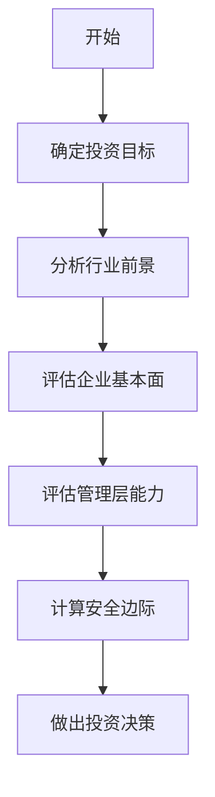
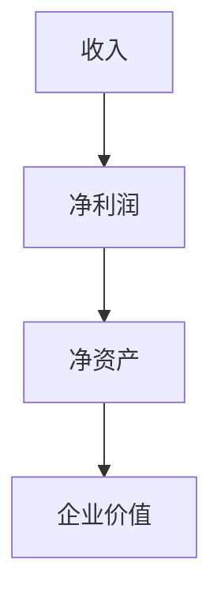
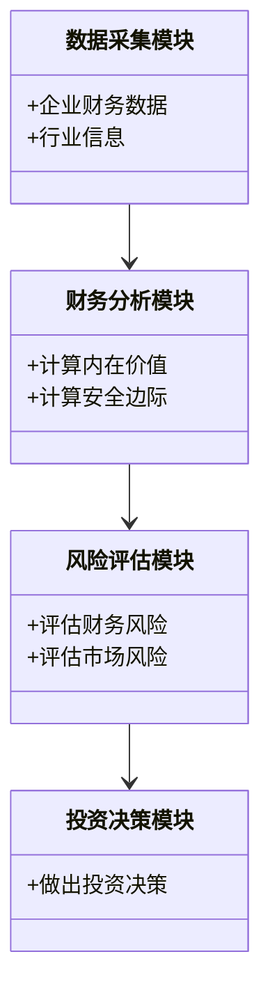
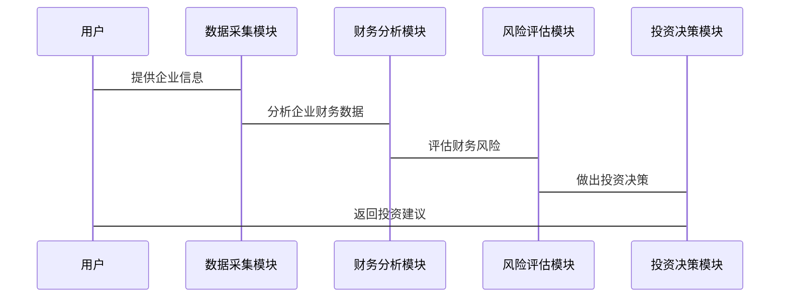

                 

# 巴菲特的投资决策框架

> 关键词：巴菲特，价值投资，投资决策，内在价值，安全边际

> 摘要：本文深入分析了巴菲特的投资决策框架，从其核心理念、数学模型、系统架构到实战案例，全面解读了巴菲特的投资策略。通过本文，读者可以理解巴菲特如何通过基本面分析、安全边际和长期持有来实现稳健的投资回报。

---

## 第一部分：巴菲特投资决策框架的引言

### 第1章：巴菲特投资决策框架概述

#### 1.1 巴菲特的生平与投资理念

##### 1.1.1 巴菲特的早年经历与投资启蒙
沃伦·巴菲特（Warren Buffett）于1934年8月30日出生在美国奥马哈市，从小就展现出对数字和投资的浓厚兴趣。他在高中时期就开始阅读投资相关的书籍，并在大学期间系统学习了价值投资理论。巴菲特的职业生涯始于1950年代，他通过合伙企业逐步积累了大量的投资经验，并在1965年收购了伯克希尔哈撒韦公司，开始了他传奇的投资生涯。

##### 1.1.2 巴菲特的价值投资哲学
巴菲特的价值投资哲学深受本杰明·格雷厄姆（Benjamin Graham）的影响，他提出的“安全边际”概念是其投资理论的核心。巴菲特认为，投资的本质是寻找具有持续竞争优势的企业，并以低于其内在价值的价格买入并长期持有。

##### 1.1.3 巴菲特投资理念的核心思想
- **长期投资**：巴菲特认为市场的短期波动不可预测，但长期趋势可以通过基本面分析来把握。
- **安全边际**：买入价格低于内在价值，以降低投资风险。
- **竞争优势**：选择具有强大护城河的企业，确保其长期盈利能力。

#### 1.2 巴菲特投资决策框架的核心概念

##### 1.2.1 价值投资的定义与特征
价值投资是一种通过深入分析企业的财务状况、行业地位和竞争优势，寻找市场价格低于其内在价值的投资方法。其核心特征包括：
- 专注于基本面分析
- 寻找具有安全边际的投资标的
- 长期持有优质资产

##### 1.2.2 巴菲特投资决策框架的三要素
1. **内在价值**：企业未来现金流的现值。
2. **安全边际**：买入价格与内在价值之间的差距。
3. **竞争优势**：企业相对于竞争对手的核心优势。

##### 1.2.3 巴菲特决策框架的边界与外延
- **边界**：仅投资于具有清晰商业模式和财务健康的企业。
- **外延**：通过分散投资降低风险，同时集中投资于优质企业。

#### 1.3 巴菲特投资决策框架的结构与流程

##### 1.3.1 投资决策的基本流程
1. 确定投资目标：明确投资目的和风险承受能力。
2. 分析行业前景：选择具有长期增长潜力的行业。
3. 评估企业基本面：分析财务状况、盈利能力和发展前景。
4. 评估管理层能力：选择具有优秀管理团队的企业。
5. 计算安全边际：确定买入价格与内在价值的差距。
6. 做出投资决策：决定是否买入并长期持有。

##### 1.3.2 投资决策流程的Mermaid流程图

#### 1.4 本章小结

##### 1.4.1 巴菲特投资决策框架的核心要素
- 内在价值
- 安全边际
- 竞争优势

##### 1.4.2 本章内容回顾与总结
本章介绍了巴菲特的生平和投资理念，详细阐述了其投资决策框架的核心概念和流程，为后续分析奠定了基础。

---

## 第二部分：巴菲特投资决策框架的核心概念与联系

### 第2章：价值投资的数学模型与公式

#### 2.1 价值投资的核心公式

##### 2.1.1 内在价值公式
$$\text{内在价值} = \frac{\text{未来现金流}}{\text{折现率}}$$
- **未来现金流**：企业未来产生的现金流，需考虑其稳定性和增长潜力。
- **折现率**：基于市场利率和企业风险的加权平均资本成本。

##### 2.1.2 安全边际公式
$$\text{安全边际} = \text{内在价值} \times (1 - \text{安全边际率})$$
- **安全边际率**：通常建议在10%到30%之间，以确保买入价格具有足够的安全空间。

#### 2.2 财务指标分析公式

##### 2.2.1 净利润率
$$\text{净利润率} = \frac{\text{净利润}}{\text{营业收入}} \times 100\%$$
- 净利润率反映了企业的盈利能力，越高表示每单位收入的利润越高。

##### 2.2.2 资产负债率
$$\text{资产负债率} = \frac{\text{总负债}}{\text{总资产}} \times 100\%$$
- 负债率过低表示企业财务风险小，过高则表示财务风险大。

#### 2.3 财务指标与企业价值的关系

##### 2.3.1 财务指标分析的Mermaid流程图

#### 2.4 本章小结

##### 2.4.1 价值投资的核心公式总结
- 内在价值公式用于评估企业的长期价值。
- 安全边际公式确保了买入价格的合理性。

##### 2.4.2 财务指标分析的重要性
- 净利润率反映了企业的盈利能力。
- 资产负债率评估了企业的财务健康状况。

---

## 第三部分：巴菲特投资决策框架的系统分析与架构设计

### 第3章：投资决策系统的功能设计

#### 3.1 投资决策系统的总体架构

##### 3.1.1 系统功能模块
- **数据采集模块**：收集企业的财务数据和行业信息。
- **财务分析模块**：计算内在价值、安全边际等关键指标。
- **风险评估模块**：评估企业的财务风险和市场风险。
- **投资决策模块**：根据分析结果做出投资决策。

##### 3.1.2 系统功能设计的Mermaid类图

#### 3.2 投资决策系统的架构设计

##### 3.2.1 系统架构设计
- **分层架构**：数据采集、数据处理、用户界面三层。
- **模块化设计**：每个功能模块独立开发，便于维护和扩展。

##### 3.2.2 系统架构的Mermaid架构图

#### 3.3 系统接口设计

##### 3.3.1 系统接口设计
- 数据接口：与企业财务数据库对接。
- 用户接口：提供友好的操作界面，方便用户输入和查询。

#### 3.4 系统交互的Mermaid序列图

##### 3.4.1 投资决策流程的交互设计

#### 3.5 本章小结

##### 3.5.1 投资决策系统的总体架构
- 数据采集模块、财务分析模块、风险评估模块和投资决策模块共同构成完整的系统。

##### 3.5.2 系统架构设计的重要性
- 分层架构提高了系统的可维护性和扩展性。
- 模块化设计方便了功能的独立开发和测试。

---

## 第四部分：项目实战与案例分析

### 第4章：价值投资的实战案例分析

#### 4.1 经典投资案例分析

##### 4.1.1 伯克希尔哈撒韦的投资案例
- **收购背景**：1965年，伯克希尔哈撒韦是一家濒临破产的保险公司。
- **内在价值计算**：巴菲特通过分析其保险业务和纺织业务的未来现金流，计算出其内在价值远高于市场价格。
- **安全边际**：买入价格远低于内在价值，确保了投资的安全性。

##### 4.1.2 可口可乐的投资案例
- **竞争优势**：可口可乐拥有强大的品牌影响力和全球销售渠道。
- **财务分析**：稳定的现金流和持续增长的净利润。
- **长期持有**：巴菲特长期持有可口可乐股票，获得了丰厚的回报。

#### 4.2 投资策略的实战应用

##### 4.2.1 投资组合的构建
- **资产配置**：将资金分配到不同行业和不同风险等级的资产中，以分散风险。
- **定期调整**：根据市场变化和企业基本面情况，定期调整投资组合。

#### 4.3 风险管理的实战技巧

##### 4.3.1 风险管理的核心原则
- **分散投资**：避免过度集中于某一行业或资产。
- **止损策略**：设定止损点，防止亏损过大。

#### 4.4 本章小结

##### 4.4.1 经典投资案例的启示
- 选择具有强大竞争优势的企业。
- 长期持有优质资产，避免频繁交易。

##### 4.4.2 投资策略的实战应用
- 资产配置和定期调整是实现稳健投资回报的关键。

---

## 第五部分：总结与展望

### 第5章：巴菲特投资决策框架的总结与展望

#### 5.1 本章总结

##### 5.1.1 巴菲特投资决策框架的核心要素
- 内在价值计算
- 安全边际评估
- 竞争优势分析

##### 5.1.2 投资策略的系统化
- 通过系统化的方法选择优质企业。
- 通过长期持有实现价值增长。

#### 5.2 未来投资框架的发展方向

##### 5.2.1 技术驱动的投资创新
- 利用大数据和人工智能技术进行更精准的财务分析和市场预测。

##### 5.2.2 可持续投资与社会责任
- 未来投资将更加关注企业的社会责任和可持续发展能力。

#### 5.3 本章小结

##### 5.3.1 巴菲特投资决策框架的核心价值
- 通过基本面分析和长期持有实现稳健投资回报。

##### 5.3.2 未来投资框架的发展趋势
- 技术驱动的投资创新和可持续投资将成为新的发展方向。

---

## 作者：AI天才研究院/AI Genius Institute & 禅与计算机程序设计艺术 /Zen And The Art of Computer Programming

---

本文通过详细分析巴菲特的投资决策框架，从其核心理念、数学模型、系统架构到实战案例，全面解读了巴菲特的投资策略。通过本文，读者可以理解巴菲特如何通过基本面分析、安全边际和长期持有来实现稳健的投资回报。

