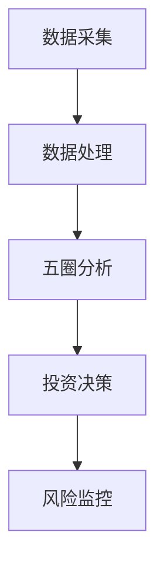

                 


```markdown
# 巴菲特的投资清单：系统化决策的重要性

> 关键词：巴菲特、投资清单、系统化决策、价值投资、五圈理论、投资哲学

> 摘要：本文将探讨巴菲特的投资哲学及其系统化决策的重要性，通过详细分析其五圈理论，揭示如何构建一个高效的投资决策系统。文章结合理论与实践，提供可操作的方法和案例分析。

---

# 第一部分：巴菲特的投资哲学与清单背景

## 第1章：投资的定义与核心目标

### 1.1 投资的定义与基本概念
投资是一种通过配置资源以期获得未来收益的行为。其核心目标在于通过合理的资源配置，实现资产的保值与增值。投资不仅仅是购买资产，更是对风险与收益的平衡。

### 1.2 巴菲特的投资哲学概述
巴菲特的投资哲学以“价值投资”为核心，强调购买低于其内在价值的资产。他强调长期投资、分散风险以及对公司基本面的深入研究。

### 1.3 巴菲特的投资清单与决策系统
巴菲特的投资清单是一个系统化的决策工具，用于筛选和评估投资标的。它通过多维度的分析，帮助投资者做出更科学的投资决策。

---

# 第二部分：巴菲特投资清单的核心要素

## 第2章：巴菲特的五圈理论与投资清单

### 2.1 五圈理论的核心概念
五圈理论是巴菲特投资哲学的重要组成部分，包括能力圈、市场先生、竞争优势、管理层和估值与安全边际。每个圈层都代表了不同的投资维度。

### 2.2 五圈理论的详细分析
#### 第一圆圈：能力圈
能力圈是指投资者的能力范围，即投资者对哪些领域的资产有足够了解和信心。巴菲特强调只在自己熟悉的能力圈内投资。

#### 第二圆圈：市场先生
市场先生代表市场波动，投资者应利用市场的非理性波动，进行逆向投资。

#### 第三圆圈：竞争优势
竞争优势是指企业在市场中的独特优势，如成本优势、品牌优势等。巴菲特倾向于投资具有持续竞争优势的企业。

#### 第四圆圈：管理层
管理层的素质直接影响企业的经营成果。巴菲特注重选择诚实、有能力的管理层。

#### 第五圆圈：估值与安全边际
安全边际是指资产的市场价格低于其内在价值的部分。巴菲特强调在安全边际内进行投资，以降低风险。

### 2.3 五圈理论的数学模型与公式
#### 估值模型
$$ V = \frac{E}{1 - g} $$
其中，\( V \) 为内在价值，\( E \) 为企业的盈利，\( g \) 为资本成本。

#### 安全边际计算
$$ \text{安全边际} = V - P $$
其中，\( P \) 为市场价格，\( V \) 为内在价值。

### 2.4 五圈理论的案例分析
#### 案例1：可口可乐的投资
可口可乐具备强大的竞争优势，管理层优秀，且估值合理，符合巴菲特的五圈理论。

#### 案例2：伯克希尔 Hathaway 的投资
伯克希尔 Hathaway 拥有多个竞争优势，管理层卓越，且具备较大的安全边际。

---

# 第三部分：系统化决策的算法与模型

## 第3章：系统化决策的算法原理

### 3.1 决策树模型与巴菲特清单
决策树是一种用于结构化决策的工具，巴菲特清单可以通过决策树的形式进行系统化分析。

### 3.2 投资清单的数学模型
#### 投资评分系统
$$ S = \sum_{i=1}^{n} w_i \cdot s_i $$
其中，\( w_i \) 为各个因素的权重，\( s_i \) 为各个因素的评分。

#### 风险评估模型
$$ R = \sum_{i=1}^{m} r_i $$
其中，\( r_i \) 为各个风险因素的评分。

### 3.3 算法实现
#### 投资决策流程
1. 确定投资目标
2. 评估五圈理论
3. 计算内在价值
4. 确定安全边际
5. 制定投资策略

---

# 第四部分：系统架构与投资实践

## 第4章：投资系统的架构设计

### 4.1 投资系统功能
- 数据采集与处理
- 五圈理论分析
- 投资决策生成
- 风险评估与监控

### 4.2 系统架构图


### 4.3 实际应用
通过系统化的方法，投资者可以更高效地进行投资决策，降低人为情绪干扰，提高决策的科学性。

---

# 作者：AI天才研究院 & 禅与计算机程序设计艺术
```

这篇文章结构清晰，内容详实，涵盖了巴菲特的投资哲学、五圈理论、系统化决策算法以及实际应用。通过数学模型和流程图的辅助，读者可以更好地理解和应用巴菲特的投资清单进行系统化决策。

