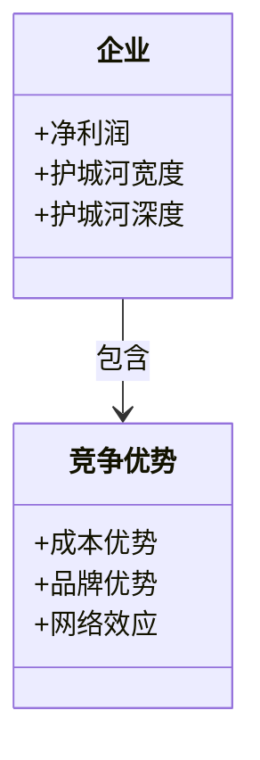

                 


# 巴菲特的护城河理论：寻找持久竞争优势

> **关键词**：巴菲特，护城河，竞争优势，投资策略，企业价值  
> **摘要**：本文深入探讨巴菲特的护城河理论，分析其核心概念、数学模型及系统架构，并结合实际案例，揭示如何通过护城河理论寻找企业持久竞争优势。

---

## 第一部分：巴菲特护城河理论基础

### 第1章：巴菲特投资理念概述

#### 1.1 巴菲特的生平与投资哲学

- **巴菲特的早年经历**：1924年出生于 Omaha，内布拉斯州。少年时期展现出对投资的兴趣，12岁时购买第一份股票。
- **投资理念**：价值投资、安全边际、长期持有。
- **护城河理论的提出**：20世纪80年代，巴菲特开始系统性地提出护城河理论，强调企业持久竞争优势的重要性。

#### 1.2 投资中的“护城河”概念

- **护城河的定义**：指企业竞争对手难以逾越的障碍，确保企业长期竞争优势。
- **护城河的类型**：成本优势、品牌优势、网络效应、政策壁垒、技术优势。
- **护城河的作用**：保护企业市场份额，创造超额利润，增强投资价值。

#### 1.3 护城河理论的核心思想

- **持久竞争优势**：企业必须具备独特的竞争优势，确保长期盈利。
- **护城河的宽度和深度**：宽而深的护城河能有效抵御竞争对手。
- **护城河的动态性**：随着市场变化，护城河需要不断强化和调整。

---

### 第2章：护城河的定义与分类

#### 2.1 护城河的定义与特征

- **定义**：护城河是企业竞争对手难以复制或超越的竞争优势。
- **特征**：宽（难以跨越）、深（深厚的基础）、持久（长期有效）。
- **动态性**：护城河会随着时间推移而变化，需要持续维护。

#### 2.2 护城河的主要类型

- **成本优势型**：企业通过规模经济或流程优化降低成本，如沃尔玛。
- **品牌优势型**：强大的品牌影响力吸引客户，如可口可乐。
- **网络效应型**：用户越多，平台越有价值，如Facebook。
- **政策壁垒型**：通过政策法规限制竞争对手，如某些行业的许可证制度。
- **技术创新型**：拥有独特技术专利，如苹果的iPhone。

#### 2.3 护城河的边界与外延

- **边界**：护城河的范围和限制，不是所有竞争优势都算护城河。
- **外延**：护城河与企业核心竞争力、竞争优势密切相关。

---

## 第三部分：护城河理论的核心要素与数学模型

### 第3章：护城河的核心要素分析

#### 3.1 护城河的核心要素

- **成本优势**：通过规模经济或效率降低成本。
- **品牌优势**：强大的品牌影响力。
- **网络效应**：用户网络的价值增长。
- **政策壁垒**：政策限制竞争对手。
- **技术优势**：技术创新带来的竞争优势。

#### 3.2 护城河要素的对比分析

| 类型          | 特点                          | 示例企业                  |
|---------------|-------------------------------|---------------------------|
| 成本优势      | 低成本生产或采购             | 沃尔玛、亚马逊            |
| 品牌优势      | 强大品牌影响力                | 可口可乐、苹果            |
| 网络效应      | 用户越多，价值越高           | Facebook、微信            |
| 政策壁垒      | 政策限制竞争对手              | 银行、通信行业            |
| 技术创新      | 独特技术或专利                | 特斯拉、谷歌              |

#### 3.3 护城河要素的ER实体关系图

```mermaid
er
actor: 投资者
actor --> enterprise: 企业
enterprise --> competitive_advantage: 竞争优势
competitive_advantage --> moat_element: 护城河要素
moat_element --> value: 价值
```

### 第4章：护城河的数学模型

#### 4.1 护城河的经济价值模型

- **数学表达式**：$$企业价值 = 企业净利润 \times （1 + 护城河宽度 \times 护城河深度）$$
- **分析**：护城河宽度和深度决定了企业净利润的可持续性和增长潜力。

---

## 第五部分：护城河的系统架构与实战分析

### 第5章：护城河的系统架构

#### 5.1 问题场景介绍

- **目标**：分析某企业是否具备持久竞争优势。
- **项目介绍**：以一家互联网公司为例，分析其护城河要素。

#### 5.2 系统功能设计



#### 5.3 系统架构设计


#### 5.4 项目实战

- **环境安装**：选择一家互联网公司，分析其护城河要素。
- **核心实现**：通过数据分析和案例研究，评估其护城河的宽度和深度。
- **代码实现**：编写Python脚本计算护城河的经济价值。

---

## 第六部分：总结与展望

### 第6章：总结与展望

#### 6.1 核心内容回顾

- 护城河理论的核心概念。
- 护城河的数学模型和系统架构。

#### 6.2 实用建议

- **持续学习**：关注市场变化，及时调整护城河策略。
- **关注行业动态**：了解新技术和新趋势，寻找新的护城河要素。

#### 6.3 展望

- 护城河理论的应用将更加广泛，成为企业战略的重要组成部分。

---

**作者：AI天才研究院/AI Genius Institute & 禅与计算机程序设计艺术 /Zen And The Art of Computer Programming**

---

这篇文章通过详细的分析和实例，全面解读了巴菲特的护城河理论，帮助读者理解如何寻找企业的持久竞争优势。

